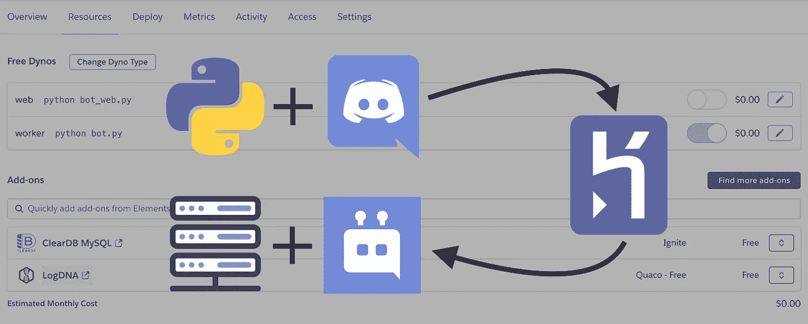
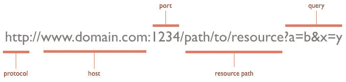
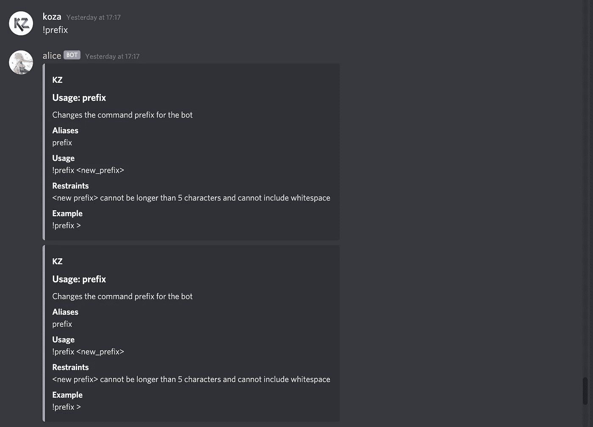
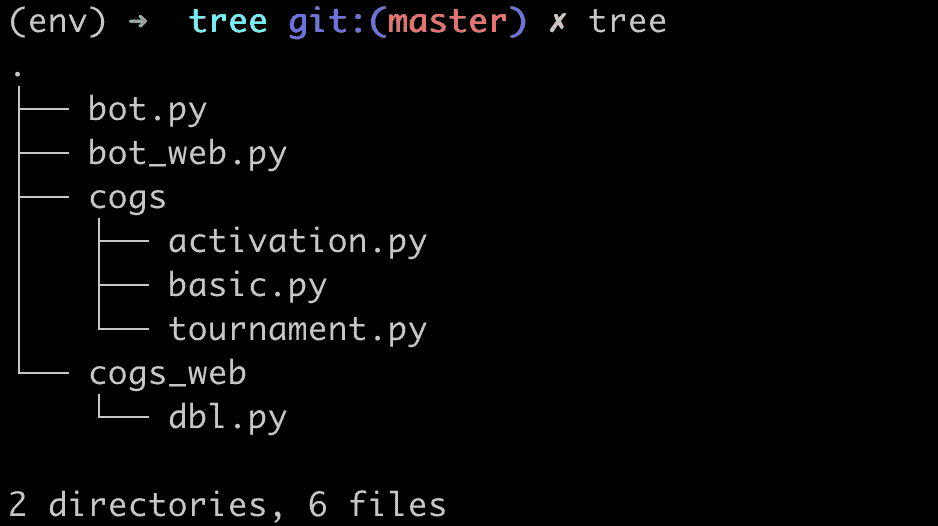
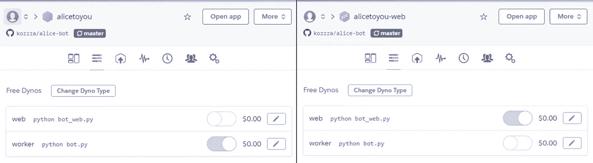

# 解决 Heroku Dyno 过程提出的欺骗问题

> 原文：<https://betterprogramming.pub/deploying-a-python-discord-bot-using-dblpy-on-heroku-259e48c873ec>

## 将运行 dblpy 的 Python Discord bot 部署到 Heroku



抽象的 web 流程 dyno(图片来源:作者)

有相当多的资源在讨论使用 [discordpy](https://discordpy.readthedocs.io/en/latest/) 库的 Discord 机器人的制作，还有相当多的资源在讨论 Heroku 上的[主机。然而，当这两个主题放在一起时，信息似乎很少。](https://www.freecodecamp.org/news/how-to-deploy-an-application-to-heroku/)

当我第一次开始构建 Discord 机器人时，我把所有的代码都混杂在一个名为`bot.py`的文件中。随着我的知识和编程能力的进步，我很快就了解到了[齿](https://discordpy.readthedocs.io/en/latest/ext/commands/cogs.html)作为一种将命令组织成相应组的方式的美妙之处。在我最近的项目中，我决定实现 [dblpy API](https://dblpy.readthedocs.io/en/latest/api.html) ，以便在用户投票给我的机器人时接收一个 webhook。这个 API 非常简单，可以作为一个齿轮集成到我的项目中，它看起来像这样:

[来源](https://discordbots.org/api/docs#pylib)

cog 实际上使用指定的路径、认证令牌和端口创建了一个 webhook 服务器(在类的初始化中)。然后，每当 POST 请求被发送到该路径时，服务器就会获取它并执行`on_dbl_vote`函数。我的目标是使用这些函数在用户投票的 Discord 频道中发送定制的消息。

# 问题

我遇到的第一个问题是不知道将定制的消息发送到哪里。默认情况下，POST 请求发送的数据只包含投票用户的 id 和被投票的机器人的 id。我无法通过使用这些数据来确定在哪个服务器和渠道中做出响应。

我的第二个问题是设置 web 服务器端点来接收 webhooks。当我在本地测试我的程序时，我能够使用 [ngrok](https://ngrok.com/) 将我的机器暴露给互联网，然后向提供的 ngrok URL 发送请求。当我把我的机器人部署到 Heroku 时，这是不可行的。

# 溶液过程

POST 请求发送的数据中包括对投票 URL 的查询。典型的 URL 如下所示:



[来源](https://tomcrowedigital.com/common-ecommerce-issues-mistakes)

通过让用户单击包含服务器和频道 id 的查询参数的链接，我可以在收到投票事件时随时获得这些数据。我的实现如下所示:

这样一来，我就可以在 Heroku 上托管我的机器人了。我清理了我的代码，并将我的开发分支与我的主分支合并，然后由 Heroku 的自动部署进行挑选。我在 [Discord Bot List](https://top.gg/) (DBL)上更改了 webserver 端点，使其指向我的 Heroku 应用所在的位置，而不是指向我的本地机器。我等待我的机器人启动，然后从 DBL 发送一个测试后的请求。很快，我开始得到一个错误，告诉我没有 web 进程在运行。

```
at=error code=H14 desc="No web processes running" method=POST path="/dblwebhook" host=_.herokuapp.com request_id=7a54e44c-5c2a-40fe-8bfc-097313c0c919 fwd="_" dyno= connect= service= status=503 bytes= protocol=https
```

在研究了错误之后，我的 Procfile 似乎配置错误。Procfile 告诉 Heroku 要运行什么类型的进程，以及在什么文件上运行该进程。我将我的进程类型设置为*工人*，进一步研究后发现它不适合 web 服务器。来自 [Heroku](https://devcenter.heroku.com/articles/procfile) :

> “Heroku 应用程序的 web 进程类型很特殊:它是唯一可以从 Heroku 路由器接收外部 HTTP 流量的进程类型。如果您的应用程序包含 web 服务器，您应该将其声明为应用程序的 web 进程。

显然，我刚刚错误地配置了我的流程类型，所需要的只是从 *worker* 到 *web* 的快速改变。这正是我所做的。

```
# worker: python bot.py
web: python bot.py
```

我将我的代码推送到 GitHub，并通过向 Heroku 应用程序的端点发送 POST 请求再次测试了我的 DBL 投票事件，它成功了！我的机器人已经收到了网络钩子并做出了相应的反应。然而，如果没有附带的警告，我不会写一篇关于我在第二次尝试中实现的简单解决方案的文章。不幸的是，我从*工人*到*网络*的转变就是这样。

Python bot 推荐使用工作进程的原因是它总是处于活动状态。这意味着工人总是在倾听命令，并能够立即做出反应。另一方面，web 进程在空闲一段时间后会进入休眠状态。

如 Heroku 文档中所述，

> “如果一个应用程序有一个免费的 web dyno，而该 dyno 在 30 分钟内没有收到任何 web 流量，它将**休眠**。”

由于显而易见的原因，这不适用于 Discord bot，它通过 API 而不是通过 web 接收流量。在这一点上，我尝试了许多不同的解决方案，从创建我自己的 web 服务器并在 Heroku 之外托管它，到重构我的代码，到不断调用 [dblpy](https://dblpy.readthedocs.io/en/latest/api.html) API 进行投票计数。这些都没有给我带来多大的成功，我又回到了起点:需要 web 进程的 HTTP 路由，但是需要工作进程的正常运行时间。同时运行这两个进程怎么样？

我修改了我的 Procfile，让我的进程同时运行我的`bot.py`文件，如下所示:

```
worker: python bot.py
web: python bot.py
```

我将我的代码推送出去，并向我的应用程序域发送了一个测试 webhook。然后，web 进程触发并在正确的通道中发送适当的响应。那里一切似乎都很好。接下来，我在 Discord chat 中尝试了一个命令，并等待 worker 进程对它做出反应。这也奏效了；然而，工作进程并不是唯一一个捕获命令的进程。

还记得 web 进程在收到 web 流量后是如何空闲一段时间的吗？在这段空闲时间里，它的行为就像工作进程一样，能够从 Discord API 接收命令。这意味着在某人投票后的三十分钟内，任何随后输入的命令都会得到类似如下的重复响应:



我认为防止双重响应的唯一方法是划分流程的任务。我制作了一份我的`bot.py`文件的副本，并将其命名为`bot_web.py`。这个新文件运行了我的 Discord bot 的第二个实例，但它只负责 web 功能。

为了将新文件与我的 web 服务器链接起来，我创建了一个名为`cogs_web`的新文件夹，并添加了我的`dbl.py`文件。现在，web 流程能够访问的唯一 cogs 是与 web 服务器相关联的 cogs。



我将我的 Procfile 更改为:

```
worker: python bot.py
web: python bot_web.py
```

我把我的新代码推到 GitHub 重新部署。我再次将我的测试 webhook 发送到我的 Heroku 应用程序，并将我的测试命令发送到我的 Discord 服务器。这一次一切似乎都很完美，我能够按预期使用机器人。但是遗憾的是，我在 Heroku 文档中漏掉了一行，这将是这个解决方案失败的原因。

> "除了 web dyno 睡眠之外，worker dyno(如果存在)也会*睡眠."*

web 流程实际上会导致任何其他流程停止运行。这意味着每当 web 进程进入睡眠状态时，worker 进程也会跟着进入睡眠状态。

# 解决办法

一次次的失败难倒了我，我有了将我的 Discord 机器人投入生产的最终想法:两个不同的 Heroku 应用程序。虽然网络服务器是主要项目的一部分，但 Heroku 不喜欢它与机器人的其余部分托管在一起。解决这个问题的一个简单方法是域分割。一个应用程序将处理机器人的主要功能，而另一个将托管 web 服务器并成为 webhooks 的端点。

我通过创建一个新的 Heroku 应用程序并将其与我原来的应用程序使用的相同 GitHub 存储库连接来实现这一点。一旦两个应用程序都提取了相同的代码，我就在每个应用程序上切换流程类型，如下所示:



我最初的 Heroku 应用程序打开了工作进程，这样它就可以响应不和谐的命令，而关闭了 web 进程，以防止它休眠。与此同时，我的 webserver Heroku 应用程序反向工作，web 进程打开以接收 webhooks，而 worker 进程关闭。这种新的配置非常有效，因为没有任何 dyno 进程相互干扰或重叠作业。

# 外卖食品

希望这篇文章对一个我觉得非常沮丧但最终能够解决的问题提供了见解。也许有比运行同一个机器人的两个实例更有效的解决方案，我很乐意听到它们。欢迎在下面留下任何想法，或者通过我的个人资料联系我。

*本文中提到的项目的所有源代码都可以在我的* [*GitHub*](https://github.com/kozzza/alice-bot) *上找到，并随时邀请我的*[*Discord bot*](https://top.gg/bot/723813871881551932)*到您的服务器上！*