# 将 React 应用程序部署到 AWS S3

> 原文：<https://betterprogramming.pub/deploying-a-react-app-to-aws-s3-e0f31be17734>

## 如何使用 CI/CD 管道来自动化您的构建过程


贾斯汀·林在 [Unsplash](https://unsplash.com?utm_source=medium&utm_medium=referral) 上的照片

成为一名软件工程师不仅仅是编码和构建项目。这是一个由需求分析、设计、开发、部署、维护等组成的庞大生态系统。

因此，将事情自动化以减少时间并专注于开发过程的核心功能是至关重要的。我们可以使用 CI/CD 工具轻松管理这种情况。

在本文中，我计划集成 GitHub repo 和 AWS S3 bucket，使用名为 [Buddy](https://buddy.works/) 的 CI/CD 工具来自动化 React 应用程序的部署。

在此之前，我们先简单了解一下 CI/CD 工具。

# 什么是 CI/CD 工具？

持续集成、持续交付和持续部署(CI/CD)已经在软件开发行业中使用了很长一段时间。CI/CD 实践可以在基础设施和内部开发的应用程序中做出类似的贡献。许多组织使用 CI/CD 工具来自动化应用程序构建的不同阶段。

有各种各样的 CI/CD 工具，但它们都使用密切相关的模型。在选择 CI/CD 工具时，你要考虑它是否是托管的，UI 是否用户友好和简单易用，是否跟上 Docker。一个有趣的事实是，CI/CD 实践将帮助您更好地指导您的组织完成这一新颖的实践。相反，你将成为其他人效仿的向导。

# 我为什么选择巴迪

最近，我偶然发现了这个奇妙的用户友好的 CI/CD 工具，叫做 Buddy，它使用来自 GitLab、Bitbucket 和 GitHub 的代码来构建、测试和部署应用程序。它利用预装了语言和框架的 Docker 容器来构建、监控和通知操作。Buddy 帮助您设计交付管道，以便在单个分支推送上构建、测试和部署您的应用程序。管道包括您可以根据自己的要求配置的步骤。

在本文中，让我们看看如何使用 Buddy 将 React 应用程序部署到 AWS S3。开始了。

# 任务 1。在 AWS 中创建新的 IAM 用户角色

登录 AWS 控制台，选择 IAM 服务，然后选择用户。然后选择 Add User，您将被重定向到这样一个 UI，您可以在这里为新用户命名。选择“编程访问”作为访问类型，并继续访问权限部分。

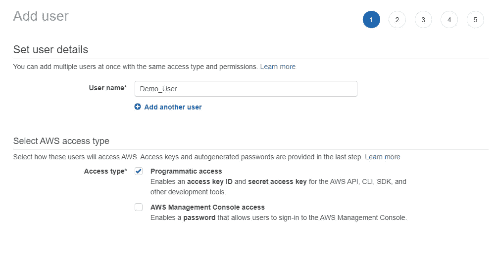

作者截图

在“权限”部分，选择“直接附加现有策略”选项卡，并从下面的列表中选择“AmazonS3FullAccess”。


作者截图

成功创建用户后，您将收到访问密钥 ID 和秘密访问密钥，稍后将使用它们在 CI/CD 管道和 AWS 服务之间建立连接。请务必下载并保存这些 id。

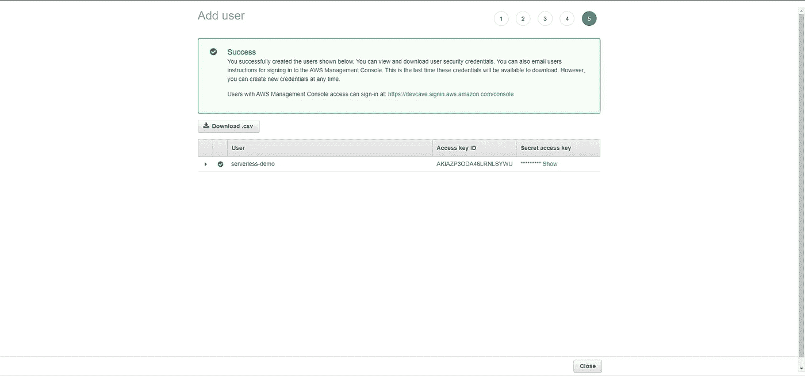

作者截图

## 任务 2。创建一个 S3 桶，并启用静态网站托管

这是一个简单的步骤。您只需要使用您的 AWS 控制台转到 S3 服务并创建一个新的 bucket。请确保从“阻止所有公共访问”中去掉勾号，以使存储桶成为公共的。

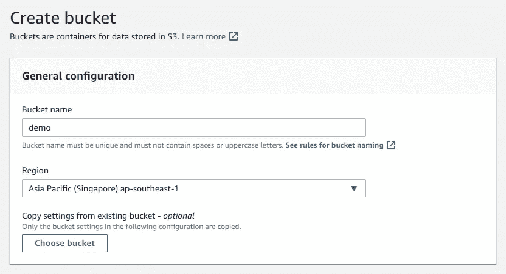

作者截图

创建存储桶后，添加以下策略作为存储桶策略:

```
{
      “Version”: “2008–10–17”,
      “Statement”: 
              [
                 {
                   “Sid”: “AllowPublicRead”,
                   “Effect”: “Allow”,
                   “Principal”: 
                              {
                               “AWS”: “*”
                              },
                   “Action”: “s3:GetObject”,
                   “Resource”: “arn:aws:s3:::<bucket_name>/*”
                 }
               ]
}
```

作为创建 bucket 的最后一步，您需要转到 properties 部分，为您的 bucket 启用静态托管选项。完成后，您将收到该存储桶的 URL。

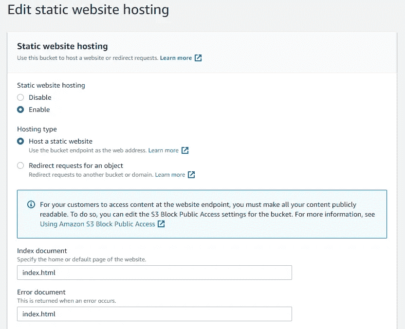

作者截图

# 任务三。创建一个新项目/选择您的 Git 存储库

接下来，如果你还没有注册，[与好友](https://app.buddy.works/sign-up)注册，或者使用你的 GitHub、Bitbucket 或 Google 账户登录。

登录好友帐户后，您可以开始创建新项目。在这个阶段，您将能够选择您的 Git 提供者和存储库。完成后，点击“创建新项目”按钮进行确认。

Buddy 允许你点击几下鼠标就可以连接所有流行的 Git 提供者，包括 GitHub、Bitbucket、GitLab 和私有库。

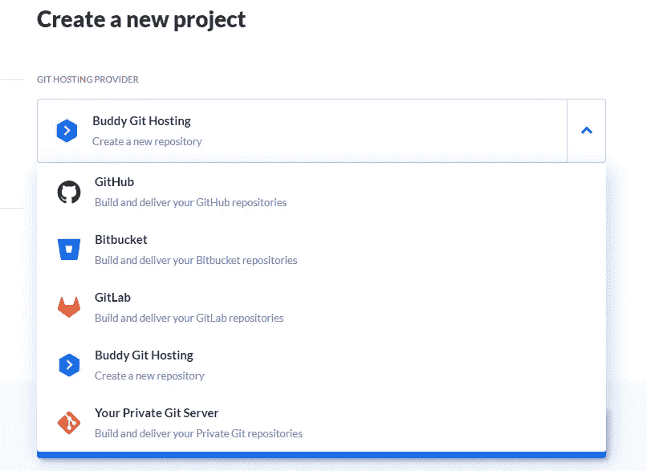

作者截图

# 任务 4。创建新管道

要自动化 React 应用程序，请添加一个新的交付管道。输入管道名称、触发模式和 Buddy 将从中获取您的代码的分支。然后单击“添加新管道”按钮继续。

“分支分配”指定好友将从哪个分支部署。如果您将触发模式调整为“在推送时”，则每次推送至该分支时，Buddy 都会执行管道。

考虑到触发模式，建议生产使用手动模式(点击模式)，开发使用“推送模式”(自动模式)，试运行/测试使用循环模式(按时间间隔)。

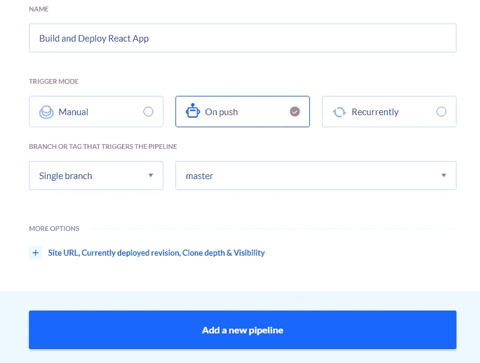

作者截图

# 任务 5。添加操作

接下来，您应该向管道添加一个新的操作。Buddy 提供了几种不同的方法来部署您的项目，并允许您从数百个预先指定的操作中进行选择。我将在这个场景中添加两个动作，这两个动作将执行以下任务:

*   构建 React 应用程序:下载依赖项(npm，Yarn)，编译资产。
*   将 React 应用程序部署到 AWS S3

可以使用 Node.js 操作来管理 React 构建。您可以选择环境信息并指定要执行的命令。

您可以使用单个节点操作来运行所有 npm 命令，也可以对每个命令使用专用操作。在本例中，我将对每个命令使用专用的操作。

首先，添加一个`npm install`命令来确保构建过程中所有的依赖项和库都已就位。

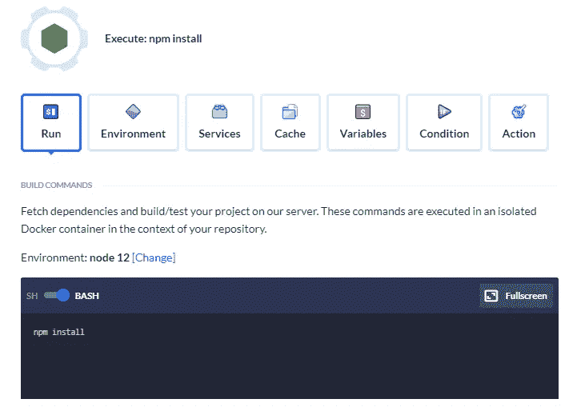

作者截图

如果您在部署项目之前有任何测试要运行，Buddy 提供了使用其管道轻松运行测试自动化的选项。您可以使用另一个节点操作，通过相关的命令来执行项目中的测试。我的情况是`npm run test`。

然后添加另一个节点动作来执行`npm run build`命令以构建项目。

如果您需要测试这些命令，您可以在继续下一步之前简单地手动运行管道。如果有任何错误，您可以在操作日志中找到它们。

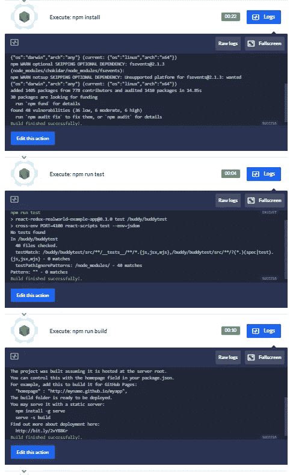

作者截图

向下滚动并点击动作列表中的 S3。

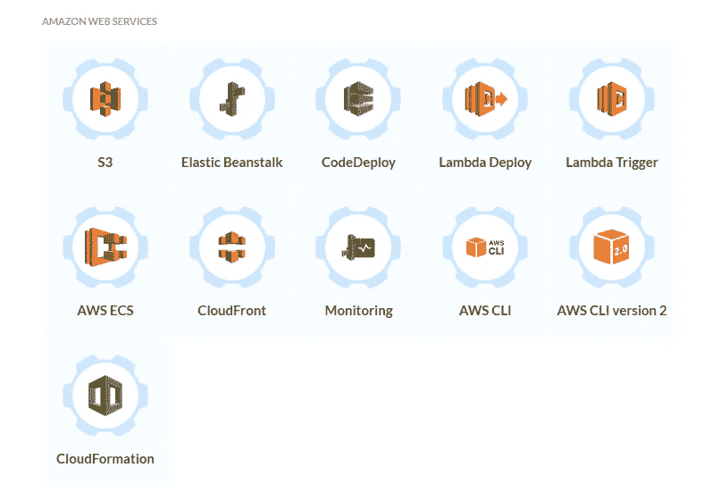

作者截图

配置 AWS 集成并输入集成的名称。从您复制的 AWS 控制台粘贴访问密钥 Id 和秘密访问密钥。点击“添加集成”按钮。

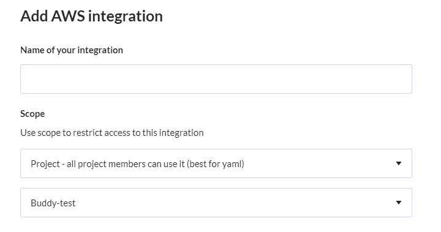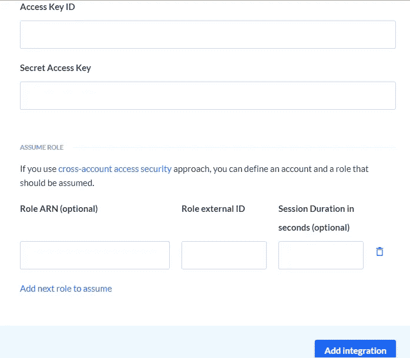

作者截图

然后配置操作信息，选择要将文件上传到的存储桶 ID。将“源路径”设置为“/构建”，因为您的项目构建目录 id 是“源/构建”此外，确保您已经选择了 Pipeline Filesystem 作为源文件系统，因为您在前面的操作中使用管道构建了项目。最后，单击“添加此操作”按钮。

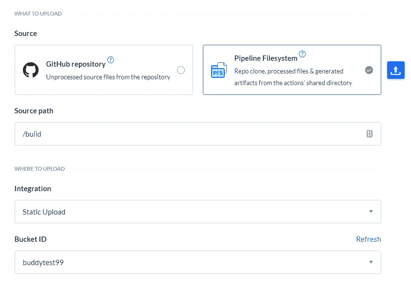

作者截图

现在，您的管道已经准备好将 React 应用程序部署到 AWS S3。

如果您想获得关于部署的通知，该怎么办？巴迪对此也有答案。

向下滚动并移至通知。从页面的右侧，选择您选择的服务。我会选择 Slack，这是一种在好友用户中很受欢迎的通知服务。当您向管道添加第三方服务时，您将需要配置集成细节。在这里，您可以决定集成的范围。

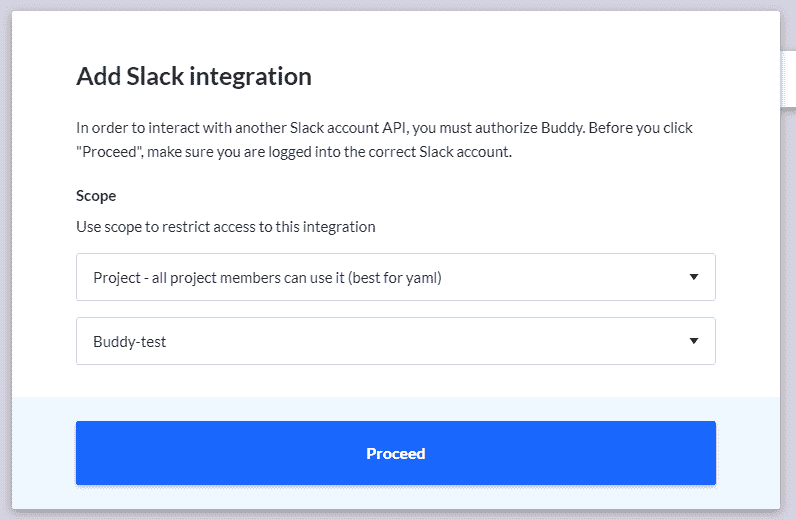

最后，您必须接受所选应用程序的 OAuth 权限:

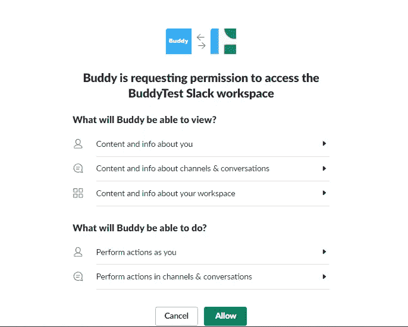

然后，您可以根据自己的意愿指定通知消息。

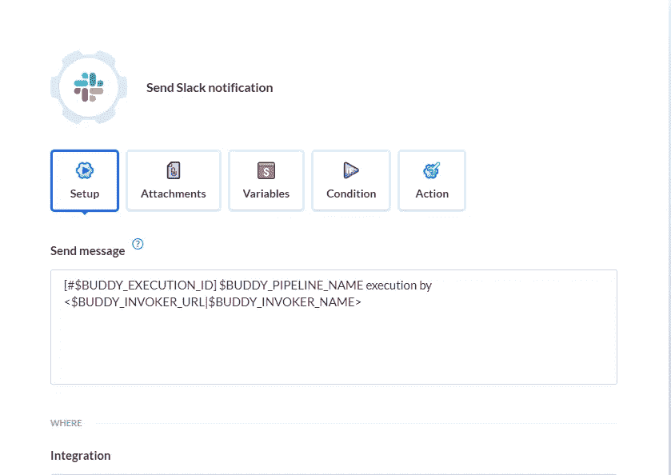

一旦有人将更改推送到您的 Git 存储库并执行管道，您将会得到通知。

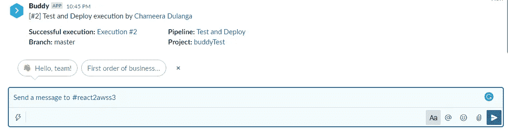

现在您已经设置好了，完成的管道将如下所示:

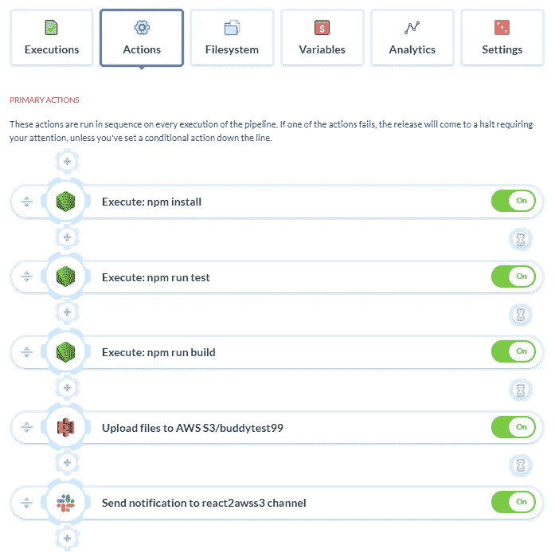

作者截图

# 任务 6。运行管道

一旦您将更改推送到 Git 存储库，您的管道将执行并将您的 React 应用程序部署到 AWS S3。

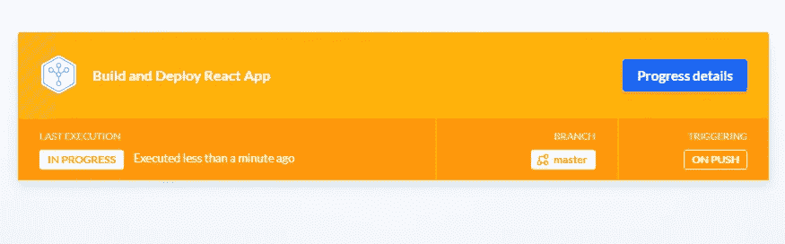

作者截图

# 结论

自动化已经成为摆脱现代软件开发过程复杂性的必要手段。CI/CD 工具使得向用户高效地交付具有新的、丰富特性的应用成为可能。像 Buddy 这样的工具帮助我们完成这一任务，允许开发人员构建管道来为各种各样的技术执行操作，并集成它们来满足最独特和最基本的需求。

感谢您的阅读！