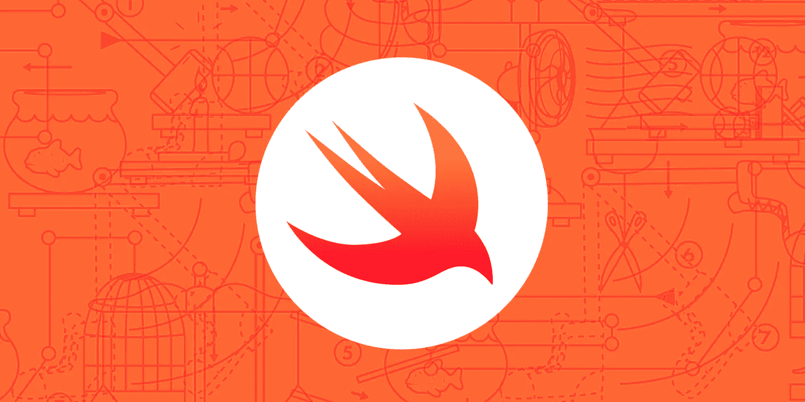
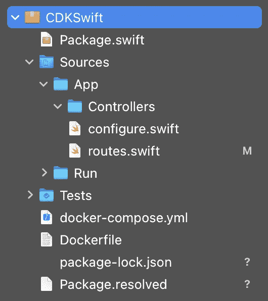
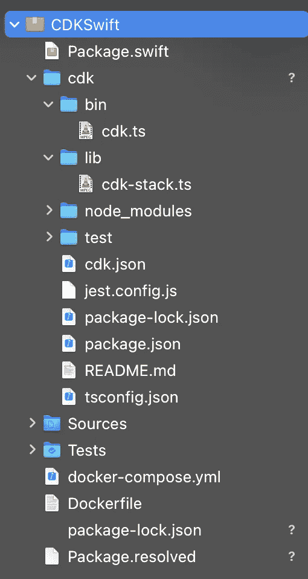

# 带有 Vapor、AWS Fargate 和 AWS 云开发套件的服务器端 Swift

> 原文：<https://betterprogramming.pub/deploying-a-server-side-swift-vapor-app-on-aws-using-aws-fargate-and-aws-cdk-ea62ffb7b9d6>

## 立即开始使用服务器端 Swift



作者照片。

您是否考虑过如何使用 Swift 编写您的后端应用程序，而无需担心扩展、修补和其他繁琐的基础设施任务？如果你回答是，这篇文章是给你的。

# 要求

对于本教程，您需要有一个 AWS 帐户来部署您的 Vapor 服务器。另外，您需要安装和配置 [AWS CDK](https://docs.aws.amazon.com/cdk/latest/guide/getting_started.html) 、[typescript](https://docs.aws.amazon.com/cdk/latest/guide/work-with-cdk-typescript.html)t、 [Docker](https://docs.docker.com/get-docker/) 和 [Vapor](https://docs.vapor.codes/4.0/install/macos/) 。

# 1.创建您的 Vapor 服务器应用

[Vapor](https://docs.vapor.codes/4.0/) 是一个用 Swift 编写的 web 框架，允许您开发富有表现力的 Swifty 服务器端应用程序。

在[安装了](https://docs.vapor.codes/4.0/install/macos/) Vapor 之后，打开一个终端窗口，选择一个文件夹，您的新项目将保存在其中，然后运行以下命令:

```
$ vapor new CDKSwift -n
```

这将创建一个名为`CDKSwift`的新文件夹，其中包含一个 Vapor“hello world”模板和运行服务器所需的所有组件。现在让我们通过进入`CDKSwift`文件夹并运行以下命令来打开项目:

```
$ vapor xcode
```

它会打开 Xcode。此时，您应该有一个如下所示的文件夹结构:



新 Vapor 应用程序的项目导航器文件夹结构。

打开*`routes.swift`源文件，将其内容修改如下:*

*此代码:*

1.  *配置一个端点，该端点将在`<hostname>/`上响应 HTTP GET 请求并返回一条`I'm the root path`消息。*
2.  *配置另一个端点，该端点将在`<hostname>/hello`响应 HTTP GET 请求并返回`Hello, AWS`。我们还没有到达 AWS，但是我们很快就会到达。*

*让我们测试一下是否一切都按预期运行。在 Xcode 中，点击播放按钮或 CMD + R。构建成功后，您应该会在 Xcode 控制台中看到以下信息:*

```
**[ NOTICE ] Server starting on* [*http://127.0.0.1:8080*](http://127.0.0.1:8080)*
```

*回到您的终端窗口并运行:*

```
*$ curl localhost:8080*
```

*您应该会在终端中看到`I'm the root path`。现在运行:*

```
*$ curl localhost:8080/hello*
```

*而且你应该能看到`Hello, AWS!!!`。*

*很漂亮，是吧？这表明您的 Vapor 服务器已经启动并正在运行。现在我们可以进入下一个挑战。*

# *2.到处都是集装箱*

*为了在云上运行我们的 Vapor 服务器，我们将使用 Docker 容器。官方码头文件将集装箱描述为:*

> *“一个标准的软件单元，它将代码及其所有依赖项打包，以便应用程序能够快速可靠地从一个计算环境运行到另一个计算环境。Docker 容器映像是一个轻量级、独立、可执行的软件包，包括运行应用程序所需的一切:代码、运行时、系统工具、系统库和设置。”*

*使用容器的一些好处是:*

*   *更有效地利用系统资源*
*   *更快的交付周期(您将在本文末尾注意到)*
*   *应用程序可移植性*

*所以[安装 Docker](https://docs.docker.com/get-docker/) 并在你的项目文件夹的根目录下寻找 Docker 文件。这个文件是 Docker 用运行 Vapor 服务器所需的所有资源构建容器的“配方”。*

*请随意阅读文件内容，看看构建应用程序的“诀窍”是什么。我将跳过本教程的细节，但总而言之，该方法会将您的所有项目内容复制到一个包含 Swift 5.2 工具链的映像并构建它。然后，它将使用生成的可执行文件并定义一个入口点，该入口点将在生产模式下在地址 0.0.0.0 和端口 8080 *运行您的服务器。**

*在构建和运行 Docker 映像之前，先终止稍后启动的 Xcode 进程。转到您的终端并运行:*

```
*$ lsof -i tcp:8080*
```

*这将列出在 TCP 端口 8080 上运行的进程，如果您看到任何正在运行的进程，则获取 PID 列中的数字并运行以下命令来终止它:*

```
*$ sudo kill -9 <PID>*
```

*现在你可以建立你的 Docker 形象了。为此，请转到项目根文件夹并运行:*

```
*$ docker build -t vapor-image .*
```

*构建成功后，运行您的容器，并通过运行以下命令来检查一切是否按预期运行:*

```
*$ docker run --rm -p 8080:8080 -it vapor-image*
```

*这个命令将运行您的容器并将端口 8080 从您的容器绑定到您的 localhost:8080 地址。运行之后，您应该会看到以下终端输出:*

```
**[ NOTICE ] Server starting on* [*http://0.0.0.0:8080*](http://127.0.0.1:8080)*
```

*运行之前运行过的相同的`curl`命令，检查您的服务器是否按预期运行。如果是这样，让我们构建支持我们服务器的基础设施。*

# *3.AWS 法盖特和 AWS CDK*

*现在是时候开始考虑部署我们应用的云基础设施了。如果我们可以将主要精力放在开发应用本身，而不是基础设施方面，如扩展、安全性和供应，这不是很好吗？别担心:AWS Fargate 是来帮忙的。*

*用 AWS Fargate docs 自己的话说:*

> *“AWS Fargate 是一个用于容器的无服务器计算引擎，它与[亚马逊弹性容器服务(ECS)](https://aws.amazon.com/ecs/) 和[亚马逊弹性库本内特服务(EKS)](https://aws.amazon.com/eks/) 一起工作。Fargate 使您可以轻松地专注于构建应用程序。Fargate 消除了供应和管理服务器的需要，允许您为每个应用程序指定和支付资源，并通过设计应用程序隔离来提高安全性。*
> 
> *Fargate 分配适当的计算量，消除了选择实例和扩展集群容量的需要。您只需为运行容器所需的资源付费，因此不存在过度配置和为额外的服务器付费的问题。"*

*这听起来像是我们应用计算平台的一个非常好的候选。因此，让我们开始编写基础设施代码并部署它。*

*是的，你没看错。我说:“我们来写基础设施*代码*。”*

*2019 年 7 月，AWS 推出了其[云开发工具包(CDK)](https://docs.aws.amazon.com/cdk/latest/guide/home.html) ，这是一个工具包，使你能够以代码优先的方式定义你的基础设施。这样，您可以使用多种编程语言轻松定义基础设施资源，利用代码版本控制，并避免在 AWS 控制台中复制和粘贴大量 arn。*

*要继续下一步，您应该已经配置了一个 [AWS 帐户](https://aws.amazon.com/premiumsupport/knowledge-center/create-and-activate-aws-account/)。然后你需要[安装 AWS CDK](https://docs.aws.amazon.com/cdk/latest/guide/getting_started.html) 。在链接页面的底部附近，您可以找到如何安装 CDK 及其必备软件。确保使用 TypeScript 作为编程语言，因为我们将在本教程中使用它。*

*跳回到您的终端窗口，并导航到您的项目根目录。然后运行:*

```
*#1 $ mkdir cdk
#2 $ cd cdk
#3 $ cdk init app --language typescript*
```

1.  *在项目根文件夹中创建一个名为`cdk`的新目录。*
2.  *进入创建的`cdk`文件夹。*
3.  *创建一个为 TypeScript 语言准备的新的`cdk`应用程序模板。*

*这最后一个命令将安装许多 Node.js 依赖项。完成后，您应该有一个如下所示的项目结构:*

**

*打开`bin/cdk.ts`文件(我建议使用 VSCode 或者 Xcode 之外的文本编辑器)，应该会看到以下代码:*

*将第 6 行改为`new CdkStack(app, 'VaporSwiftStack');`，将堆栈名称改为`VaporSwiftStack` *。* CDK 使用 AWS 的一个名为 stack 的概念，将一组相关资源封装在云基础设施中。*

*现在跳转到`lib/cdk-stack.ts`，您应该会看到类似这样的内容:*

*这个文件定义了一个`CdkStack`类，我们将在类构造函数中定义创建基础设施所需的所有其他资源。*

*现在跳回终端并运行:*

```
*$ npm install @aws-cdk/aws-ecr-assets*
```

*这将安装一个 CDK 模块，能够将我们的 Docker 图像上传到 AWS 弹性容器注册表。为此，请将您的类修改如下:*

1.  *从我们最近安装的模块中导入`DockerImageAsset`类。*
2.  *导入路径模块，以便我们可以操作文件路径。*
3.  *创建一个新的`DockerImageAsset`实例，负责将我们的图像上传到 ECR。*
4.  *`directory`属性是本地目录，其中包含我们将要构建的 Dockerfile 。*
5.  *属性将从我们的映像构建中排除指定的文件夹或文件。*
6.  *将我们的存储库名称设置为`vapor-swift-image-repo`。*

*由于我们需要上传像 Docker 图像这样的资产，我们首先需要用我们的 AWS 帐户引导我们的 CDK 应用程序。为此，请在您的终端中运行以下命令:*

```
 *$ cdk bootstrap*
```

*您将看到大量资源被创建，最终输出如下所示:*

```
 *⏳  Bootstrapping environment aws://<acount-id>/us-east-1...
CDKToolkit: creating CloudFormation changeset...
[██████████████████████████████████████████████████████████] (3/3)✅  Environment aws://<account-id>/us-east-1 bootstrapped.*
```

*到目前为止，一切顺利。让我们继续我们的`CdkStack`课。在此之前，让我们在项目中再安装两个必需的 CDK 模块。到达您的终端窗口并运行:*

```
*$ npm install @aws-cdk/aws-ecs @aws-cdk/aws-ecs-patterns*
```

*现在跳回`lib/cdk-stack.ts`源文件，并将其更改为以下内容:*

1.  *导入 AWS ECS 模块。*
2.  *导入 ECS 模式模块，该模块包含我们将用来部署和运行 Docker 映像的模式。*
3.  *创建一个集群，其中包含运行 Docker 映像和 Vapor 应用程序的任务。*
4.  *创建一个`ApplicationLoadBalancedFargateService` (稍后会详细介绍)。*
5.  *设置我们刚刚在 Fargate 定义中定义的集群。*
6.  *将最大内存设置为 512 Mb。*
7.  *定义我们的服务只运行一个任务。*
8.  *定义我们的服务名。*
9.  *将映像设置为作为我们之前创建的 ECR 资产运行。*
10.  *将我们的容器端口设置为 8080(稍后会详细介绍)。*
11.  *将在我们的 Fargate 服务前面运行的负载平衡器设置为在我们的 VPC 外部可见。*

*一个`ApplicationLoadBalancedFargateService` 是一个部署模式，它将创建一个由 Fargate 管理的 ECS 任务(我们在 Docker 容器中运行的服务),并将其放在应用程序负载平衡器的后面。这样，任何发送到负载平衡器 DNS 的流量都将被重定向到第 10 点中定义的`containerPort`。*

*您可能已经注意到，您可以配置 Fargate 服务属性，比如 CPU、内存、任务数量等等。请访问此 [AWS CDK 页面](https://docs.aws.amazon.com/cdk/api/latest/docs/aws-ecs-patterns-readme.html)了解更多关于您可以定义的所有选项的信息。*

*现在让我们构建我们的基础设施代码。回到您的终端并运行:*

```
*$ npm run build*
```

*如果所有东西都已正确安装和导入，TypeScript 编译器应该不会发出任何错误。现在，让我们通过运行以下命令来部署我们的基础架构:*

```
*$ cdk deploy --require-approval never*
```

*这将生成云形成模板变更集并部署我们的代码，而不询问它是否可以创建或更新 IAM 角色和策略。*

*这需要一段时间，您将开始看到与第 2 节中的`docker build`命令相同的输出。构建映像后，您将看到如下所示的输出:*

```
*CdkStack: creating CloudFormation changeset...
[██████████████████████▎···································] (15/39)9:59:18 PM | UPDATE_IN_PROGRESS   | AWS::CloudFormation::Stack                | CdkStack
10:00:15 PM | CREATE_IN_PROGRESS   | AWS::EC2::VPCGatewayAttachment            | Cluster/Vpc/VPCGW
10:00:15 PM | CREATE_IN_PROGRESS   | AWS::EC2::Subnet                          | Cluster/Vpc/PublicS
ubnet2/Subnet
10:00:15 PM | CREATE_IN_PROGRESS   | AWS::IAM::Policy                          | VaporSwiftFargate/.
..Role/DefaultPolicy
10:00:15 PM | CREATE_IN_PROGRESS   | AWS::EC2::Subnet                          | Cluster/Vpc/Private
Subnet1/Subnet
10:00:16 PM | CREATE_IN_PROGRESS   | AWS::EC2::Subnet                          | Cluster/Vpc/PublicS
ubnet1/Subnet
10:00:19 PM | CREATE_IN_PROGRESS   | AWS::EC2::SecurityGroup                   | VaporSwiftFargate/L
B/SecurityGroup
10:00:20 PM | CREATE_IN_PROGRESS   | AWS::EC2::SecurityGroup                   | VaporSwiftFargate/S
ervice/SecurityGroup*
```

*这显示了您的 AWS 帐户中正在创建的所有资源。*

*当资源创建完成部署时，您将看到以下输出:*

```
*✅  CdkStackOutputs:
CdkStack.VaporSwiftFargateLoadBalancerDNS91F0D848 = CdkSt-Vapor-WFNZA891WCKL-597636731.us-east-1.elb.amazonaws.com
CdkStack.VaporSwiftFargateServiceURL2080FDCA = [http://CdkSt-Vapor-WFNZA891WCKL-597636731.us-east-1.elb.amazonaws.com](http://CdkSt-Vapor-WFNZA891WCKL-597636731.us-east-1.elb.amazonaws.com)*
```

*最后，获取输出列表中的 HTTP URL(这是您的负载平衡器地址，您的地址将与此不同),并通过在您的终端中运行以下命令来检查服务是否启动:*

```
*$ curl [http://CdkSt-Vapor-WFNZA891WCKL-597636731.us-east-1.elb.amazonaws.com](http://CdkSt-Vapor-WFNZA891WCKL-597636731.us-east-1.elb.amazonaws.com)*
```

*您应该会看到:*

```
*$ I'm the root path*
```

*然后将`/hello` 追加到 URL 路径，再次运行`curl`:*

```
*$ curl [http://CdkSt-Vapor-WFNZA891WCKL-597636731.us-east-1.elb.amazonaws.com](http://CdkSt-Vapor-WFNZA891WCKL-597636731.us-east-1.elb.amazonaws.com)/hello*
```

*您应该会收到:*

```
*$ Hello, AWS!!!*
```

*厉害！您有一个运行在 AWS 中的 Vapor 服务器。非常容易，非常快，最少的努力，你不需要达到 AWS 控制台。*

*现在，我推荐您尝试一下 Vapor 服务器，然后重新部署它。为类似`POST`和`PUT`的其他 HTTP 方法添加其他路由，看看还能做什么。*

*在结束之前，我必须提醒您清理 AWS 创建的资源。否则，您将为它们的使用付费。要删除堆栈，请到达您的终端并运行:*

```
*$ cdk destroy*
```

# *包扎*

*在本教程中，您将:*

*1.创建了一个功能齐全的 Vapor 服务器，能够以多种方式响应。*

*2.构建并运行 Docker 容器来支持您的 Vapor 服务器。*

*3.使用 AWS CDK 将容器部署到 AWS Fargate。*

# *后续步骤*

*在下一个教程中，我们将更新我们的 Vapor 应用程序，以使用 AWS DynamoDB 作为数据库并创建 CRUD 操作。*

*感谢阅读这篇文章！如果您有任何建议或意见，请告诉我。*