# 将静态引导网站部署到 Google Firebase

> 原文：<https://betterprogramming.pub/deploying-a-static-bootstrap-website-to-google-firebase-a2eb043ff015>

## 快速轻松地构建和部署网站


# 开始工作需要什么

*   一个激活的[谷歌云平台](https://console.cloud.google.com/)账号
*   [谷歌云 SDK](https://cloud.google.com/sdk/install)

如果你以前做过一些 HTML + CSS 网页，或者打算这样做，你只能通过将你的项目文件上传到一个托管源来展示你的作品，在那里你的网站可以通过互联网访问。在过去的几十年里，这是一项痛苦的任务。然而，今天变得容易多了。随着所有云技术越来越受欢迎，服务价格越来越便宜，在一些工具如谷歌 Firebase Hosting 的帮助下，你今天基本上可以免费托管你的网站。

你可以自由选择任何静态网站上传到 Firebase 主机。如果您已经有一个项目准备上传到云，请随意跳过下面的第一步。

# 1.从模板创建引导网站

在本教程中，我们将使用一个引导模板。首先，让我们从您最喜欢的引导模板来源获得一个引导项目。我喜欢用[启动自举](https://startbootstrap.com/templates/)。对于我的项目，为了简单起见，我将使用一个简单的模板。一旦你选择了你的，下载到一个已知的文件夹，然后编辑你的`index.html`来个性化你的页面。最后，在浏览器中打开您的`index.html`页面，查看您的更改。下面是我下载的添加一些改动前后的模板。

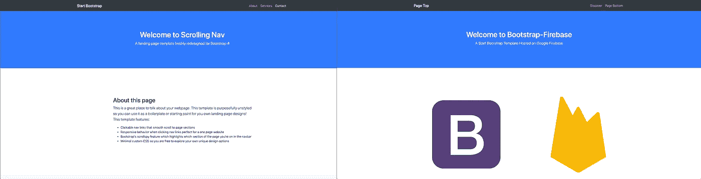

# 2.创建 Firebase 应用程序

导航到 [Firebase 控制台](https://console.firebase.google.com/)并创建一个新项目。下面是代表该过程每一步的一系列截图。您可以自由启用/禁用 Google Analytics，但这不是必须的。

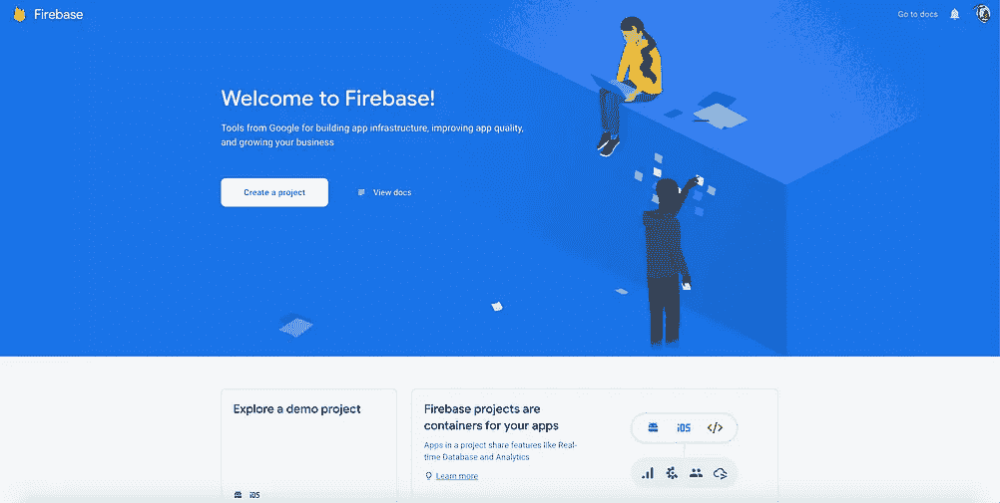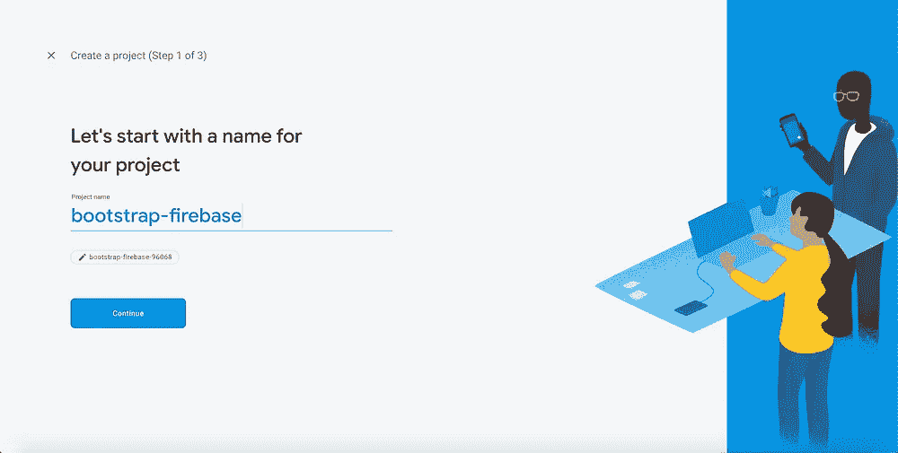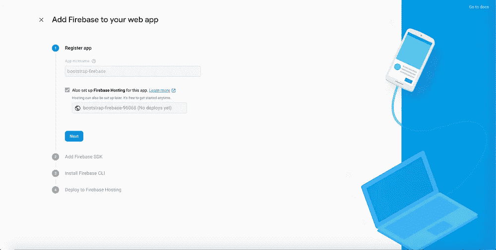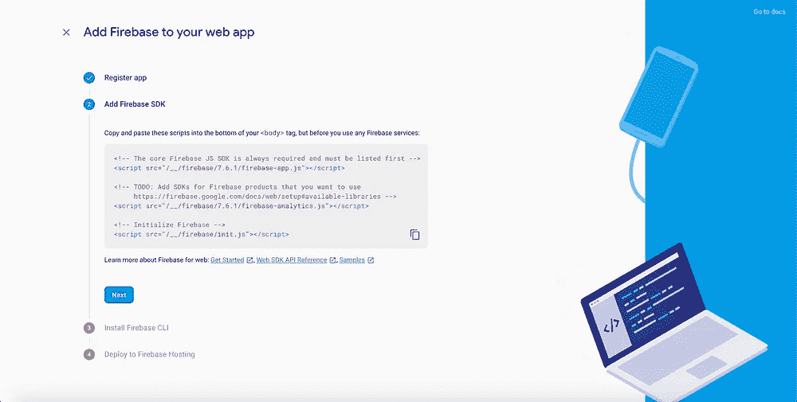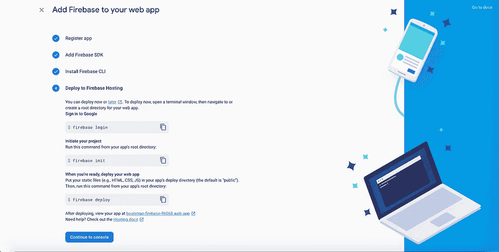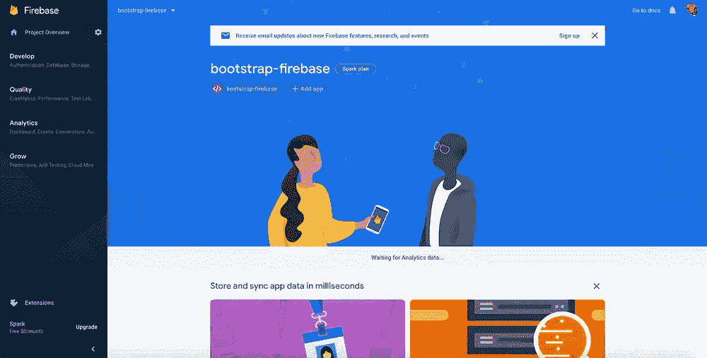

# 3.准备项目进行部署

在使用 CLI 部署静态网站之前，我们需要有一个默认的公共目录，其中包含静态文件。因此，在您的项目目录中，将您的所有网站文件移动到一个名为 *public* 的新文件夹中。按照下面的截图寻求帮助。

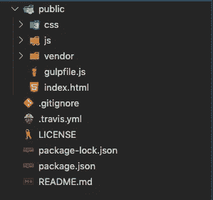

在部署项目之前，我们需要对项目进行的最后一项更改是加入 Firebase SDK。创建 Firebase 应用程序后，您将看到一个代码片段(见下面的截图)。这是允许你的静态网站与 Firebase 交互的原因。复制代码块并将其添加到您的`index.html`的底部。


# 4.使用 Firebase CLI

如果你没有安装 firebase，使用这个[链接](https://firebase.google.com/docs/cli)或者这个`npm`命令:

```
npm install -g firebase-tools
```

现在，使用终端，确保您在项目的目录中，并按顺序执行这三个命令。按照截图进行详细的步骤。

```
firebase login
```

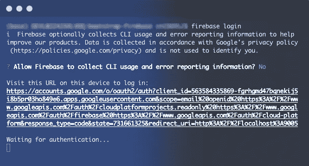

```
firebase init
```

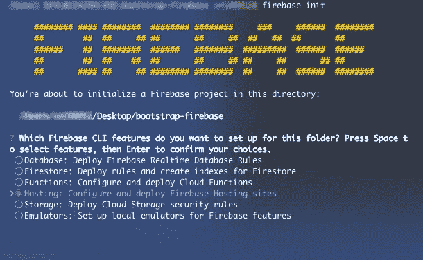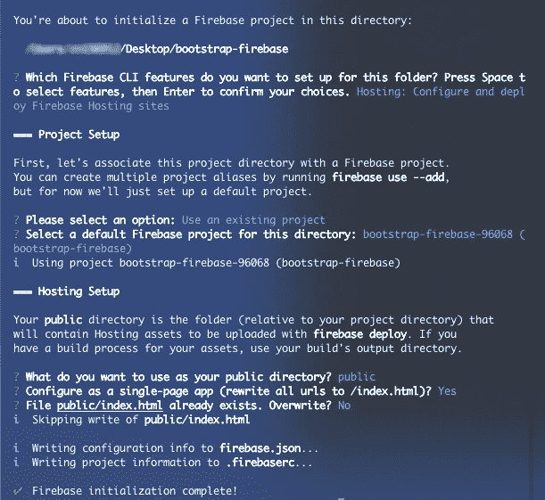

```
firebase deploy
```

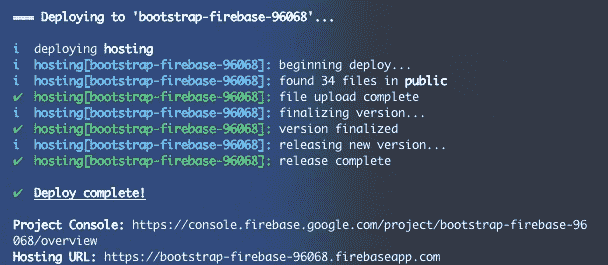

访问显示在终端底部的托管 URL，您应该会看到您部署的静态网站。这里是我的。你也可以在 [Firebase 控制台](https://console.firebase.google.com/)中找到更多关于你的主机的信息。你成功了！🎉

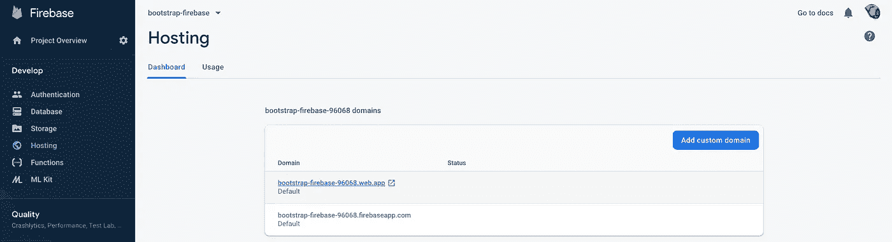

作为可选的清理任务，将`.firebase`*`.firebaserc`*和`firebase.json`添加到您的`.gitignore`中。**

**查看 [Github repo](https://github.com/Marwan01/bootstrap-firebase) 获取本文使用的源代码。**