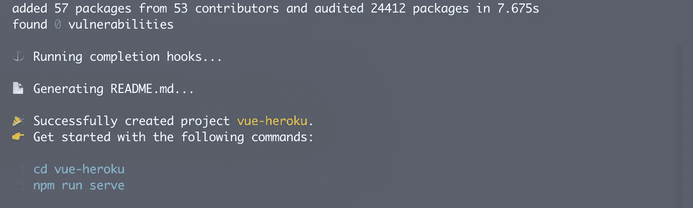
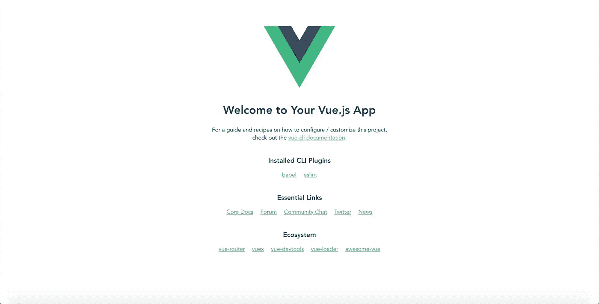
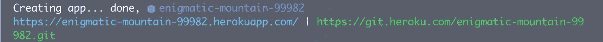
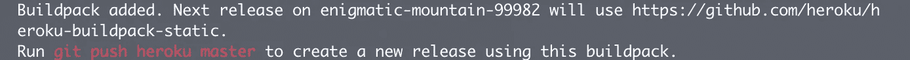
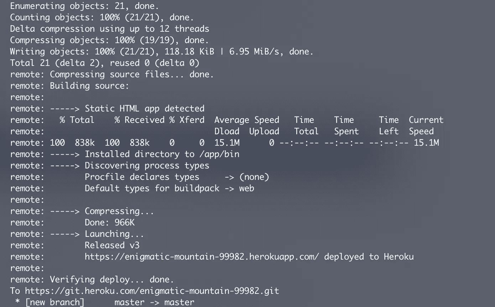

# 将 Vue.js 应用程序部署到 Heroku

> 原文：<https://betterprogramming.pub/deploying-a-vue-js-app-to-heroku-d16f95c07a04>

## 在不到五分钟的时间内，从零开始创建 Vue.js 应用程序并将其部署到 Heroku


图片作者:Marouen Helali

先决条件:

*   [Git](https://git-scm.com/book/en/v2/Getting-Started-Installing-Git)
*   [节点](https://nodejs.org/en/)
*   Vue CLI
*   Heroku CLI
*   [免费 Heroku 账号](https://signup.heroku.com/login)

首先，使用 Vue CLI 生成一个新的 Vue 应用程序:

```
vue create <app-name>
```

如果 CLI 提示预设，请选择默认。



```
cd <app-name>
```

现在，您已经进入了新的项目目录，让我们试着运行这个应用程序，以确保一切都按预期运行。但首先，我喜欢用`npm start`统一运行我的网络应用，Heroku 也是。可悲的是，在初始化一个 Vue app 时，启动命令是不同的(`npm run serve`)。让我们迅速改变这一点。在你的项目文件夹中，打开`package.json`文件。

包含在`scripts`中的花括号表示右边命令的别名。简单地将*服务*替换为*启动*。您应该会得到这样的结果:

```
{ "name": "vue-heroku", "version": "0.1.0", "private": true, "scripts": { "**start**": "vue-cli-service serve", "build": "vue-cli-service build", "lint": "vue-cli-service lint" },.
.
.}
```

让我们试一试，回到终端并运行:

```
npm start
```

导航到 [http://localhost:8080](http://localhost:8080/) ，您应该会看到 Vue 生成的应用程序。



接下来，我们的 Vue 应用是一个简单的前端专用应用。我们可以通过服务器提供服务，也可以静态地提供构建文件。让我们采用第二种选择，它要简单得多。

所需要做的就是向我们的项目添加一个文件，向 Heroku 添加一个 buildpack。在项目 repo 的根目录下创建一个名为`static.json`的文件。补充一下这个内容([官方来源](https://cli.vuejs.org/guide/deployment.html#heroku)):

```
{
  "root": "dist",
  "clean_urls": true,
  "routes": {
    "/**": "index.html"
  }
}
```

至此，我们完成了对项目的编辑。我们可以通过执行以下操作将我们的更改提交给 Git:

```
git add . && git commit -m "Heroku config"
```

让我们创建一个生产版本:

```
npm run build
```

最后，赫罗库来了。假设您有 Heroku CLI，运行:

```
heroku login
```

按任意键，将弹出一个浏览器窗口供您登录:


我们准备使用 CLI 创建一个新的 Heroku 应用程序。运行:

```
heroku create
```



一个非常重要的步骤是运行这两个命令:

```
heroku buildpacks:add heroku/nodejs
heroku buildpacks:add [https://github.com/heroku/heroku-buildpack-static](https://github.com/heroku/heroku-buildpack-static)
```

这将允许 Heroku 将我们的应用程序作为一个静态应用程序。



现在我们终于可以执行部署命令了:

```
git push heroku master
```



导航到远程网址，你应该会看到你的 Vue 应用。

这里是我的。您还可以在 Heroku 仪表板中找到您部署的应用程序，如果您想了解更多信息，其中包含许多有用的信息。以下是我的仪表板的外观，以供参考:


这里有一个到 [Github repo](https://github.com/Marwan01/vue-heroku) 的链接，它包含了用于本文的 Vue 应用程序，以及所有的修改。

感谢您的访问，请继续阅读！