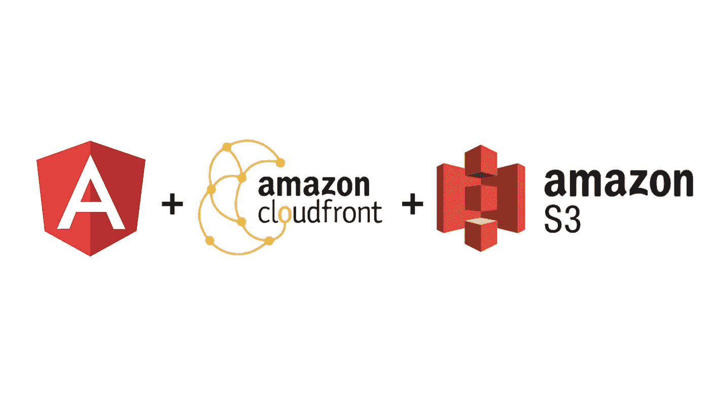
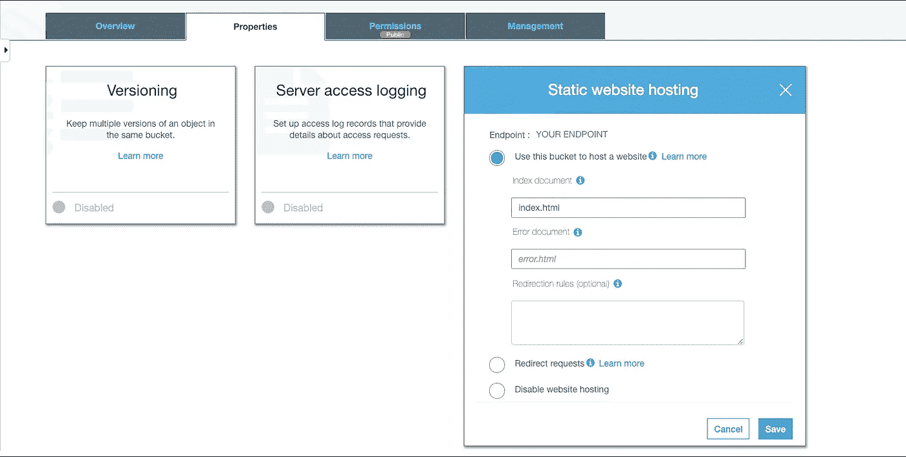
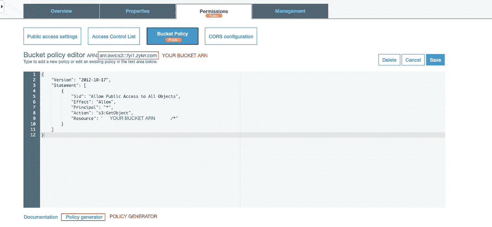
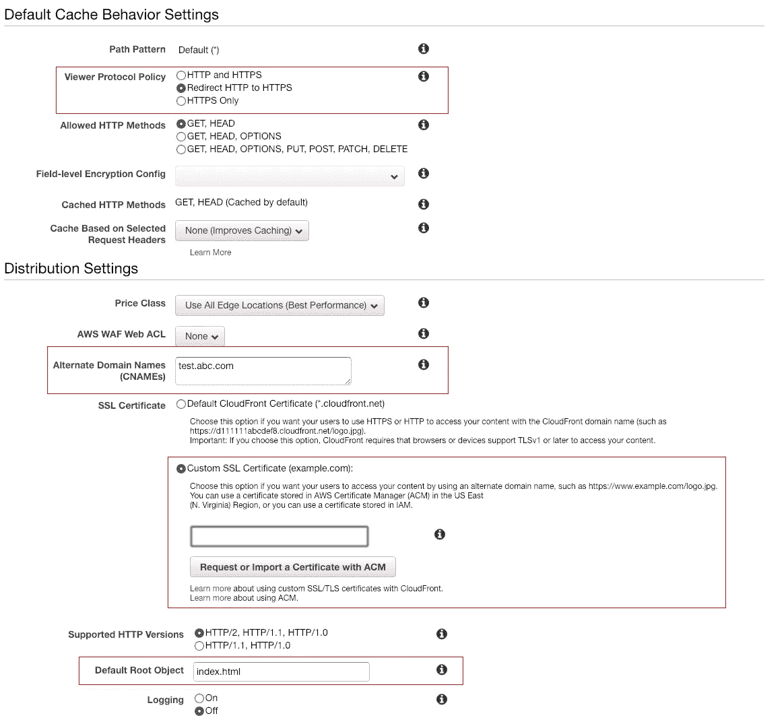
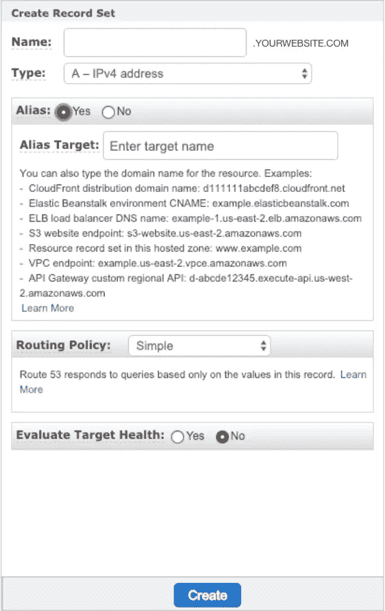

# 将 Angular 应用部署到 S3 自动气象站，CloudFront 为 HTTPS 提供服务

> 原文：<https://betterprogramming.pub/deploying-an-angular-7-application-to-aws-s3-cloudfront-serving-https-requests-f59a806c57b2>

## 您将 Angular 应用安全部署到 S3 和 CloudFront 的一站式解决方案



我的任务是为服务于 HTTPS 的 [AWS S3](https://aws.amazon.com/s3/) 部署一个新的前端应用。令我惊讶的是，我没有一篇完整的博客可以参考，来使用 [CloudFront](https://aws.amazon.com/cloudfront/) 成功地将我的应用程序部署到 S3 和 HTTPS。

我不得不参考几个不同的来源来完成这项任务。因此，我想分享我在使用 CloudFront 为 HTTPS 请求部署完整的前端应用程序到 S3 的知识和经验。

我假设你已经有了你的 AWS 账户，一个 HTTPS 的 SSL 证书，和一个在 [Route53](https://aws.amazon.com/route53/) 的域名。

# 创建 S3 存储桶

*   登录 AWS，进入*S3>创建桶*。提供一个存储桶名称，它应该是唯一的。将 *false* 设置为所有权限，因为您将在以后更改它们，只需继续单击下一个的*，您将创建一个新的 bucket。*


取消选中所有复选框

*   单击已创建的 bucket，您将看到该 bucket 的详细信息。转到*属性*选项卡，然后转到*静态网站托管*并设置*使用此桶托管网站*并提供您的入口点文件。



提供索引文档。这个例子中的 index.html。

*   转到*权限> >存储桶策略*，使用策略生成器更新权限，策略生成器将生成以下 JSON 和*保存*。这应该可以让公众访问您的存储桶。

```
{
    "Version": "2012-10-17",
    "Statement": [
        {
            "Sid": "Allow Public Access to All Objects",
            "Effect": "Allow",
            "Principal": "*",
            "Action": "s3:GetObject",
            "Resource": "YOUR_BUCKET_ARN/*"
        }
    ]
}
```



这使得公众可以访问您的存储桶。

*   将您的构建文件上传到 S3，并提供给公众访问。

您可以从*静态网站托管*中提供的端点访问您的网站。

# 为 Bucket 创建 CloudFront 发行版

1.  导航到 *CloudFront > >创建发行版> >开始使用 Web* 。从列表中选择源域 main。它应该填充所有必需的字段，您需要对默认值进行一些更改。
2.  将查看协议策略更改为*将 HTTP 重定向到 HTTPS* 。
3.  提供备用域名(CNAME):[www.yourwebsite.com](http://www.yourwebsite.com)
4.  选择 SSL 证书或向 AWS 申请一个证书。
5.  提供默认的根对象:它应该是你访问网站时返回的文件，大多数情况下是`index.html`。



在突出显示的区域所做的更改。

保存并拿起一杯咖啡，它需要大约 15 分钟来部署发行版。

# 为端点的别名设置 Route53

1.  创建记录集:提供您想要访问网站的地址。例如:abc.com。与 CNAME 的云锋分布相同。
2.  将*别名*设置为*是*，选择*云锋分发*下创建的分发。应该部署它。
3.  创建记录集。



在别名下拉列表中的 CloudFront Distribution 下选择您的发行版

# 结论

几分钟后，您就可以访问 HTTPS 提供的应用程序或网站。

您可能会遇到拒绝访问错误，此时您会得到以下错误:“此 XML 文件似乎没有任何与之相关联的样式信息”。

这是因为 CloudFront 设置中没有默认的根对象。如果你需要任何帮助，你可以在下面评论，我会回复你的。