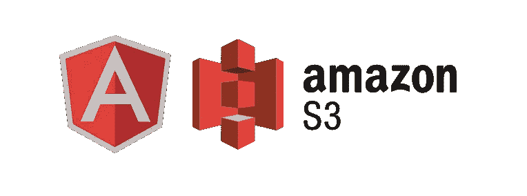
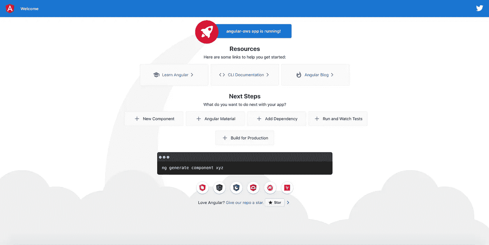
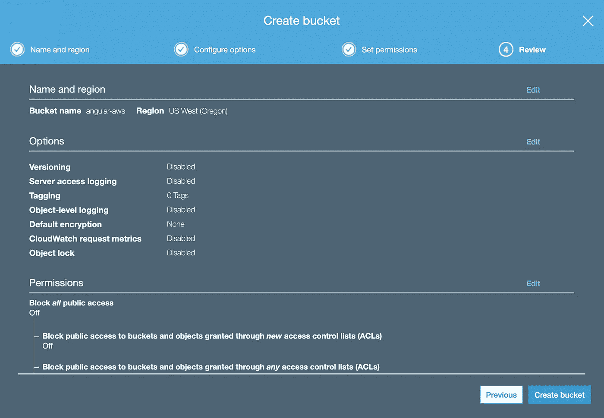
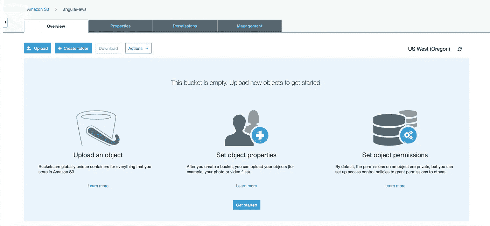
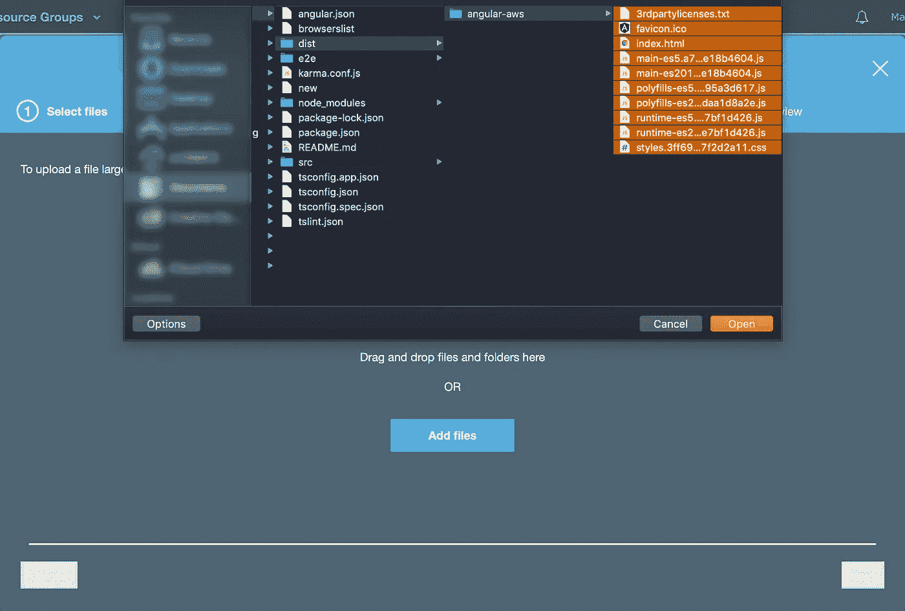
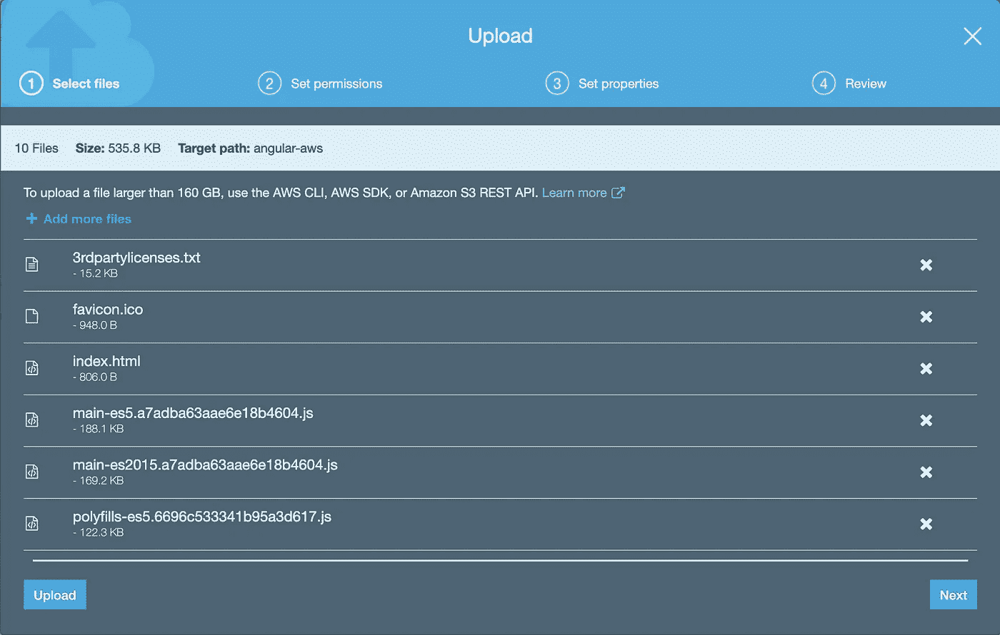
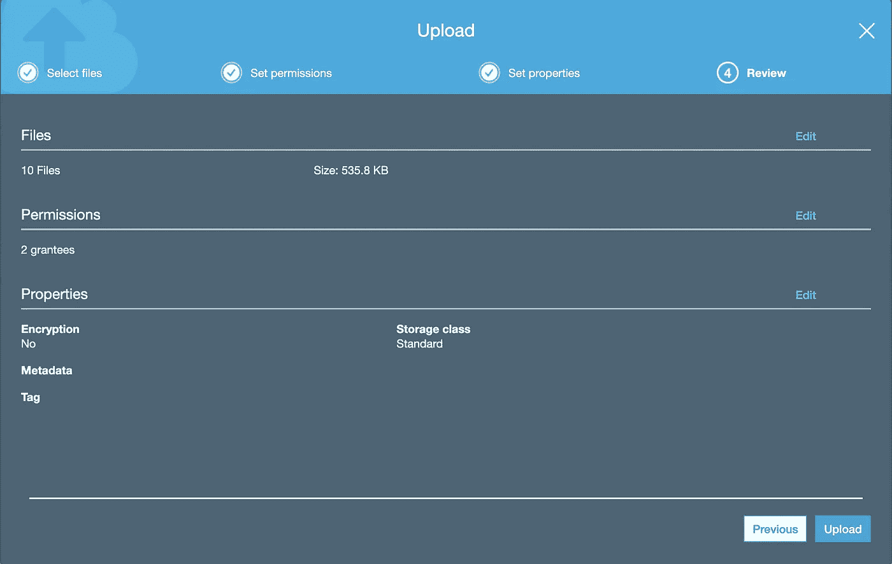
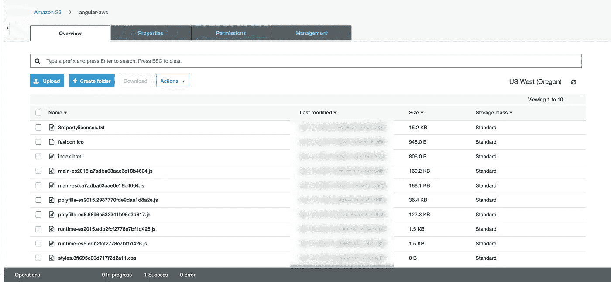
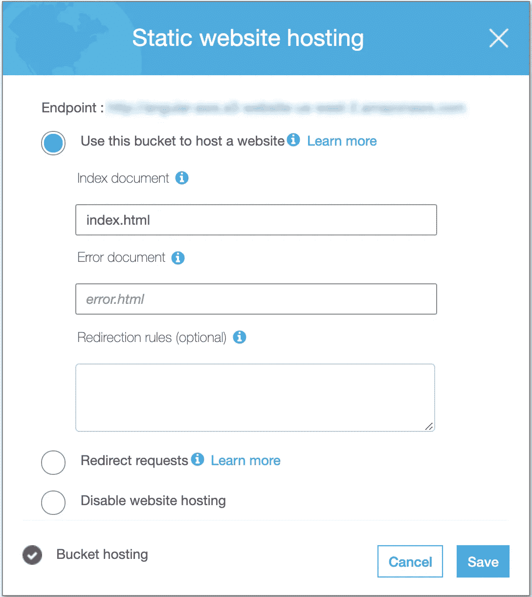

# 将 Angular 应用程序部署到 S3 自动气象站

> 原文：<https://betterprogramming.pub/deploying-an-angular-app-to-aws-s3-301e0c3827d7>

## 在不到五分钟的时间内，从零开始创建 Angular 应用程序并将其部署到 AWS S3



先决条件:

*   [节点](https://nodejs.org/en/)
*   [角度 CLI](https://angular.io/cli)
*   [激活的 AWS 账户](https://aws.amazon.com/premiumsupport/knowledge-center/create-and-activate-aws-account/)

首先，使用 Angular CLI 生成一个新的 Angular 应用程序:

```
ng new
```

系统会提示您输入应用程序的名称和一些配置选项。一旦 CLI 为您的 Angular 应用程序生成了所有必要的文件，让我们通过执行以下操作来确保它正常运行:

```
cd <app-name>
ng serve
```

在您最喜欢的浏览器中，导航到 [http://localhost:4200](http://localhost:4200) 。如果您使用 Angular 8，您应该会看到与此类似的屏幕:



现在，您的应用程序已经启动并运行，让我们将其部署到 S3。为此，您需要登录您的 AWS 帐户，并前往 [S3 控制台](https://s3.console.aws.amazon.com/)。

点击*创建存储桶*按钮，按照步骤为您的新存储桶命名并选择一个合适的区域。

保持*配置选项*不变，取消勾选*设置权限*部分的*阻止所有公共访问*。现在查看并创建您的存储桶。您的最终屏幕应该如下图所示:



我们的新桶看起来很棒。但是当我们把它装满的时候会看起来更好。

目前，我们所有的是一个带有 Angular 应用程序的文件夹。我们需要生成构建文件，这样 S3 就可以理解并服务于它们。让我们回到 Angular 应用程序，简单运行:

```
ng build --prod
```

您应该会在项目目录中看到一个新的`dist`文件夹。它包含
浏览器可以理解的文件，你现在需要上传到你的桶。

回到 S3 上传你的`dist`文件夹的内容。确保在*管理公共权限*下拉菜单中选择*授予对该对象*的公共读取权限。

保持*设置权限*和*设置属性*不变。然后点击*上传*。以下是一些有用的截图:



现在，导航到*属性*并展开*静态网站托管*。



点击*使用此桶托管网站*，进入`index.html`获取*索引文件*。点击*保存*。



保存后，你应该会看到一个彩色的勾号代表*桶托管*，表示它现在已被启用。在顶部，*端点*是新部署的 Angular 应用程序的链接。

大约一分钟后，导航到该链接以查看结果。恭喜你。您刚刚将 Angular 应用程序部署到 AWS S3！