# 从《我的世界》部署基础设施

> 原文：<https://betterprogramming.pub/deploying-infrastructure-from-minecraft-97b3f8321cce>

## 使用 Terraform 部署基础设施的有趣方式

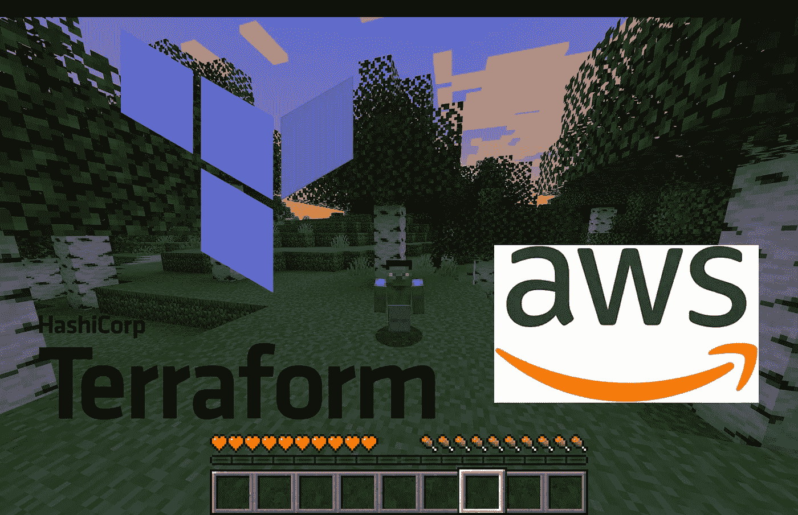

作者图片| AWS 和 Terraform 徽标

在一个周日下午玩《我的世界》的时候，一个随机的想法出现在我的脑海里:“我可以使用《我的世界》的 Terraform 吗？”当时，我正在学习 Terraform，我对它的痴迷让我创建了这个周末项目。现在你可能想知道为什么我会尝试这样做，原因如下:

*   很好玩！
*   这是学习 Docker、docker-compose 和 Terraform 的一种很酷的方式！

如果你确信这足够酷😎，在深入实际项目之前，让我简单介绍一下我们将使用的工具。

# TL；速度三角形定位法(dead reckoning)

这是为不耐烦的读者准备的回购:[https://github.com/lollococce/terracraft](https://github.com/lollococce/terracraft)。按照 README.md 中的说明开始使用《我的世界》世界的 Terraform！

# 工具和要求

*   [](https://www.minecraft.net/en-us)*****必选！Java 版: [Here](https://www.minecraft.net/en-us/store/minecraft-java-bedrock-edition-pc) ]:《我的世界》是一款非常受欢迎的视频游戏，由 Mojang Studios 开发，允许你在一个由立方体积木组成的虚拟世界中进行创作、生活和实验。我们将在这个项目中使用 Java PC 版，但是你应该(在理论上)能够在基础版中复制它。*****
*   ****[**Docker**](https://www.docker.com/)*必选！* Docker 桌面:[此处](https://www.docker.com/get-started/)】:Docker 是一个开发、发布和运行应用程序的开放平台。Docker 让您将应用程序从基础设施中分离出来，从而快速交付软件[1]。在你的电脑上下载并安装 Docker 桌面应用程序。****
*   ****[**docker-compose**](https://docs.docker.com/compose/)*必选！*安装指南:[此处](https://docs.docker.com/compose/install/)】:docker-compose 是一个定义和运行多容器 Docker 应用的工具。使用 Compose，您可以使用 YAML 文件来配置应用程序的服务。然后，只需一个命令，您就可以从您的配置中创建并启动所有服务[2]。按照安装指南从您的终端本地安装它。****
*   ****[**Spigot**](https://www.spigotmc.org/)【Am 使用 v 1.19】:Spigot 是一款针对性能进行了优化的《我的世界》服务器，具有额外的特性，比如定制插件。我们将用它在本地主机上托管一个修改过的《我的世界》版本，通过一个自定义插件与 Terraform 交互。****
*   ****[**terra form**](https://www.terraform.io/):terra form 是一个 HashiCorp 工具，用于将基础设施配置为代码(IaC)。它允许您部署服务器、数据库等。，通过将您的代码转换成对云服务的 API 调用。****
*   ****[**AWS**](https://aws.amazon.com/) :我们将在这个具体的例子中使用 AWS，但是您可以随意使用您选择的任何云服务。****

# ****步骤 1:安装和设置****

****一旦您安装了 Docker 和 docker-compose，您应该能够在您的终端上检查它们是否可用:****

```
**$ docker-compose --version
docker-compose version 1.29.2, build 5becea4c$ docker --version
Docker version 20.10.12, build e91ed57**
```

****如果出现一些错误，检查你的 Docker 引擎正在运行；你可以通过打开 Docker 桌面应用程序来实现。这将自动启动 docker 服务。您可以再次尝试上面的 bash 命令来确认一切正常。****

****如果 Docker 和 docker-compose 设置正确，可以从我的 repo 下载源代码，正式开始项目。****

```
**$ git clone [https://github.com/lollococce/terracraft](https://github.com/lollococce/terracraft)$ cd ./terracraft**
```

****在 repo 里面，你会发现一个 Dockefile，一个 docker-compose.yml 和一个带有插件和服务器设置的数据文件夹。****

****作为 Docker 文件的 Docker 图像，我们使用了一个众所周知的图像:[https://github.com/itzg/docker-minecraft-server](https://github.com/itzg/docker-minecraft-server)[3】(这使我们可以轻松地启动一个 Spigot 服务器)。使用它作为基础映像，我们可以扩展它，在服务器上安装 g it 和 Terraform。****

****下面是我们的 [Dockerfile](https://github.com/lollococce/terracraft/blob/master/Dockerfile) 如何扩展 [itzg](https://github.com/itzg/docker-minecraft-server) 的图像:****

```
**#
# Extended from itzg/minecraft-server:latest
#
# Copyright on itzg/minecraft-server:latest
# of itzg (https://github.com/itzg)
#
FROM itzg/minecraft-server:latest
# Install Git
RUN apt-get update && DEBIAN_FRONTEND=noninteractive apt-get install -y --no-install-recommends git wget unzip gnupg software-properties-common
# Install Terraform
RUN wget --quiet https://releases.hashicorp.com/terraform/1.2.1/terraform_1.2.1_linux_amd64.zip \  && unzip terraform_1.2.1_linux_amd64.zip \  && mv terraform /usr/bin \  && rm terraform_1.2.1_linux_amd64.zip
# Check if working
RUN terraform -help**
```

****现在，让我们来看看 [docker-compose.yml](https://github.com/lollococce/terracraft/blob/master/docker-compose.yml) 文件！我们将 repo 中的数据文件夹安装为容器的卷:****

```
**version: "3.8"
services:
  minecraft:
    # Using . to use the local ./Dockerfile
    build: "."
    ports:
      - "25565:25565"
      - "4711:4711"
      - "8123:8123"
    environment:
      # + + + + + [START] WORLD SETTINGS + + + + +
      # - - - World Type - - - 
      # Custom World (Use a custom Seed or a world from a ZIP)
      #WORLD: "https://download1460.mediafire.com/5epwuydu5fmg/35a7iustexizbrc/World+of+worlds+3.9.zip"
      #SEED: "-1785852800490497919"
      #GUI: FALSE
      # - - - World Settings - - -
      MAX_PLAYERS: 50
      MAX_WORLD_SIZE: 10000
      ALLOW_NETHER: "TRUE"      
      ENABLE_COMMAND_BLOCK: "TRUE"      
      HARDCORE: "FALSE"      
      SNOOPER_ENABLED: "FALSE"      
      SPAWN_ANIMALS: "TRUE"      
      SPAWN_MONSTERS: "TRUE"      
      SPAWN_NPCS: "TRUE"      
      SPAWN_PROTECTION: 0      
      VIEW_DISTANCE: 10      
      GENERATE_STRUCTURES: "TRUE"      
      FORCE_GAMEMODE: "FALSE"      
      DIFFICULTY: "peaceful"      
      MODE: "survival"      
      LEVEL_TYPE: "DEFAULT"      
      # + + + + + [END] WORLD SETTINGS + + + + +    

      # + + + + + [START] SERVER SETTINGS + + + + +      
      # - - - Server Type - - -      
      # Use SPIGOT server type + install Plugins
      TYPE: SPIGOT      
      SPIGET_RESOURCES: 22724,34315,51944      
      # Server Title      
      MOTD: "A §l§cSpigot§r §nserver with Terraform"      
      # Custom Server Icon      
      #OVERRIDE_ICON: "TRUE"      
      #ICON: ""

      # - - - Settings - - -      
      # THIS HAS TO BE TRUE!      
      EULA: "TRUE"      
      ENABLE_ROLLING_LOGS: "TRUE"      
      TZ: "Europe/Rome"      
      # + + + + + [END] SERVER SETTINGS + + + + +             

      # + + + + + [START] CLOUD CREDS + + + + +      
      # (Credentials for Could)      
      # AWS Creds and config      
      AWS_ACCESS_KEY_ID: "INSERT_HERE_YOUR_KEY"      
      AWS_SECRET_ACCESS_KEY: "INSER_HERE_YOUR_SECRET"      
      AWS_DEFAULT_REGION: "YOUR REGION (ex us-east-1)"      
      # + + + + + [END] CLOUD CREDS + + + + +

    volumes:
      - ./data:/data
volumes:
  data: {}**
```

****正如你在上面看到的，我们可以用环境变量改变世界设置，并从种子或 Zip 文件上传一个自定义的《我的世界》世界。Terraform 将使用云凭据变量连接到您选择的云服务。因为我为这个项目选择了 AWS，所以我将 AWS 默认环境变量传递给 Terraform 在部署时将寻找的容器(记住创建一个具有适当权限的 I am 用户)。****

****为了从《我的世界》运行 Terraform，我们使用了[basish](https://www.spigotmc.org/resources/bashful.51944/)，一个允许我们运行 bash 命令并从《我的世界》的 chat 控制服务器终端的插件。****

# ****步骤 2:运行容器****

****好吧！一切都准备好了。我们现在可以运行以下内容:****

```
**$ cd ./terracraft
$ docker-compose up**
```

****您应该会在终端上看到类似这样的提示:****

****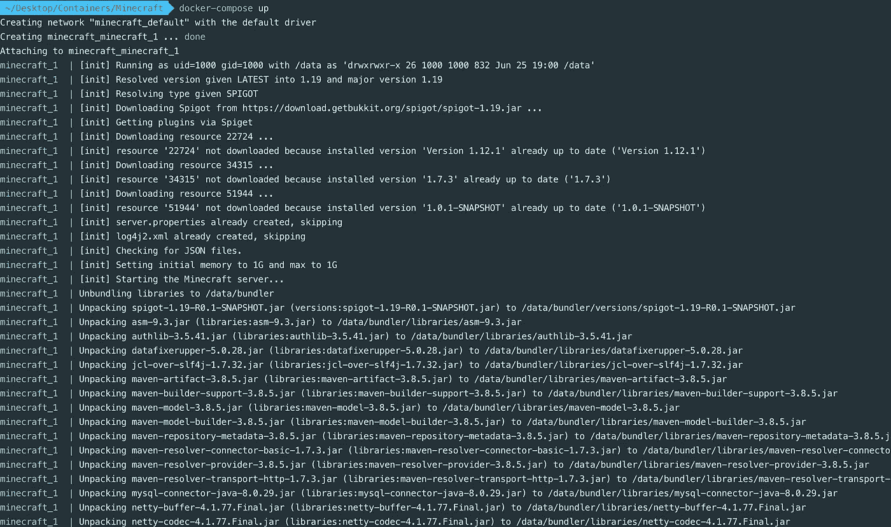****

****要在后台运行容器，您可以决定改为运行:****

```
**$ docker-compose up -d**
```

****等待几分钟，让容器安装资源并完全运行。****

****要仔细检查容器是否在本地运行，可以打开 Docker 桌面应用程序。它应该将您的《我的世界》容器显示为“正在运行”，如下所示:****

****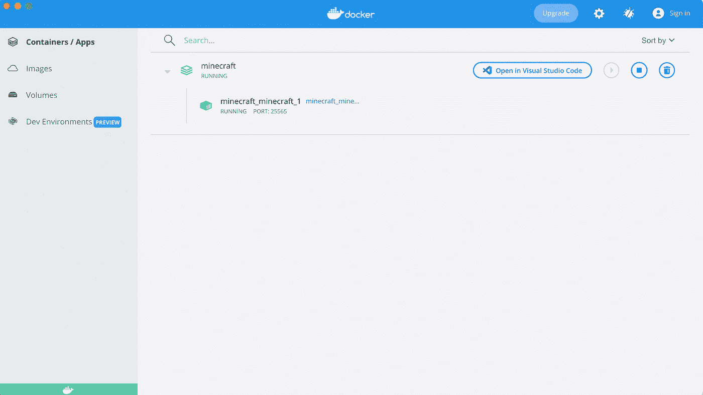****

# ****步骤 3:访问《我的世界》服务器****

****最后，您可以从您的《我的世界》应用程序连接到服务器！在你的笔记本电脑上启动 Java《我的世界》版，选择“多人游戏”****

****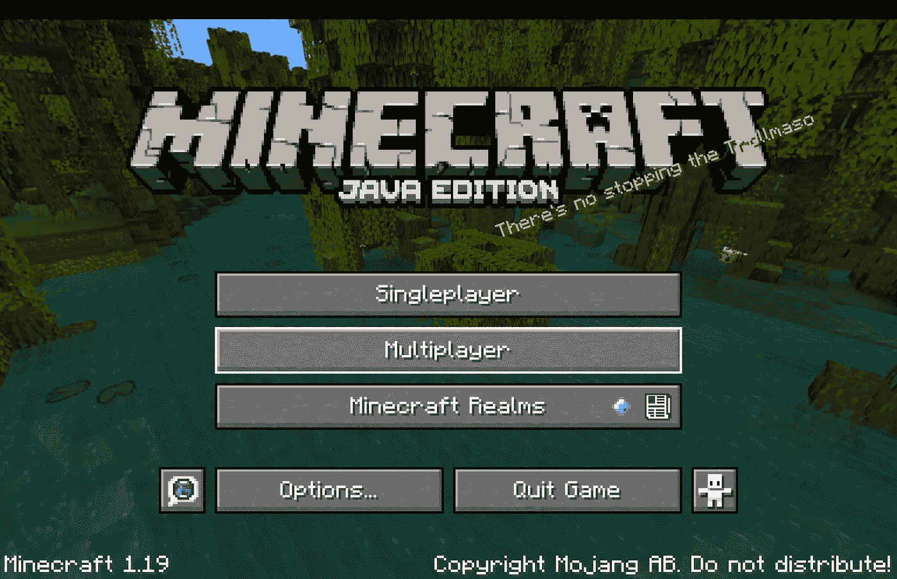****

****您应该会看到一个“添加服务器”按钮。点击它！****

****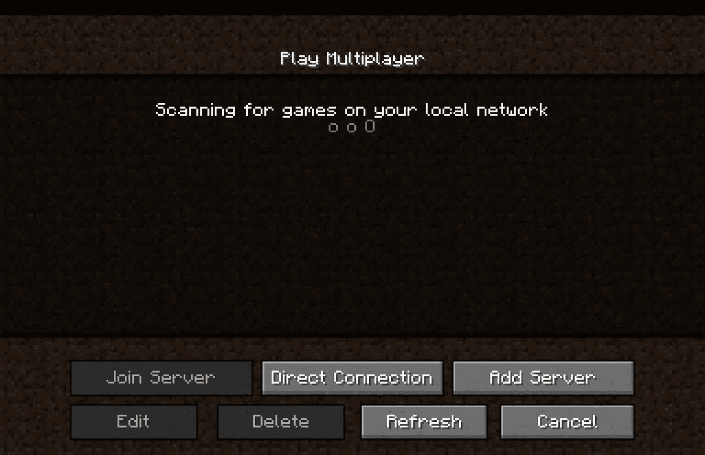****

****使用“localhost”作为服务器地址，并输入您喜欢的任何名称作为服务器名称。****

****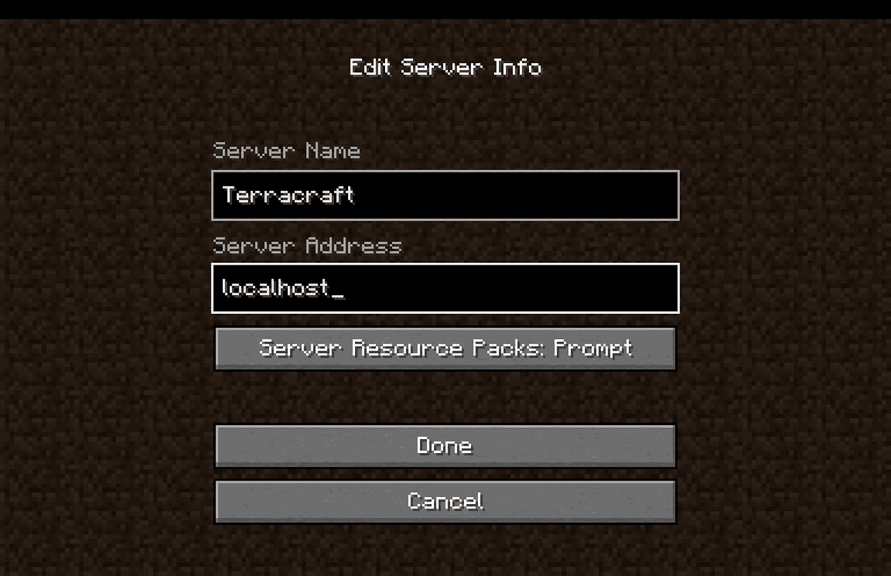****

****如果您正确设置并运行了《我的世界》容器，您应该会在服务器列表中看到一个服务器。点击图片加入吧！****

****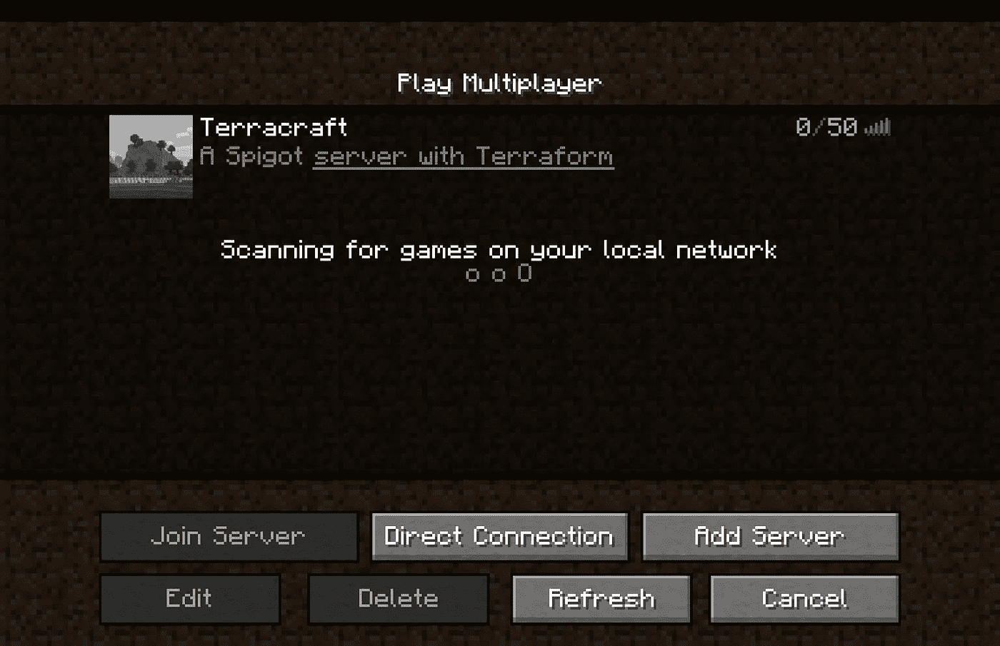****

****恭喜你。最后，您将作为 Docker 容器运行在本地主机上的《我的世界》服务器中。****

****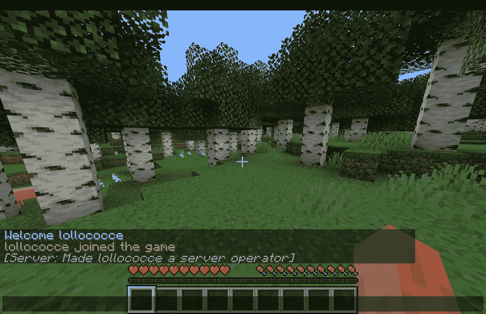****

# ****步骤 4:运行 Terraform****

****要开始运行 Terraform，我们首先需要检查我们安装的插件(basish)是否功能齐全。为了测试它，我们必须给我们的《我的世界》播放器分配一个特殊类型的用户访问，称为`op`。因为默认情况下，加入服务器的用户不属于这个用户组，所以我们必须在终端上运行下面的命令。****

****记住使用你的容器 ID 作为<your_container_id>(你可以使用`docker ps`命令来获取)，你的《我的世界》玩家的名字作为<你的玩家名字>。</your_container_id>****

```
**$ docker ps
CONTAINER ID IMAGE COMMAND CREATED STATUS PORTS NAMES
<CONTAINER_ID (e.g. 2cbc269c566f)> minecraft_minecraft  "/start" 2 minutes ago Up 2 minutes (healthy)   0.0.0.0:4711->4711/tcp, 0.0.0.0:8123->8123/tcp, 0.0.0.0:25565->25565/tcp, 25575/tcp   minecraft_minecraft_1$ docker exec <YOUR_CONTAINER_ID> mc-send-to-console op <YOUR_PLAYER_NAME>**
```

****这在容器的终端上执行一个《我的世界》命令，升级游戏中用户的权限。在 bash 执行之后，游戏日志中会立即提示一条消息“Server:make<your_player_name>a Server operator”。</your_player_name>****

****现在，让我们用《我的世界》运行我们的第一个 bash 命令(多酷啊！！).按下`t`激活《我的世界》的聊天并输入以下内容:****

```
**/bashful echo hello world**
```

****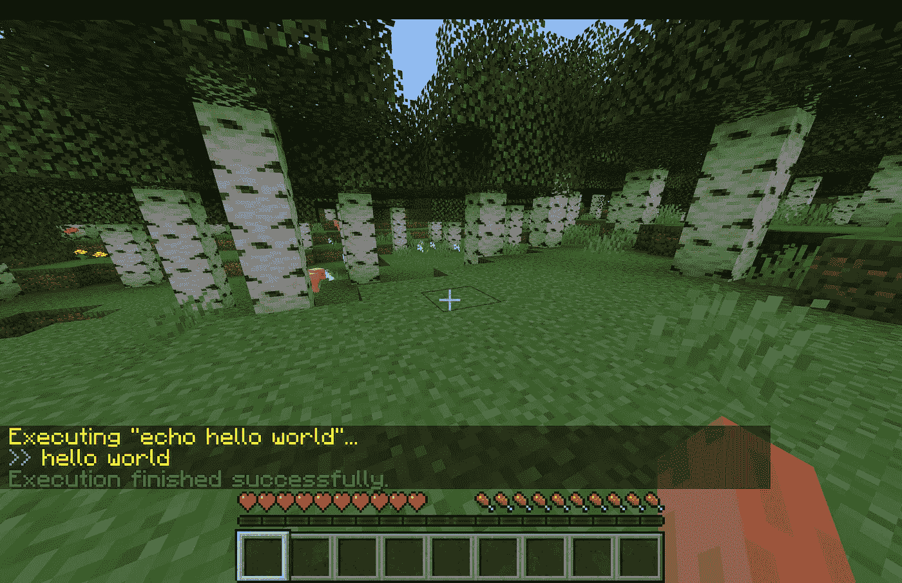****

****在您的聊天中，您应该会看到带有命令输出的黄色日志！****

****用 Terraform 试试吧！****

```
**/bashful terraform --help**
```

****屏幕上应该会出现以下输出:****

****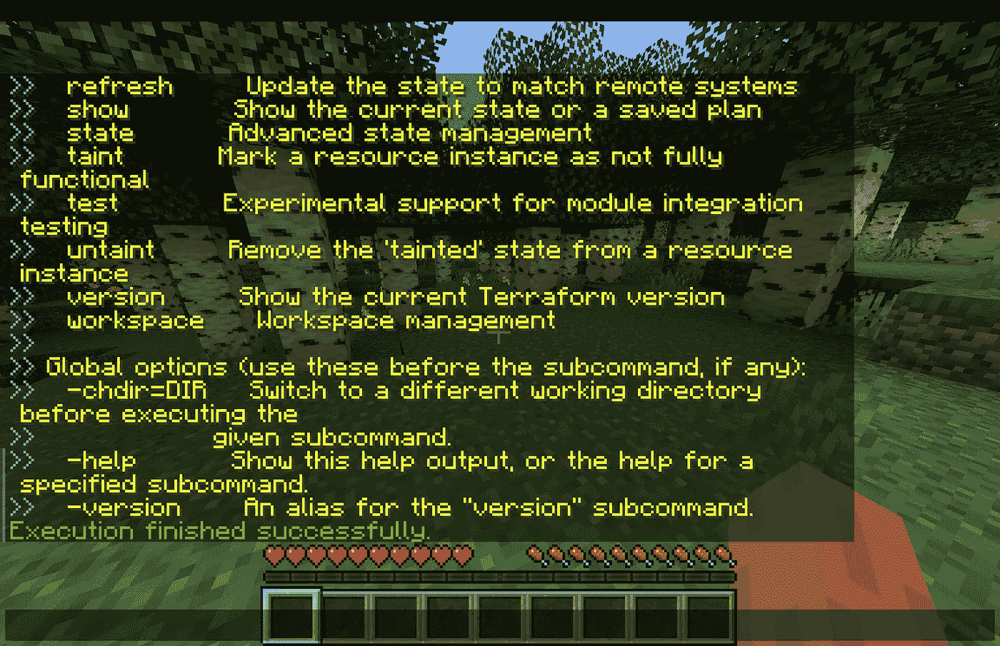****

****如果您在 docker-compose.yml 文件中设置了 AWS 凭证，那么您可以使用 repo 中包含的示例在 AWS 上部署 EC2 实例。****

```
**# First Initialize TF:
/bashful terraform -chdir=home/terraform/ec2 init# Wait until you can read in green "Execution finished successfully"# Verify that you have a functioning connection with your cloud service and what you are planning to deploy:
/bashful terraform -chdir=home/terraform/ec2 plan -out=tfplan# Apply and deploy the Ec2 instance:
/bashful terraform -chdir=home/terraform/ec2 apply -auto-approve# wait creation of cloud resources**
```

****最后，检查您的 AWS 帐户，查看 EC2 实例是否正在运行！****

****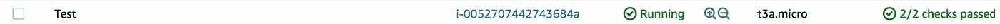****

****恭喜你。🍾****

****您刚刚在《我的世界》发布了 EC2 服务器！(那多爽啊！？)****

****要破坏您的基础设施，您可以运行以下命令:****

```
**# To Destroy the Infrastructure created
/bashful terraform -chdir=home/terraform/ec2 destroy -auto-approve**
```

# ****结论****

****在《我的世界》，你可以随意使用命令块，让这个项目变得更加有趣。如果被《我的世界》事件触发，这些块可以执行上面的命令，例如激活一个杠杆，按下一个按钮，或者与一些红色石头组件交互。让你的想象力自由驰骋。****

****记住，这是玩的工具。Bash 日志很乱，很难阅读，就生产率和安全性而言，在为真正的 Terraform 基础设施创建 CI/CD 服务器时有一些最佳实践，但是谁知道呢？****

****也许我们应该重新思考如何在元宇宙世界中至少可视化部分 DevOps 工具。****

> ****感谢阅读！玩得开心！****
> 
> ****洛伦佐****

# ****更多想法****

*   ****当按下《我的世界》按钮时，使用命令块启动服务器****
*   ****使用 basish 插件通过一个《我的世界》按钮向 Slack 发送消息****
*   ****为 Terraform 创建一个自定义插件，而不是使用 basish****
*   ****创建一个插件，将云基础设施表示为《我的世界》结构/块(使用。tfstate)****

# ****参考****

1.  ****https://docs.docker.com/get-started/overview/****
2.  ****【https://docs.docker.com/compose/ ****
3.  ****[https://github.com/itzg/docker-minecraft-server](https://github.com/itzg/docker-minecraft-server)****