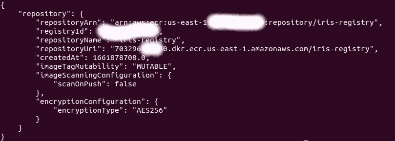
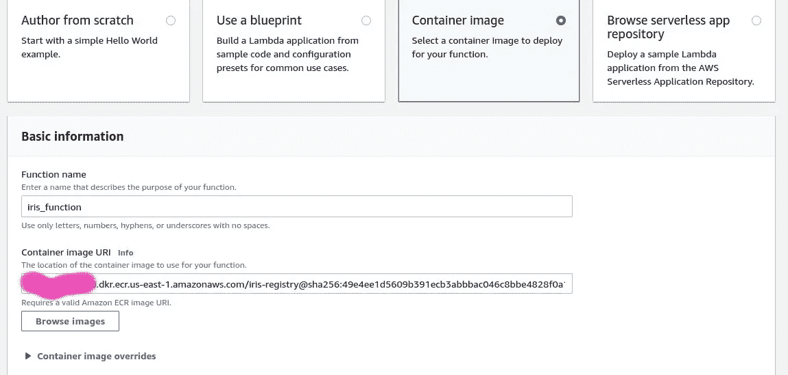
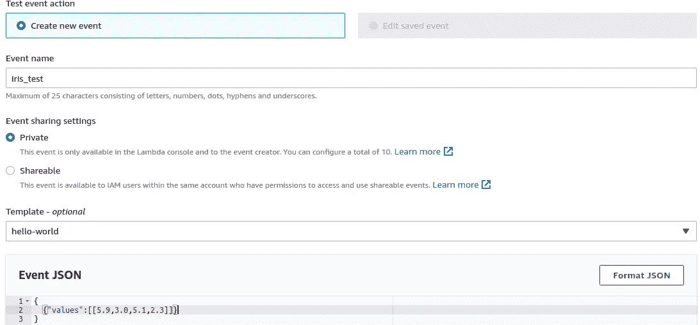
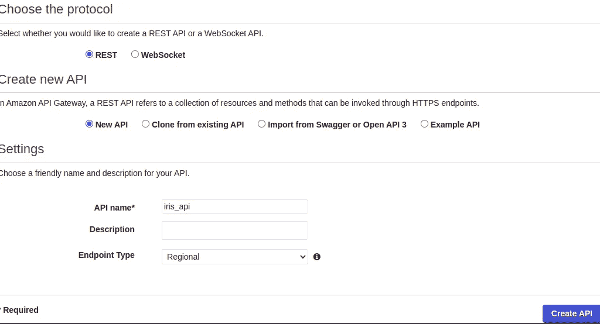
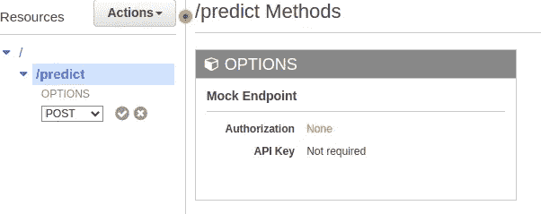

# 使用 AWS Lambda 和 API 网关部署 ML 模型

> 原文：<https://betterprogramming.pub/deploying-ml-models-using-aws-lambda-and-api-gateway-f1f349515c81>

## 演示 AWS lambda 与 API 网关的用法


[亚辛·哈尔法利](https://unsplash.com/@yassine_khalfalli?utm_source=medium&utm_medium=referral)在 [Unsplash](https://unsplash.com?utm_source=medium&utm_medium=referral) 上的照片

通常情况下，机器学习模型要么在本地训练，要么在服务器上训练，我们将模型保存为所需的可消费格式，以供将来使用。每当我们部署我们的机器学习模型时，我们可以使用各种方法来部署它们，如 AWS Sagemaker、EC2 和 Lambda。在这里，我们将讨论λ函数。这是无服务器架构，因为我们没有分配给我们的专用机器。每当服务被使用时，我们就付费，每当我们的服务没有被消费时，我们不为空闲时间付费。

整个教程的代码可以在[https://github.com/Shivampanwar/aws-lambda-apigateway](https://github.com/Shivampanwar/aws-lambda-apigateway)找到

预计读者会对 Docker 有一个简要的了解。[这个链接](https://www.youtube.com/watch?v=0qG_0CPQhpg)对理解 Docker 很有用。我们将遵循几个步骤:

1.  制作一个 Docker 图像，该图像将使用经过训练的模型生成预测。
2.  在 AWS ECR 上创建存储库
3.  将 docker 映像推送到 AWS ECR
4.  使用容器图像创建 lambda 函数
5.  使用 API 网关访问预测 API。

我们将在标准[虹膜数据集](https://archive.ics.uci.edu/ml/datasets/iris)上完成所有这些工作。这是因为我想让 ML 模型尽可能简单，以便更好地理解。

虹膜数据集有四个特征，即萼片长度、萼片宽度、花瓣长度和花瓣宽度。它有 3 类，即刚毛鸢尾、杂色鸢尾和海滨鸢尾。

# 1.创建 docker 图像

## **1.1 训练 ML 模型**

我在 iris 数据集上训练了一个简单的 SVM 模型，并保存了它的 pickle 文件。培训脚本可以在`train.py` *文件中找到。我用名称**`iris.sav`***保存了训练好的模型。****

## ***1.2 写入 docker 图像***

*为了创建 lambda 函数，我们将创建一个预测函数，该函数将使用该模型并给出其预测。这是在文件`lambda_function.py`里面完成的:*

```
*filename = 'iris_model.sav'
model = pickle.load(open(filename, 'rb')def predict(features):
  return model.predict(features).tolist()def lambda_handler(event, context):
   values = event['values']
   result = predict(values)
   return result*
```

*Lambda 函数`handler` *，* `lambda_handler` 在本例中是您的函数代码中处理事件的方法。当您的函数被调用时，Lambda 运行处理程序方法。*

*当处理程序退出或返回响应时，它就可以处理另一个事件了。这里，`lambda_handler`中的`event`是 JSON。测试案例的一个例子是`{“values”:[[0.1,2,0.1,3]]}`*

*下一步是创建创建图像所需的 Dockerfile 文件。它在 git 存储库中被命名为 Dockerfile*

```
*FROM public.ecr.aws/lambda/python:3.8 ## donwloading lambda imageRUN pip install sklearn
COPY iris_model.sav . 
COPY lambda_function.py .
CMD [ “lambda_function.lambda_handler” ]*
```

*该文件中的第一行下载 AWS ECR 提供的基本映像。由这个[链接](https://gallery.ecr.aws/lambda/python)提供。您可以从 ECR 公共图库中找到与您的平台相对应的图像。当 docker 容器运行时，CMD 给出运行命令，它调用`lambda_function.py`文件中的函数`lambda_handler`。*

*现在，使用以下内容构建映像:*

```
*docker build -t iris_image*
```

*现在，您将拥有一个名为 iris_image 的 docker 图像。您可以使用`docker image ls`来列出图像。*

## ***本地测试图像***

*我们将根据图像制作容器，并测试我们的图像是否工作正常。为了运行容器，我们将使用:*

```
*docker run -it — rm -p 8080:8080 iris_image:latest*
```

*在这里，我们映射端口 8080。现在使用 test.py 测试容器是否在运行。我们将使用[*http://localhost:8080/2015-03-31/functions/functions/invocations*](http://localhost:8080/2015-03-31/functions/function/invocations)*对模型进行本地测试。此 URL 由 AWS lambda 提供。**

**我们现在使用`test.py`来检查图像是工作正常还是出现错误。我希望，它在你的情况下正常工作。**

# **2.创建 ECR 存储库**

**我们现在已经在本地创建了映像。我们将需要这个图像来运行 lambda 函数。为此，我们将使用 ECR。ECR 是一个容器注册表，我们将使用它来推送或托管我们的映像。我们将首先创建注册表，然后将映像推送到该注册表。**

## **2.1 创建 ECR 注册表，使用**

```
**aws ecr create-repository — repository-name iris-registry**
```

**该命令将生成如下所示的存储库。**

****

**注意`repositoryURI`，因为稍后会用到它。它的初始和隐藏部分是 accountID。**

## **3.将 Docker 图像推送到注册表**

**使用[这个链接](https://docs.aws.amazon.com/AmazonECR/latest/userguide/docker-push-ecr-image.html)将 docker 镜像推送到注册表。我将在下面展示它的步骤。**

## **3.1 将 docker 身份验证发送到您想要推送映像的存储库。**

**使用下面的命令:**

```
**aws ecr get-login-password — region region | docker login — username AWS — password-stdin aws_account_id.dkr.ecr.region.amazonaws.com**
```

## **3.2 用 AWS ECR 注册表标记您的图像**

**使用`docker image ls` 查找 ImageID。在我的例子中，图像 ID 是 *ab9ca3188305* 。使用下面的命令来标记图像。**

```
**docker tag ab9ca3188305 aws_account_id.dkr.ecr.us-east-1.amazonaws.com/iris-registry:tag**
```

## **3.3 使用 docker push 命令推送映像**

```
**docker push aws_account_id.dkr.ecr.us-east-1.amazonaws.com/iris-registry:tag**
```

## **4.创建 lambda 函数**

**Lambda 函数可以通过多种方式创建，但我们将使用容器进行构建。更多细节可以在下图中找到。**

****

**Lambda 创建页面**

**我们现在将测试我们的 lambda 函数。我们现在将创建一个测试事件。它的输入可以从下面的事件 JSON 看出来。您可能需要将 lambda 函数配置中的超时时间从 3 秒增加到 30 秒。**

****

**λ测试事件**

**如果你还和我在一起，那么我们将使用 API 网关来构建我们的 API 并供我们最终消费。**

## **5.使用 API 网关公开 Lambda 函数**

****Amazon API Gateway** 是一个完全托管的服务，让开发者可以轻松创建、发布、维护、监控和保护任何规模的 API。**

**我们将转到 API 网关页面，有三个选项来构建 API，第一个是 HTTP API，第二个是 Websocket API，最后一个是 REST API。我们将使用 REST API 作为我们的用例。**

****

1.  **创建一个新的 REST API(如上图所示)。命名为 iris_api。给它一个名字，然后创建它。这将打开一个资源菜单。**
2.  **创建一个新资源，给它一个名字(类似于 predict)并创建它。**

**3.在您的资源中创建一个新的*方法*。选择您需要的 HTTP 方法(在这个例子中我们将使用`POST`)。选择它以打开其设置选项**

****

**4.将 Integration type 设置为 Lambda Function，将 Lambda region 设置为您的区域，并选择您在前面的步骤中创建的 Lambda 函数。使用默认超时并取消选中 *Lambda 代理集成*。**

****

**5.点击*测试*测试网关。**

*   **在*请求体*中编写一个 JSON 文档进行测试。在我们的例子中，它是{"values":[[5.9，3.0，5.1，2.3]]}**
*   **测试成功后，部署 API。**

**6.点击顶部的*动作*按钮并选择部署 API**

**首先，分配一个*阶段名*如 test，然后点击 Deploy 后，控制面板会显示一个调用 URL。用它来访问 Lambda 函数。我已经在`testing.py`文件中添加了网址**

**我希望这篇文章对你有所帮助。代码可以在 GitHub 存储库中找到:**

**[](https://github.com/Shivampanwar/aws-lambda-apigateway) [## GitHub-Shivampanwar/AWS-lambda-apigateway:演示 AWS lambda 与 API gateway 的用法…

### 演示使用 AWS lambda 和 API gateway 部署在 IRIS 数据集上训练的 ML 模型- GitHub …

github.com](https://github.com/Shivampanwar/aws-lambda-apigateway)**