# 使用 Hardhat 和 Ethers.js 将智能合约部署到 Polygon 和 Ethereum 区块链

> 原文：<https://betterprogramming.pub/deploying-smart-contracts-to-the-polygon-and-ethereum-blockchain-using-hardhat-and-ethers-js-2c31aa41aed0>

## 编写、编译和部署合同


图片来自 Unsplash

# **简介:什么是智能合约？**

根据以太坊的官方文档，“智能合约”只是一个运行在以太坊区块链上的程序。“它是代码(它的功能)和数据(它的状态)的集合，驻留在以太坊区块链上的一个特定地址。”

Nick Szabo 还将智能合约描述为数字自动售货机，它们是一种以太坊账户，通过正确的输入产生并保证一定的输出。

智能合约也不是由用户控制的，它们有编程的逻辑，可以根据输入运行。

还记得自动售货机的比喻吗？一枚硬币和输入什么小吃想进去。点心出来了。你可以在这里阅读更多关于智能合约的信息:【https://ethereum.org/en/developers/docs/smart-contracts 

# **先决条件**

要开始部署智能合约，我们必须首先编写一个智能合约。以下是我们需要的:

*   文本编辑器:从 Visual studio 代码到基本的文本编辑器，任何人都可以做。Remix 是一个为编写可靠性代码而创建的 IDE。我用的是 Visual Studio 代码。
*   命令行界面:基于 UNIX 的操作系统上的终端。windows 上的命令行或 Powershell。我觉得 Windows 10+上的 Windows 终端用起来挺好玩的。
*   Node.js: Node js 是基于 Chrome 的 V8 引擎构建的 JavaScript 运行时。没有它，JavaScript 代码就不能在浏览器之外运行。我们还需要它来访问节点包管理器(NPM)以安装第三方包。我们将为本文安装 hardhat 和 ethers.js。
*   智能合同语言:我们将用它来编写智能合同。坚固和毒蛇是最受欢迎的两个。在这篇文章中，我们将使用 solidity。
*   区块链钱包:钱包可以让你连接到区块链网络并进行交易。它还可以帮助您存储支付汽油费所需的加密货币代币。以太坊交易上下文中的 Gas 是指测量在以太坊网络上执行特定操作所需的计算工作量的单位。在本文中，我们将使用 Metamask 作为我们的钱包。你可以从这里得到:[https://metamask.io/download/](https://metamask.io/download/)

# **什么是区块链考试网？**

要开始了解什么是区块链测试网络，我们必须先谈谈什么是区块链网络。比特币等区块链通常被称为分布式账本。

以太坊和以太坊虚拟机(EVM)被称为分布式状态机，而不是分布式分类帐，因为它支持智能合约和状态。EVM 上的官方以太坊文档对此描述得最好:“虽然以太坊有自己的本地加密货币(以太)，遵循几乎完全相同的直观规则，但它也实现了一个更强大的功能:智能合约。对于这个更复杂的特性，需要一个更复杂的类比。以太坊不是分布式账本，而是分布式状态机。以太坊的状态是一个大型数据结构，不仅包含所有帐户和余额，还包含一个机器状态，它可以根据一组预定义的规则从一个块改变到另一个块，并且可以执行任意的机器代码。从一个块到另一个块改变状态的具体规则由 EVM 定义

我喜欢把 EVM 想象成一个分布式的全球网络，由相互连接的对等计算机节点组成，这些节点运行以太坊客户端，形成一台计算机。老实说，这很简单，但这也是以太坊被称为“世界计算机”的原因区块链是分布式的，这使得它们是分散的、开放的和无权限的。

好吧，这是一件大事——现在让我们来看看区块链的测试网络。区块链测试网络(我从这里开始将它们称为`testnets`)是用于测试和实验目的的区块链的一个实例，它们允许你在没有损失真实资金的风险的情况下执行交易。例子包括以太坊网络上的 Rinkeby(即将被弃用，)Ropsten，Goerli，Kovan。其他区块链电视网也有自己的`testnets`。

测试网资金与真正的官方 mainnet 令牌是分开的，它们没有价值，可以从水龙头免费获得，我们很快就会请求水龙头资金。

由于我们已经简要介绍了本文中使用的一些概念，我们可以开始编码和部署我们的智能契约了。

# **创建一个安全帽项目:**

Hardhat 是一个开发环境，允许您编辑、编译、调试和部署智能合同和 dApps。在部署到活动链之前，它可以帮助开发人员在本地开发智能合约。

如果您的机器上安装了 node js，它会与 NPM 捆绑在一起。创建一个名为`smart-contracts-tutorial`的新文件夹——你可以给它起任何名字，真的。

在终端中运行以下命令:

当软件包安装完成后，我们现在可以使用 hardhat 了。这将在终端中弹出一个菜单。使用键盘上的箭头键选择第一个选项“创建 JavaScript 项目”。完成后，您应该会看到一个类似这样的屏幕。

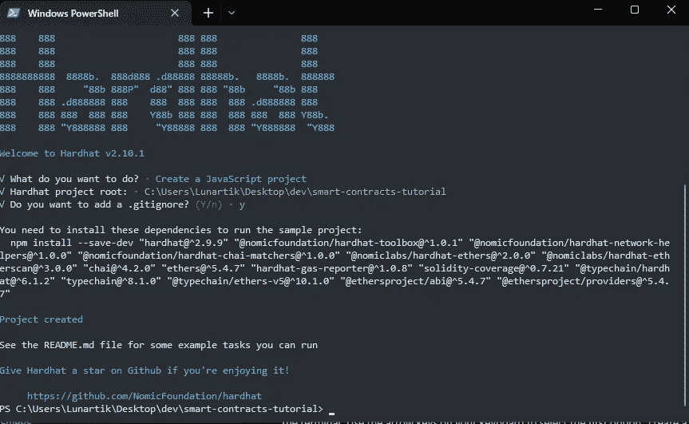

完成后，您的 package.json 文件也应该类似于以下内容:

**安装依赖关系**:要安装缺失的依赖关系，在终端运行`npm i`或`npm install`。这通常是不必要的，但我喜欢这样做以确保万无一失。

# **编写智能合同**:

当我们运行`npx hardhat`并创建一个 JavaScript 项目时，Hardhat 为我们创建了一个样板项目。这是当前的文件夹结构。请注意，这可能会根据您使用的 hardhat 版本而有所变化。

我们现在将在`contracts`文件夹和`hardhat.config.js`文件中工作。

在`scripts`文件夹中，我们有一个`Lock.sol`文件。这是一个 solidity 文件，如果你好奇，你可以打开它玩玩。我将删除它，并在文件夹中创建一个新文件。我就叫它`VendingMachine.sol`。所以，是`smart-contracts-tutorial/contracts/VendingMachine.sol`

在`VendingMachine.sol`中，添加以下代码:

上面的智能合约演示了前面分享的自动售货机示例，您可以通过添加的评论来更好地理解它。它来自智能合约的官方以太坊文档。

# **设置元掩码钱包:**

我们需要一个以太坊账户来发送和接收区块链上的交易。Metamask 可作为 chrome 和其他浏览器的扩展，从这里下载并创建一个帐户。当您创建完一个帐户或拥有一个现有帐户后，切换到如下所示的`goerli test network`。记住，我们不会冒险用`testnet`损失真正的资金。

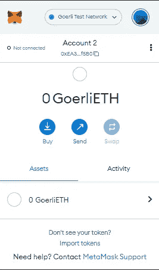

对于首次使用 metamask 的用户，请妥善保管您的种子短语，这是用于检索您的帐户的机密信息。任何可以访问您的种子短语的人都可以访问您的钱包、资金和资产。

# **请求龙头资金**:

好吧，我们发财吧。前往 https://goerlifaucet.com/为你的 testnet 账户申请假乙醚。复制粘贴你的以太坊钱包地址，点击“发送给我以太”按钮如下图所示:

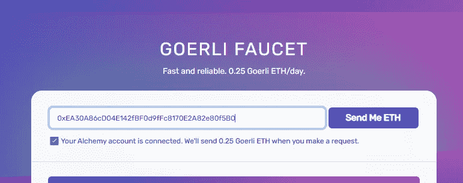

这可能需要一段时间，但当你完成后，你可以检查你的钱包余额进行验证。下面是我之后的截图。

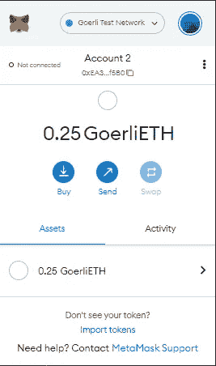

酷，我们发财了！我们现在有足够的假资金来执行我们的以太坊交易。

# **在炼金术中创建一个应用**

Alchemy 通过为构建和运行区块链应用程序提供一套开发工具、增强的 API 和节点基础设施，使开发人员更容易进行区块链开发。

我们将用它为我们的应用程序创建一个 API 端点。

前往[炼金术](https://dashboard.alchemy.com/)并创建一个账户。登录到您的帐户，您将看到一个类似如下的仪表板。将鼠标悬停在导航栏中的“应用程序”上，然后单击“创建应用程序”导航至创建应用程序页面。或者，您只需点击下表右上角的“+创建应用程序”即可。

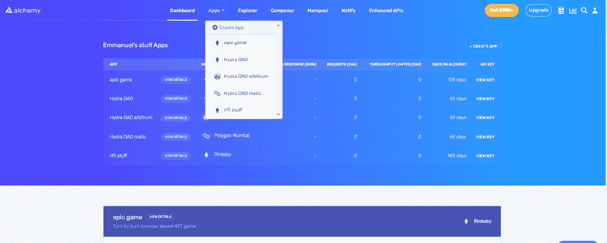

*   你应该会看到一个类似下面的屏幕，填写你的应用程序的详细信息，我已经把我的应用程序命名为`smart-contracts-tutorial`
*   为您的应用程序添加描述。(可选)
*   选择以太坊作为你的链条。
*   选择以太坊链上的戈利网络。

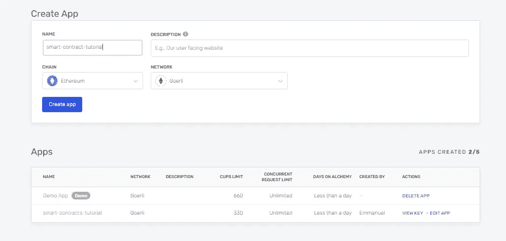

# **安装乙醚和 dotenv:**

要部署我们的智能合约，我们必须首先将我们的以太坊帐户和 alchemy 连接到我们的应用程序。

为此，我们将安装 dotenv，当我们在这里安装它时，我们也将安装`ether.js`。

*   `Dotenv`是一个软件包，通过将环境变量从一个. env 文件加载到 process.env 文件中，可以在我们的代码中安全地引用这些变量，从而帮助我们保护秘密，比如我们的帐户私钥和其他敏感信息。
*   `Ethers.js`是一个 JavaScript 库，通过抽象标准的 JSON-RPC 方法和更加用户友好的实用函数，允许我们用 JavaScript 与以太坊区块链进行交互。

打开你的终端并运行这个命令来安装`ethers.js`和`dotenv`:

根据您的互联网和计算机速度，安装可能需要一段时间。但是当你完成后，你的`package.json`文件应该看起来像这样。

酷，我们现在已经将`ethers`和`dotenv`添加到我们的依赖项中了

# **将以太坊账号和炼金术连接到项目**:

让我们把我们的以太坊账号，炼金术账号，和我们的项目连在一起。我们需要钱包地址的唯一私钥来发送交易。

按照这里的说明[获取您的私钥。](https://metamask.zendesk.com/hc/en-us/articles/360015289632-How-to-Export-an-Account-Private-Key)

若要连接您的 Alchemy API 密钥，我们需要为您的应用获取 Alchemy API 密钥。要获取我们的 API 密钥，当您进入仪表板时，请点击您的应用名称和详细信息右侧的查看密钥按钮，如下图所示。复制应用程序的 HTTPS URL。

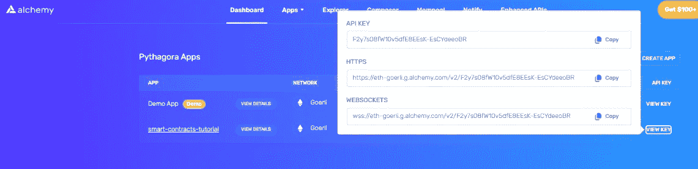

现在我们有了密钥，让我们将它们添加到我们的项目中。

创建一个文件，并将其命名为”。env”放在项目的根文件夹中。添加元掩码私钥和 Alchemy API 密钥，如下所示:

```
ALCHEMY_API_URL = “alchemy-api-url”PRIVATE_KEY = “metamask-private-key”
```

**关于您的私人密钥的附加说明:**请保密，任何拥有您私人密钥的人都可以访问您钱包中的资产。

如果你想把这个项目推给 GitHub，请添加。env 文件到您的。gitIgnore 文件，防止 Git 将其推送到 GitHub。

# **更新 Hardhat.config.js:**

我们希望 hardhat 知道我们之前添加的依赖项和键。在编译和部署我们的智能合约之前，我们将修改 hardhat.config.js 以反映这些变化。

这是我现在的样子。

让我们现在更新它:

我们现在可以在终端中运行这个命令来编译智能契约，以验证一切都正常工作。

```
npx hardhat compile
```

您应该会得到类似这样的输出。不要担心警告。

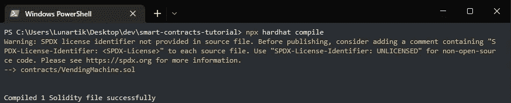

# **为 Goerli 部署智能合约**:

好了，在部署智能合约之前，还有最后一件事。导航到脚本文件夹并打开`deploy.js`文件。当我们创建项目时，Hardhat 为我们添加了一些样板代码。我们将删除它并添加我们的。

现在让我们添加部署脚本:

我们现在已经准备好部署我们的自动售货机智能合约。为此，我们只需运行:

```
npx hardhat run scripts/deploy.js — network goerli
```

运行完成后，您应该会在终端上看到以下输出:

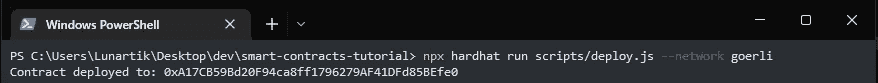

最后，前往[https://goerli.etherscan.io/](https://goerli.etherscan.io/)查看我们部署合同的交易细节。复制控制台中返回的合同地址并进行搜索。

您应该会看到您的交易详情，如下图所示。

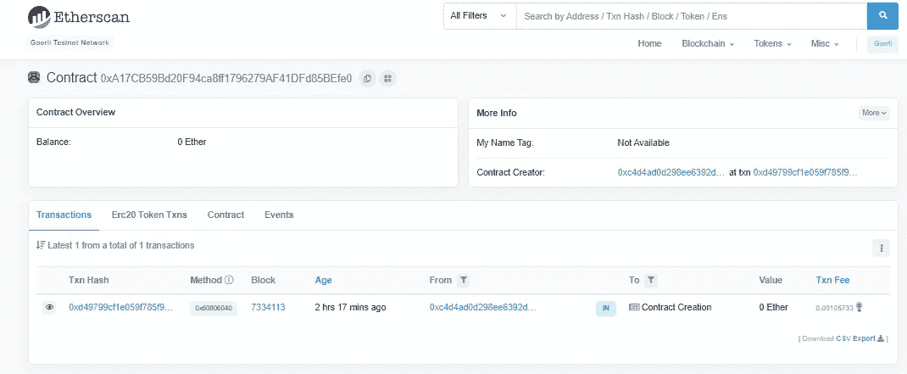

厉害！你刚刚部署了一个智能合同到以太坊区块链。

恭喜你，给自己一个鼓励吧！

## **多边形:什么是多边形？**

多边形。也称为 Matic。根据文档，Polygon 是面向公共区块链的基于侧链(也称为第 2 层链)的扩展解决方案。它允许快速交易和低汽油费。第 2 层区块链构建为运行在第 1 层以太网链之上，这也是主网络。在这种情况下，Polygon 充当与以太坊链并行运行的平行链。

# 将多边形测试网添加到 hardhat 配置和 Metamask wallet。

要将元掩膜添加到您的区块链钱包，首先要将面的网络详细信息添加到您的钱包。

点击网络下拉菜单，你会得到一个弹出窗口。在弹出窗口中，您会看到一个“行动号召”按钮，上面写着“添加网络”，如下图所示。

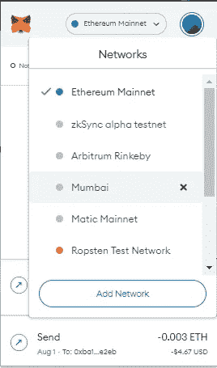

按照这里的说明将多边形孟买测试网络添加到您的钱包。[https://docs . polygon . technology/docs/develop/meta mask/config-polygon-on-meta mask/](https://docs.polygon.technology/docs/develop/metamask/config-polygon-on-metamask/)

完成后，您应该会在您的网络列表中看到孟买。点击即可切换。

现在让我们将多边形测试网添加到我们的 hardhat 配置中进行部署。

首先，获取 Polygon 的 Alchemy API 端点 URL，如下图所示:

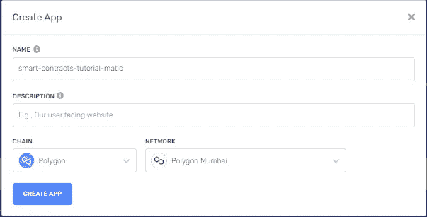

复制您的 HTTPS 端点或 API 密钥，并将其添加到您的环境文件(。env 文件)使用新的变量名。我给我的命名为:

```
ALCHEMY_API_URL_MUMBAI
```

最后，让我们更新我们的 hardhat 配置并添加多边形 Mumbai `testnet`,这样我们就可以在部署命令中引用它。

**部署到多边形**

现在几乎完成了，我们只需要为我们的合同部署请求水龙头自动。汽油费，记住。

前往[https://faucet.polygon.technology/](https://faucet.polygon.technology/)粘贴你的钱包地址，点击提交，如下图所示。

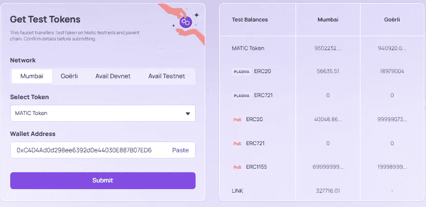

你应该在 1 到 2 分钟后看到你钱包里的水龙头资金。

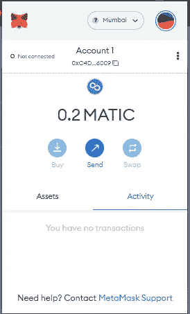

太棒了，最后在您的终端中运行部署脚本来部署到 polygon:

```
npx hardhat run scripts/deploy.js — network mumbai
```

如果一切顺利，您应该在终端中看到以下输出:

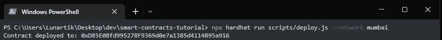

最后，您可以通过粘贴您的部署地址并点击搜索图标，在[https://polygonscan.com/](https://polygonscan.com/)上查看您的交易详情。

您应该会看到您的交易详情，如下图所示。

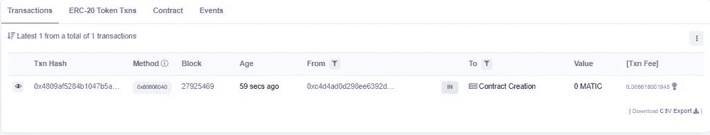

太好了，都完成了！

# **结论**

本教程的资源库可以在 GitHub 上找到:

[](https://github.com/THEmmanuel/smart-contract-tutorial) [## GitHub —手册/智能合同教程:包含智能合同文章的存储库…

### 这个项目演示了一个基本的安全帽用例。它附带了一个样本合同、该合同的测试和一个…

github.com](https://github.com/THEmmanuel/smart-contract-tutorial) 

您已经为智能合约开发建立了一个开发环境，使用 Solidity 编写了一个基本的智能合约，使用 hardhat 编译并部署了智能合约。

最后，您使用 Hardhat 将智能合约部署到以太坊 Goerli 和 Polygon Mumbai 测试网络。这是史诗般的东西，恭喜！

我希望你在区块链上探索、学习和构建东西的过程中获得乐趣。保持好奇！

# **参考资料和进一步阅读:**

[https://en.wikipedia.org/wiki/Blockchain?wprov=sfla1](https://en.wikipedia.org/wiki/Blockchain?wprov=sfla1)

[https://en.wikipedia.org/wiki/Testnet](https://en.wikipedia.org/wiki/Testnet)

[https://ethereum.org/en/developers/docs](https://ethereum.org/en/developers/docs)

[](https://docs.polygon.technology/docs/develop/metamask/config-polygon-on-metamask/) [## 添加多边形网络|多边形技术|文档

### 为了查看您帐户中的资金流动，在多边形网络上，您需要配置多边形…

文档.多边形.技术](https://docs.polygon.technology/docs/develop/metamask/config-polygon-on-metamask/) [](https://docs.polygon.technology/docs/home/blockchain-basics/sidechain/) [## 侧链和等离子体|多边形技术|文档

### 侧链是母链的替代区块链。等离子体是一个子链的框架-它是一个缩放…

文档.多边形.技术](https://docs.polygon.technology/docs/home/blockchain-basics/sidechain/) [](https://www.web3.university/tracks/create-a-smart-contract/deploy-your-first-smart-contract) [## 部署您的第一份智能合同

### 完成本指南的预计时间:大约 15 分钟，如果你是区块链开发的新手，不知道去哪里…

大学](https://www.web3.university/tracks/create-a-smart-contract/deploy-your-first-smart-contract)