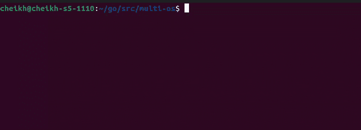
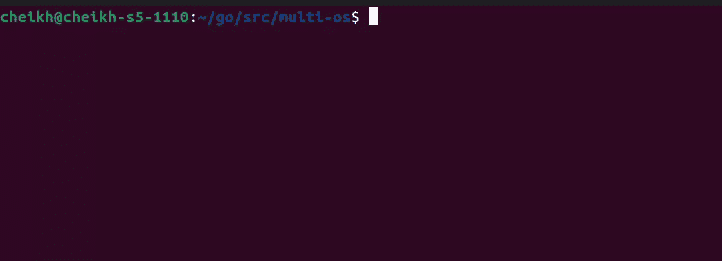
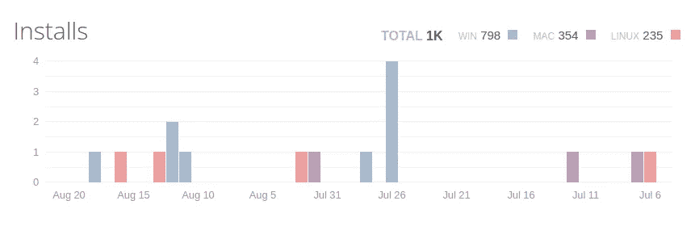

# 使用 Go 部署到多个操作系统

> 原文：<https://betterprogramming.pub/deploying-to-multiple-oss-with-go-d87fc1681720>

## Go build 标签的快速概述


图片由[安格尔·坎普](https://unsplash.com/@angelekamp)通过 unsplash 提供

我在编写 Go 库时遇到的一个常见问题是管理多平台支持。我构建的第一批库具有糟糕的跨平台兼容性。然而，这是一些错误代码的结果。例如，我用`+`操作符连接文件路径字符串。这导致一些功能无法正常工作。不过，我还是设法解决了这个问题。我导入了已经支持多种操作系统环境的包`file/filepath`来纠正这个问题。在这篇文章中，我将尝试编写一个库。这个库将检查是否安装了某个程序。我选择这个问题是因为基于 Windows 和 Unix 的操作系统将程序放在不同的文件位置。

# 图书馆

为了构建这个库，我将从测试驱动开发(TDD)中借用一些原则。考虑到这一点，我将从编写单元测试开始。该单元测试将验证函数是否返回正确的操作系统名称。稍后我将实现我正在测试的实际功能。测试将定义功能的需求，我将更新功能，直到测试通过。下面是测试的代码:

上面定义的文件的第一行是一个构建标记。我可以通过构建标签来命令`go test`执行某些测试。这很有用，因为这个测试不会用命令`go test`自动运行。例如，Windows 测试在 Unix 计算机上肯定会失败。我将执行以下命令来运行上面的测试:

```
go test --tags=unix_test
```

测试将会失败，因为我还没有定义函数`FindExe`。首先，我将定义该函数的 Unix 版本。下面是执行此操作的代码:

文件的第一行是构建标记。当目标操作系统是 Linux 或 MacOS 时，它将编译这个文件。该函数将返回 2 个字符串。一个是我正在寻找的程序的路径，另一个是操作系统名。在这种情况下，操作系统名称始终是`Unix`。本着 TDD 的精神，是时候运行我的测试了:



既然 Unix 功能已经工作，是时候添加 Windows 支持了。我先写个测试。测试文件将有构建标签`windows_test`。下面是这个测试的代码:

有了需求，我将继续定义函数`FindExe`的 Windows 实现。这个文件将有一个 build 标记来指定 Windows 作为它的构建目标。下面是执行此操作的代码:

文件的第一行将告诉编译器只在目标操作系统是 windows 时进行编译。这就是我在编写的包中避免重复函数名的方法。返回的文件路径与 Unix 实现有很大不同。这就是为什么 build 标签是有用的，如果没有它，我将不得不给我的函数以 OS 为中心的名字，或者在一些‘if’语句中插入。现在，是时候用适当的构建标记运行 Windows 测试了:

```
go test --tags=windows_test
```



不出所料，该命令将会失败。测试使用的是 unix 实现`FindExe`，它将返回 Unix 作为操作系统名称。

# 结论

回到 2016 年，我试图建立一个围棋框架。该库的第一个版本对 Windows 的支持很差/甚至没有。我以为会有更多的 Linux 开发人员使用 Go 进行开发。我错了，因为在框架中加入 Windows 支持后，我看到下载量增加了。直到今天，该框架的大多数用户运行 Windows。以下图表说明了这些数据:



[https://package control . io/packages/Gopher % 20 sauce % 20 syntax % 20 and % 20 static % 20 completions](https://packagecontrol.io/packages/Gopher%20sauce%20syntax%20and%20static%20completions)

还有其他方法可以在没有构建标签的情况下实现跨平台支持。Go 标准库有为多种操作系统设计的包。一个例子是包`file/filepath`。它有一个叫 Join 的功能。该函数使用正确的路径分隔符连接一组路径部分。

你可以在下面这篇文章中找到这个库的链接。

# 附加链接

 [## medium _ examples/主 cheikhshift 上的多操作系统/medium_examples

### 中型文章的代码示例。在 GitHub 上创建一个帐户，为 cheikhshift/medium_examples 开发做贡献。

github.com](https://github.com/cheikhshift/medium_examples/tree/main/multi-os) [](https://www.digitalocean.com/community/tutorials/building-go-applications-for-different-operating-systems-and-architectures) [## 为不同的操作系统和架构构建 Go 应用程序|数字海洋

### 在软件开发中，重要的是要考虑操作系统和底层处理器架构…

www.digitalocean.com](https://www.digitalocean.com/community/tutorials/building-go-applications-for-different-operating-systems-and-architectures)