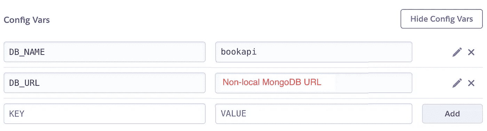

# 将您的 Dockerized FastAPI 项目部署到 Heroku

> 原文：<https://betterprogramming.pub/deploying-your-dockerized-fastapi-project-to-heroku-379e31cb1c5d>

## 步入云应用开发的下一阶段


photo by this engineering:[https://www . pexels . com/photo/female-software-engineer-coding-on-computer-3861972/](https://www.pexels.com/photo/female-software-engineer-coding-on-computer-3861972/)

# 概观

时候到了！您已经在本地测试了您的 FastAPI 项目，并且您已经准备好在云中运行它。当然，您可以使用任何云服务提供商，但是在本指南中，我们将逐步将您的容器化 FastAPI 项目部署到 Heroku。我们开始吧！

## 先决条件

在我们开始之前，您首先需要有一个 Heroku 帐户，安装 Heroku CLI 并在本地进行授权，并且您的 FastAPI 项目已经设置了 docker 文件。如果你还没有将你的项目归档，查看[将你的 FastAPI 项目归档](/dockerizing-your-fastapi-project-d8bb13ad6335)的帖子，获得一个简单的指导来帮助你开始。

[](/dockerizing-your-fastapi-project-d8bb13ad6335) [## 将您的 FastAPI 项目归档

### 5 分钟内集装箱化

better 编程. pub](/dockerizing-your-fastapi-project-d8bb13ad6335) 

# 步伐

## 创建项目

在 Heroku 中，创建一个新应用程序。它可以有任何地区和任何名称。我建议给它起一个描述性的名字，比如{appname}-{dynotype}-{stage}(比如 bookapi-web-dev)。

## 应用程序配置变量

在部署之前，您可能希望将 env 变量添加到应用程序配置中，以满足运行应用程序所需的任何需求。在 Heroku dashboard 中，导航到应用程序的设置页面来添加这些设置。



作者的 Heroku 应用程序配置示例

## 构建和部署

这一步将分为两个部分。第一部分将包含不使用 M1/M2 芯片的 Macbooks 的更常见的步骤，第二部分将包含使用这些芯片的 Macbooks 的步骤。

对于非 M1/M2 Macbook 用户，您可以登录 Heroku 容器注册表，然后进行推送和发布。推送将在注册表中设置最新的，而发布则处理要使用的更改。

为此，如果团队在同一个项目中发布了多个 dyno 类型，他们可以将 Dockerfile 命名为`Dockerfile.web`或`Dockerfile.worker`。或者，他们可以使用一个`heroku.yml`文件来帮助解决这个问题。

在本例中，假设您的 Dockerfile 名为`Dockerfile.web`。这些步骤的命令如下:

```
heroku container:login
heroku container:push -a appname
heroku container:release web -a appname
```

如果你是 M1/M2 Macbook 用户，我们将替换的步骤是上传或推送步骤。在这种情况下，我们中的许多人在创业时遇到了问题，以一个`exec format error`告终。

解决这个问题的方法是在构建期间指定平台，然后我们将使用 Docker CLI 使用 push 命令，而不是使用`heroku container:push`命令。此设置的修改命令如下:

```
heroku container:login
docker build --platform linux/amd64 -t imagename -f Dockerfile.web .
docker tag imagename registry.heroku.com/appname/web
docker push registry.heroku.com/appname/web
heroku container:release web -a appname
```

# 测试

现在您的更改已经部署，您可以将此应用程序的 dyno 计数翻转为 1，让它开始运行！通过在终端中运行以下命令，检查日志以确认应用程序没有崩溃:

```
heroku logs -t -a appname
```

要从您的应用程序单独获得标准输出，请运行以下命令:

```
heroku logs -t -s app -a appname
```

如果您看到一个成功的应用程序启动，并且没有崩溃语句，那么您就成功了！现在你可以开始全面测试你的新应用了。您可以在设置页面下检索应用程序的基本 URL。

单击该 URL，并为您的网站添加任何其他路线信息。如果您严格地将这种设置用于一个 headless API，那么尝试将您的基本 URL 放在一个 REST 客户端中，比如 Postman。

就是这样！这只是将 Heroku 用于注册和托管应用程序的一个简单例子。正如我在新书《使用 FastAPI 和 AWS 构建无服务器 Python 应用程序》中所讨论的，您可以使用许多相同的应用程序设置和构建步骤来部署到 AWS(当然，这将需要一个 AWS 帐户和 AWS CLI)

感谢您的阅读，一如既往，祝您黑客生涯愉快！

```
**Want to Connect?** If you want to learn about using AWS ECR and Fargate with a sample FastAPI project, go to [my website](https://www.eidanrosado.com/).
```