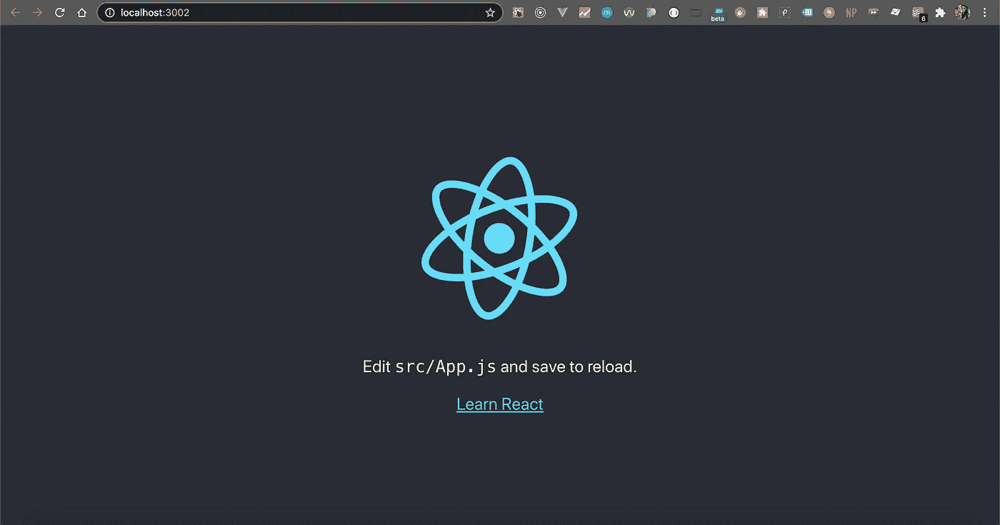
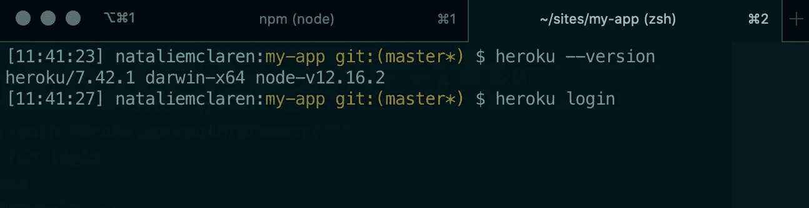
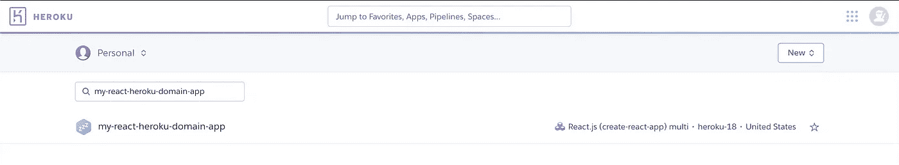
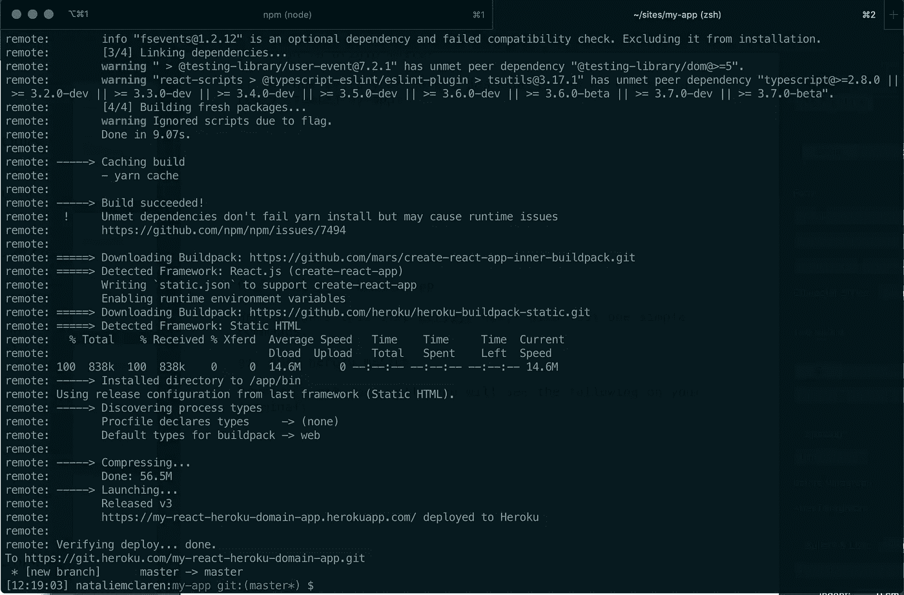
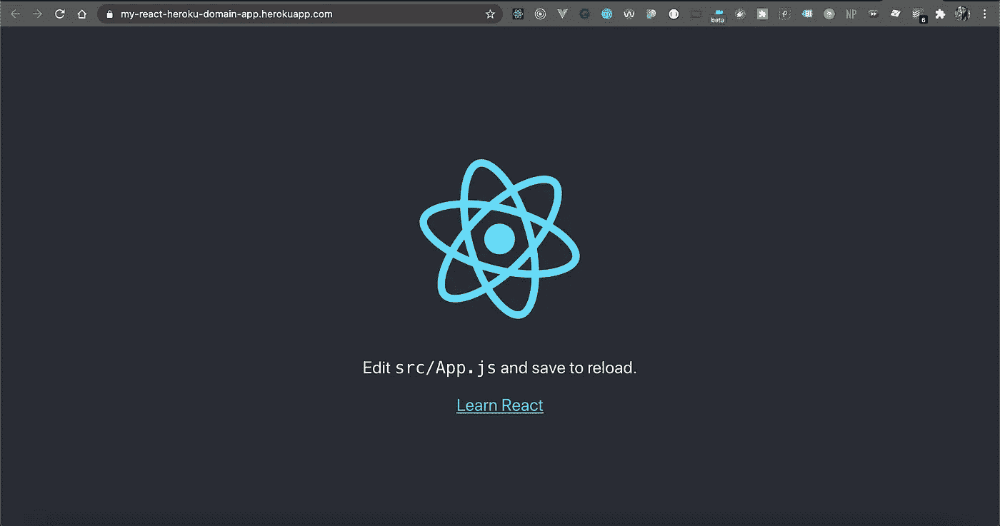
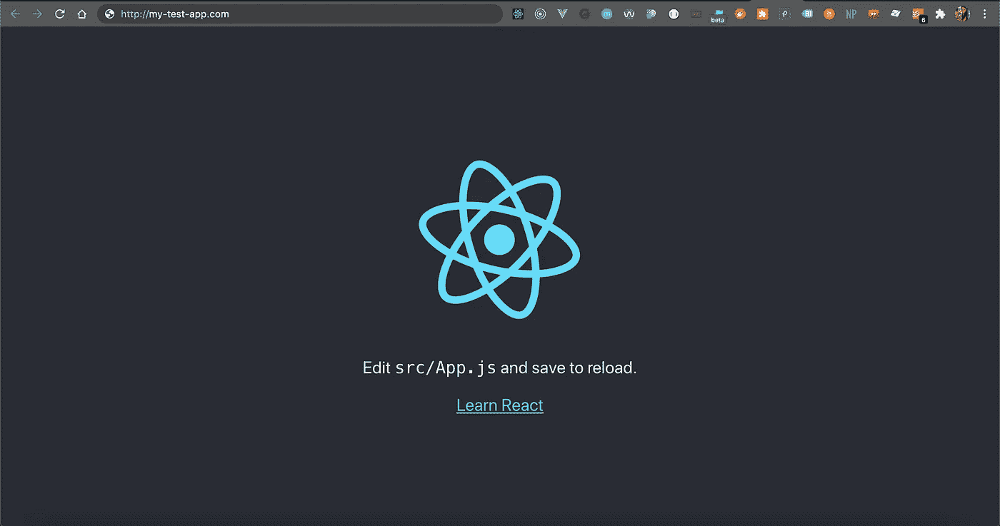

# 通过 Heroku 使用自定义域在几分钟内部署您的 React 应用程序

> 原文：<https://betterprogramming.pub/deploying-your-react-app-with-a-custom-domain-in-minutes-5c58f3675784>

## 今天就用一个完美的名字开始你的新项目吧


在 [Unsplash](https://unsplash.com?utm_source=medium&utm_medium=referral) 上由 [SpaceX](https://unsplash.com/@spacex?utm_source=medium&utm_medium=referral) 拍摄的照片。

当我开始做开发人员时，我记得“部署”这个词把我吓坏了。老实说，直到我最近开始思考我们使用什么来部署之前，它仍然是这样的！

[Heroku](https://www.heroku.com/home) 是我部署 React 应用时的第一个平台，由于在这个过程中出现了一些小问题，我想我应该在这里写一下这个过程。

我们将做以下工作:

*   创建 React 应用程序。
*   使用 Heroku 部署它。
*   将自定义域名连接到您的应用程序。

*注意:我在 Mac 上工作，所以你的命令可能会因你的操作系统而略有不同。在我可以的地方，我会张贴链接，展示其他操作系统的替代命令。*

我们开始吧！

# **1。您的 React 应用程序**

假设您熟悉 React，我将跳过冗长的描述，说它是一个用于构建接口的 JavaScript 库。它最酷的地方在于，它是一个基于组件的库，在整个应用程序中增强了逻辑的可重用性。更多信息可在[正式文件](https://reactjs.org/docs/getting-started.html)中找到。

让我们打开一个终端，用下面的命令创建 React 应用程序:

```
npx create-react-app my-app
```

Create-react-app 将为我们搭建出一个全新的 react 应用程序，所以现在我们可以像这样运行它:

```
cd my-app && npm start
```

您应该会看到下面的屏幕:



现在我们的应用程序已经设置好了，我们可以开始设置我们的 Heroku 环境了。

# **2。Heroku**

Heroku 是一个云 PaaS，提供多种服务，允许普通开发人员和组织构建、部署、监控和扩展应用程序。最好的部分是它可以免费建立一个帐户，并且主机也是免费的(取决于你希望你的应用程序有多少个 dynos(也就是容器)。对于大多数基本的应用程序，你可以使用基本的免费 dyno。

所以首先，确保你已经[注册了](https://signup.heroku.com/)Heroku。

注册后，我们将安装 Heroku CLI，以便能够从我们的终端部署我们的应用程序。

## **安装 Heroku CLI**

如果您在 Mac 上工作，运行下面的命令来安装 CLI。您可以在 Heroku 的 cli 页面上找到 Windows 和 Linux 的替代安装选项:

```
brew tap heroku/brew && brew install heroku
```

安装完成后，通过运行以下命令验证安装是否正确:

```
heroku — version
```

您应该会看到类似这样的内容:



如果没有，请尝试关闭终端，然后重新打开。有时候，它需要重启。

现在，我们可以使用之前通过 Heroku 网站注册时使用的凭证登录了:

```
heroku login
```

这将带我们到浏览器登录，一旦你这样做了，终端应该确认你使用确切的电子邮件地址登录:


或者，您可以运行`heroku login -i`通过终端本身登录。这两个选项将做同样的事情。

我们现在已经准备好设置 Heroku 环境并部署 React 应用程序了！

## **在 Heroku 仪表盘上创建我们的应用**

在我们跳到这一步之前，重要的是 git repo 已经初始化，所以在您的终端中运行`git init`。

接下来，运行以下代码，将`<app-name>`替换为应用程序的名称:

```
heroku create <app-name> — b [https://github.com/mars/create-react-app-buildpack.git](https://github.com/mars/create-react-app-buildpack.git)
```

*注意:这必须是一个唯一的名称——不仅仅是在你的 Heroku 应用程序集合中，而是在一般情况下。如果有其他 Heroku 用户用这个名字注册了一个应用程序，它就会被使用。如果你没有指定一个应用名称，Heroku 会为你随机生成一个。*

让我们花一点时间来理解上面的命令。

`-b`标志指的是一个构建包。部署后，Heroku 将自动检测您的应用程序的语言，并分配相关的构建包来帮助进行生产构建(例如，用于 JavaScript 应用程序的 Node.js 构建包)。然而，使用 React，您将需要手动分配这个构建包，以确保 Heroku 知道它是一个 create-react-app，从而能够定位您的入口点文件。

如果您现在转到 Heroku [仪表盘](https://dashboard.heroku.com/apps)，您将看到您新创建的应用程序:



## **部署您的 Heroku 应用**

Heroku 通过一个简单的命令使这一步变得非常容易:

```
git push heroku master
```

如果一切顺利，您将在终端上看到以下内容:



运行`heroku open`将打开一个浏览器，里面有你部署的应用程序！



注意域名默认为 Heroku 的格式`<app-name>.[herokuapp.com](http://herokuapp.com)`。

在下一阶段，我们将把 Heroku 连接到您选择的自定义域，以删除这个默认域。

# **3。自定义域**

出于本文的目的，我将使用 [Namecheap](https://www.namecheap.com/) 作为我的域名提供商。如果你选择另一个域名提供商，同样的概念也适用于其他域名提供商。

继续搜索您的自定义域名，然后结帐。您需要在结帐时设置一个帐户来管理您的域名。

登录后，进入你的仪表板，在那里你可以看到你的域名，然后点击管理你想连接到 Heroku 的域名。

最后，我们将做两件事:

1.  设置我们的重定向。
2.  添加我们的 Heroku 信息，以便我们的域名指向我们的应用程序。

## **重定向**

确保您在域选项卡中，向下滚动找到重定向域部分。使用您自己的自定义域名，添加一行，如下所示:


这将确保您的应用程序被重定向到其 http://格式，并且用户仍然可以访问它，而无需将其键入。

## **连接到 Heroku**

回到 Heroku 仪表板，点击您新创建的应用程序。在 Settings 选项卡下，向下滚动到 Domains，然后添加带有前缀 [http://的自定义域。](http://.)

新的一行应该以随机生成的 URL 的形式出现，并带有 DNS 目标值。复制这个网址，回到你的名字廉价仪表板。

进入高级 DNS 选项卡—在这里，我们将使用刚才复制的值将我们的域指向我们的 Heroku 应用程序。

*注意:对于那些以前使用过其他主机提供商的人来说，Heroku 的工作方式有点不同，因为他们不提供 DNS 提供商服务。因此，你从他们那里得到的信息并不是域名服务器。我在下面留了一个链接来获取更多的信息。*

对于高级 DNS 表，我们需要两条记录:

第一个将是一个具有以下值的URL 重定向记录行:

1.  类型:Url 重定向记录
2.  主持人:@
3.  值:http://<your-domain-name></your-domain-name>

第二个将是具有以下值的 CNAME 记录行:

1.类型:CNAME 记录

2.主持人:www

3.值:从 Heroku 仪表板上随机生成的字符串。

您应该得到类似这样的结果(其中`test-dns-record`替换了您自己的值):


好吧！我们都准备好了。这可能需要一段时间才能生效，尽管通常不会超过几个小时。

你可以在你的 Heroku 仪表盘的域下查看它的状态。运行时，您会看到一个绿色的 OK 图标。

现在剩下要做的就是检查你的网站！

在浏览器中导航到您的自定义域，您应该会看到与您之前部署的相同的 create-react-app:



在这个阶段，我想指出的是，如果您忘记将 create-react-app 构建包添加到您的应用程序中，您可以在稍后的阶段通过 Heroku dashboard 进行添加。只需点击应用程序，进入设置选项卡，向下滚动到 Buildpacks。您可以在那里添加构建包 URL。

# 结论

这就是全部了！我在下面留下了一些资源，我认为对理解 Heroku 的工作方式会有帮助。

如果有任何问题，欢迎在评论中提问！

# 资源

*   [Dynos](https://www.heroku.com/dynos)
*   [Buildpacks](https://www.heroku.com/elements/buildpacks)
*   [自定义域名应用](https://devcenter.heroku.com/articles/custom-domains)