# 符号自动机的衍生物解释

> 原文：<https://betterprogramming.pub/derivatives-of-symbolic-automata-explained-4673dee6af82>

## 关于获取正则表达式的符号导数的教程和一些 Haskell 语法的介绍


来自白线条乐团的梅根·玛莎·怀特。2011 年从公众生活中消失的自学成才的极简鼓手。照片由 [Dena Flows](https://radiografica.org.ar/2021/12/10/meg-white-la-anti-estrella-de-rock-que-marco-una-generacion/) 拍摄。

符号衍生工具用于发现电子邮件中安全密钥的泄露，并用于分析 AWS 访问策略，以避免私人数据的意外暴露——根据微软研究的说法[。](https://www.youtube.com/watch?v=rMS4rTbY0So)

当你在实践中试图对正则表达式应用导数时，它们也会出现。在给定更大的 Unicode 字母表的情况下，它们实际上导致可管理的状态空间。

我还在不知道的情况下“重新发明”了符号自动机，同时使用导数创建了一种验证语言。当你试图用正则表达式的导数做任何实际的事情时，它们会自然地出现。

在本教程中，我将解释如何对符号正则表达式求导。

1.  首先，我们需要理解标准自动机和符号自动机之间的区别。
2.  接下来，我将解释这如何影响正则表达式的导数的算法。
3.  最后，我还将展示我们如何需要扩展符号导数，以允许更好的简化规则、智能构造器和产品使用。
4.  作为奖励，我还将谈到如何在没有任何字母表知识的情况下探索状态空间。

这篇文章是解释以下内容的后续文章:

1.  [正则表达式的导数](https://medium.com/@awalterschulze/how-to-take-the-derivative-of-a-regular-expression-explained-2e7cea15028d)和
2.  [简化规则，聪明的构造器和懒惰地构建确定性有限自动机](https://medium.com/@awalterschulze/derivatives-of-context-free-grammars-explained-3f930c5e363b)。

# 符号自动机

确定性有限自动机(DFA)由两个函数组成:

1.  转换函数将源状态和字符作为参数，并返回新的目标状态。
2.  接受函数将状态作为参数，并返回一个布尔值。

例如，假设我们希望接受以辅音开头的单词，如“regular ”,其中所有辅音都由元音分隔，所有元音都由辅音分隔，我们以辅音结尾。以下是我们“常规”单词的简化正则表达式:

```
((b|c|d|f...)(a|e|...))*(b|c|d|f...)
```

*   作为另一个例子，“元音”是正则表达式可以接受的单词。
*   “辅音”和“自动机”是会被拒绝的例子。

DFA 的转换和接受函数非常简单，它们只是表格:

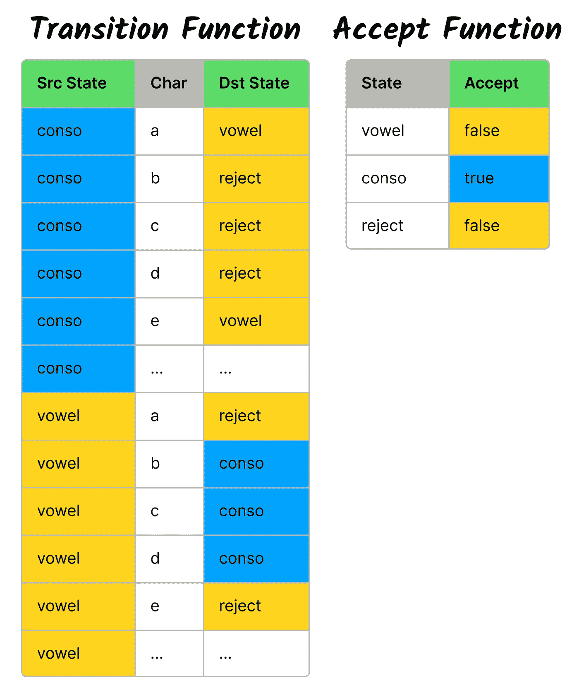

通常用图形来表示 DFA:


一种确定性有限自动机，其中“元音”是起始状态，双圈“conso”是接受状态。

请注意，为了避免混乱的画面，我只画了字母表的前 5 个字母的过渡。

符号自动机扩展了转移函数，并允许它在输入字符上包含谓词。谓词是一个接受参数并返回布尔值的函数。这意味着我们可以写:

```
(is_consonant, is_vowel)*, is_consonant
```

注意:我们在连接中添加了逗号以提高可读性。

转换表现在变得简单多了，因为它允许包含谓词。

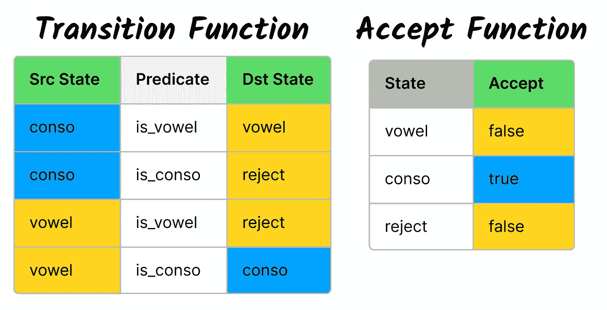

甚至连画图都变成了我们不走捷径就能完全画出来的东西。

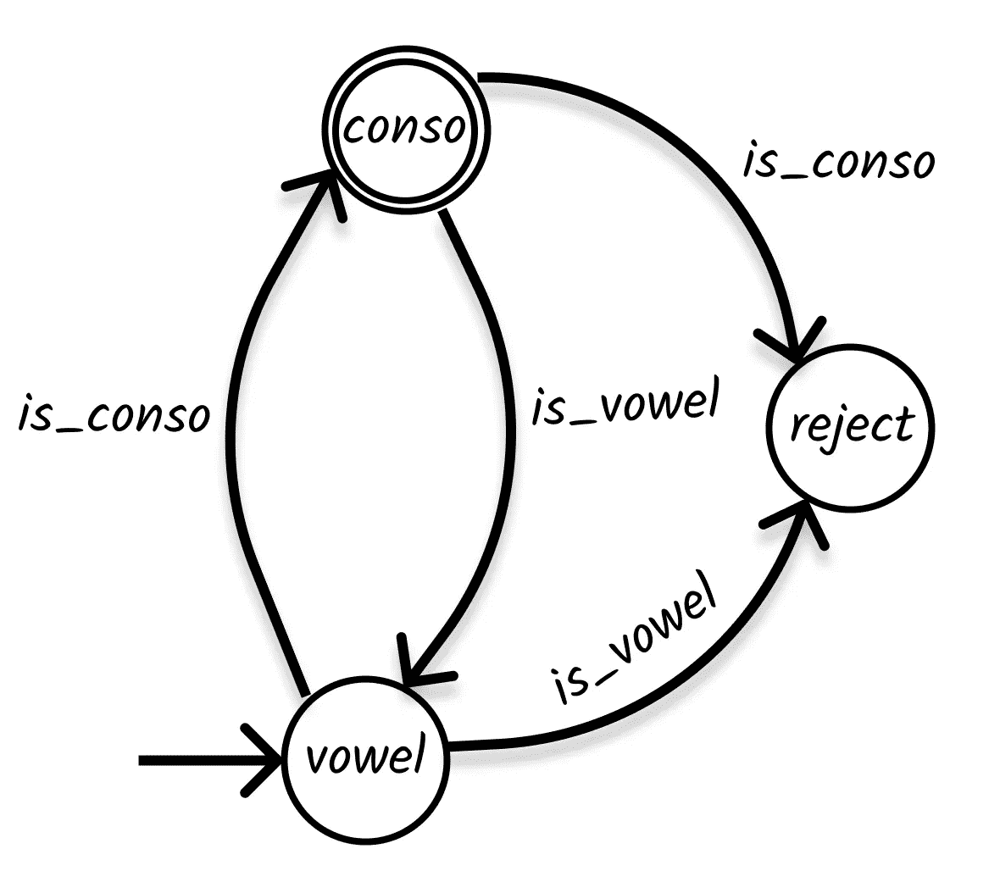

符号确定性有限自动机，其中“元音”是起始状态，双圈“conso”是接受状态。

符号自动机的另一个重要特性是，谓词不必接受一个字符作为输入，它们可以接受任何符号，甚至是钹。

## 铙钹是象征的一个例子


[大卫·乔伊](https://davidchoe.com/2011/david-choe-at-travis-barkers-give-the-drummer-some-art-show)绘制特拉维斯·巴克。飞机失事的唯一幸存者。我在[我的歌曲](https://soundcloud.com/awalterschulze)中使用了他的鼓样本。

让我们使用钹的鼓符号作为符号自动机的符号示例。首先，让我简单介绍一下鼓谱。每个钹都有自己的符号:

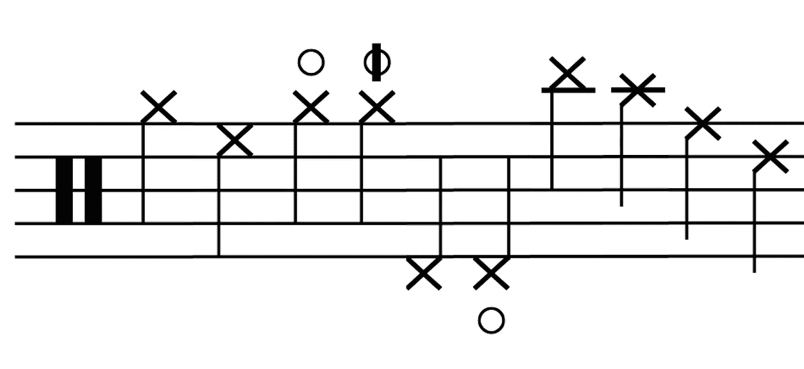

钹的鼓记法:高帽、二高帽、高帽开、高帽半开、高帽足、高帽足溅、撞钹、二撞钹、骑钹、二骑钹。

每条有十字的线代表一种不同的钹或一种演奏钹的方法。按照左边的两个条形，从左到右依次是:

1.  放置电影摄影机的低架
2.  第二顶高帽
3.  圆圈代表打开的高帽
4.  带条纹的圆圈代表半开放的高帽
5.  用脚踏板玩的高帽
6.  下面的圆圈代表一个高礼帽，作为脚溅，用力撞击高礼帽，让它们响
7.  碰撞钹
8.  另一个撞击钹
9.  骑钹
10.  另一个骑钹

另外，这些钹可以用一些修饰键来演奏。

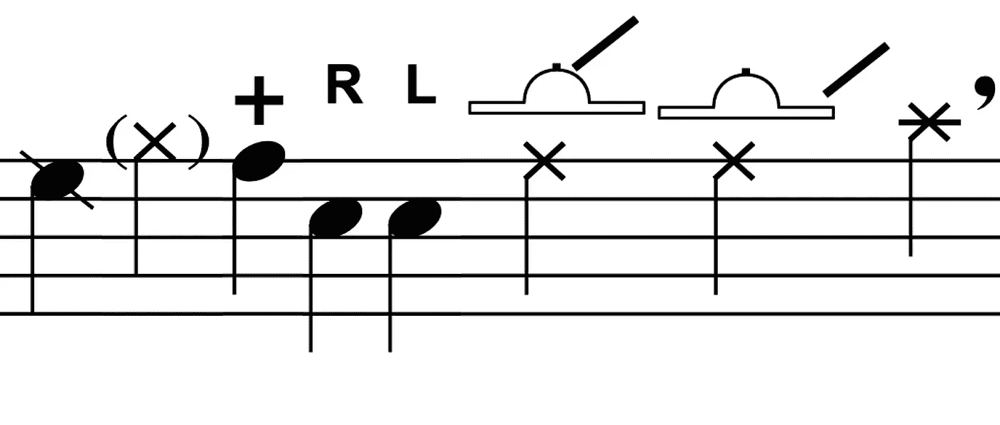

鼓符号修饰符:边缘射击，鬼音符，停止，右棒，左棒，钟，边缘和窒息。

这些修饰键告诉鼓手钹应该如何演奏，同样从左到右我们有:

1.  篮筐投篮:同时击打头部和篮筐
2.  幽灵笔记:非常轻的一击
3.  停止:演奏后触摸钹以停止其振动
4.  右棒:可以选择推荐使用哪根棒来敲击钹
5.  左侧操纵杆
6.  钟:敲钟上的钹
7.  边缘:敲边缘的钹
8.  呛:被击后立即抓起钹

我们可以使用符号自动机来匹配符合以下条件的节奏:

*   从高帽开始，用左棍，
*   每次击打都是用交替的棍子，
*   最后一击是铙钹撞击

```
(
 !is_right,
 (
  !is_left & (is_high_hat | is_crash), 
  !is_right
 )*,
 is_crash & !is_left
)
```

注意，我们使用了一个谓词“不正确”，因为使用哪根棍子的指示是可选的，只要没有指示我们应该使用右棍子，我们就可以使用左棍子。

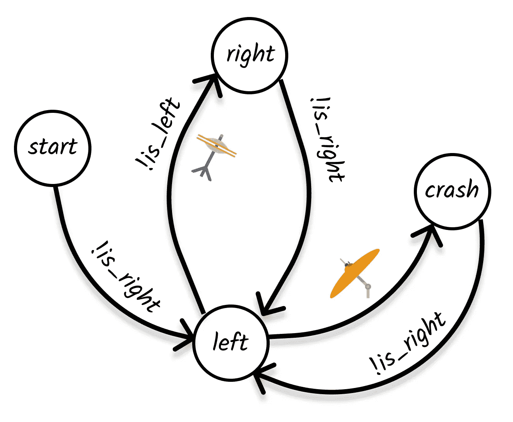

辛波自动机。信用:钹图- [SVG 回购](https://www.svgrepo.com/svg/62277/cymbals)

该自动机将匹配以下钹节奏:

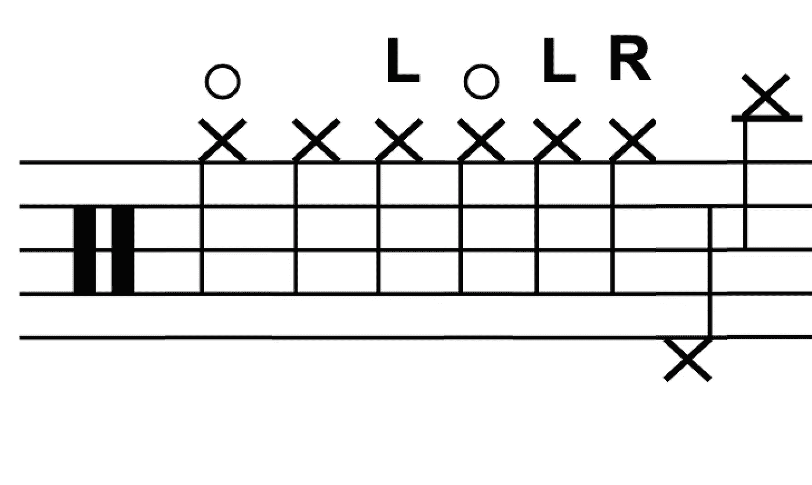

钹序列的高帽，结束于崩溃。鸣谢:乐谱图片— [鼓导&打击乐乐谱](https://web.mit.edu/merolish/Public/drums.pdf) — [音频涂鸦](https://audiograffiti.com.au/)

正如您所看到的，这些符号谓词为我们提供了在任何类型的输入列表上使用正则表达式的灵活性，这包括使用布尔运算符将谓词组合成更大的谓词的能力，但从技术上讲，这些嵌套函数可以返回任何类型，只要顶层函数返回一个布尔值，但我们将在后面进行更多的讨论。

# 符号表达式的派生词


铙钹吃吉他，这是我在荷兰认识的一个乐队。键盘手制作吉他踏板，让他的键盘听起来像电吉他。衍生品现在要吃钹了。

我们之前已经解释过正则表达式的[衍生物。现在我们将解释如何调整这个算法来处理符号上的谓词，而不仅仅是字符。](https://medium.com/@awalterschulze/how-to-take-the-derivative-of-a-regular-expression-explained-2e7cea15028d)

我们的基本运营商仍然包括:

*   空集:∅
*   空字符串:ε
*   逻辑或:|
*   串联:，和
*   星号:*

我们用符号操作符代替了基本的字符操作符，符号操作符是一个谓词或函数，它将一个符号作为参数并返回一个布尔值:

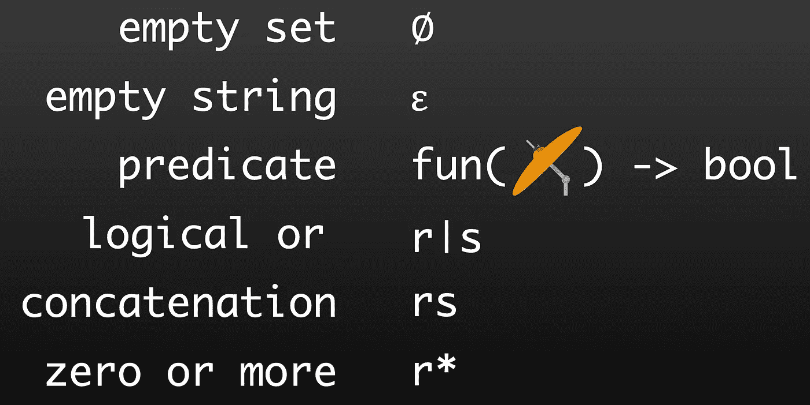

对于所有其他操作符，可空函数保持不变，对于符号操作符，总是返回 false。类似于字符操作符返回的内容。

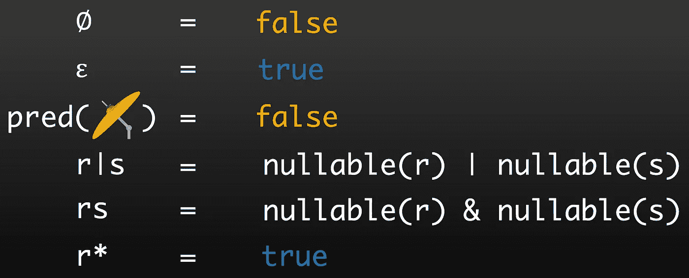

导数函数对于所有之前的运算符也保持不变。

*   在谓词返回 true 的情况下，符号运算符返回空字符串和
*   在谓词返回 false 的情况下，符号运算符返回空集。

同样，类似于字符操作符的工作方式。

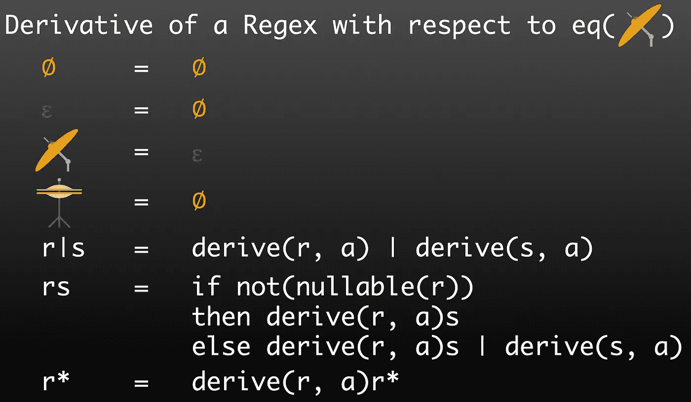

就是它，这就是正则表达式的导数算法中把字符操作符抽象成符号谓词有多简单。为了证明我没有说谎，下面是 Haskell 中从标准到符号实现的区别:

正则表达式的标准导数算法和 Haskell 中的符号实现的区别。

*对于不熟悉 Haskell 的人来说:* `*(s -> Bool)*` *表示从任意符号，用* `*s*` *表示，到布尔的函数。*

# 可比谓词

这种算法是可行的，但是我们无法进行优化。例如，简化要求我们能够比较正则表达式:

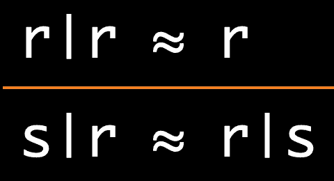

需要比较正则表达式的简化规则

我们不仅要能够比较两个正则表达式是否相等，还要能够比较其中一个是否比另一个“小”,这样我们就可以对

1.  减少状态空间，这增加了我们命中内存缓存的机会，但也
2.  使用我们的简化规则增加我们找到重复并消除它们的机会。

问题是我们的符号谓词是不可比的。要解决这个问题，我们需要创建一个新的谓词数据类型，并在其中包含一个描述符字符串，它是可比较的，并且完整地描述了谓词。这是它在 Haskell 中的样子:

*对于不熟悉 Haskell 的:instance* `*Eq*` *和* `*Ord*` *语句，简单告诉 Haskell*`*Pred*`*具有可比性，以及谓词分别与一个等价函数* `*==*` *或* `*compare*` *函数比较时调用哪些函数。注意等号函数是如何用一个中缀函数* `*==*` *来表示的。中缀函数是一个有两个参数的函数，放在两个参数之间。我们可以将任何双参数函数变成中缀函数，方法是在函数名两边加上反勾号，见* `*compare*` *。另一个中缀函数是* `*++*` *，它连接描述符的字符串，其中* `*[c]*` *表示一个字符串。*

然后，我们可以将正则表达式中的谓词替换为可比较的谓词。

这对于基本表达式非常有效，但是很快你就会想要为你的符号建立更大的表达式。

*对于那些不熟悉 Haskell 的人来说:我们可以使用* `*deriving (Eq, Ord)*` *为正则表达式生成 compare and equal 函数和实例，它足够智能，可以遵从我们为谓词编写的 compare and equal 函数。*

# 为生产目的扩展符号表达式

符号自动机要求谓词是:

1.  纯功能性的(给定相同的输入，总是返回相同的结果)，
2.  可判定的(函数必须保证它们将完成运行并返回一个布尔值)，
3.  complete(不抛出异常，为每个输入值定义)和
4.  不会通过返回错误来模拟不完整的函数。

除了这些需求之外，我们可以在谓词内部构建任意的表达性语言。例如，我们可能希望将正则表达式操作符`&`和`|`作为`and`和`or`函数推入符号谓词:

```
(
 (!more_than(length(modifiers), 1) | is_crash)*,
 is_crash & !is_left
)
```

我们可能还想引入其他函数，比如`more_than`和`length`，来指定我们不希望 cymbal 的修改器列表中有一个以上的修改器。

早在 2015 年，我在不知道符号表达式存在的情况下“重新发明”了它们，同时为协议缓冲区、JSON 和 XML 构建了一种名为 [katydid](https://katydid.github.io/) 的验证语言。我将创建一个后续帖子来解释该算法，但现在，您需要知道的是，它对这些表达式有以下要求:

1.  用户应该能够组合现有的功能，以建立自己的表达式。我们想给用户一些表现力。
2.  比较快。这个需求是作为一个生产问题出现的。在简化过程中，比较是主要的瓶颈，这导致了足够大的用户注意到的速度下降。
3.  执行速度快。验证速度是验证语言的主要特点。
4.  函数库应可由用户扩展。这意味着我们的函数将由一个数据结构来表示，这个数据结构可以由用户来构造，而不是只有语言维护人员才能编辑的大和类型的一部分。
5.  函数可能会返回错误。例如，如果一个`atoi`函数能够返回一个错误，那么它就更加健壮。*注意:在表达式树顶部的谓词的情况下，错误被转换为假结果，以保持符号自动机的完整要求。这在实践中非常有效。*

## 描述符


罗布·罗尔夫，[进入 Shikari](https://www.youtube.com/watch?v=kBtbF_3MPWM) 乐队的鼓手。我看过这个乐队在南非、荷兰和英国演出。

允许我们的表达式嵌套，要求我们跟踪用于创建表达式的抽象语法树(AST)。这是必需的，这样我们就可以对谓词进行适当的比较，这是正则表达式的简化规则所要求的。我们称之为表达式的描述符。我从协议缓冲区窃取了这个名称，协议缓冲区将 AST 存储在 descriptor.proto 文件中。我觉得这个名字比首字母缩略词更易读，更平易近人。每个表达式调用一个带有一些参数的函数(具有唯一的名称),这些参数可以是带有自己描述符的其他表达式:

```
data Desc = Desc 
  { _name :: String
  , _params :: [Desc]
  }
```

我们想要做的另一个优化是，在开始验证和考虑输入之前，预先计算表达式中我们可以计算的任何部分。例如，如果用户书写:

```
(less_than(length(modifiers), minimum(3, 2)))*
```

我们希望将其简化为:

```
(less_than(length(modifiers), 2))*
```

我们不会进行更高级的简化，比如 Minterms，因为这将限制我们允许用户编写的函数的类型，但是我们认为要求用户提供一个关于函数是否从输入中读取(也称为读取器)的标志是可以接受的:

```
data Desc = Desc 
  { _name :: String
  , _params :: [Desc]
  , _reader :: Bool
  }
```

最后，我们希望我们的描述符能够优化，以便快速比较。这一要求仅在生产问题中发现。我们最终发现，这些比较在简化过程中是一个巨大的瓶颈，当我们修复它时，这修复了从过滤器获得初始结果的等待时间，这是一个缓慢构建自动机的过程。

```
data Desc = Desc 
  { _name :: String
  , _hash :: Int
  , _params :: [Desc]
  , _reader :: Bool
  }
```

我们的比较函数试图尽可能快地缩短返回小于或大于的值。首先，它比较哈希，只有当它们相等时，它才尝试比较名称，只有当它们相等时，它才尝试比较参数的数量，只有当它们相等时，它才尝试递归并比较参数。

如果您不熟悉`<>`运算符、幺半群，或者像我一样您从未想过`compare`是幺半群，我将在下一小节解释这一点，您可以随意跳过这一小节。

## 比较幺半群(可选)


Martijn van der Merwe，打击乐器为 [Manouche](https://soundcloud.com/martijnvandermerwe) 而留有余地。我的大学室友，也是唯一和我一起登台的鼓手。

幺半群只是一个具有两个方法的接口，或者在 Haskell 中是一个具有两个函数的 typeclass:

1.  `mappend`(继承自半群，它只有这一个函数)
2.  `mempty`

如果你的类型满足这个类型类，那么你可以在你的类型上使用幺半群的 mappend 操作符`<>`。正确使用该运算符还要求函数满足以下数学特性:

1.  `mappend`是联想:`(a <> b) <> c = a <> (b <> c)`
2.  `mempty`是一个身份元素:`(mempty <> a) = a`

以下是一些幺半群的例子:

1.  乘法:`(1*2)*3 = 1*(2*3)`，`(1*7) = 7`
2.  加法:`(7+4)+3 = 7+(4+3)`，`(7+0) = 7`
3.  串联:`("" ++ "ab") = "ab"`，`("abc" ++ "cde") ++ "fgh" = "abc" ++ ("cde" ++ "fgh")`

另一个可能不熟悉的幺半群是`compare`幺半群:

```
instance Monoid Ordering where
  mempty         = EQ
  LT `mappend` _ = LT
  EQ `mappend` y = y
  GT `mappend` _ = GT
```

`_`代表一个通配符，而`mappend`的功能定义按从上到下的顺序排列，直到找到一个与输入匹配的。

起初并不明显，但`compare`确实满足所有属性:

1.  关联性:`(EQ <> LT) <> GT = EQ <> (LT <> GT) = LT`
2.  身份:`EQ <> GT = GT = GT <> EQ`

这非常适合于短路比较，例如，如果您想先按长度排序字符串列表，然后再按字母顺序排序:

```
mySort :: [String] -> [String]
mySort list = sortBy ((comparing length) <> compare) listmySort ["abc", "a", "bc", "ab"] = ["a", "ab", "bc", "abc"]
```

*   `comparing length`返回一个函数，该函数接受两个字符串并返回它们的长度比较。
*   `compare`是比较两个字符串的函数

这意味着`(comparing length) <> compare`相当于:

```
\s1 s2 -> comparing length s1 s2 <> compare s1 s2
```

这种比较的捷径正是我们在描述符的比较函数中使用的，以确保在进行低效的深度比较之前，首先尝试有效地比较散列。

## 高效执行表达式


A·罗德里格兹，T21 的鼓手。与他的鼓声相比，听起来所有的乐器都是慢动作——图片来自 oneshforfree

我们不会在每次想要检查谓词时都解释描述符，这意味着我们的表达式需要包含一个我们可以调用的函数。这个函数需要一个符号`s`并返回一个结果`r`或一个错误字符串。

```
type Result r = Either String rdata Expr s r = Expr
  { 
    desc :: Desc
  , func :: (s -> Result r) 
  }
```

比较两个表达式就是比较表达式的两个描述符。

```
instance Eq (Expr s r) where
  (Expr desc1 _) == (Expr desc2 _) = desc1 == desc2instance Ord (Expr s r) where
  (Expr desc1 _) `compare` (Expr desc2 _) = desc1 `compare` desc2
```

我们需要考虑构建各种表达方式:

*   常数，
*   读取输入和
*   接受参数的函数。

## 读者功能


Cobus Potgieter 在 youtube 上表演[鼓面](https://www.youtube.com/watch?v=xCuXp-FYwjA)。很久以前，他教我黑客工具。

如果我们只允许一种类型的读取函数，那么构造从输入中读取的函数是最简单的。这个函数只是读取输入并返回它。

```
\s -> return s
```

将此函数构造为表达式，首先需要构造描述符，因此我们创建一个辅助函数:

```
mkReaderDesc :: String -> Desc
mkReaderDesc name = Desc
  { _name = name
  , _hash = hashWithName name []
  , _params = []
  , _reader = True
  }
```

我们的`read_char`函数从输入中读取一个字符，并简单地返回相同的字符:

```
read_char :: Expr Char Char
read_char = Expr (mkReaderDesc "$c") (\s -> return s)
```

## 其他功能


[Atom Willard](https://www.youtube.com/watch?v=D3S81X8JBZQ) ，天使与电波鼓手，对抗我与后代。反对我的有声读物是我最喜欢的。

构造任何其他函数也需要一个助手函数来构造描述符:

```
mkDesc :: String -> [Desc] -> Desc
mkDesc name ps = Desc
  { _name = name
  , _hash = hashWithName name ps
  , _params = ps
  , _reader = any _reader ps
  }
```

这个函数散列了名称和参数的描述符。它还确保了如果任何参数是一个读取器，那么这个函数也被认为是一个读取器，这确保了我们不会试图预先计算它。

这使得创建常量 char 表达式成为可能:

```
const_char :: Char -> Expr s Char
const_char c = Expr (mkDesc ("'" ++ [c] ++ "'") []) (\_ -> return c)
```

`const_char`函数忽略输入，只返回构造它的字符`c`:`\_ -> return c`。

现在我们可以从输入中读取一个字符并创建一个常量，我们需要用一个 equal 函数将它们组合起来，以重新创建我们的原始字符比较，这是正则表达式的核心:

```
eq($c, 'a')
```

构造我们的 equal 函数需要两个表达式，一个返回字符作为参数，另一个返回布尔值:

创建这个描述符需要传递参数的描述符。接下来，我们创建评估函数，它需要评估表达式参数，检查它们的错误并返回结果。

*对于不熟悉 Haskell 的人来说:* `*Left*` *代表一个错误，* `*Right*` *代表一个结果。哈斯克尔总能找到歧视的方法，在这种情况下是针对左撇子。谢谢哈斯克尔。我们可以使用 Haskell 的 do 符号更简洁地做到这一点，它为我们做了错误检查。把* `*<-*` *看作是《铁锈》中* `*?*` *的替代品，或者你可以深入兔子洞，仔细阅读* [*单子*](https://medium.com/@awalterschulze/monads-for-go-programmers-6cda2b978cb1) *。*

我们可以用 [*应用型风格*](https://www.youtube.com/watch?v=r_Enynu_TV0) *:* 来更简洁地写这个

作为一个例子，最后一个有趣的函数是一个返回错误的函数，在这个例子中`ctoi`将一个数字字符转换成一个整数，否则返回一个错误:

我们现在可以编写如下表达式:

```
ZeroOrMore (Symbol (less_than (ctoi read_char) (const_int 5)))
```

这将匹配零个或多个小于 5 的数字的字符串，例如:“4214”。

## 完整谓词


亚当·卡森，AFI 的鼓手。我的遗愿清单上剩下的唯一一支去看现场演出的乐队。

我们的谓词必须是完整的，并且只返回一个布尔值，这意味着它们不能抛出任何异常，也不能通过返回错误来模拟不完整的函数。我们没有任何异常，我们的函数都是完整的(我们必须相信我们的用户会遵守这个要求)，但是我们的函数确实通过返回错误来模拟不完整的函数。

为了解决这个问题，我们必须使用一个特殊的`evalPred`函数来评估表达式树顶部的谓词，这个函数简单地忽略错误并返回 false:

```
type Pred s = Expr s BoolevalPred :: Pred s -> s -> Bool
evalPred e s =
  case eval e s of
  (Left _) -> False
  (Right r) -> r
```

## 生产谓词

现在我们的谓词已经为生产做好了准备，因为它们满足了所有的需求:

1.  用户可以嵌套表达式，参见`eq_char`。
2.  使用描述符中预先计算的`_hash`字段可以快速比较表达式。
3.  表达式执行起来很快，不需要解释。
4.  该库可由用户扩展，见下面的`less_than`。
5.  函数可以返回错误，见`ctoi`，顶部的谓词忽略错误并总是返回一个布尔值，见`evalPred`。

以下是完整的工作算法:

请注意，我们没有包括简化规则、智能构造函数、额外的操作符或详尽的函数库，这只是为了简洁，但现在添加这些非常简单。

## 记忆和条件句


我需要更多的牛铃

我们还没有解释如何使用记忆化来构建符号自动机。写[一篇关于符号导数的论文](https://dl.acm.org/doi/pdf/10.1145/3453483.3454066)的激励性例子是关于能够将导数算法翻译成 SMT 求解器(如 Z3)可以检查可满足性的东西。SMT 求解器非常擅长检查公式是否可满足——是否存在任何输入会导致公式返回 true。在 SMT 解算器中应用导数需要能够探索整个图形而不探索整个字母表，因为这样效率太低。

Caleb Stanford、Margus Veanes 和 Nikolaj Bjø rner 通过向 SMT 求解器提供以下递归函数`in`解决了这个问题。SMT 求解器可以在不知道字符串`s`的值的情况下分析该公式，但是可以检查具体的正则表达式`R`是否可满足(能够匹配至少一个字符串):

```
(length(s) = 0 & nullable(R)) |
(length(s) > 0 & in(s[1..],deriv(R)(s[0])))
```

这种方法还使我们能够支持无限的字母，并且仍然能够完全探索图形，这在引入符号谓词之前是不可能的。

为了能够在 SMT 求解器中使用这个公式，我们希望能够在不提供输入字符的情况下对正则表达式求导。换句话说，在将字符作为参数提供之前，我们希望尽可能地预先计算。有效地曲线化导数函数。

```
deriv :: Regex s -> (s -> Regex s)
```

如果我们想在读取输入之前预先计算所有可能的计算，我们需要引入 If 表达式:

```
data IfExpr s =
    JustRegex (Regex s)
  | IfExpr {
      _pred :: (Pred s)
    , _then :: (IfExpr s)
    , _else :: (IfExpr s)
  }
```

这些表达式或者只是作为基本情况的正则表达式，或者它们表示一个 if 表达式，当输入字符可用时，可以对其进行计算。现在，我们可以编写返回 if 表达式的导数函数:

*   不管输入是什么，空字符串和空集总是返回空集。
*   符号必须遵从 if 表达式，直到提供字符来决定导数应该是空字符串还是空集。
*   其他操作符需要为 if 表达式编写新的复合函数，以将导数下推到`_then`和`_else`参数中。

例如这里的`concatIfExpr`功能:

`orIfExpr`函数在[完整的代码示例](https://gist.github.com/awalterschulze/59550f19797aa407b796f36fd5e3770c)中可用，但简而言之，它将创建一个嵌套的 if，该 if 考虑两个可能谓词的结果的所有可能组合。

我们可以为 if 表达式组合子引入简化规则，例如，`orIfExpr`可以删除重复的条件。如果我们引入一个`and`操作符和`andIfExpr`组合符，我们就可以移除总是为假的组合条件，例如`eq('a')`和`!eq('a')`。

*注意:它在 SMT 求解器论文中的实现方式与我的实现略有不同。他们创建了转换正则表达式，将布尔运算符添加到 if 表达式数据结构中，以简化* `*orIfExpr*` *函数，但这个问题只是在推导时间和求值时间之间推来推去，算法是等效的。如果要比较的话，我还做了这些* [*过渡正则表达式*](https://gist.github.com/awalterschulze/32a69f400469be21382ec94e50e2014f) *的缩短实现。*

使用这些 if 表达式，我们现在可以通过创建从正则表达式到 if 表达式的映射来完全探索图形或懒洋洋地构建符号自动机，即使我们有无限的符号字母表。`ba-dum tss`。


埃里克·桑丁，NOFX 的鼓手。我想他已经有 30 年没有吸过海洛因了。我可以推荐这个乐队的有声读物《T21》，并观看他们的南非之旅。

# 然后

请用你选择的编程语言对这篇文章进行评论，并附上你实现符号自动机的衍生工具的链接。你能介绍几个运营商？有多少简化规则？能否介绍一下 if 表达式的简化规则？

接下来，我们将看看我们的符号是树的导数，但我还是要写那篇文章。

在那之前，我们将开始[验证 Lean4](https://github.com/katydid/proofs) 中描述的符号谓词的实现。欢迎你加入我们。

# 谢谢你

*   Brink van der Merwe 花时间向我解释符号自动机并不可怕，它们正是我一直在实现的。

# 参考

*   [史丹福，凯莱布，玛格斯·维恩斯和尼古拉·比约内尔。"有效求解扩展正则表达式约束的符号布尔导数."第 42 届 ACM SIGPLAN 编程语言设计与实现国际会议论文集。2021.](https://dl.acm.org/doi/pdf/10.1145/3453483.3454066)