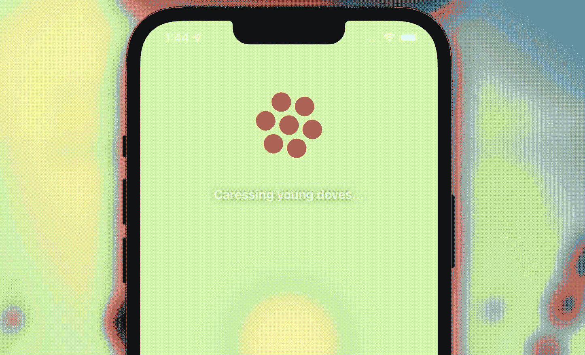
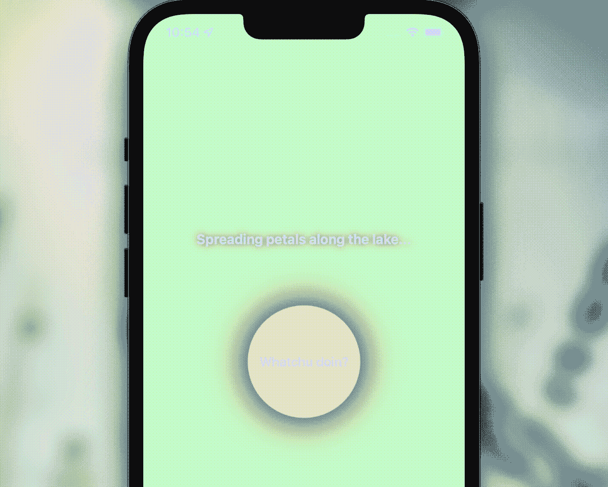
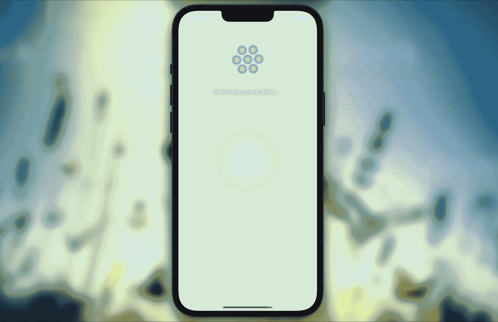

# 为你的 iOS 应用程序设计一个漂亮的加载屏幕

> 原文：<https://betterprogramming.pub/design-a-beautiful-loading-screen-for-your-ios-app-3a8c144d107>

## 为您的 iOS 应用程序创建美观的 Dribbble 式用户界面



我们都经历过。创建我们的应用程序，试图让它工作，并意识到我们留下了设计。但是谁会喜欢一个长相一般的完美 app 呢？不是我！可能你也不会，因为你还在读书。

如果你正在寻找一个简单但漂亮的加载屏幕来点亮你的 iOS 应用程序的用户界面，你来对地方了！

请继续阅读，在您的项目中实现这个简单的动画！

# 步骤 1:创建对象

由于我们将使用系统的`circle.hexagongrid`和`circle.hexagongrid.fill`图像来制作圆圈，我们需要设置的唯一对象是背景中的模糊屏幕和将出现在圆圈下的带有文本的标签。

对于模糊的视图，我们将使用`UIVisualEffectView`和`UIBlurEffect(style: .extraLight)`，尽管你可以选择任何其他不同的可用样式(只需删除`.extraLight`并键入一个圆点)看看你所有的选择，并尝试一下，直到你找到最适合你的！)

```
// blur view behind loading scren
lazy var blurry: UIVisualEffectView = {
   let blurEffect = UIBlurEffect(style: .extraLight)
   let blurEffectView = UIVisualEffectView(effect: blurEffect)
   blurEffectView.alpha = 0
   blurEffectView.frame = self.view.bounds
   blurEffectView.autoresizingMask = [.flexibleWidth, .flexibleHeight]
   return blurEffectView
}()
```

对于我们的标签，创建一个变量`loadingLabel`并设置它的默认文本、字体、大小、位置和阴影(如果您认为合适的话):

```
// loading screen
var loadingLabel: UILabel = {
   let l = UILabel()
   // text
   l.font = UIFont.systemFont(ofSize: 18, weight: .bold)
   l.textColor = .label
   l.numberOfLines = 0
   l.textAlignment = .center
   l.text = "loading..."
   // position
   l.frame = CGRect(x: 20, y: 250, width: UIScreen.main.bounds.width-40, height: 100)
   // shadow
   l.layer.shadowRadius = 5
   l.layer.shadowColor = UIColor.black.cgColor
   l.layer.shadowOffset = CGSize.zero
   l.layer.shadowOpacity = 0.5
   return l
}()
```

最后，为您的`loadingLabel`创建一个字符串数组:

```
// strings to show on loading
var randomStrings = [
   "Picking flowers from Eden Garden...",
   "Making flower crowns for nymphs...",
   "Spreading petals along the lake...",
   "Smelling cherry blossoms off a tree...",
   "Blowing poplar fluff in the wind...",
   "Painting orchids baby blue...",
   "Watching the lotus floating in the pond...",
   "Clipping daisies in my hair...",
   "Caressing young doves...",
   "Singing spring songs with the nightingale...",
   "Catching the treasure at the end of the rainbow...",
   "Napping on a cloud...",
   "Sipping tea with a wood fairy..."
]
```

不错！现在，是时候设置一些东西了！

# 第二步:设置基础

首先，你需要模糊视图。为此，您需要创建一个函数:

*   检查用户设置是否允许模糊视图
*   添加模糊视图，并将其置于目前为止视图控制器中所有其他视图的前面。

一个例子:

您可以考虑用另一个常规视图来替代模糊视图，以防`isReduceTransparencyEnabled`返回`true`。

接下来，我们将创建一个函数:

*   通过使用`Int.random(in:)`作为我们的索引，从`randomStrings`数组中随机选取一个句子，并且
*   设置一个 6 秒的定时器，在它重复自己和改变句子之前。

代码如下:

酷！现在剩下的就是我们的加载屏幕动画功能了。

# 步骤 3:加载屏幕动画

这是所有奇迹发生的地方。这将是一个相当长的功能，但我们将一点一点地进行。

首先，创建您的函数:

```
func loadingScreen(animating: Bool) {}
```

正如你所看到的，我们正在定义一个名为`animating`的布尔值，它将允许我们决定动画是否应该开始，或者是否已经在进行而应该停止。

我们将添加到这个函数中的第一个语句是一个`if...else`语句，在这里我们可以定义`animating`是否等于`true`:

```
func loadingScreen(animating: Bool) { **if** **animating == true** **{** **} else {** **}**}
```

**…标签**

先说`animating == true`条件。让我们将我们的`loadingLabel`添加到视图中，并调用我们的函数`labelText()`来设置它的文本。

您可能会尝试使用简单的`view.addSubview()`类型的代码将标签添加到视图中；然而，当我们用`loadingLabel.removeFromSuperview()`移除它时，将标签重新放回视图中会变得更加困难。

最简单的解决方法是使用`loadingLabel.isHidden = true`来代替。但是这意味着每次我们用`view.addSubview(loadingLabel)`调用`loadingScreen(animating: true)`时，一个新的标签被添加到视图中。恶！想象一下，在一个会话中可以添加多少个…这不是最好的工作方式，不是。

我们要做的是检查视图是否包含我们的`loadingLabel`。如果有，我们就简单的用`loadingLabel.isHidden = false`取消隐藏；否则，我们将把它添加到视图中。

只需一行代码，加上函数`labelText()`，就可以做到这一点:

```
// add the label
self.view.contains(self.loadingLabel) ? self.loadingLabel.isHidden = false :  self.view.addSubview(self.loadingLabel)
self.labelText()
```

太棒了。此时，如果您测试您的应用程序并运行`loadingScreen(animating: true)`，您应该会看到标签显示在屏幕上，每六秒钟显示一次不同的文本。



我保证在本教程结束时它会看起来更好。

还没那么可爱。但是我们就要到了！

**…圆圈**

如上所述，我们将使用系统图像`circle.hexagongrid`和`circle.hexagongrid.fill`来创建圆圈。为我们的图像创建两个名为 img1 和 img2 的对象:

```
// use system circle hexagon grid images as circles
let img1 = UIImage(systemName: "circle.hexagongrid")
let img2 = UIImage(systemName: "circle.hexagongrid.fill")
```

为每个图像添加一个`UIImageView`,并为其分配 img1 和 img2:

```
// add the circles
let iv1 = UIImageView(image: img1)
let iv2 = UIImageView(image: img2)
```

由于视图将一次显示一个圆，将`UIImageView`的 alpha 设置为零是有意义的:

```
iv1.alpha = 0
```

创建一个名为`i`的变量，并将其设置为值为 100 的`Int`。这将是视图标记，我们将使用它来访问视图，并在加载动画需要停止时删除它。

```
var i = 100
```

创建一个图像视图阵列，以便您可以一次设置相同的大小和位置。

```
let images = [iv1, iv2]
```

**…格式**

让我们使用该数组并创建一个`for...in`语句来同时设置两个图像视图属性:

```
for image in images {}
```

在该语句中，我们将设置每个图像视图的标签。如上所述，这在以后删除视图时会很有用，因为它被声明为嵌套在函数内部，而不是类内部。

```
// give a tag to the image view so you can find it and remove it later
i += 1
image.tag = i
```

现在将圆的位置和大小设置为相同，这样它们看起来就像融合在一起了:

```
// set the circles position
let hw: CGFloat = 100
image.frame = CGRect(x: UIScreen.main.bounds.width/2 - hw/2, y: 100, width: hw, height: hw)
image.contentMode = .scaleAspectFill
```

设置图像的颜色。我使用了新的 iOS 15 颜色，但我也为使用早期版本的设备设置了备用颜色。

```
// set the circles colors
if #available(iOS 15.0, *) {
   image.tintColor = (image.image == img1 ? .systemMint : .systemPink)
} else {
   image.tintColor = (image.image == img1 ? .systemGreen : .systemRed)
}
```

然后，将图像视图添加到视图中:

```
// add to the view
self.view.addSubview(image)
```

最后，添加旋转动画，使用 linear 和 repeat 使视图在循环中始终以相同的速度旋转:

```
// rotation animatio
UIView.animate(withDuration: 2, delay: 0, options: [.repeat, .curveLinear]) {
   image.transform = CGAffineTransform(rotationAngle: CGFloat(Double.pi))
}
```

**…模糊视图**

使用我们上面定义的函数模糊视图:

```
// add blur view
self.blurView { success in}
```

添加模糊视图后，添加所有其他视图:

```
// bring the circles in front of the blurred view
self.view.bringSubviewToFront(iv1)
self.view.bringSubviewToFront(iv2)
self.view.bringSubviewToFront(self.loadingLabel)
```

为每个圆单独启动一个渐隐动画，将第二个圆的延迟设置为与第一个圆的动画相同的持续时间，如下所示:

```
// switch views
UIView.animate(withDuration: 1, delay: 0, options: [.repeat, .autoreverse]) {
   iv2.alpha = 0
   iv1.alpha = 1
}UIView.animate(withDuration: 1, delay: 1, options: [.repeat, .autoreverse]) {
   iv1.alpha = 0
   iv2.alpha = 1
}
```

如您所见，两个圆圈持续时间相同，第二个圆圈的延迟设置为 1 秒。这意味着一旦第一个圆圈开始褪色，圆圈将开始出现，因为我们将动画设置为重复和自动反转，圆圈将保持褪色和间歇性地重新出现。

**…结束加载屏幕**

好了，娱乐结束了，该回到现实了。我们如何用所有这些视图和动画结束这个加载屏幕？

轻松点。创建一个包含所有视图的数组并删除它们。

```
 // find image views by tag
   **let** views = [**self**.view.viewWithTag(101), **self**.view.viewWithTag(102), **self**.blurry] **for** view **in** views {
      view?.alpha = 0
      view?.removeFromSuperview()
   } 
```

当然标签除外；正如我们上面所说的，标签将会随着 isHidden 从屏幕上移除。

```
// hide loading label
self.loadingLabel.isHidden = true
```

嗒哒！你完了！您的函数现在应该如下所示:

哇，这是一个很长的代码。太棒了。

运行您的代码，您应该得到类似如下的内容:



简单但很好，不是吗？

你可以在 [my GitHub](https://github.com/Margels/Eden-Garden) 上找到完整的项目！

你喜欢这个教程吗？它和你的项目合作得好吗？让我知道你的反馈！

```
**Want to Connect?**Follow me on…
❤️ [YouTube](https://www.youtube.com/channel/UC5hqYiHxie458KSO1PAnA8Q)
💖 [Dribbble](https://dribbble.com/margelss)
💜 [Instagram](https://www.instagram.com/itsmargels/)
💙 [Ko-Fi](https://ko-fi.com/margelss)
🖤 [GitHub](https://github.com/Margels)
```