# 使用 Swift 5 为 iOS 设计一个漂亮的水平滑动演示

> 原文：<https://betterprogramming.pub/design-a-nice-horizontal-sliding-presentation-for-ios-using-uiscrollview-and-uipagecontrol-swift-2c4fa1b11403>

## 为你的应用程序创建类似 Dribbble 的用户界面——第 1 部分

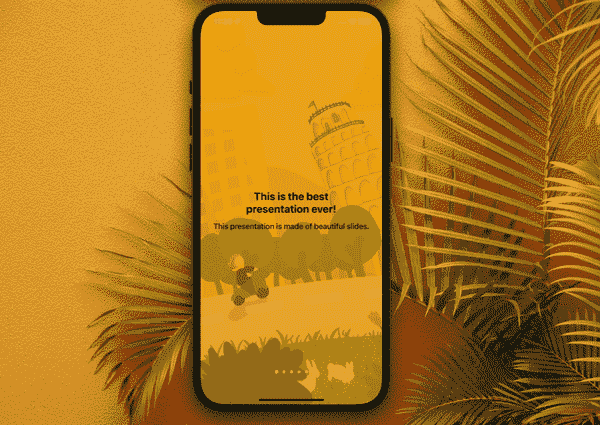

谢谢玛丽亚·卢潘背景中漂亮的照片！

你好。又是我，为你的 iOS 应用提供了另一个教程。希望你还没有厌倦它们，因为今天我为任何网站、软件或应用程序的一个非常普遍的“问题”想出了一个很好的解决方案:无聊、可怕、经常被低估的…指令。

我不知道你是怎么想的，但是我对任何指南手册都有一种天生的厌恶，我发现自己总是试图避免阅读它们，没有明显的原因。后来确实后悔了，但还是没办法。

这是一件好事，应用程序通常足够直观，不需要它们，对不对？然而有时候，在你的用户开始与你的应用程序互动之前，一个小小的演示是必要的。那么你能做些什么来让这部分更有趣一点呢？

我从 [Anitaa Murthy](https://medium.com/u/b69ba9cd4ff2?source=post_page-----2c4fa1b11403--------------------------------) 的惊人的[教程](https://medium.com/@anitaa_1990/create-a-horizontal-paging-uiscrollview-with-uipagecontrol-swift-4-xcode-9-a3dddc845e92)中获得灵感，并制作了我自己版本的背景带有移动图像的幻灯片演示。请继续阅读，了解如何在您的应用中实现这一点！

# 第 1 部分:建立你的故事板

在教程的这一部分，我们将使用故事板准备我们的视图控制器。您可以编写自己的代码，也可以下载以下材料来学习我的代码:

*   [GitHub 项目](https://github.com/Margels/PresentationApp)
*   [背景图片](https://dribbble.com/shots/18741326-Presentation-App-Background)

准备，设置…开始！

## 第一步:选择你的颜色和背景图片

我通常从选择资产的颜色开始。对于这个应用程序，我将选择一个芥末黄色的阴影，它与我的背景图像很好，我的配件(标签和最后一个按钮)是一个暗松木绿色的阴影。

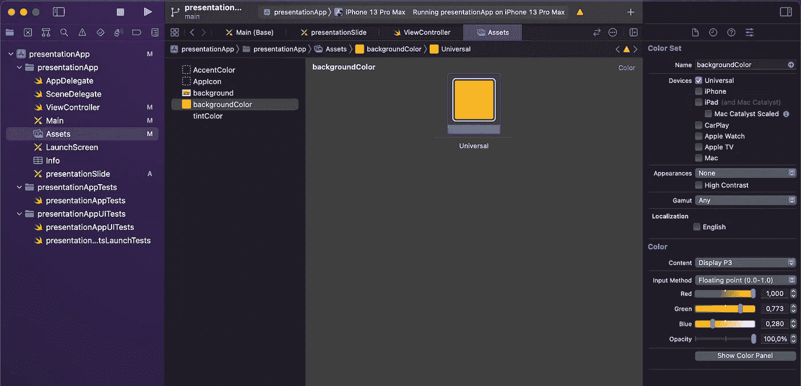

至于背景图片，我在我的 iPad Pro 上使用 Procreate 绘制了这张图片，但是你可以使用任何你喜欢的图片，并相应地设置你的颜色。

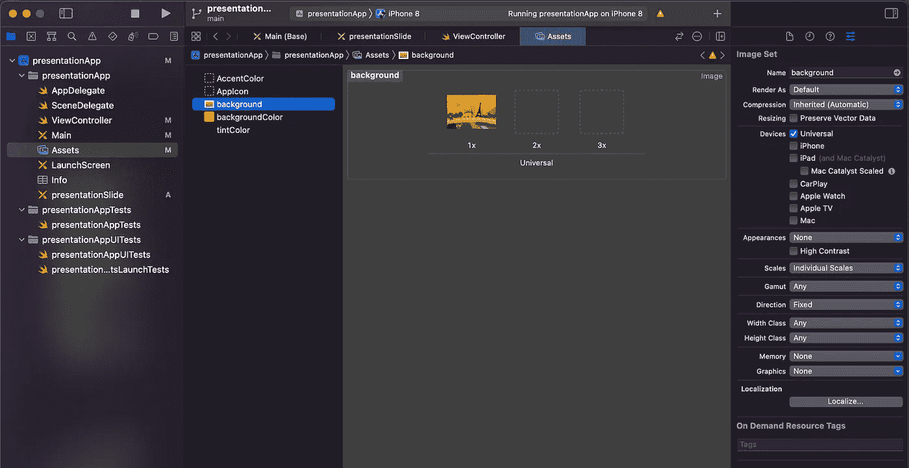

一旦第一步完成，我们就可以开始制作我们的故事板了。

使用新的背景颜色和视图控制器的色调颜色。如果这将是您的初始视图控制器，考虑对您的启动屏幕也做同样的事情。

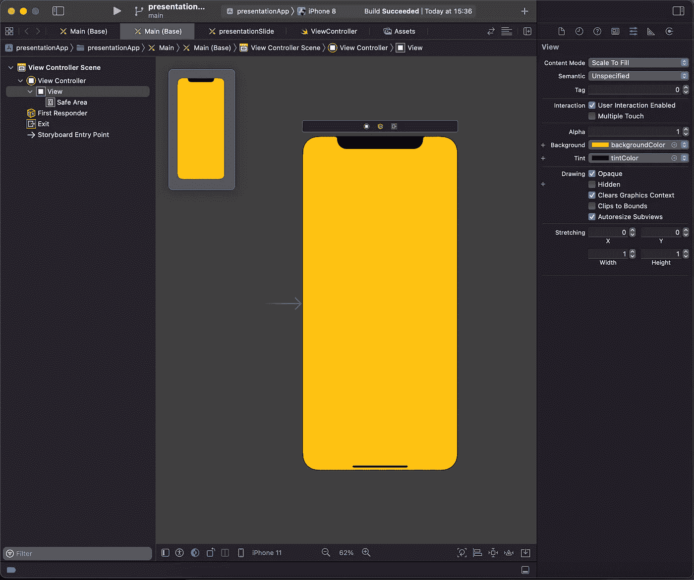

现在，在最重要的部分:滚动视图！

## 步骤 2:在故事板中设置你的 UIScrollView 视图

打开对象库，在视图控制器中拖动一个`UIScrollView`,拖动它的边缘覆盖视图控制器的整个安全区域。

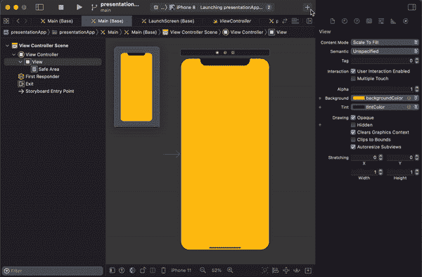

现在我们有了滚动视图，我们需要设置它的约束。通过按住 control 键拖动对象到您的类，将`UIScrollView`连接到您的视图控制器类，并将其命名为。我将用`presentationScrollView`作为它的名字。

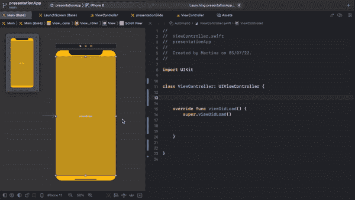

完成后，在视图控制器类中添加函数`setUpScrollView()`并定义滚动视图的约束，使它们与视图安全区域的约束一致，如下所示:

```
**// set the scroll view's constraints**
func setUpScrollView() { **// align the scroll view to the safe area**
   let sv = presentationScrollView
   sv?.translatesAutoresizingMaskIntoConstraints = **false** sv?.topAnchor.constraint(equalTo: view.safeAreaLayoutGuide.topAnchor, constant: 0).isActive = truesv?.bottomAnchor.constraint(equalTo: view.safeAreaLayoutGuide.bottomAnchor, constant: 0).isActive = truesv?.leadingAnchor.constraint(equalTo: view.safeAreaLayoutGuide.leadingAnchor, constant: 0).isActive = truesv?.trailingAnchor.constraint(equalTo: view.safeAreaLayoutGuide.trailingAnchor, constant: 0).isActive = true}
```

现在从你的视图控制器的`viewDidLoad()`调用这个函数，添加下面几行来定义内容大小和你的滚动视图的行为:

```
**// scroll view settings**
setUpScrollView()
presentationScrollView.contentSize = CGSize(width: presentationScrollView.contentSize.width, height: 0)
presentationScrollView.automaticallyAdjustsScrollIndicatorInsets = false
presentationScrollView.alwaysBounceVertical = false
presentationScrollView.alwaysBounceHorizontal = true
presentationScrollView.isDirectionalLockEnabled = true
```

搞定了。你的滚动视图现在可以运行了。您的视图控制器现在应该如下所示:

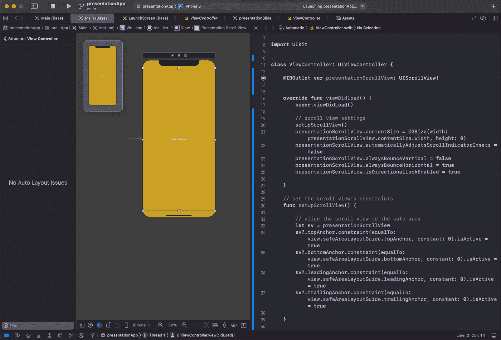

现在，让我们将其余的对象添加到我们的视图中。

## 步骤 3:背景、页面控件和按钮

仍然有相当多的东西要添加到我们的观点中。你需要确定的一件事是，每个对象都在滚动视图的*之外，或者在前景(`UIPageControl`和`UIButton`)或者背景(`UIImageView`)，但是*不在*之内。*

*   **页面控制**

先说我们的`UIPageControl`:

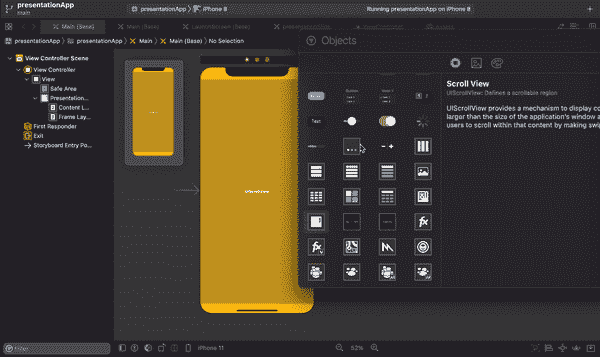

正如你所看到的，我特别注意把它拖到滚动视图之外，更确切地说，拖到它的上面，这样它就会出现在前景上。

我将设置它的约束，使页面控件贴在视图的底部并水平居中:

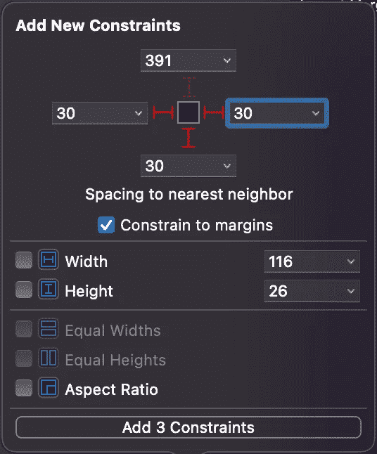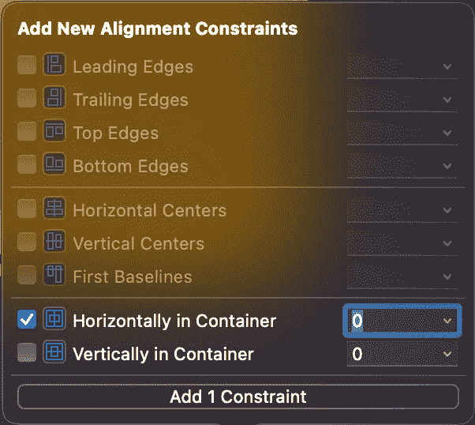

此外，可以在大于或等于关系的*上设置前导和尾随约束，以保持视图居中，如下图所示:*

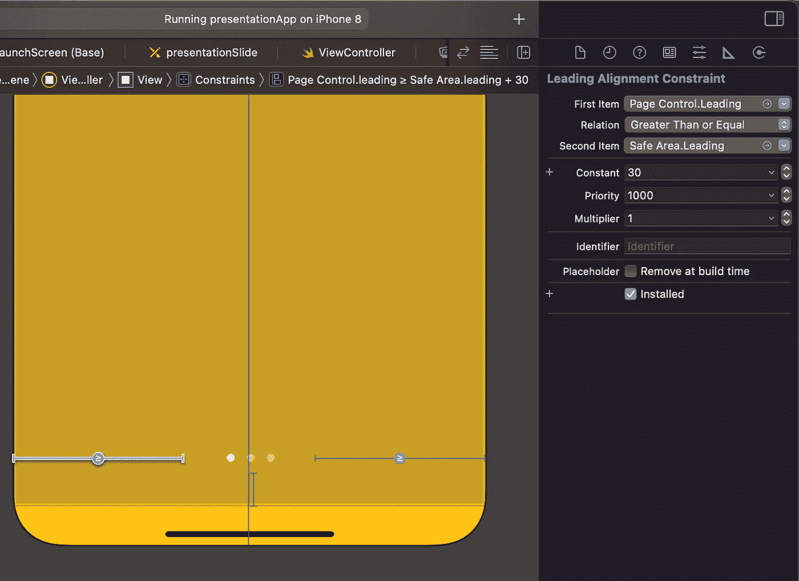

像以前一样将它连接到视图控制器的类，并将其命名为`presentationPageControl`。

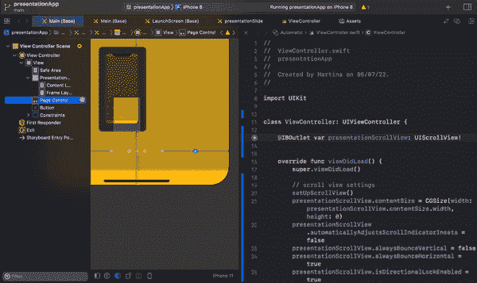

*   **按钮**

从上面的 gif 可以看到，最后一张幻灯片附带了一个按钮。要设置它，您需要首先添加一个`UIButton`到您的视图控制器:

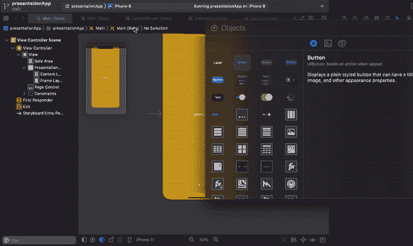

它的高度和宽度应该设置为 40，而它对安全区域的尾部和底部约束应该设置为 30。

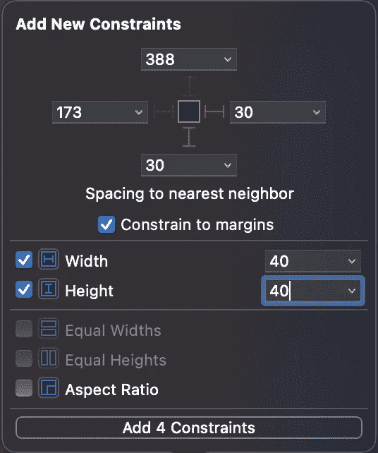

快到了！这个按钮现在看起来很简单，但我们显然希望它看起来很漂亮，并符合我们的应用程序的设计。

使用以下设置使其看起来与本教程中的一模一样:

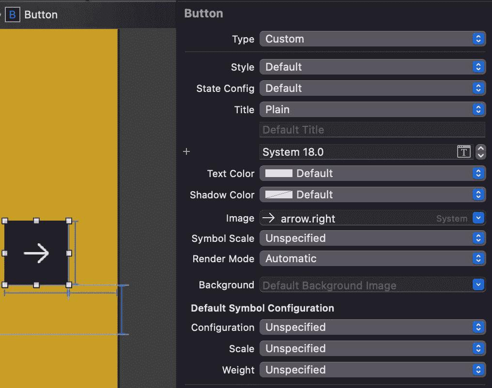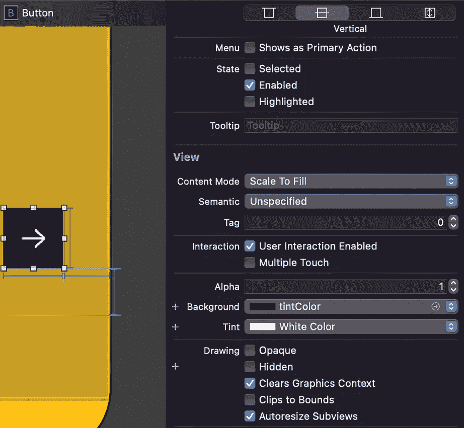

按住 Control 键，将按钮拖动到视图控制器的类中进行连接，就像处理页面控件和滚动视图一样，并将其命名为`continueButton`。

添加以下代码行，使按钮变圆，并使其在以后不可见:

```
**// set up button to be rounded & to show only on last slide**
continueButton.layer.cornerRadius = continueButton.frame.height / 2
continueButton.isUserInteractionEnabled = falsecontinueButton.alpha = 0
```

太棒了。现在剩下要添加的是我们的背景图像视图。

*   **背景图片**

在视图控制器中拖动一个`UIImageView`。这一次，如您所见，该对象将位于视图中其他所有对象的下方:

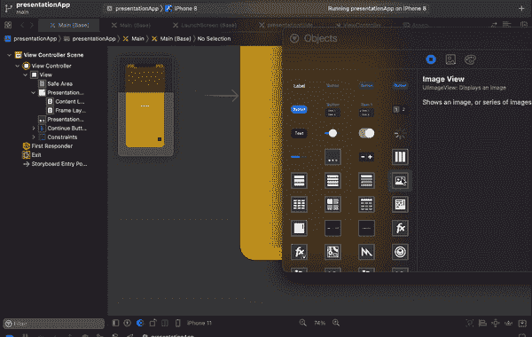

将对象放置在安全区域和滚动视图之间，以确保它将被放置在视图中其他所有对象的下方。

完美！现在，我们不会使用故事板设置任何约束；我们需要图像在用户滚动时移动，因此，图像的位置应该以编程方式设置。

我将在`viewDidLoad()`中使用下面几行代码来定义图像的初始位置。我将:
-设置图像视图的高度略大于视图的框架，以确保它覆盖整个屏幕，
-通过使用其纵横比计算来设置我的图像的宽度(我的图像的宽度大约是其自身高度的 1.4 倍)
-设置图像略微透明。

```
**// background image settings**
let viewHeight = view.frame.size.height
let imageWidth = viewHeight * 1.4
let padding: CGFloat = 10
backgroundImageView.alpha = 0.5
backgroundImageView.frame = CGRect(x: 0,
                                   y: -padding,
                                   width: imageWidth,
                                   height: viewHeight+padding*2)
```

现在，我将拖动它的边缘来填充整个屏幕，并让它的左右边缘经过视图的框架，只是为了对代码编译时的样子有一个大致的概念。

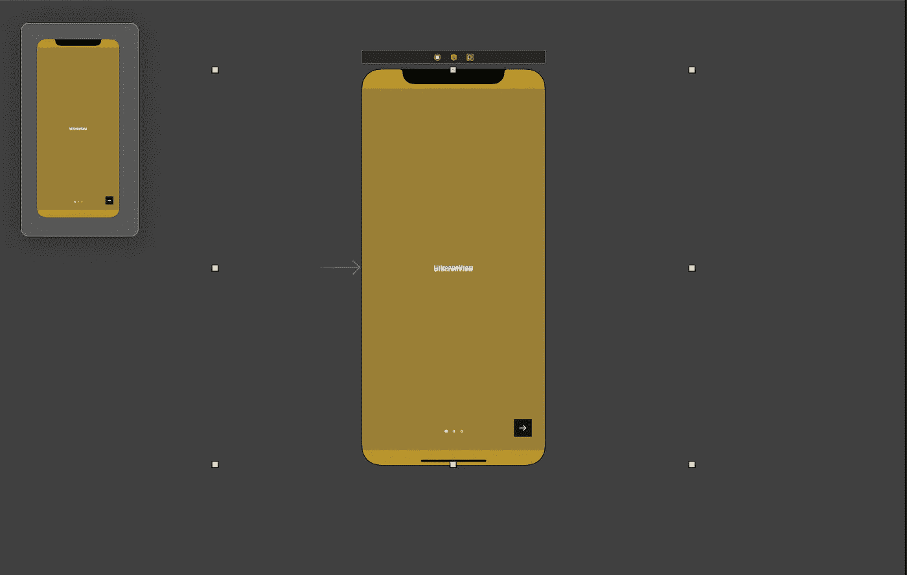

我还将它连接到视图控制器类，并将其命名为`backgroundImageView`。

最后但同样重要的是，将资产中的背景图像分配给图像视图，并将其内容模式设置为*缩放填充。*

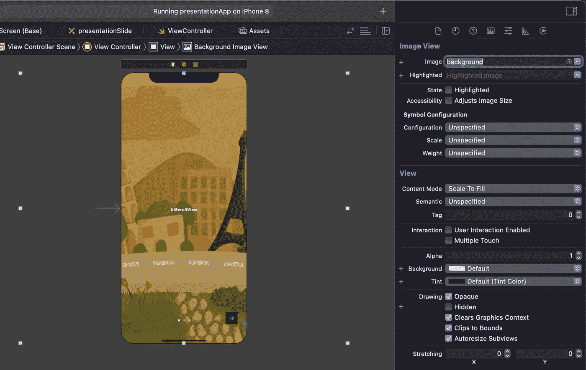

已经很好看了！

您的视图控制器现在看起来应该如下所示:

哇，已经有很多代码了。干得好，你跟上了！

最无聊的部分现在已经完成了，我的笔记本电脑真的需要从所有这些图像、gif 和视频中解脱出来……所以，为了我心爱的设备，我将把这个教程分成更多的部分:

*   [第二部分](https://medium.com/@margels/design-a-nice-horizontal-sliding-presentation-for-ios-using-swift-5-b312b9b1bbbc)

你喜欢这个教程吗？它和你的项目合作得好吗？

```
**Want to Connect?** Follow me on…
❤️ [YouTube](https://www.youtube.com/channel/UC5hqYiHxie458KSO1PAnA8Q)
💖 [Dribbble](https://dribbble.com/margelss)
💜 [Instagram](https://www.instagram.com/itsmargels/)
💙 [Ko-Fi](https://ko-fi.com/margelss)
🖤 [GitHub](https://github.com/Margels)
```