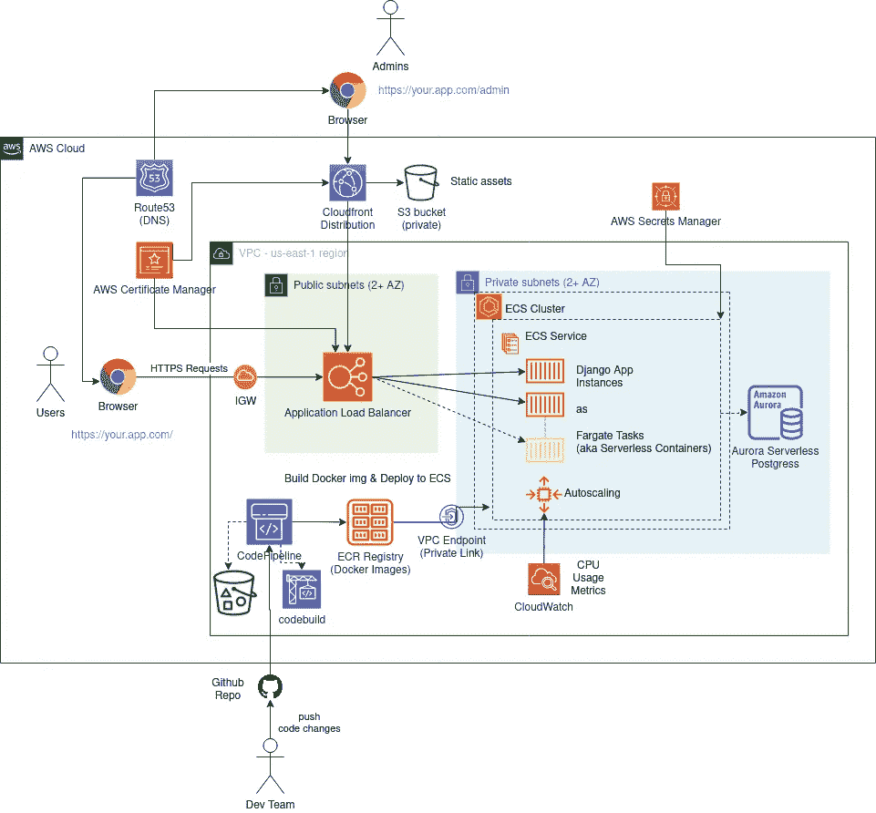
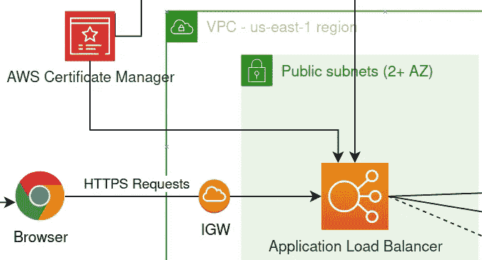
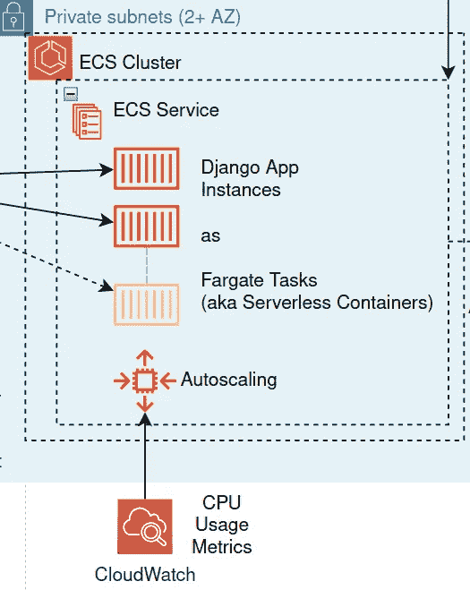
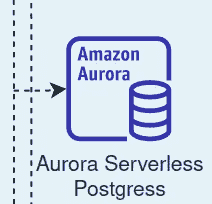
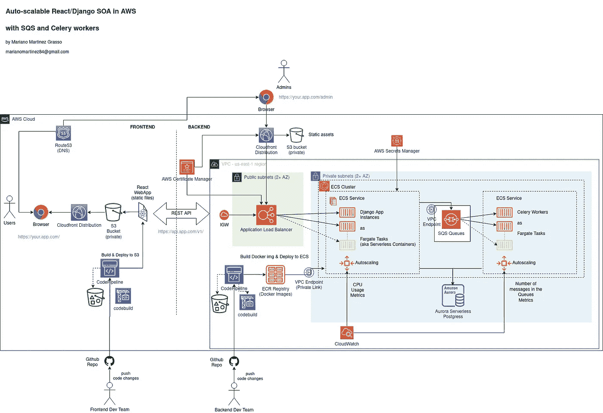
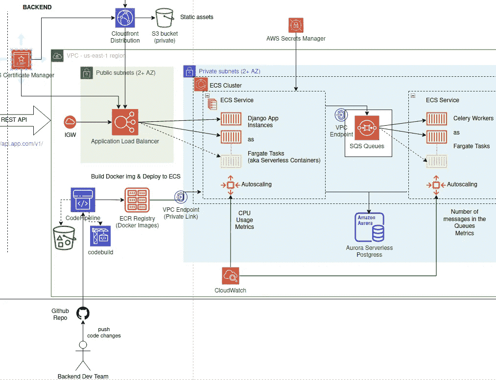
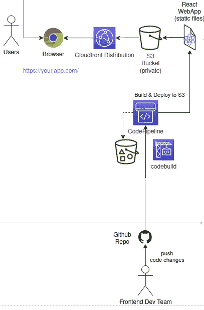

# 为 AWS 中的 Django 应用程序设计一个可自动伸缩的架构

> 原文：<https://betterprogramming.pub/design-an-auto-scalable-architecture-for-your-django-apps-in-aws-850ca5ec63a1>

## 使用无服务器容器实现零服务器维护的弹性、性能和安全性

马克·瑟尼斯在 [Unsplash](https://unsplash.com/s/photos/guide?utm_source=unsplash&utm_medium=referral&utm_content=creditCopyText) 上的照片

你终于有了一个好到可以公开的工作版本。干得好！但是现在，您想知道如何在 AWS 中将 Django 应用程序投入生产，以及如何使它具有可伸缩性、弹性、高性能和安全性，同时优化成本并且不需要手动基础架构管理。这就是这篇文章的内容。

# 审查开发架构

开发中的 Django 应用程序的典型架构如下所示:

因此，我们可以确定两个主要组成部分:

*   Django app:通常由 [runserver](https://docs.djangoproject.com/en/4.0/ref/django-admin/#django-admin-runserver) 提供服务，它是与 Django 打包在一起的开发服务器。
*   数据库:Django 支持多种数据库，例如 PostgreSQL、MySQL 和 SQLite。

您可能想将相同的设置复制到服务器或虚拟机中，并让它在生产中运行，但是正如您将看到的，这种架构有一些缺陷:

## 它是不可扩展的

Runserver 没有经过优化，也没有做好处理大量请求的准备，即使您用 gunicorn 这样的生产应用服务器来代替它，单个服务器可以处理的请求数量也会受到其硬件资源的限制。因此，一旦你开始收到越来越多的请求，系统最终会没有反应，请求将开始超时。

向服务器添加更多的资源，也就是垂直扩展，可以暂时解决这个问题，但是很快就会达到极限，并且会重复这个过程，直到无法添加更多的资源。您可以添加一个负载平衡器，然后添加更多的服务器，但是手动这样做可能会很慢而且很痛苦，如果您没有计划好，可能会导致停机。

## **不是表演**

Runserver 没有针对性能进行优化。此外，静态文件和媒体由处理请求的同一进程提供服务，这会延迟请求处理并消耗更多资源。此外，如果您使用默认的 SQLite DB，它只允许在任何给定时间进行一次写操作，这极大地限制了吞吐量。我不建议在生产中使用 SQLite。

## **安全漏洞**

Runserver 运行在 HTTP 上而不是 HTTPS 上，这对于本地开发来说还可以，但是不适合生产。此外，如果数据库与 Django 应用程序运行在同一个主机上，并且主机暴露在互联网上，那么如果有人侵入服务器，他现在也可以攻击您的数据库。

## **服务器维护很痛苦**

您需要手动监控和管理您的服务器和资源。如果服务器进入不健康状态或需要更多资源，这将需要手动干预，并可能导致停机。

# 在 AWS 中设计生产就绪的架构

现在，我们将使用几个 AWS 服务来设计新的生产架构，这些服务将帮助我们解决上述问题。

先决条件:[将你的 Django 应用](/dockerize-your-django-apps-428189407c69)归档。所选择的架构需要一个容器化的应用程序。

现在让我们来看一下有目的的架构:

你可以在[这里](https://drive.google.com/file/d/1MsZhVcTErT9-wgBQVqcYQs4G-4dYflLc/view?usp=sharing)看到这个全尺寸的图表

## **应用负载平衡器**

首先，我们添加了一个[应用负载平衡器](https://aws.amazon.com/elasticloadbalancing/application-load-balancer/) (ALB)来实现水平扩展和健康检查。现在，请求可以分布在几个实例之间，并且可以检测和替换不健康的实例。ALB 还支持端口转发，因此您不需要 nginx 这样的中间代理，因为请求可以直接转发到端口 8000 上的应用程序。

ALB 还支持 HTTPS 和 SSL/TLS 证书，可以使用 [AWS 证书管理器](https://docs.aws.amazon.com/acm/latest/userguide/acm-overview.html)添加这些证书。在这种情况下，TLS 会话在负载平衡器处终止，然后流量通过 HTTP 转发到应用，但通过您的私有云网络转发到应用。

您还会注意到，ALB 部署在两个不同的[可用性区域](https://aws.amazon.com/about-aws/global-infrastructure/regions_az/) (AZs)中的两个公共子网中。处于公共子网中允许它接收来自互联网的请求，并且使用两个 AZ 确保即使一个 AZ 关闭它仍将工作。

## **弹性容器服务(ECS)和无服务器容器**

ECS 允许在云中运行 docker 容器。我们用它来运行 Django 应用程序实例。ECS 支持两种运行容器的方式:您可以在服务器内部运行容器(EC2 VM 或 on-premise ),也可以使用 Fargate 在无服务器模式下运行容器。

我们使用 Fargate，因为我们不想管理服务器。这需要创建一个具有 Fargate 启动类型的 [ECS 集群](https://docs.aws.amazon.com/AmazonECS/latest/developerguide/clusters.html)和一个 [ECS 服务](https://docs.aws.amazon.com/AmazonECS/latest/developerguide/ecs_services.html)，然后添加一个[任务定义](https://docs.aws.amazon.com/AmazonECS/latest/developerguide/task_definitions.html)，它指定将作为服务的一部分运行的容器。在这种情况下，我们需要为 Django 应用程序定义一个任务/容器。容器的图像取自 docker 注册表。

请注意，容器必须是无状态的，这样它们就可以随时被销毁和重新创建。这实现了 ECS 服务(以及一般的 AWS)的最大特性之一:[自动伸缩](https://docs.aws.amazon.com/AmazonECS/latest/developerguide/service-auto-scaling.html)。我们设置任务的最小、期望和最大数量，并使用 [CloudWatch 指标](https://docs.aws.amazon.com/AmazonCloudWatch/latest/monitoring/working_with_metrics.html)如平均 CPU 使用率(更高的 CPU 使用率=更高的流量)来根据需要自动扩展(添加更多实例)或扩展(删除实例)。

最少拥有两个实例可以确保系统在一个实例关闭时仍能继续运行，而健康检查将允许自动检测失败的实例，并用新的健康实例替换它们。此外，将这两个实例放在两个不同的可用性区域(AZ)中，可以在一个 AWS 数据中心停机的情况下分散风险。

最后，我们不要忘记安全性。我们将 ECS 任务放在私有子网中，这样它们就不会暴露在互联网上，并且只能接收来自负载平衡器的请求。

## Aurora 无服务器数据库

数据库本质上是有状态的，因为它存储的数据必须是持久的。所以它不能在 ECS/Fargate 中作为无状态容器运行。但是我们不想为数据库管理服务器或虚拟机。

幸运的是，AWS 有一个名为 [Aurora Serverles](https://docs.aws.amazon.com/AmazonRDS/latest/AuroraUserGuide/aurora-serverless.html) s 的托管服务，Aurora Serverless 是一个完全托管的服务，用于支持 PostgreSQL 的关系数据库。无服务器意味着 it [自动扩展](https://docs.aws.amazon.com/AmazonRDS/latest/AuroraUserGuide/aurora-serverless.how-it-works.html#aurora-serverless.how-it-works.auto-scaling)，并且不需要您提供或管理任何资源。

与 ECS 服务类似，我们设置了最小和最大容量，它可以按需自动扩展。为了节省一些成本，您还可以启用[自动暂停](https://docs.aws.amazon.com/AmazonRDS/latest/APIReference/API_ScalingConfiguration.html)功能，在闲置`N`分钟(无连接)后将容量暂时缩减为零。这意味着数据库会关闭，直到收到新的连接请求。这对于生产前/准备环境尤其有用，但不太适合生产环境，因为唤醒时间可能需要一到两分钟。

Aurora DB 还支持自动备份作为灾难恢复策略。另外，Aurora DB 的整体性能比普通 PostgreSQL 实例快三倍。

还要注意，我们将数据库放在运行 ECS 服务的同一个私有子网中，因此可以从我们的 Django 应用程序访问数据库，它不会暴露在互联网上。

## **代码管道和 CI/CD 管道**

CodePipeline 是一个持续集成/持续交付服务，允许软件发布过程自动化。管道由可以定制的阶段组成，因此它可以适应您正在使用的任何分支模型，例如[基于主干的](https://trunkbaseddevelopment.com/#scaled-trunk-based-development)、 [GitHub 流](https://docs.github.com/en/get-started/quickstart/github-flow)、 [GitFlow](https://nvie.com/posts/a-successful-git-branching-model/) 或其他定制分支模型。

例如，这些将是使用经典 GitHub 流分支模型的阶段。

*   Source:当 PR 合并到主分支时，管道被触发(这是通过 AWS CodeStar 连接使用 webhooks 检测到的)。
*   构建和[测试]:docker 映像由源代码构建，并保存在 ECR 存储库中，ECR 存储库是 AWS 中的 docker 映像注册中心。如果自动测试在合并之前没有运行过，或者只是作为第二次检查，它们可以在这个阶段运行。这个阶段可以使用其他服务，如 CodeBuild 或 S3 桶来构建和存储工件。
*   阶段:新映像被部署到一些预生产环境中，以进行更多的 QA(例如，集成测试、端到端测试、UI 测试)。在手动或自动批准后，它将进入生产阶段。
*   生产:部署新映像，更新 ECS 中的应用程序。[滚动更新](https://docs.aws.amazon.com/AmazonECS/latest/developerguide/deployment-type-ecs.html)可用于避免停机。

## **路由 53 作为 DNS 和(可选)作为域名注册商**

[Route53](https://docs.aws.amazon.com/Route53/latest/DeveloperGuide/Welcome.html) 是 DNS，我们在其中添加记录，将我们的域和子域指向 AWS 资源。例如，我们添加一条记录，将我们的主域指向我们的 ALB。域名本身也可以通过 Route53 注册，也可以在一些第三方域名注册机构注册，比如 NameCheap 或 GoDaddy。如果您使用的是第三方注册商，那么您必须将名称服务器(NS)记录更改为[使 Route 53 成为您的 DNS](https://docs.aws.amazon.com/Route53/latest/DeveloperGuide/migrate-dns-domain-in-use.html#migrate-dns-change-name-servers-with-provider) 。

## **利用 CloudFront 服务静态资产**

静态资产比如。js 或者。css 文件存储在 [S3](https://docs.aws.amazon.com/AmazonS3/latest/userguide/Welcome.html) 桶中，并通过使用 [CloudFront](https://docs.aws.amazon.com/AmazonCloudFront/latest/DeveloperGuide/Introduction.html) 的内容分发网络(CDN)提供服务。这允许在靠近客户端的地方缓存文件，从而优化性能，同时减轻应用服务器的负担。您应该确保您的 S3 bucket 是私有的，并使用一个原始访问身份来只允许通过您的 CloudFront 发行版进行访问。

## **使用 AWS Secrets Manager 保护您的秘密安全**

您不希望将 API 键、数据库凭证或任何敏感信息提交到代码库中。您可以直接在任务定义中设置环境变量，但是有人可以使用 AWS API 读取它们的值。使用 [AWS Secrets Manager](https://docs.aws.amazon.com/secretsmanager/latest/userguide/intro.html) 数据被加密存储在云中，并在运行时注入。在 JSON 中，可以以纯文本或键值对的形式存储数据。我们用它来存储 Django 秘密和数据库凭证之类的东西。

## **通过 VPC 端点保持网络内部的流量**

当你使用 S3 或 SQS 等 AWS 服务时，默认行为是通过互联网访问它们。如果你的应用在私有网络的虚拟私有云(VPC)内的 AWS 中运行，那么需要一个 [NAT 网关](https://docs.aws.amazon.com/vpc/latest/userguide/vpc-nat-gateway.html)来访问互联网上的任何资源。NAT GWs 是按小时和 GB 计费的，它们会迅速增加您的账单。

因此，将流量保持在 VPC 内，可以提高安全性和性能，同时也可以降低一些成本。由于你的应用程序在 AWS 中，有一种方法可以从你的 VPC 访问这些 AWS 服务，而无需穿越互联网: [VPC 端点](https://docs.aws.amazon.com/vpc/latest/privatelink/vpc-endpoints.html) (fka 专用链接)。您只需要在 VPC 级别为每个服务启用它们，然后对这些服务的任何调用都将在 AWS 网络内部进行路由。

请注意，使用 VPC 端点也有成本，但每小时的价格和数据处理是 NAT GW 价格的四分之一。

# **高级架构模式**

## 与队列和工人解耦

你可以在这里得到这个全尺寸的图

这种架构模式允许您通过添加队列和工人来分离短期请求和长期运行的任务。所有花费超过一秒钟的事情都可以被转换成一个任务，这个任务可以被排队等待在一个工作线程上异步执行。

# **为什么我可能需要这个？**

## **性能效率**

您的应用程序实例可以处理有限数量的并发请求。所以您希望尽可能快地处理请求，以便能够在每个实例上每秒处理更多的请求。假设您有一些在请求处理期间同步执行的耗时代码。添加的时间越多，每秒可以处理的请求就越少。

这还可能触发一个横向扩展事件，添加更多实例来支持更高的工作负载，这将不必要地增加基础架构成本。添加队列允许应用程序实例将这些耗时任务的执行委托给工作人员，并继续处理更多的请求。

## **更好的可扩展性**

您的主要应用程序实例和员工现在可以独立扩展。中间的队列还允许支持工作负载峰值，而不必如此频繁地向外扩展和向内扩展。工作人员可以根据队列中的消息数量等指标进行扩展。

## **容错**

假设您调用一些外部 API(第三方或您自己的另一个服务)。如果你同步进行，因为你的应用程序直接与它耦合，那么一旦外部 API 关闭，你的整个应用程序也会关闭。将 API 调用转移到异步任务中允许您将应用程序从外部服务中分离出来。该应用程序只会将任务排队，然后继续前进。

一个工人将在稍后选择任务并执行它。在 API 调用失败的情况下，可以用不同的策略重试任务，直到它最终成功或者直到您放弃。

## **用芹菜实现工人**

在 python 中灵活可靠地实现了分布式任务队列和工人。它负责繁重的工作，如消息传递、工人执行、断开连接和重新连接，它还带有一些很棒的功能，如采用不同策略的[任务重试](https://docs.celeryproject.org/en/stable/userguide/tasks.html#retrying)。它支持几个队列，[亚马逊 SQS 是其中之一](https://docs.celeryproject.org/en/stable/getting-started/backends-and-brokers/sqs.html#broker-sqs)，并且它自带了一个 [Django 集成](https://docs.celeryproject.org/en/stable/django/first-steps-with-django.html)。

## **使用亚马逊 SQS 实现队列**

[SQS](https://docs.aws.amazon.com/AWSSimpleQueueService/latest/SQSDeveloperGuide/welcome.html) 是一个完全托管的、高度可用的服务，在云中提供可靠的队列。您不需要提供资源或管理任何类型的服务器。对消息的数量没有任何限制，因此队列不会变满，消息存储在多个冗余可用性区域(az)中。

## 使用现代前端框架和面向服务的架构(SOA)

您可能愿意将前端和后端分离，并使用一些现代前端框架，如 React 或 Vue。我们将调整我们的架构来支持这一点。

你可以在这里得到这个全尺寸的图

因此，现在 Django 应用程序将实现一个 REST API，作为与前端的通信接口。

## **后端**

我们的 Django 应用程序现在实现了一个服务于 REST API 的后端 web 服务。Django 模板层没有被使用，因为前端渲染现在移到了客户端。如果你选择这个架构，你可能想看一看 [django-rest-framework](https://www.django-rest-framework.org/) 。

## **前端**

前端现在将单独开发和部署。同样，我们使用 CodePipeline 构建和部署前端应用程序。前端 app 一旦搭建好，就只是一组静态文件(html，js，css)。因此，我们可以将它存储在一个私有的 S3 桶中，通过 CloudFront 提供服务。前端的典型流水线可以具有以下阶段:

*   来源:在 GitHub 的前端 repo 中，当新的提交被推送到 master 时，管道被触发。
*   测试:自动测试在前进之前执行。
*   构建:构建 react 应用程序(yarn build ),并将包(静态文件)传递到下一阶段。
*   阶段:新的捆绑包被部署到生产前环境中的 S3 桶中，以进行更多的 QA(例如，端到端测试、UI 测试)。在手动或自动批准后，它将进入生产阶段。
*   生产:新的包被部署到生产环境中的 S3 存储桶。然后更新 CloudFront 发行版，并使缓存失效，以强制其分发新版本的应用程序。

# 下一步是什么？

是时候部署了！在我的下一篇文章中，看看如何用 CDK 在 AWS 中部署你的 Django 应用。

感谢阅读！