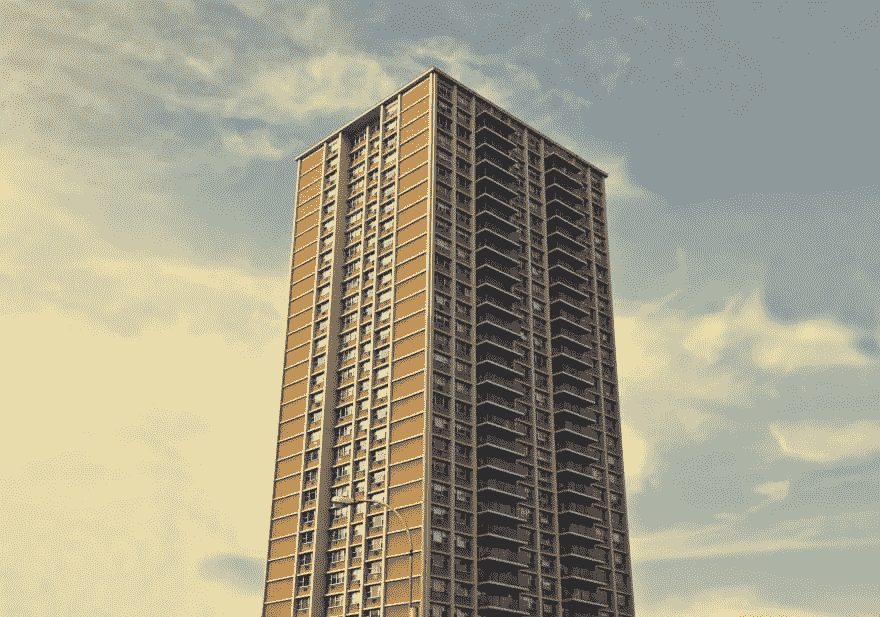
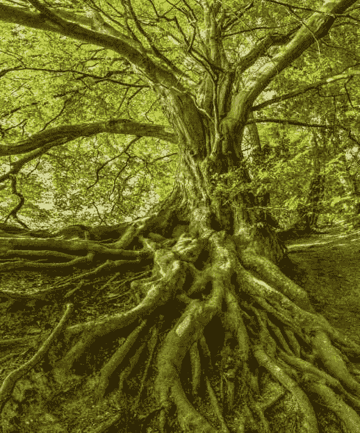

# 设计应用程序，如树，而不是建筑

> 原文：<https://betterprogramming.pub/design-applications-like-trees-not-buildings-45e5337db663>

## 换个角度思考

在 [Unsplash](https://unsplash.com?utm_source=medium&utm_medium=referral) 上 [veeterzy](https://unsplash.com/@veeterzy?utm_source=medium&utm_medium=referral) 拍摄的照片

随着技术和软件开发工具的发展，我们现在已经有了成熟的模式、架构和模型，可以用来构建我们的应用程序。比如分层架构，SOLID 原则等开发原则，设计模式。

然而，从我的经验来看，构建软件仍然有许多传统的方面违背了开发的本质和我们在编程时试图做的对现实的抽象。

在这篇文章中，我想分享一个关于如何以不同的方式思考我们构建应用程序和应用软件架构的个人观点。

# 1.模块和组件的一致性

建筑的外部和内部都保留着一种模式。在一栋公寓楼里，有两三种风格的公寓，它们在每个细节上都保持相似，以尊重买家和业主的利益。几乎没有什么地方有明显的不同，墙壁、柱子和基础的刚性使得将来很难做出重大的改变。

应用程序中的模块和组件是非常动态的，并且由于良好的用户体验实践，应用程序会适应用户像树一样与应用程序交互的行为和流动性。

树的枝和根相似，但不相同。它们完全相等的意图在本质上是不可预料的。外观取决于环境、遇到的障碍、天气和开发过程中出现的其他变量，正如应用程序在其分析和实现周期中应该表现的那样。

# 2.适应性

大自然的奇妙之处在于，尽管有障碍，它也不会停止，它可以适应、调整、反思并寻找解决挑战的最佳方式。

树木就是一个明显的例子。随着它们的生长，为了生存，它们可以根据气候改变根、枝的位置，甚至叶子的生长方式。

即使在构建软件的过程中投入时间进行分析、需求收集和规划，我们也可以发现非常大的挑战和技术上的突然变化，这应该使我们重新思考我们的道路，这应该是很自然的事情，应该在开发过程中以及我们的应用程序的架构中流动。

我们必须能够使用抽象元素来改变组件或连接到新的服务，这些抽象元素允许我们在不显著影响我们的架构的情况下转换项目。

# 3.容错和容错

这一部分与已经投入生产的应用程序相关，即使它们仍处于开发阶段。

如果我们分析一棵几年的成年树，我们可以看到，它的多根多枝使它能够忍受气候的突然变化或任何扰乱其四肢的现象。我们甚至可以从树上砍下树枝，它会继续站立，吸收养分，利用其他树枝完成它的功能。

有许多架构和实践允许我们在应用程序中实现树的这种行为。比如微服务架构。通过实现这种架构，我们可以将我们的应用程序划分为相互独立的小组件，这些组件实现特定的功能。我们的应用程序可以在一些模块不再工作的严重问题中幸存下来，并且仍然可供用户执行其他操作。

我们的应用程序所需要的高可用性必须受到树木为任何自然事件做准备的方式的启发。

# 4.进化和持续改进

建筑有设计、规划和施工阶段。在这些阶段之后，可以在一般水平上进行的改变是最小的。

我们不能更换一层楼或增加另一层楼，也不能把大楼搬到另一个地方。虽然，有新的建筑技术允许改变，在这一点上，建筑物被组装成碎片而不是建造它们。我指的是至今仍被广泛使用的传统建筑。

另一方面，树永远不会停止生长！无论是在它们的枝头还是在它们的根部。虽然在高龄时，一棵树长得很小，但它从未停止生长或适应环境。一棵树也可以被移植(即使这是一个困难的过程，因为它的年龄)，它可以适应它的新环境。这与应用程序向云的迁移、新服务的使用或者我们将应用程序从一个云迁移到另一个云有关。这个过程会很困难，但并非不可能。

没有现代应用程序会中断它的发展，它总是需要改变、更新和改进，所以我们必须在我们的架构中考虑这种将成为未来发展阶段的一部分的现象。

# 结论

我们可以利用树木的许多其他方面来更好地考虑我们的应用程序的设计，例如当发生山体滑坡时，树根允许它们附着在地面上的方式，或者它们每年生成新树皮的方式(我们可以利用这些来更新我们的库和框架，并保持我们的项目更新)。

有了这样的思考，我只想让我们以一种更自然、更有机的方式来思考我们应用程序的设计和架构，这样，需求和我们使用的技术之间的和谐就能让我们构建出最佳的解决方案。