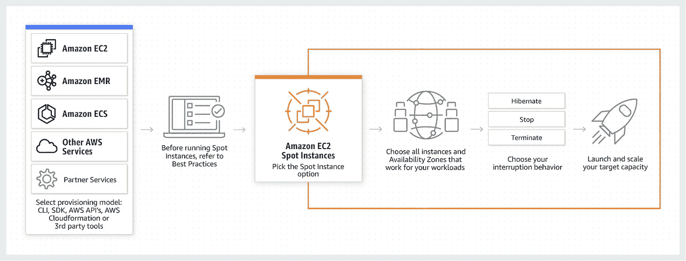
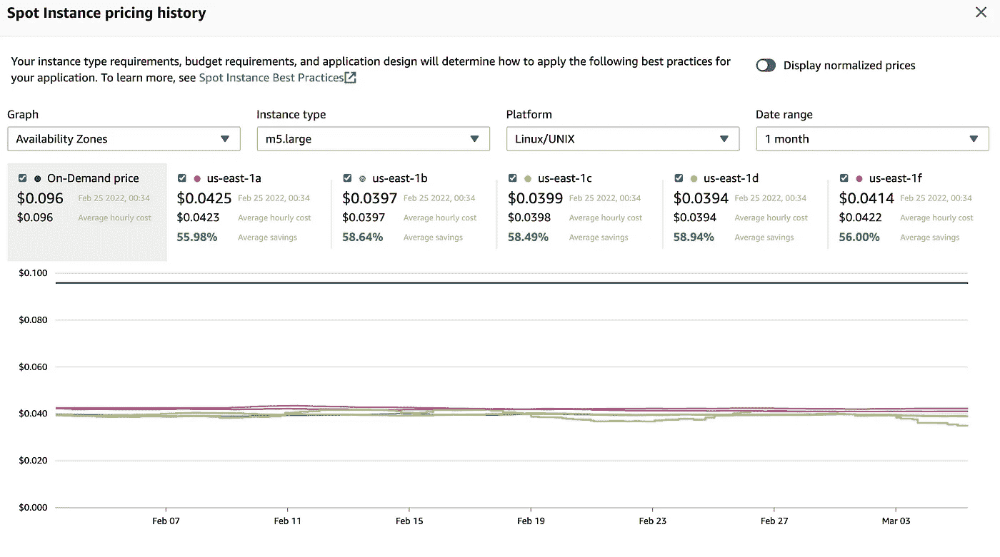
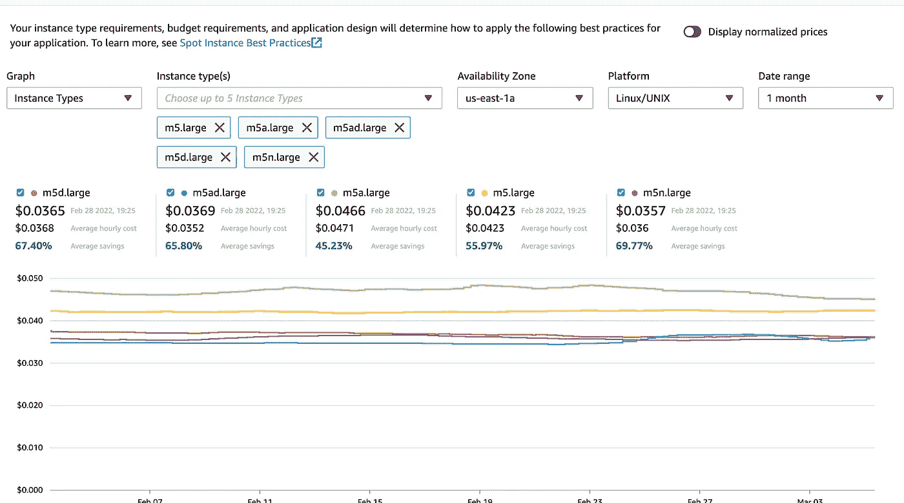
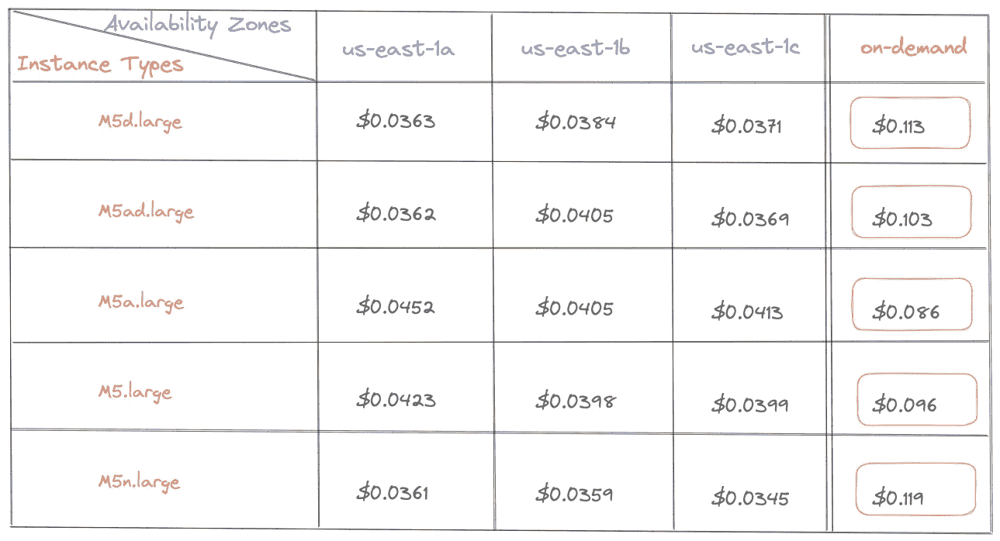
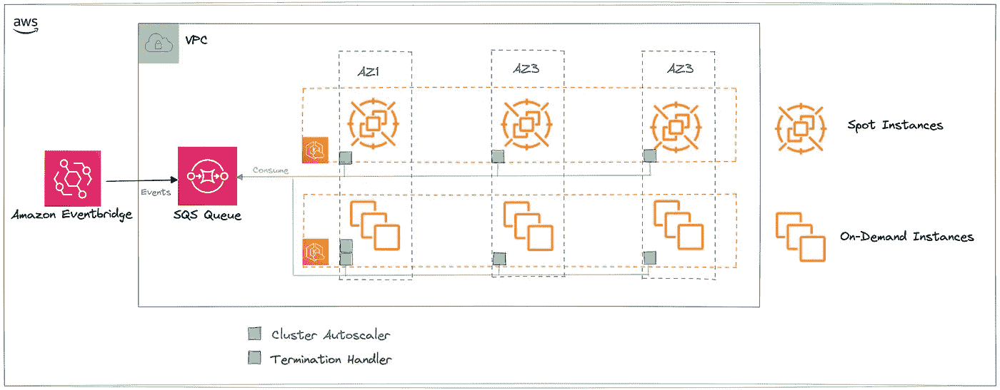

# 如何使用 EC2 Spot 实例设计 AWS EKS 集群

> 原文：<https://betterprogramming.pub/design-aws-eks-with-ec2-spot-instances-c9a0f814bc00>

## 节省高达 90%的计算成本，同时确保零停机时间

马库斯·斯皮斯克在 [Unsplash](https://unsplash.com?utm_source=medium&utm_medium=referral) 上的照片

**亚马逊弹性 Kubernetes 服务( *EKS* )是在 AWS 云上运行 Kubernetes 的托管服务。托管解决方案为每个 EKS 集群运行一个单租户 Kubernetes 控制计划。一旦 EKS 集群启动并准备就绪，您需要提供亚马逊弹性计算云(EC2)工人或 AWS Fargate 来运行您的应用程序。**

**EC2 服务为您提供可扩展的计算能力。您可以租用虚拟机命名实例来运行您的应用程序。该服务为您提供不同的实例类型和支付方式。**

**选择最佳定价模式对您的成本有直接影响。您的所有计算工作负载并没有相同的限制。玩弄承诺以获得更大的弹性，你可以每月节省很多钱。**

**大多数时候，人们只为他们的 EKS 集群使用按需实例。如果您也是这种情况，您可能会错过不使用 EC2 Spot 实例的巨大节省(高达 90%的节省)。**

**阅读本文，您将通过**了解如何将 EKS 与 EC2 Spot 实例一起使用

*   **全面了解 4 种 EC2 定价模式，选择最适合您的模式。**
*   **了解在您的计算策略中何时使用 Spot 实例。**
*   了解 Spot 实例如何最大化您的投资并最小化它们的缺点。
*   **使用 **EC2 Spot 实例**设计您的 EKS 集群**。

# 4 种 EC2 定价模式

来自[https://en.wikipedia.org/](https://en.wikipedia.org/)的亚马逊弹性计算云(EC2)

## 1-按需实例

您需要为每小时或每秒的计算能力付费(仅适用于 Linux 实例)。你不需要预付款。您可以根据需要增加或减少计算能力。您只需为您使用的实例付费。这种模式适合开发**短期**或**不可预测工作负载**的应用。

> 选择按需实例，无需预付费用或长期承诺。

## 2-保留的实例

与按需实例相比，保留实例可为您提供高达 75%的折扣。您将受益于特定可用性区域中的容量预留。**使用可预测性**确保计算容量在需要时可用。

> 为可预测的使用选择保留实例。您可以承诺 1 年或 3 年的期限，以降低您的总计算成本。

## 3 台专用主机

专用主机是专用于运行实例的物理 EC2 服务器。您可以使用现有的服务器绑定软件(例如 Windows Server)来降低成本。使用这种定价模式可以帮助您达到**合规要求**。您需要为主机在帐户中活动的每个小时支付点播价格。

> 如果您有软件许可证并且有合规性要求，请选择专用主机

## 4 点实例

EC2 Spot 实例是 AWS 云中**未使用的 EC2 容量**。与按需购买的价格相比，它们的折扣高达 90%。实例的**现货价格根据**供求**波动**。作为按需实例，你按小时或秒付费。现场实例上没有**承诺**，并且 **AWS 可以请求终止实例**。AWS 云中的计算是这样重新分配的。

> 为大规模动态工作负载的紧急计算选择 Spot 实例。

# 何时使用 EC2 Spot 实例？

来自 https://aws.amazon.com/[的亚马逊 EC2 现货实例](https://aws.amazon.com/)

你可以使用 Spot 实例以**折扣价**购买额外的计算能力。它是按需实例的一个很好的补充。它们比按需 EC2 定价更便宜。

> 由于潜在的服务中断，Spot 实例不应该处理所有的工作负载。

Spot 实例是以下情况的理想选择:

*   **批处理任务**涉及在短时间内处理大量数据。报告生成、文档生成或视频编码等任务就是很好的例子。他们大部分时间都是无国籍的。
*   **持续集成(CI) &持续交付(CD)** :您可以扩展在您喜欢的 CI/CD 工具(Gitlab、Jenkins 等)上运行的任务..).工作运行在不规则的时间表上，并且是短暂的。对于这种用法，使用按需实例的开销很大。
*   **高性能计算:**对于需要大量内存和密集计算能力的工作负载，您可以使用 Spot 实例。人工智能和 ML 驱动的应用程序是贪婪和昂贵的。Spot 实例是它们的最佳选择。
*   **大数据分析**:您可以使用 Spot 实例进行密集处理，以分析大型数据集，从而提取洞察力。Spot 实例的可扩展性和成本提供了一个很好的解决方案。
*   **渲染工作负载**:你可以用 Spot 实例渲染廉价的工作负载。

> Spot 实例是自动化、大规模和非常易于使用的理想选择。

**警告**:你不应该将 Spot 实例用于不能容忍错误和不灵活的工作负载。这是为了避免将它们用于数据库、缓存和队列。对于无状态工作负载，首选 Spot 实例。

由于时间和中断的原因，管理 Spot 实例往往是具有挑战性的。只要你能**处理中断**和**减轻风险**，你就可以继续前进。

这里，我们将使用 Spot 实例来呈现廉价的工作负载。

# EC2 Spot 实例是如何工作的？

“Spot 实例如何工作？”来自[https://aws.amazon.com/ec2/spot/](https://aws.amazon.com/ec2/spot/)

您必须创建一个 **Spot 实例请求**来启动实例。

该请求包括您愿意为每个实例支付的最高价格。如果不指定，最高价格将是按需价格。您可以添加其他约束，如实例类型和可用性区域。

AWS **验证您的请求**并在 **2 条件**下启动您的 Spot 实例:

*   你的最高价低于现货价。
*   可用容量取决于可用性区域上的实例类型。

> 验证后，您将被收取现货实例的当前价格，而不是您设置的最高价格。

亚马逊 EC2 根据长期供应和现货需求调整现货价格。现货市场一直在波动。你可以根据报价和需求把它比作股票市场。

您的 Spot 实例会一直运行，直到您停止或终止它，或者直到 Amazon EC2 中断它。**亚马逊 EC2 可以中断**你的 Spot 实例**当**:

*   现场实例要求上升。
*   现货供应减少。
*   现货价格超过你的最高价格。

亚马逊 EC2 在实例终止前 2 分钟给你发送**现货实例中断通知。因此，您可以预见到中断。**

我们将了解如何使用 Terraform 构建一个具有弹性且经济高效的 EKS 集群。

# 使用 EC2 Spot 实例设计 EKS 集群

## 多样化你的现货实例

多样化您的 Spot 实例是一个必须具备的最佳实践。您可以从多个点池中选择资源调配容量。由于现货市场一直在波动，它可能会出现池短缺。您可以确保缩放和定点实例替换。

现货容量池在可用性区域之间是不同的:

可用性区域的现货实例定价历史记录

根据实例类型的不同，价格也会有所不同:

不同实例的现货实例定价历史记录

Spot 容量被分成由实例类型、可用性区域和 AWS 区域确定的池:

具有实例类型/可用性区域的 AWS 现货池的定价矩阵

> **现场容量池=(可用区域)x(实例类型)= 3 x 5= 15**

上图给出了 15 个容量池。

> **使用尽可能多的可用性区域和实例类型来增加稳定性和弹性**

## EKS 集群架构

具有 Spot 实例的 EKS 集群体系结构的体系结构图

以下 EKS 架构分布在 **3 个可用区域**。工作负载分为 **2 个节点组**:

*   1 个节点组运行具有多种实例类型的 Spot 实例，以确保弹性。
*   1 个运行按需实例的节点组，用于运行关键集群组件、有状态应用程序，并确保为现场实例提供备份解决方案。
*   每个 EKS 工作者运行一个[节点终止处理器控制器](https://github.com/aws/aws-node-termination-handler)
*   [集群自动缩放器](https://github.com/kubernetes/autoscaler)部署在按需实例上

## 节点终端处理器控制器

> “该项目确保 Kubernetes 控制平面对可能导致您的 EC2 实例变得不可用的事件做出适当的响应，例如 [EC2 维护事件](https://docs.aws.amazon.com/AWSEC2/latest/UserGuide/monitoring-instances-status-check_sched.html)、 [EC2 现场中断](https://docs.aws.amazon.com/AWSEC2/latest/UserGuide/spot-interruptions.html)、 [ASG 扩大](https://docs.aws.amazon.com/autoscaling/ec2/userguide/AutoScalingGroupLifecycle.html#as-lifecycle-scale-in)、 [ASG AZ 重新平衡](https://docs.aws.amazon.com/autoscaling/ec2/userguide/auto-scaling-benefits.html#AutoScalingBehavior.InstanceUsage)，以及通过 API 或控制台终止 EC2 实例。如果处理不当，您的应用程序代码可能无法正常停止，需要更长时间来恢复完全可用性，或者意外地将工作安排到正在关闭的节点上。”来自[https://github.com/aws/aws-node-termination-handler](https://github.com/aws/aws-node-termination-handler)

 [## GitHub—AWS/AWS-node-termination-handler:优雅地处理 EC2 实例关闭…

### 在 Kubernetes 内部妥善处理 EC2 实例关闭每月召开一次第 n 次社区会议…

github.com](https://github.com/aws/aws-node-termination-handler) 

Amazon Eventbridge 收集 EC2 事件，包括**点实例中断**，并将其推送到 SQS 队列。节点终止处理程序使用该队列并管理工作负载以确保弹性:

*   确定两分钟内将被中断的 Spot 实例。
*   使用两分钟的通知窗口让节点做好终止准备。
*   污染节点并封锁它以防止新的豆荚被部署在上面。
*   运行舱上的排水连接。

## 聚类自动缩放器

> 来自 https://github.com/kubernetes/autoscaler[的](https://github.com/kubernetes/autoscaler)[“集群自动缩放器](https://github.com/kubernetes/autoscaler/tree/master/cluster-autoscaler)——一个自动调整 Kubernetes 集群大小的组件，这样所有的集群都有一个运行的地方，并且没有不需要的节点”

 [## GitHub—Kubernetes/auto scaler:Kubernetes 的自动缩放组件

### 这个库包含 Kubernetes 的自动缩放相关组件。集群自动缩放—一个组件…

github.com](https://github.com/kubernetes/autoscaler) 

Cluster-Autoscaler 的作用是扩大/缩小集群，以确保灵活性。它还将管理未来终止的 Spot 实例的替换。

# 结论

现在，您对不同的 EC2 定价模型有了更好的理解。根据你的承诺和工作量，你知道哪一个是最好的。我们深入研究何时使用 Spot 实例，并了解它们是如何工作的。这使得理解主要的不便成为可能:没有承诺和干扰。

希望由于通知，Spot 实例中断是可以预料的。此外，您将看到如何使实例类型多样化，并尽可能地将它们分布在多个可用性区域中。这增加了您可以从中挑选实例的 Spot 实例池的数量。

处理现场实例中断和多样化是弹性和容错的关键。您最终看到了一个运行 EKS 的架构，它使用了 Spot 实例来优化成本，而不牺牲弹性。

感谢阅读！🙏我希望这篇文章是有帮助的。想了解更多关于 DevOps 的知识？看看下面更多类似的文章吧！⬇️

 [## Getbetterdevops

### Getbetterdevops 是一个 devops 博客，帮助学习现代基础设施和云技术，如 Kubernetes…

getbetterdevops.io](https://getbetterdevops.io)