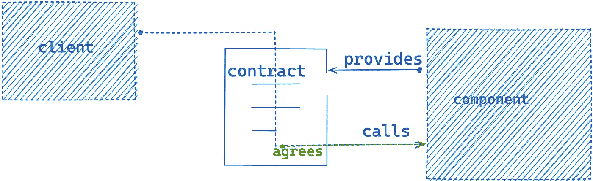
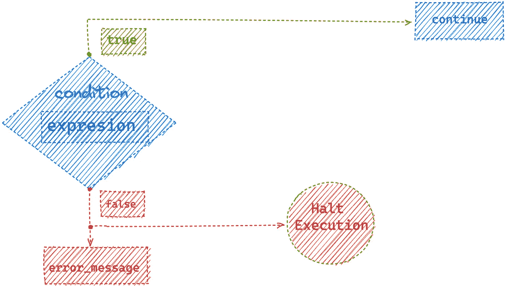
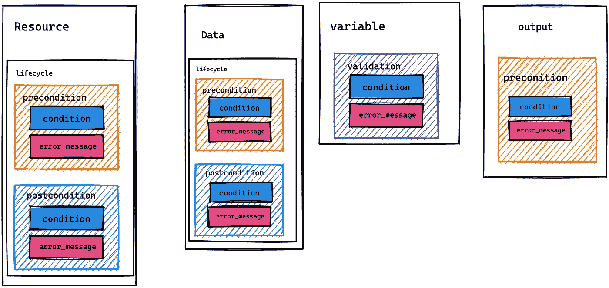
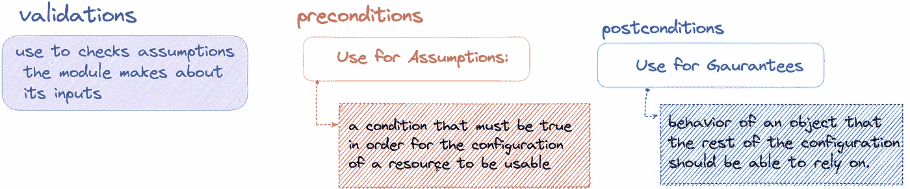
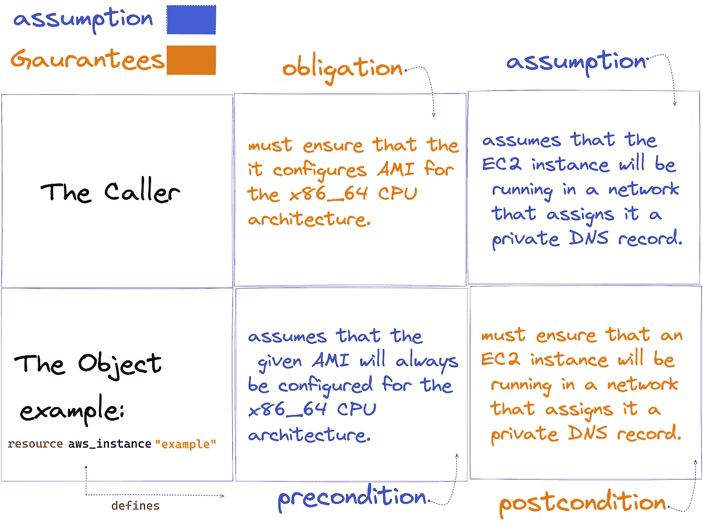
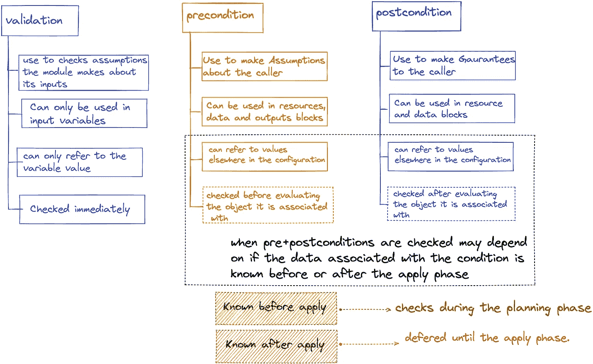

# Terraform 合同设计

> 原文：<https://betterprogramming.pub/design-by-contracts-in-terraform-63467a749c1a>

## 了解自定义条件检查


英国医学专家在 [Unsplash](https://unsplash.com?utm_source=medium&utm_medium=referral) 上拍摄的照片

在本文中，我展示了一个关于自定义条件检查的观点，这是一种用于编写 Terraform 模块的契约式设计方法。

2020 年，Terraform 团队[引入了输入变量的自定义验证规则作为实验特性](https://github.com/hashicorp/terraform/pull/23794)，后来[在 v0.13 中发布了](https://github.com/hashicorp/terraform/pull/25054)作为稳定特性。今年，他们通过在 v1.2.0 版本中引入前置条件和后置条件扩展了自定义验证，它们用于资源、数据源和输出块。

以上两者都引入了一种方法，使得 *Terraform 作者*能够为模块定义一个*精确的*契约，为模块调用方指定义务和保证。

在软件设计中，这被称为契约式设计，这个术语是由 Bertrand Meyer 提出的。它的中心思想是*一个软件系统的元素如何在相互义务和利益的基础上相互协作的隐喻。*

> 一个软件组件为它将要提供的服务提供一个合同，通过使用该组件，客户同意该合同的条款。



这份合同是一份规格清单。规格可能包括:

*   前提条件:在调用一个函数之前，客户端有*义务*满足一个函数所需的前提条件。如果不满足前提条件，则该功能可能无法正常运行。
*   后置条件:函数*保证*在完成工作后满足某些条件。如果不满足后置条件，则该函数没有正确完成其工作
*   *可接受和不可接受的输入值*

表达义务和保证的机制是断言。将断言作为代码的一部分使得契约成为检查正确性的有用工具。考虑以下计算平方根的函数:

```
square_root(x):
  assert x > 0   # precondition
  ...
  /*a computation to get the square root of x as y*/
  ...
  assert y*y == x # postcondition
  return y
```

## 陆地合同

就 Terraform 而言，断言由一个`validation` / `precondition` / `postcondition`块中的`condition`参数表示。`condition`采用一个必须计算为`true` / `false`的表达式。如果断言被违反，Terraform 将返回一个`error_message`并*停止执行*。

```
condition = self.private_dns != ""
error_message = "The instance must be in a VPC that has private DNS hostnames enabled."
```



作为条件的断言，以及当它们被违反时会发生什么

## 其中自定义条件检查出现在各种块类型中



Terraform 中作为嵌套块的自定义验证规则

## 自定义条件检查捕捉假设和保证



注意上面使用了“*假设*一词，而不是“*义务*”。这可能有点令人困惑，所以为了澄清这一点，请考虑以下观点:

资源:

> 资源*必须确保满足后置条件:为其调用者提供保证。*资源*可以对调用者如何使用它做出假设:定义调用者必须满足的先决条件。*

来电者:

> 调用者*必须确保由资源定义的前提条件得到满足，并且可能承担由资源做出的某些保证(后置条件)。*



## 如何使用 Terraform 自定义条件检查的比较



## 参考

```
[1] Bertrand Meyer, in [*Applying “Design by Contract”*](http://se.ethz.ch/~meyer/publications/computer/contract.pdf)(October 1992)*.* IEEE Computer.
[2] Wikipedia Contributors, [Design by contract](https://en.wikipedia.org/wiki/Design_by_contract) (June 2022). Wikipedia.
[3] Martin Reddy, in [API Design for C++](https://www.sciencedirect.com/science/article/pii/B9780123850034000099) (2011). 9.1.2 *Documenting the Interface’s Contract.* 
```

## 想要连接

```
If you think this was helpful and would like to show your support here's my :
[**PayPal page**](http://paypal.me/mfndou)[**Buy me a coffee page**](https://www.buymeacoffee.com/mfundo)[**Ko-fi page**](https://ko-fi.com/mfundo)
```