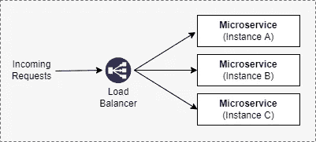
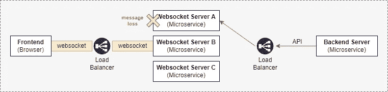
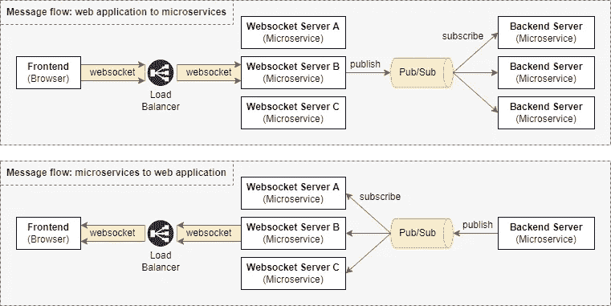
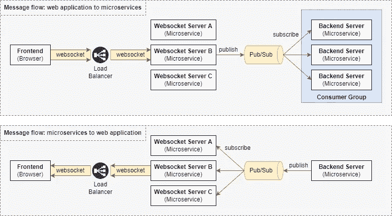
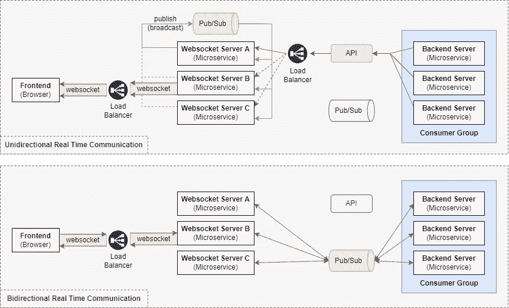

# 使用发布-订阅模式水平扩展 WebSocket 服务器的设计考虑

> 原文：<https://betterprogramming.pub/design-considerations-for-scaling-websocket-server-horizontally-with-a-publish-subscribe-pattern-fe6de9988400>

## 了解扩展 WebSocket 服务器的挑战

凯利·西克玛在 [Unsplash](https://unsplash.com?utm_source=medium&utm_medium=referral) 上的照片

在我的[上一篇文章](https://medium.com/@kbryan1008/building-a-websocket-server-in-a-microservice-architecture-50c6c6432e2b)中，我写了在微服务架构中设计和构建一个 WebSocket 服务器。尽管该实现对于 WebSocket 服务器的单个实例来说工作得很好，但是当我们试图扩大 WebSocket 服务器实例的数量(也称为水平扩展)时，我们将开始面临问题。本文研究了使用发布-订阅消息传递模式扩展 WebSocket 服务器的设计考虑。

# **我的 Websocket** 服务器**系列**

*   01: [在微服务架构中构建 WebSocket 服务器](https://medium.com/@kbryan1008/building-a-websocket-server-in-a-microservice-architecture-50c6c6432e2b)
*   02:使用发布-订阅模式水平扩展 WebSocket 服务器的设计考虑
*   03: [使用 Spring Boot、Redis 发布/订阅和 Redis 流实现可伸缩的 WebSocket 服务器](/implement-a-scalable-websocket-server-with-spring-boot-redis-pub-sub-and-redis-streams-b6b8cc08767f)
*   04:待定

# 什么是水平缩放？

首先，让我们试着理解为什么我们需要水平缩放。随着我们用户群的增长，服务器上的负载也在增长。当负载增加时，单个服务器将无法为所有用户提供高性能。因此，作为我们设计考虑的一部分，有必要提供随时增加/减少服务器数量的能力，以满足用户需求并节省资源。

水平扩展是指在基础设施中添加更多的机器，以应对服务器的高需求。在我们的微服务环境中，水平扩展等同于部署更多的微服务实例。然后需要一个负载平衡器在多个微服务实例之间分配流量，如下所示:

使用负载平衡器进行水平扩展的示例

至此，我希望您能更好地理解为什么我们的基础设施需要水平扩展。因此，让我们继续学习在微服务架构中扩展 WebSocket 服务器的设计考虑。

# 快速回顾

微服务架构中 WebSocket 服务器的高级图

以前，我们使用 Spring Boot、Stomp 和 Redis Pub/Sub 实现了 WebSocket 服务器。web 应用程序(前端)和 WebSocket 服务器之间的通信是通过 WebSocket 进行的，而微服务(后端)和 WebSocket 服务器之间的通信是通过 API 和发布-订阅消息模式进行的。有关更多信息，请参考[上一篇文章](https://medium.com/@kbryan1008/building-a-websocket-server-in-a-microservice-architecture-50c6c6432e2b)。

# 有哪些问题和解决方案？

之前的设计在每个微服务只有一个实例的设置中运行得非常好。但是，在生产环境中拥有单个实例是不实际的。通常，我们将部署带有多个副本(或实例)的微服务，以在生产环境中实现高可用性。因此，当我们试图横向扩展 WebSocket 服务器(微服务)或后端微服务的数量时，我们会注意到以下问题。

## **问题#1:负载均衡器导致的消息丢失**

在我们的上一篇文章中，我们为后端微服务添加了 API，以便向 WebSocket 服务器发送消息，进行单向实时通信。如下所示，当扩展 WebSocket 服务器的数量时，负载平衡器有助于处理流量重定向。

通过 API 从微服务(后端)向 web 应用程序(前端)发送消息时出现问题

在上面的设置中，web 应用程序的一个实例(前端)建立到 WebSocket 服务器的 WebSocket 连接(实例 B)。当后端服务器试图向 web 应用程序发送消息时，负载平衡器将 API 请求重定向到 WebSocket 服务器(实例 A)。因为 WebSocket 服务器(实例 A)没有到 web 应用程序的特定实例的 WebSocket 连接，所以消息将会丢失。

## **问题#1 的解决方案:使用发布/订阅广播消息**

负载均衡器导致消息丢失的解决方案

***注:*** *这个解决方案很大程度上受到了*[在我们之前的文章中，我们使用 Redis Pub/Sub 来处理 WebSocket 服务器(微服务)和后端微服务之间的双向实时通信。当我们增加 WebSocket 服务器和后端微服务的数量时，您会注意到 Redis Pub/Sub 的所有订户都会收到如下所示的消息。](https://medium.com/u/a0e9fafab843#2:由于多个后端订阅者对一个主题进行重复的消息处理</strong></h2>
</h2>
</h2>
</h2>
</h2>
</h2>
</h2>
</h2>
</h2>
</h2>
</h2>
</h2>
</h2>
</h2>
</h2><p id=)

