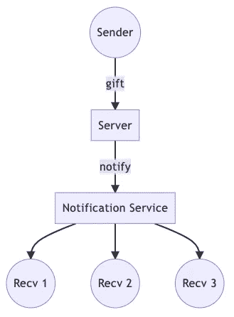
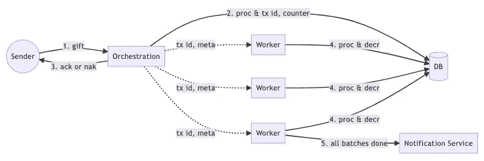
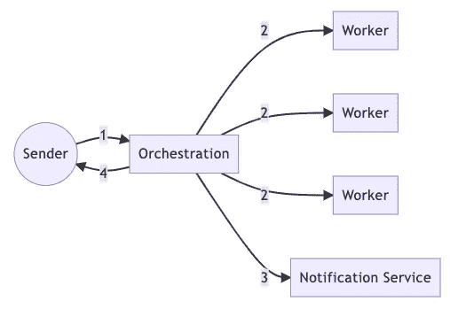
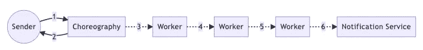
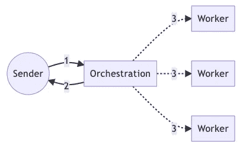

# 用实例设计分布式事务

> 原文：<https://betterprogramming.pub/design-distributed-transaction-with-practical-examples-7b1d93fddb63>

## 设计评审实际上是什么样子

约翰·施诺布里奇在 [Unsplash](https://unsplash.com?utm_source=medium&utm_medium=referral) 上的照片

上次，我们已经讨论过，[如何像专家](/how-to-prepare-a-design-review-like-an-expert-85d2ab85d7f5)一样准备设计评审。应该准备三样东西:

*   C4 模型
*   用户故事和用例
*   设计决策

在这篇文章中，我将用一个实际的例子向你展示什么是设计评审。一些有太多细节的讨论将被跳过，只展示关键的设计。

# 用户故事

首先，我们要定义用户故事。就像前一篇文章提到的，用户故事与 C4 模型中的上下文观点一致。因此，我们清楚地写下用户故事。

这次我们要做的是送礼物的功能。并且，整个故事如下。

*   用户可以决定一次给别人多少同样的礼物。
*   只要用户有足够的钱，那么送礼的人数是没有限制的。
*   在完成赠送礼物后，它必须通知发送者和接收者一切都已完成。

# 用例

整个送礼场景在用户故事中描述的很清楚，但是，还有一些细节描述的不够充分。举个例子，

*   如果用户余额不够，那么所有的礼物都会失效，无法部分成功。
*   送礼物完毕表示所有的接收者都收到了礼物。
*   通知的内容必须包含发送者、礼品总额和所有接收者。
*   不管给多少人，整个过程都要在几分钟内完成。

正如我们在上面看到的，在用例中，我们添加了故事中没有的细节，更详细地呈现了整个场景。

# C4 模型

现在，我们可以画出整个设计的 C4 模型。

# 语境

内外关系图

基于用户故事，我们绘制了一个上下文来描述用户和系统之间的交互。从上下文中，我们知道有几个关键点必须充分讨论。

1.  包含`gift`的行
2.  `Server`本身的行为
3.  包含`notify`的行

你可能会问`notification service`和`receivers`怎么样。答案很简单。那是第三方服务，我们无法控制它的行为。所以在一篇设计评论里，关于送礼的话题，没必要讨论。当然，如果对通知有任何担心，我们可以举行另一次设计审查来深入了解。

# 容器

一旦我们有了上下文，我们就开始深入上面列出的三点，并以容器的形式展开它们。

集装箱图

最后我们得到了这个图表，这是它完成后的样子。这里有很多设计决策，但是在这一节，我只介绍这个图的意义。至于设计决策，我们将在后面的章节中深入分析。

1.  用户发送礼物请求，包括送什么和送谁。
2.  收到请求后，`Server`首先从用户钱包中扣款，如果余额不够直接回复`nak`，然后将请求分成固定大小的批次，并将批次信息写入数据库。之后，批处理任务被发送到 worker，与事务的序列号异步执行。
3.  虽然流程没有完成，但是准备工作已经做好了，回复用户`ack`表示整个流程在进行中。
4.  当 worker 接收到命令时，它关注分配给它的批处理任务，当它完成时，它从数据库中扣除`counter`。如果工作人员遇到任何错误，只需重试任务本身。
5.  当发现`counter`扣除计数器后为 0，表示所有人都完成了任务，那么最后一个工人会通知所有接收者。

# 组件和代码

从容器的角度来看，接下来的步骤是组件和代码，但这些已经涉及到一些实现细节，每个系统面临的问题也不一样，这里就不赘述了。

# 设计决策

我们在集装箱图中发现了许多细节。正如我在上一篇文章中所做的，我们将使用`why do A instead of B`公式来问很多问题。

1.  为什么发送方和服务器以半异步的方式(介于同步和异步之间)相互通信？
2.  为什么将服务器分为编排和工作器？
3.  为什么编排和工人是完全异步的？
4.  为什么工人要通知接收者？
5.  也许你可以考虑一些我从未列出的问题。

这些问题都要从最初的架构说起。

一开始，我们已经有了送礼物给一个人的特征。因此，最简单的方法是执行一个 for 循环，通过一对一的礼物发送所有接收者，而不管接收者的号码。

当只有几个接收器时，这没问题，但是一旦接收器的数量开始增加，性能将是一个严重的挑战。在我们的测算中，投递一个人大概需要`100-200 ms`的时间，不包括通知，也就是说当人数达到`10`的时候，就会达到秒量级。这显然是不能接受的。

看来批处理是不可避免的，于是有人拟定了第一个架构图。

第一次尝试

从图表中，我们可以发现编排已经出现。但是，与工作人员的通信仍然是同步的，只有当所有任务都完成时，才会发送通知。在所有任务完成之前，它不会回复用户。这似乎大大减少了性能瓶颈，但它根本没有变得更好。

让我们做一个简单的数学计算。假设我们要给 1000 个人发礼物，我们怎么设置批量和工人数量？

为了在几秒钟内完成它，最大批量是`10`，所以需要同时生成`100`工人来处理一个礼物请求。这对系统来说是一个非常严格的挑战，要在一瞬间产生`100`工人并不是一件容易的事情。因此，很难让用户以完全同步的方式等待。那么，完全异步时会发生什么呢？

第二次尝试

在第二次尝试中，我们将编排改为编排，这样用户可以在很短的时间内得到响应，礼物也可以顺利发送。但是，真的是这样吗？

如果中工失败了会怎么样？整个链条断了，用户可能感觉不到，没有通知。是可以的，但是对于给予者来说，中间成功工作者已经扣了用户的钱，只是通知没有发出。此外，回到用例的第一点，不允许部分成功。

编排相比编排确实会有更好的性能和更好的可伸缩性，但是会得到更复杂的工作流控制。因此，在这个用例中，编排会更合适。

因此，让我们通过编排来实现完全异步。

第三次尝试

这种架构立即遇到两个问题。

1.  谁应该发送通知？
2.  中途钱不够了怎么办？

发送通知的问题得到了很好的解决，因为在 C4 模型中的前一个容器视图中，实际上已经解决了向谁发送通知的问题。然而，在完全异步架构的中途处理错误基本上是不可能的。

由于这个原因，我们最终采用了半异步的方法。一是编排决定余额是否够发，为了避免飙车状况，直接扣钱。因此，工作人员只需要处理发送礼物，而不需要从送礼者那里扣除钱，甚至不需要检查余额。

# 错误处理和灾难恢复

在这样的架构下，有一个巨大的麻烦。

> *工人失败了怎么办？*

如果这是由于数据库拥塞造成的，重试几次后应该就没事了。否则，如果实现中出现故障，即使重试多次也无法解决。

因此，需要一个额外的监控系统来定期检查哪些异步任务已经失败，并重试那些可以重试的任务，或者如果通过重试无法恢复，则通知人工干预。[适用的解决方案](/implement-event-driven-architecture-with-minimal-effort-182c3bbe5524)在我之前的一篇文章里已经介绍过了，这里就不做过多解释了。

# 结论

总而言之，这个系统把送礼分成几个步骤。

1.  用户同步发送请求，余额提前扣除。
2.  所有送礼物的过程都是异步进行的。
3.  送礼的过程最终可以一致，扣的钱等于发的钱。

在本文中，我们将通过一个实例来讨论设计分布式系统时所面临的挑战。

*   同步与异步
*   编排与编排
*   原子一致性与最终一致性

事实上，这些项目也是典型分布式事务中的权衡。这些方面会显著影响整个分布式事务模型。我在之前的文章的[中介绍了分布式事务。下一次，我将仔细研究设计分布式系统时面临的挑战和问题。](https://medium.com/interviewnoodle/distributed-transaction-introduction-1cd105c830a2)