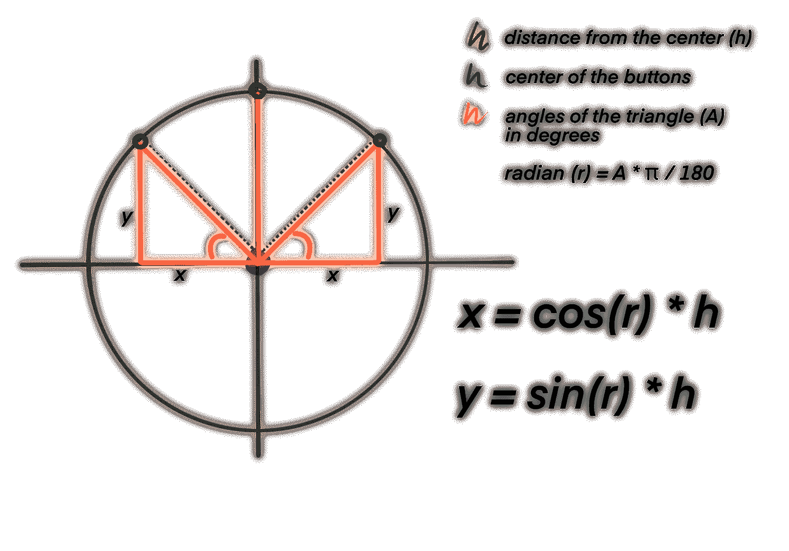
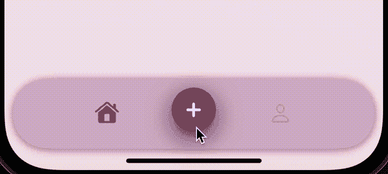

# 使用 Swift 5 在 iOS 中为你的 UITabBar 设计类似 Dribbble 的浮动按钮

> 原文：<https://betterprogramming.pub/design-dribbble-like-floating-buttons-for-your-uitabbar-for-ios-using-swift-5-8bf5eb71f79a>

## 在 iOS 上为 UITabBar 创建漂亮的 UIs 第 3 部分


嘿嘿嘿！看起来有人已经完成了本教程的最后一部分！恭喜你，你成功通过了所有的数学障碍和编码挑战！

我希望之前的数学课没有杀了你，因为，你猜怎么着？教程的最后一部分将会有更多的数学内容！别担心，这次我不会太深入细节。但还是数学。糟透了。所以无论如何都要准备好，这只是最后一次努力！

是不是打算先查查之前的教程？点击这里观看[第一部](https://medium.com/p/f9d2d5450909)和[第二部](/how-to-create-a-nice-uitabbar-for-your-ios-app-using-swift-5-pt-2-9285466846c8)！

# 步骤 6:创建浮动按钮

让我们从定义按钮名称、图标和序列开始。我将使用虚拟名称和图标:

```
var **index** = Int()
var **optionButtons**: [UIButton] = []
var **options** = [
   option(name: "A", image: UIImage(systemName: "a") ?? UIImage(), segue: "a"),
   option(name: "B", image: UIImage(systemName: "a") ?? UIImage(), segue: "b"),
   option(name: "C", image: UIImage(systemName: "a") ?? UIImage(), segue: "c")
]struct **option** {
   var name = String()
   var image = UIImage()
   var segue = String()
}
```

我们将需要一个函数来完成以下任务:

*   创建具有指定外观的按钮；
*   指定按钮的约束；
*   创建时执行动画。

为此，我创建了函数`createButton(size:)`，它看起来像这样:

使用`CGAffineTransform`，我将创建一个小的“pop”动画，将按钮缩放到 1.1，然后快速返回到 1，这样它会变大，然后缩小到原始大小。我还将按钮图像视图的色调设置为在动画过程中清除，以确保只有当按钮在视图中时图像才可见。

在我们调用这个函数并实际创建按钮之前，我们需要确保一旦它们在视图中，用户只能禁用它们或者选择其中一个。跳过这一步会导致按钮滞留，即使用户决定移动到不同的视图控制器。

为了避免这种情况，我将简单地创建一个屏幕大小的透明背景按钮，并将其放在选项按钮的后面。稍后我们会给它一个动作来触发中间的按钮并禁用三个选项按钮。这样，即使当按钮在视图中时，用户试图选择其他东西，按钮也会先消失。

该函数将如下所示:

现在最好的部分是:将我们的三个按钮添加到视图中，并设置它们的约束！谁准备好再上几节数学课了？

> 无聊的部分…

今天的课是关于三角学的！对于那些已经有所了解的人，我建议你直接跳到下一部分。如果你不知道我在说什么，我会试着让它变得简单。



基本上，在一个直角三角形中，你可以计算你的三角形的边长，只要你至少有:
-一个角的度数(在我们的例子中，我用黄色突出显示的那个)，
-和三条边中的一条边的大小(在我们的例子中，蓝色虚线)。
从图中可以看出，这个逻辑可以应用到我们中间按钮周围的一个看不见的圆圈上，通过用图中的公式计算 x 和 y 值来定义三个按钮(绿色)的位置。

我们确实粗略地知道这些按钮应该离我们中间的按钮有多远；这将是我们的蓝色虚线(h)的大小。我们还知道，我们希望它与中间按钮的水平中心成 45 度角(黄色)。那已经是很多信息了！然而，没有办法告诉我们的 Swift 函数:我们需要在 x 和 y 轴上设置一个距离来放置按钮。为了让它们到达我们的绿点，我们需要进行以下计算:

*   首先，我们需要将度数乘以π /180 来转换成弧度，如下:`45 * .pi/180`
*   其次，我们将需要把这个值放在`cos()`或`sin()`中，然后乘以我们的斜边，也就是我们设置的按钮到中间按钮的距离。

使用图中的公式作为指导。

> …最酷的部分！

从理论到代码，这是我们的公式:

现在，在运行项目之前，您所要做的就是返回到您的`buttonHandler(sender:)`函数，并取消对第 24 行的限制:

```
self.setUpButtons(count: self.options.count, center: self.middleButton, radius: 80)
```

点击“运行”,见证奇迹！



显然，您可以将按钮的图像设置得更好。或者随便挑一个。他们还是会比三 A 好看。

但是等等，不要这么快！我们仍然没有定义移除按钮的公式。他们将如何离去？如果你现在一直按这个按钮，它只会在你每按一次的时候增加越来越多的按钮。幸运的是，在添加我们的按钮(包括背景按钮)时，我们将每个按钮都添加到一个按钮数组中，这样我们就可以通过一个简单的函数快速访问和删除它们，用户每隔一秒钟点击中央按钮，我们就可以调用这个函数:

现在运行您的项目，并…见证奇迹！


你应该为能走到这一步而自豪。你经历了数学，几何，三角学，所有这些来设计这个 2 秒钟的动画。用户永远不会知道你经历了什么，但我知道。干得好！

你喜欢这个教程吗？它和你的项目合作得好吗？

```
**Want to Connect?**Follow me on…
❤️ [YouTube](https://www.youtube.com/channel/UC5hqYiHxie458KSO1PAnA8Q)
💖 [Dribbble](https://dribbble.com/margelss)
💜 [Instagram](https://www.instagram.com/itsmargels/)
💙 [Ko-Fi](https://ko-fi.com/margelss)
🖤 [GitHub](https://github.com/Margels)
```