# 服务设计；不是微服务

> 原文：<https://betterprogramming.pub/design-for-services-not-microservices-e339883946d7>

## 开始一个新项目，思考微服务架构？有现存的独石吗？请继续阅读架构策略

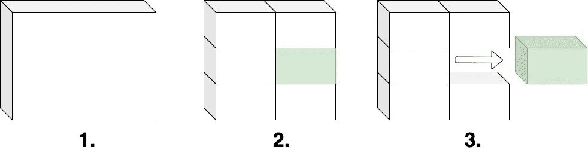

作者图片

如果您正在启动一个新项目并考虑微服务架构，或者您已经有了一个整体架构，希望将其分解为不同的服务，那么请继续阅读，寻找一种策略，使您能够在需要时采用该架构。

构建微服务很流行，而且已经流行了几年了。

一方面，它让人们重新关注内聚力和松散耦合。另一方面，它带来了很多复杂性，尤其是如果您想要一个健壮的企业解决方案。

# 需要微服务吗？

几十年来，在广泛的项目中，我不得不致力于分布式计算*问题*。

这是我喜欢的东西，微服务是几年前一些计算模式的更现代的旋转，但这些天有了更好的工具:-)

如果你用微服务开始一个新项目，但没有明确的需求在单独的实例中运行你的服务，你可能会在应用程序“基础设施”上花费比结果更大的努力。

但是有一个更好的起点。

# 首先构建服务，而不是微服务

在这个上下文中，我所说的“服务”是什么意思？

嗯，它是一组内聚的代码或功能(也就是说，它的职责只集中在一个领域)，与代码库的其余部分是松散耦合的。

你会发现这就像一个微服务。

然而，这里的不同之处在于，我们没有指定该服务在专用的执行环境中运行。相反，该服务在应用程序的实例中运行。

在这种情况下，您不会遇到跨执行边界的可观察性或进行远程调用时的延迟(和重试)等问题。

从这个意义上说，服务是应用程序中的一个组件。

# 设计模式来帮助

如果您已经正确定义了您的服务，一些设计模式将使您能够从基于组件的服务模型过渡到微服务模型，而无需进行大量的重新编码工作。

这些是[工厂方法](https://en.wikipedia.org/wiki/Factory_method_pattern)和[代理](https://en.wikipedia.org/wiki/Proxy_pattern)设计模式。

让我们用一个简单的服务作为例子:a `mail service`。

`MailService`是一项封装发送电子邮件领域的技术服务。

这个例子很简单，但是概念同样适用于任何服务类型，包括封装业务域的服务类型。

我们的服务有一个单一的`send`方法。

假设您有一个现有的 monolith 应用程序，并将`MailService`部署为微服务。在这种情况下，它可能如下所示，应用程序逻辑通过 HTTPS 调用新服务。

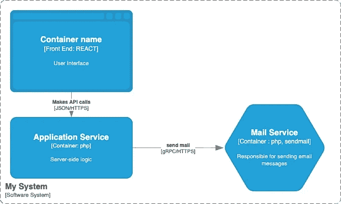

一个简单的“微服务”沿着一个整体运行

或者，如果我们将`Mail Service`部署为在您的主应用程序代码中运行的组件，它可能如下所示:

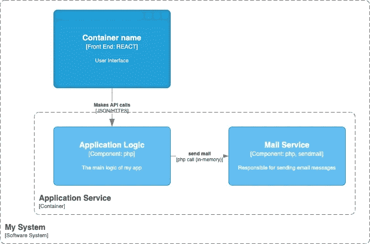

与 monolith 的执行上下文中的组件相同的服务。

注意:根据你使用的编程语言，你仍然可以独立开发你的服务，然后使用一个依赖管理器(比如 NPM，Composer 等。)在构建过程中获取所需的服务版本。

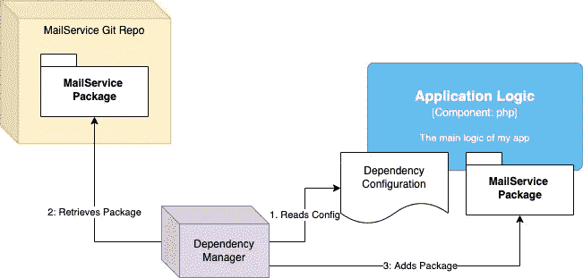

使用依赖项管理器来保持服务代码的独立性，但允许组装到最终产品中。具有版本控制的依赖管理器将使您能够创建一个模块化的整体，具有微服务所具有的一些相同的开发生命周期独立性。

# 创建服务工厂

首先，邮件服务可能是一个简单的类。

```
**class** MailService {

    **public function** send(**string** $recipient, **string** $title, **string** $message) : **bool** {
        *// to do* **return false**;
    }
}
```

但是，我们需要定义一个*抽象类*或*接口*来采用服务工厂。

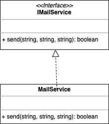

将服务的公共接口提取到一个*接口或抽象类中。*

可能是这样的:

```
**interface** IMailService {
    **public function** send(**string** $recipient, **string** $title, **string** $message) : **bool**;
}

**class** MailService **implements** IMailService {

    **public function** send(**string** $recipient, **string** $title, **string** $message) : **bool** {
        *// to do* **return false**;
    }
}
```

服务工厂是一个新类，您的代码现在调用它来获取服务的实例。

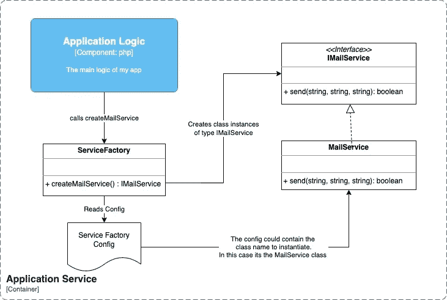

1.  您的应用程序调用服务工厂，为其提供一个邮件服务实例。
2.  `Service Factory`可以读取一个配置文件来查看要实例化什么类。它可以是任何类，只要它实现了 IMailService 接口。
3.  `Service Factory`实例化该类，将其返回到您的应用程序。
4.  然后你的应用程序在实例化的类上调用`send`。

这个序列看起来像是调用一个类的函数的大量代码。的确如此。

稍后，我将向您展示这如何帮助您实施微服务战略。但是首先，让我们看看这对您的测试有什么帮助。

# 改进的测试

使用一个*接口*和一种间接的方法来实例化类，您可以通过提供一个*模拟*邮件服务来改进单元测试。

模拟服务将模拟邮件服务，支持测试您的代码处理对 send 方法的成功和不成功(别忘了，慢)调用。

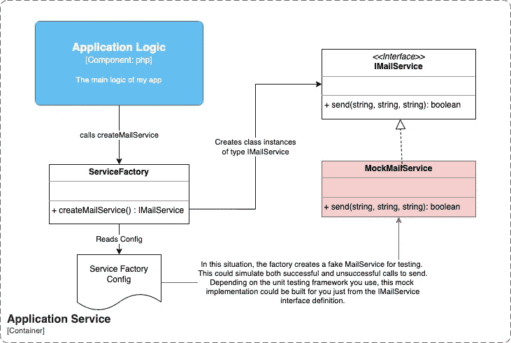

服务对象的间接创建有助于创建用于测试的模拟服务对象。

注意:根据您使用的编程语言和单元测试框架，从接口创建一个 mock 可能很简单。

# 将服务发展为微服务(如果需要的话)

在这个阶段，您将所有的电子邮件发送逻辑都放在一个服务中，并有一个测试它的机制。

我们将引入*代理模式*，使您能够将这项服务发展成为微服务。

`Proxy`是另一个实现服务接口的类。

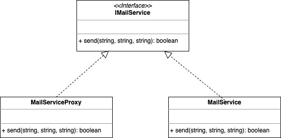

代理公开相同的服务接口。通过代码调用它，它将看起来与实际的邮件服务一样。

```
**interface** IMailService {
    **public function** send(**string** $recipient, **string** $title, **string** $message) : **bool**;
}

**class** MailServiceProxy **implements** IMailService {

    **public function** send(**string** $recipient, **string** $title, **string** $message) : **bool** {
        *// to do: Call the MailService microservice* **return false**;
    }
}
```

然而，这个新类不是发送电子邮件，而是调用邮件服务，该服务运行在一个单独的容器中，具有 HTTPS API 接口。换句话说，这个新类是实际服务类的*代理*。

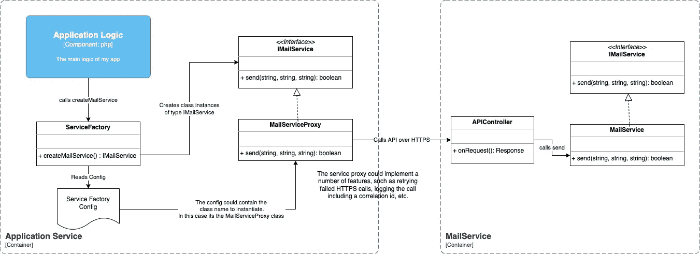

服务代理运行在 monolith 的执行环境中，并调用运行在单独的执行环境中的实际服务。没有对 monolith 进行代码更改；只有对依赖程序集和服务工厂配置的更改。

上图中的主应用程序代码没有任何变化，除了实例化代理而不是服务类的服务工厂配置。

注意:依赖管理器对您的代码的打包可以被更新以交付代理代码而不是实际的服务代码。所有这些都使您的应用程序保持最小的变化。

# 微服务支持

您的代理类可以变得更加智能，而不仅仅是调用远程服务。

例如，它可以处理网络调用超时、执行日志记录和跟踪，以及处理远程服务的身份验证。

# 发展微服务

直接调用远程邮件服务可能不是最实际的，我们可以在分离服务方面做得更好。

在下图中，异步消息队列取代了同步 HTTPS 调用。

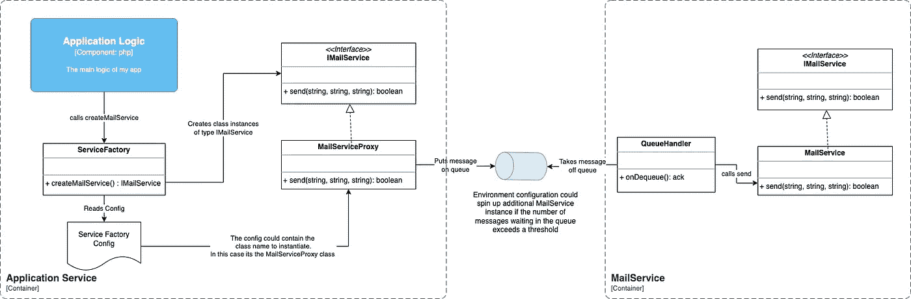

服务的通信机制可以在不重新编码的情况下改变。

重要提示:要更改架构以支持与服务的异步通信，不需要对主要应用程序代码进行编码更改。

代理封装了与远程服务通信的所有逻辑。

处理主应用程序逻辑的开发人员将代理作为本地类调用。

如果你想用商业服务来代替它，你可以。新版本的服务代理可以调用远程邮件产品，而无需对您的主应用程序逻辑重新编码。

或者，你可能已经开发了许多微服务，并决定采用一个网格，比如 DAPR 提供的网格。

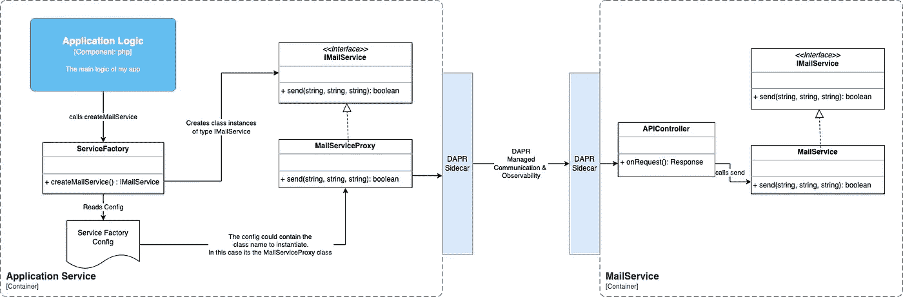

该策略还支持在适当的时候引入[服务网格](https://www.infoq.com/articles/service-mesh-ultimate-guide-2021/)。

# 分解整块石头

本文概述的解决方案中，服务作为进程内组件运行，这是交付一个[](https://youtu.be/5OjqD-ow8GE)*模块化整体的绝佳方式。*

*巨石柱并不邪恶。它们是许多解决方案的良好模式。*

*当它们是一个[](https://en.wikipedia.org/wiki/Big_ball_of_mud)*的大泥球，没有考虑到一致性、信息隐藏和封装以及松散耦合时，它们就会失败。**

**本文概述的方法将帮助您创建一个模块化的整体，提供开发和架构灵活性，以便在需要时将一些服务转变为微服务。**

# **改进大球泥块**

**如果您有一个现有的急需重构的 monolith，您可以使用这些技术来帮助控制它。**

**例如，如果您正在调用函数从代码内的几个地方发送电子邮件，为什么不首先将所有的电子邮件发送逻辑放入一个`MailService`；-)**

# **总结**

**希望您已经了解了这个简单的示例，并且现在已经有了从可以扩展到微服务的模块化整体开始的策略。**

**或者，如果你已经有一个整体，你有一个战略来模块化和发展它。**

# **更进一步**

**在大多数编程语言中，您可以创建工厂方法和代理设计模式，而不需要任何特定的框架。**

**如果你想更进一步，看看[依赖注入模式](https://martinfowler.com/articles/injection.html)。**

**框架广泛使用这种模式来实现“幕后”服务工厂。如果您正在使用一个框架，在它的文档中搜索依赖注入，看看它是否能让您用更少的代码获得与本文相同的结果。**

**请记住，您希望使它尽可能可配置，在您的代码之外，就像服务工厂有一个配置文件来找出要实例化的类一样。**

**一个 [CI/CD 管道](https://en.wikipedia.org/wiki/CI/CD)可以向不同的环境交付不同的配置。另外，配置技术提供了一个简单的 [*特性切换*](https://www.martinfowler.com/articles/feature-toggles.html) 机制，用于快速部署(和退出)新特性。**

**然而，一些框架依赖于代码注释之类的技术，这些技术将配置硬编码在您的源代码中，这不是一个好主意。**

**框架可能导致问题的另一个例子是，如果你现有的整体框架不支持它。理想情况下，您希望创建与框架无关的工厂或依赖注入，这样它就可以与您现有的 monolith 和您的新服务一起工作。**