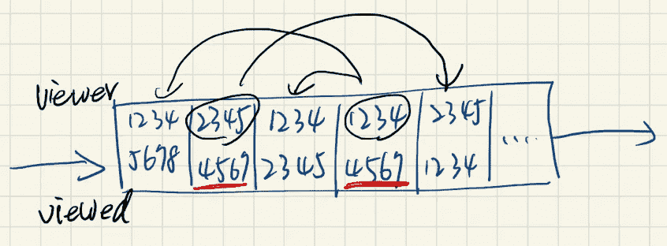
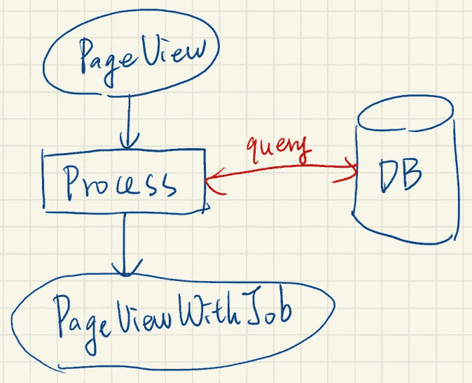
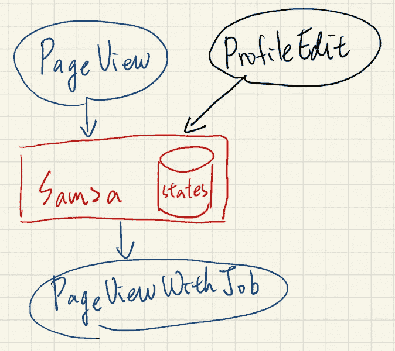

# 流式浓缩的设计模式

> 原文：<https://betterprogramming.pub/design-pattern-of-streaming-enrichment-17a9eb065eca>

## 理解流式架构的概念


若昂·布兰科在 [Unsplash](https://unsplash.com/photos/1_2d3MRbI9c) 上的照片

上次，我们[介绍了流式处理](https://lazypro.medium.com/stream-processing-introduction-796f15061880)。为了能够用更纯粹的基础设施处理批量和实时数据，我们引入了 Kafka 和流框架。

在本文中，我们将介绍一个通用的流设计模式，丰富，并检查流框架能带来什么好处。

什么是充实？简而言之，它是扩展原始事件以满足新功能需求的实现。

# 功能描述

许多社交媒体平台上都有类似的功能。

1.  谁来看我
2.  其他人也在观看
3.  以什么身份来看待我

第一个特征是在给定的时间段内有多少人查看了我的个人资料。例如，我的个人资料在一周内被浏览了多少次。

第二个功能是前一个功能的高级版本，这些人还查看了谁？例如，一周内有 10 个人查看了我的个人资料，他们也查看了埃隆·马斯克。

第三个特征是第一个特征的衍生物。这些看我的人是什么身份？例如，一周内有 10 个人浏览了我的个人资料，其中 3 人是谷歌员工。

# 谁来看我&其他人也在看

使用事件流技术可以容易地实现第一和第二特征。首先，让我们定义一个“视图”事件。

```
{
    eventType: "PageView",
    timestamp: 1660270009,
    viewerId: 1234,
    viewedId: 5678
}
```

此事件包括发生时间和谁查看了谁。然后我们只需要创建一个收集所有视图事件的流来分析我们需要的特性。



在上图中，假设我的用户 id 是 4567，那么很容易从事件流中找到两个查看过我的用户，分别是 2345 和 1234。

进一步从流记录我们也可以了解到 2345 查看过 1234，而 1234 查看过 5678 和 2345。

综合这些信息，我们可以回答。

1.  谁来看我？2345 和 1234。
2.  其他人也在查看 1234、5678 和 2345。

有了流框架记录的所有事件流，我们可以执行简单的分析来获得所需的特性。

# 以什么身份来看待我？

然而，要知道以什么身份查看我的个人资料并不是那么简单。

因为我们的原始事件没有定义额外的属性，只有 id。嗯，有必要修改原来的实现来添加新的功能。

# 在事件中添加元数据

让我们将作业添加到原始事件中。当用户正在查看时，除了发送带有 id 的事件之外，还必须附加作业。

```
{
    eventType: "PageView",
    timestamp: 1660270009,
    viewerId: 1234,
    viewedId: 5678,
    viewerJob: "Google"
}
```

问题看似解决了，但真的是这样吗？

这种解决方案有几个明显的问题。首先，修改事件格式会直接影响所有下游消费者。在事件驱动的架构下，生产者不知道消费者的用例，因为两者是分离的。

其次，事件变大，无论消费者是否需要，每个原有的事件都必须加入这个新的领域。换句话说，开销变大了，不仅仅是存储开销，传输开销也变大了。

此外，如果我们想添加新功能，该怎么办？除了工作之外，特性还需要新的头衔、年龄等等。那么上面提到的问题就会一而再再而三的发生。

因此，我们知道这不是一个好方法。

# 来自外部数据存储的查询

因为修改原始事件不是一个好方法，所以我们一收到事件就会从其他地方查询所需的数据。



虽然在图中表述为数据库，但也可以是微服务或任何能提供信息的平台。

基本上，这是事件驱动架构最典型的实现。当工作人员从消息队列中获取事件时，他们处理数据，要么从其他数据源获取必要的信息，要么将结果存储在数据存储中，最后将丰富的事件发送到下一个数据源。

这种实现在消息队列架构中很好。然而，在流框架中，这样的实现产生了性能瓶颈。假设一个流框架的平均吞吐量是一个数据库的十倍以上。如果每个事件都必须依赖外部数据源，那么总吞吐量将变成`1/10`。

此外，这种架构还存在一个问题。

当一个工作集群或流处理集群崩溃时，这是很有可能发生的，毕竟错误无处不在。此时，事件将继续累积，因为没有消费者能够处理它们。这还是正常情况。

一旦 worker 集群被修复并且所有 worker 都在线，所有 worker 将开始全速消化消息，一个峰值将到达数据源并很可能关闭它。

自身故障会以级联方式影响其他服务。在系统设计中应避免这种紧密耦合。因此，这样的解决方案不够好。

# 合并事件

没有新的元数据进入事件并且不能从外部源查询，那么如何处理丰富？这是提供优势的流框架。



在这个例子中，我们选择了 Apache Samza 作为说明，但实际上还有许多很好的替代方案，比如 Apache Flink。

除了将前面提到的处理程序更改为流处理框架之外，还有一个新的事件源`ProfileEdit`。

这个修改事件可以来自数据库的变更数据捕获(CDC ),也可以来自用户服务，但是细节不是本文的重点。

上一节中的数据库成为流处理框架中的状态。这个状态可以被认为是每个工作者的内存空间，因此非常有效。此外，每个工作者共享状态，因此容量比单个实例的内存大得多。

当 Samza 接收到`ProfileEdit`时，可以保存每个用户的最新状态。一旦收到`PageView`,它就可以从保存的状态中提取所需的信息，并组装新的事件。

这种方法解决了紧耦合的问题，并显著提高了处理性能。更重要的是，Samza 提供了恰好一次的保证，以避免由于外部数据源故障而导致事件重复。

尽管状态由多个实例共享，但仍有可能达到上限。如何解决可扩展性问题？

在 Kafka 中，提供了一种消息分区机制，具有相同键的消息被分配到相同的分区，并由相同的消费者组处理。在流框架中，划分机制仍然存在，并且已经被抽象到更高的级别。不同的流可以共享同一个密钥空间，也就是说，只要`PageView`和`ProfileEdit`拥有相同的密钥，它们就可以被相同的工作者处理。

这样，状态可以通过水平可伸缩性来存储。

# 结论

在本文中，我们介绍了一种常见的设计模式，传统的消息队列体系结构和现代的流处理体系结构都遇到了同样的问题，即事件丰富。

设计系统时，除了功能实现之外，还要考虑系统的健壮性和性能，这一点很重要。这就是为什么流框架正在兴起。流提供了处理实时大流量的可能性，而流框架另外提供了各种有用的工具来简化开发。

正如[之前关于流架构的文章](https://lazypro.medium.com/stream-processing-introduction-796f15061880)中提到的，流架构有能力将许多技术栈折叠成两个核心组件:Kafka 和流处理框架。因此，我建议每一个开发人员，即使你不是数据工程师，也应该了解一下流框架。我相信有更多的洞察力会导致更可靠的系统设计。