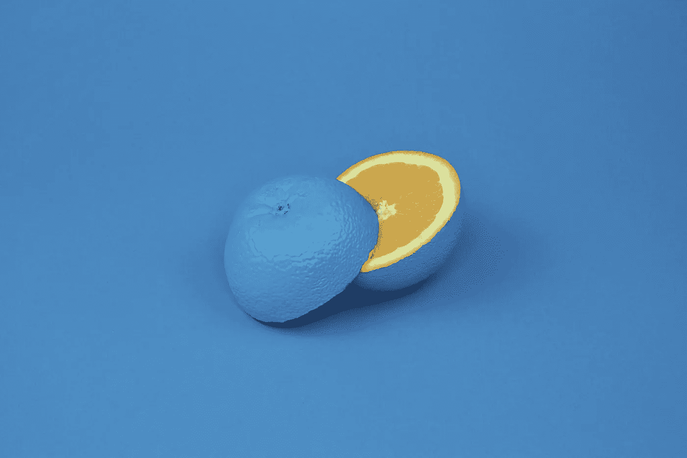
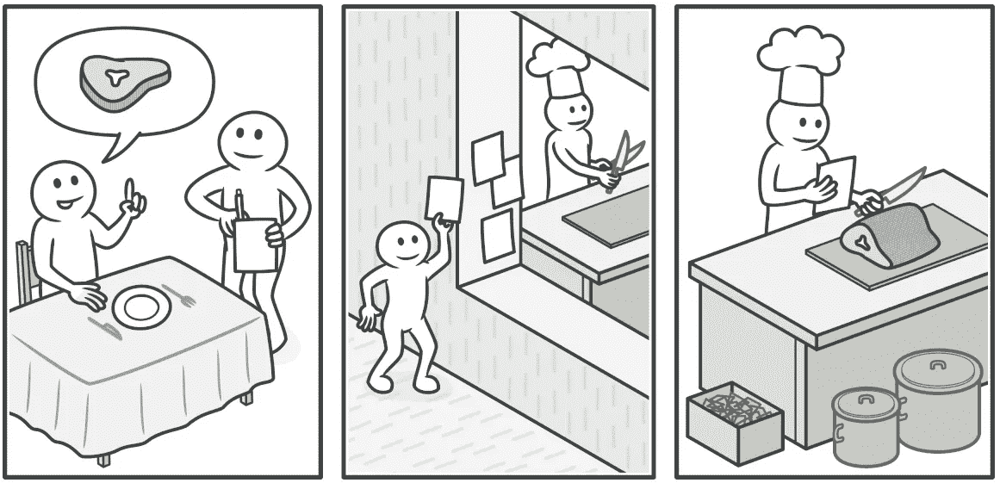
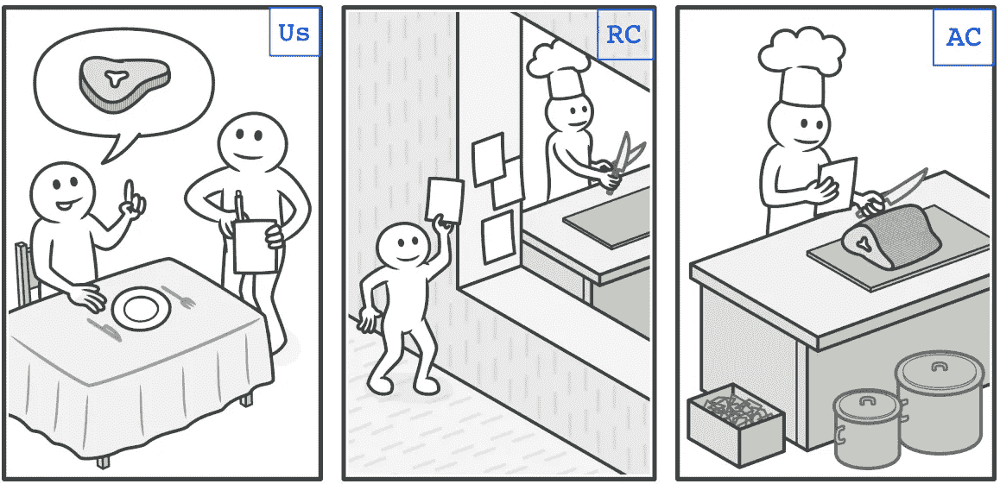

# 设计模式完全指南

> 原文：<https://betterprogramming.pub/design-patterns-a-complete-guide-b2699315961f>

## 用简单的例子解释设计模式


因陀罗·乌塔马在 [Unsplash](https://unsplash.com?utm_source=medium&utm_medium=referral) 上拍摄的照片

# 1-策略模式

> **“策略模式**定义了一族算法，封装了每一个，并使它们 ***可互换*** 。策略让算法从使用它们的客户端独立地变化

**

*[方钻杆](https://unsplash.com/@kellysikkema?utm_source=unsplash&utm_medium=referral&utm_content=creditCopyText)在 [Unsplash](https://unsplash.com/photos/qWwpHwip31M?utm_source=unsplash&utm_medium=referral&utm_content=creditCopyText) 上拍照*

*除了形式上的定义，**策略模式**在你需要 ***切换*** 你的算法或者策略在你代码的不同地方的时候被广泛使用。*

***简单的例子:***

*假设您构建了一个游戏，它有一个实现了 **Diet** 类的 **Cat** 类。但是，假设你的猫体重增加太多，现在它需要节食来帮助它减肥以保持健康。*

*在这种情况下，你可以实现**一个策略模式**，比如:*

```
*interface EatBehavior {
    public void eat();
}*
```

**实现进食行为的饮食类型**

```
*public class NormalDiet implements EatBehavior {
    @Override
    public void eat() {
        // normal food
    }
}public class LosingWeightDiet implements EatBehavior {
    @Override
    public void eat() {
        // healthy food
    }
}*
```

**猫类认为* ***有-个*** *吃行为**

```
*public abstract class Cat { EatBehavior eatBehavior; public Cat(){}

    public void eat() {
        eatBehavior.eat();
    }
}*
```

*客户端代码应该是这样的:*

```
*cat.eat();            // Cat eats as usual.cat.setEatBehavior(new LosingWeightDiet());cat.eat();            // Cat eats with a healthier diet.*
```

***策略模式**也可以帮助你为不同的子类型分配**不同的行为**。*

*假设你有一只 spyhnx 猫(一种没有任何皮毛的猫)和一只虎斑猫(或任何其他有皮毛的猫)。*

*您可以轻松地更新您的类，如下所示:*

```
*interface EatBehavior {
    public void eat();
}
interface DisplayBehavior {
    public void display();
}*
```

**实现显示行为的毛发类型**

```
*public class HasFur implements DisplayBehavior {
    @Override
    public void display() {
        // display with fur
    }
}public class NoFur implements DisplayBehavior {
    @Override
    public void display() {
        // display without fur
    }
}*
```

**一只猫类即* ***是——一只*** *猫类和* ***有——一只*** *吃和显示行为**

```
*public class Sphynx extends Cat { EatBehavior eatBehavior;
    DisplayBehavior displayBehavior; public Sphynx() {
        eatBehavior = normalDiet();
        **displayBehavior = noFur();**
    } public void eat() {
        eatBehavior.eat();
    } public void display() {
        displayBehavior.display();
    }
}*
```

**另一个猫类即* ***是——一个*** *的猫类与* ***有——一个*** *的进食行为与一个* ***不同*** *的展示行为**

```
*public class Tabby extends Cat {

    EatBehavior eatBehavior;
    DisplayBehavior displayBehavior; public Tabby() {
        eatBehavior = normalDiet();
        **displayBehavior = hasFur();**
    } public void eat() {
        eatBehavior.eat();
    } public void display() {
        displayBehavior.display();
    }
}*
```

*客户端代码应该是这样的:*

```
*Cat spyhnx = new Spyhnx();
sphynx.display(); // displays cat without furCat tabby = new Tabby();
tabby.display();  // displays cat with fur*
```

*如上所见，它还可以帮助你将****类中的*** 类分开。**

**如果有一天你想为你的游戏从 tabby 中移除毛发，你可以只改变在 Tabby 类中设置 displayBehavior 的方式，而不需要通知客户端这个改变。**

**每个阶级只会关心自己的。(单一责任原则)**

****

**[方钻杆](https://unsplash.com/@karberg?utm_source=unsplash&utm_medium=referral&utm_content=creditCopyText)在 [Unsplash](https://unsplash.com/s/photos/two-cats?utm_source=unsplash&utm_medium=referral&utm_content=creditCopyText) 上拍照**

****现实生活中的例子:****

**假设您正在编写一个显示天气预报的软件，但是您希望将用户信息存储在一个数据库中，将天气信息存储在另一个数据库中。**

***实现数据库策略的不同数据库类型***

```
**public class PostgreStrategy implements DatabaseStrategy {
    @Override
    public void save() {
        // save to PostgreSQL
    }
}public class CouchbaseStrategy implements DatabaseStrategy {
    @Override
    public void save() {
        // save to Couchbase
    }
}**
```

**客户代码:**

```
**DatabaseContext db = new DatabaseContext();db.setDatabaseStrategy(new PostgreStrategy());
db.save(userInformation);db.setDatabaseStrategy(new CouchbaseStrategy());
db.save(weatherInformation);**
```

**同样，如果有一天你想改变 PostgreStrategy 或 CouchbaseStrategy 的工作方式，你就不需要接触客户端代码了。**

**简而言之，**策略模式**帮助我们在编写代码时动态*改变组件的工作方式，并且 ***分离*我们的关注点**。***

*****把它当成一个单独的故事来读:** [策略模式—快速指南](http://emretanriverdi.medium.com/design-patterns-strategy-pattern-d57a13c593b7) (3 分钟读完)***

# ***2-装饰图案***

> ***"**装饰模式**动态地给一个对象*附加额外的责任。Decorators 为扩展功能提供了子类化的灵活替代方案。****

********

****克里斯托弗·乔利在 [Unsplash](https://unsplash.com/@chris_jolly?utm_source=unsplash&utm_medium=referral&utm_content=creditCopyText) 上拍摄的照片****

****除了形式定义，**装饰模式**包装了一个**装饰**类的对象，允许你在客户端代码中动态改变对象的行为。****

******简单的例子:******

****假设你拥有一家 ***本地*** ***披萨店*** ，那里有*【随心所欲】*风格的披萨。****

****它的软件有 **Pizza** 超类，子类有**Pizza with 蘑菇、Pizza with 玉米、PizzaWithSalami、Pizza with mushrooms and 玉米、PizzaWithMushroomsAndSalami、PizzaWithCornAndSalami、Pizza with mushrooms and cornandsalami。******

****这不是一个很好的做法，是吗？****

****如果我们想在未来添加一种新的成分呢？如果我们想添加一种新的外壳类型，比如薄皮披萨，该怎么办？如果我们想更新每种成分的价格，该怎么办？如果我们想增加 2 倍的玉米呢？****

****在我们的例子中，这种做法会导致 ***维护的噩梦*** 。****

****我们的目标必须是允许我们的类添加新的行为，而不修改现有的代码。(开闭原理)****

****编写的代码应该是 ***可重用*** 。****

****为了实现这一点，我们可以实现**装饰模式**，例如:****

```
****public interface Pizza {
    String getSummary();
    int getPrice();
}****
```

*****实现 pizza 接口的 Pizza 类*****

```
****public class StandardCrustPizza implements Pizza **private static final String PRICE = 25;**

    @Override
    public String getSummary() {
        return "Standard Pizza (" + PRICE + ")";
    } @Override
    public int getPrice() {
        return PRICE;
    }
}public class ThinCrustPizza implements Pizza { **private static final String PRICE = 30;**   

    @Override
    public String getSummary() {
        return "Thin Crust Pizza (" + PRICE + ")";
    } @Override
    public int getPrice() {
        return PRICE;
    }
}****
```

*****pizza decorator 实现 pizza 接口的抽象类*****

```
****abstract class PizzaDecorator implements Pizza { @Override
    public abstract String getSummary();

    @Override
    public abstract int getPrice();
}****
```

*******披萨配料*** *扩展* ***披萨装饰器抽象类*******

```
****public class Corn extends PizzaDecorator {

    private Pizza pizza;
    **private static final String PRICE = 4;**

    Corn(Pizza pizza) {
        this.pizza = pizza;
    } @Override
    public String getSummary() {
        return pizza.getSummary() +
               ", with corn (" + PRICE + ")";
    } @Override
    public int getPrice() {
        return pizza.getPrice() + PRICE;
    }
}public class Mushrooms extends PizzaDecorator { private Pizza pizza;
    **private static final String PRICE = 6;** Mushrooms(Pizza pizza) {
        this.pizza = pizza;
    } @Override
    public String getSummary() {
        return pizza.getSummary() +
               ", with mushrooms (" + PRICE + ")";
    } @Override
    public int getPrice() {
        return pizza.getPrice() + PRICE;
    }
}public class Salami extends PizzaDecorator {

    private Pizza pizza;
    **private static final String PRICE = 5;** Salami(Pizza pizza) {
        this.pizza = pizza;
    } @Override
    public String getSummary() {
        return pizza.getSummary() +
               ", with salami  (" + PRICE + ")";
    } @Override
    public int getPrice() {
        return pizza.getPrice() + PRICE;
    }
}****
```

****客户端代码应该是这样的:****

```
****Pizza pizza = new StandardPizza(); // standard pizza, base: 25
pizza = new Salami(pizza);         // salami added, total: 30
pizza = new Corn(pizza);           // corn added, total: 34
pizza = new Corn(pizza);           // corn x2 added, total: 38Output:
Standard Pizza (25), with salami (5), with corn (4), with corn (4)
Price: 38Pizza pizza = new ThinCrustPizza(); // thin crust pizza, base: 30
pizza = new Mushroom(pizza);        // mushroom added, total: 36
pizza = new Salami(pizza);          // salami added, total: 41Output:
Thin Crust Pizza (30), with mushroom (6), with salami (5)
Price: 41****
```

****看，这都是非常可重复使用的！如果有一天你想添加一种新的面包皮/配料或者更新现有的价格，你不需要接触客户代码。****

****每个阶级只会关心自己的。(单一责任原则)****

********

****[Karthik](https://unsplash.com/@karthikgarikapati?utm_source=unsplash&utm_medium=referral&utm_content=creditCopyText) 在 [Unsplash](https://unsplash.com/s/photos/pizza?utm_source=unsplash&utm_medium=referral&utm_content=creditCopyText) 上拍照****

******现实生活中的例子:******

******装饰模式**广泛应用于 ***java.io 包、*** 中，如:****

```
****InputStream in = new FileInputStream(file);
in = new BufferedInputStream(in);
in = new DataInputStream(in);****
```

****FileInputStream 是这里的*外壳类型*，BufferedInputStream 和 DataInputStream 是*配料*。****

****你甚至可以通过简单地扩展 *java.io 包*decorator 的超类(FilterInputStream)并将其包装在基类 FileInputStream 周围，来为你的程序编写你自己的 decorator 。****

```
****public class UpperCaseInputStream extends FilterInputStream {
    public UpperCaseInputStream(InputStream in) {
        super(in);
    } @Override
    public int read() throws IOException {
        return Character.*toUpperCase*(super.read());
    }
}****
```

****客户端代码应该是这样的:****

```
****InputStream in = new FileInputStream(file);
in = new UpperCaseInputStream(in);// other decorators****
```

****简而言之，**装饰模式**帮助我们在编写代码时动态地*附加额外的功能到我们的基类。*****

*******把它当成一个故事来读:** [【装饰图案——快速指南】](http://emretanriverdi.medium.com/design-patterns-decorator-pattern-3b50880173e1) (4 分钟阅读)*****

# *****3 观察者模式*****

> *****"**观察者模式**定义了对象之间一对多的依赖关系，这样当一个对象 ***改变*** ***状态*** 时，其所有的依赖对象 ***都会得到通知并自动更新。********

**********

*****照片由[道尔顿·亚伯拉罕](https://unsplash.com/@daltonabraham?utm_source=unsplash&utm_medium=referral&utm_content=creditCopyText)在 [Unsplash](https://unsplash.com/?utm_source=unsplash&utm_medium=referral&utm_content=creditCopyText) 上拍摄*****

*****除了正式的定义，**观察者模式**帮助我们倾听(订阅)一个主题，并且 ***在发生变化时保持最新。********

******主题**对**观察者**到*开放订阅，*不知道(也不关心)它们是如何实现的，反之亦然。****

******简单的例子:******

****假设您正在构建一个社交媒体应用程序，并为多个平台实现它。****

*****一个平台枚举(为了简单起见)*****

```
****public enum Platform {
    *WEB(1)*,
    MOBILE(2);
}****
```

*****具有显示方法的视图界面*****

```
****public interface View {
    void display();
}****
```

*****具有添加/删除观察者和通知观察者方法的主题接口*****

```
****public interface Subject {
    void registerObserver(Observer observer);
    void removeObserver(Observer observer);
    void notifyObservers();
}****
```

*****具有更新方法的观察者接口*****

```
****public interface Observer {
    void update(Double x, Double y);
}****
```

****假设您想在我们的应用程序中显示货币信息。根据输入的数据，您将更新屏幕上的数字。****

*****实现主题接口*中方法的货币类****

```
****public class CurrencyData implements Subject {
    private final List<Observer> observers = new ArrayList<>();
    private Double value;
    private Double interestRate; @Override
    public void registerObserver(Observer observer) {
        observers.add(observer);
    } @Override
    public void removeObserver(Observer observer) {
        observers.remove(observer);
    } @Override
    public void notifyObservers() {
        observers.forEach(observer ->
                **observer.update(value, interestRate)**);
    } public void setValue(Double value) {
        this.value = value;
        **notifyObservers();**
    } public void setInterestRate(Double interestRate) {
        this.interestRate = interestRate;
        **notifyObservers();**
    }// getters}****
```

*****注意****notify observers()****是如何在发生变化时被调用的。*****

****随着应用程序变得越来越大，您可能想要添加新的功能，例如天气信息。****

*****实现主题接口*中方法的天气类****

```
****public class WeatherData implements Subject {
    private final List<Observer> observers = new ArrayList<>();
    private Double temperature;
    private Double humidity; @Override
    public void registerObserver(Observer observer) {
        observers.add(observer);
    } @Override
    public void removeObserver(Observer observer) {
        observers.remove(observer);
    } @Override
    public void notifyObservers() {
        observers.forEach(observer ->
                **observer.update(temperature, humidity)**);
    } public void setTemperature(Double temperature) {
        this.temperature = temperature;
        **notifyObservers();**
    } public void setHumidity(Double humidity) {
        this.humidity = humidity;
        **notifyObservers();**
    }// getters}****
```

*****实现观察者和视图接口*中方法的货币显示类****

```
****public class CurrencyDisplay implements Observer, View {
    private Platform platform;
    private Double value;
    private Double interestRate; public CurrencyDisplay(Platform platform, Subject subject) {
       this.platform = platform;     
       subject.registerObserver(this);
    } public void unsubscribe(Subject subject) {
        subject.removeObserver(this);
    } @Override
    public void update(Double temperature, Double humidity) {
        this.value = temperature;
        this.interestRate = humidity;
        display();
    } @Override
    public void display() {
        // display
    }
}****
```

*****天气显示类，实现观察者和视图接口*中的方法****

```
****public class WeatherDisplay implements Observer, View {
    private Platform platform;    
    private Double temperature;
    private Double humidity; public WeatherDisplay(Platform platform, Subject subject) {
        this.platform = platform;
        subject.registerObserver(this);
    } public void unsubscribe(Subject subject) {
        subject.removeObserver(this);
    } @Override
    public void update(Double temperature, Double humidity) {
        this.temperature = temperature;
        this.humidity = humidity;
        display();
    } @Override
    public void display() {
        // display
    }
}****
```

****让我们来看看它的实际应用:****

```
****CurrencyData currency = new CurrencyData();
WeatherData weather = new WeatherData();CurrencyDisplay webCurrency = new CurrencyDisplay(WEB, currency);
CurrencyDisplay mobileCurrency
                         = new CurrencyDisplay(MOBILE, currency);
// currency information is available for both platformsWeatherDisplay mobileWeather = new WeatherDisplay(MOBILE, weather);
// weather information is available for mobile,
// not available for webdouble temperature = 21.05;
weather.setTemperature(temperature);
// for weather -> only mobile is notifieddouble interestRate = 14.18;
currency.setInterestRate(interestRate);
// for currency -> both web and mobile got notifiedmobileCurrency.unsubscribe(currency);
// for currency -> mobile is not listening anymoreinterestRate = 15.20;
currency.setInterestRate(interestRate);
// for currency -> only web is notified****
```

****在**观察者模式**中，**主体**是一个 ***开卷*** 。**观察者**可以根据需要自由订阅和退订**。******

****如果你想退订，那么简单！既然这个设计是 ***松耦合，*** 你只要调用**退订(subject)** 就搞定了！****

> ****松散耦合的设计允许我们构建灵活的面向对象的系统来处理变化。它们最小化了对象之间的相互依赖。****

********

****照片由[粘土堤](https://unsplash.com/@claybanks?utm_source=unsplash&utm_medium=referral&utm_content=creditCopyText)在 [Unsplash](https://unsplash.com/s/photos/clay-banks-dogecoin?utm_source=unsplash&utm_medium=referral&utm_content=creditCopyText) 上拍摄****

******现实生活中的例子:******

******观察者模式**在 ***javax.swing 包中被广泛使用。*******

****让我们考虑一个服务，它将根据数据的变化更新显示和数据库信息:****

```
****UserData data = new UserData();Display webDisplay = new Display(WEB, data);
Display mobileDisplay = new Display(MOBILE, data);Database postgresql = new Postgresql(data);
Database couchbase = new Couchbase(data);// web display, mobile display, postgresql and couchbase
// all subscribed to user data.****
```

****按钮是这里的**主题**，当点击按钮时，数据发生变化。****

```
****button.addActionListener((ActionListener) 
                ae -> data.setEmail(email));****
```

****当数据发生变化时，所有的观察者都会得到通知并得到更新。****

******把它当成一个故事来读:** [观察者模式—快速指南](http://emretanriverdi.medium.com/observer-pattern-a-quick-guide-38865dc9bae2) (4 分钟阅读)****

# ****4 工厂模式****

> ****"工厂模式有三种类型:**简单、方法和抽象."******

********

****照片由[娜塔莉·库尔](https://unsplash.com/@nataliekuhl?utm_source=unsplash&utm_medium=referral&utm_content=creditCopyText)在 [Unsplash](https://unsplash.com/s/photos/factory?utm_source=unsplash&utm_medium=referral&utm_content=creditCopyText) 上拍摄****

## ****简单工厂****

****假设您有一个 ***本地披萨店*** ，并且您为您获得的每一个订单实例化**一个** **披萨对象**。****

```
****Pizza pizza = new Pizza();****
```

****相反，您可以简单地这样做:****

```
****public class Pizza {
    private Pizza(){}     // hide the constructor, so no one         
                                initializes pizza with "new" public static Pizza create() {
        return new Pizza();
    }
}****
```

****或者这个:****

```
****public class PizzaFactory {
    public static Pizza create() {
        return new Pizza();
    }
}public class Pizza {

   // assuming your models are in the same package, you can
   make this package-private to make sure constructor won't be    
   called from client code
   protected Pizza(){}
}****
```

****客户端代码将如下所示:****

```
****Pizza pizza = Pizza.create();orPizza pizza = PizzaFactory.create();****
```

****如果你想改变这个方法的工作方式(或者可能给它添加一些业务逻辑)，你可以更新 **create** ，而不是把逻辑代码放到构造函数中。****

****别担心，我听到了，你说我们可以用构造函数实现同样的事情。简单工厂基本上是一个有自定义名称的构造函数。****

****这样想吧:****

```
****Person person = new Person(170);toPerson person = Person.fromHeight(170);orPerson person = PersonFactory.fromHeight(170);****
```

****用不用由你决定。我个人很喜欢。****

****然而，有些人甚至不把简单工厂算作一种设计模式。
工厂方法和抽象工厂相反，有点不同。****

****那么让我们来看一下**工厂方法**。****

## ****工厂方法****

****那么…回到订单管理系统。****

****假设你的生意越来越大，你开始卖汉堡。****

****工厂方法通过覆盖一个方法来帮助你在比萨饼和汉堡之间进行选择，但是在一个公共方法中保持不变的部分。****

****让我们首先用实现它的膳食创建一个膳食接口。****

```
****public interface Meal {
    // implementations
}public class Pizza implements Meal {
    // implementations
}public class Burger implements Meal {
    // implementations
}****
```

****让我们用 PizzaFactory 和 BurgerFactory 实现一个更通用的 MealFactory 接口。****

```
****interface MealFactory {
    //factory method
    **Meal** create();        // compulsory inheritance
}public class PizzaFactory implements MealFactory {
    // implementations @Override
    Meal create() {
        return new Pizza();
    }
}public class BurgerFactory implements MealFactory {
    // implementations

    @Override
    Meal create() {
        return new Burger();
    }
}****
```

****这两种比萨饼都根据自己的需要超越**创造**。****

****现在，客户端代码应该是这样的:****

```
****MealFactory pizzaFactory = new PizzaFactory();
Meal pizza = pizzaFactory.create();MealFactory burgerFactory = new BurgerFactory();
Meal burger = burgerFactory.create();****
```

****就是这样！****

****如果两餐都有一个公共的方法，不管它们是什么类型，你可以把 MealFactory 变成抽象类，而不是接口。****

```
****abstract class MealFactory {
    //factory method
    protected abstact **Meal** create();     // compulsory inheritance public void createAndSendOrder() {
        Meal meal = create();
        // do stuff
    }
}public class PizzaFactory extends MealFactory {
    // implementations @Override
    protected Meal create() {
        return new Pizza();
    }
}public class BurgerFactory extends MealFactory {
    // implementations

    @Override
    protected Meal create() {
        return new Burger();
    }
}****
```

****客户端代码应该是这样的:****

```
****MealFactory pizzaFactory = new PizzaFactory();
pizzaFactory.createAndSendOrder();MealFactory burgerFactory = new BurgerFactory();
burgerFactory.createAndSendOrder();****
```

****这很棒，因为我还完全封装了客户端的创建逻辑。****

## ****抽象工厂****

****现在让我们增加比萨饼和汉堡的素食选择。****

****所以会是这样的:****

```
****interface MealFactory {
    **Pizza** createPizza();      // no inheritance needed
    **Burger** createBurger();    // no inheritance needed
}public class VeganMealFactory implements MealFactory { @Override
    public Pizza createPizza() {
        return new VeganPizza();
    } @Override
    public Burger createBurger() {
        return new VeganBurger();
    }
}public class NonVeganMealFactory implements MealFactory { @Override
    public Pizza createPizza() {
        return new NonVeganPizza();
    } @Override
    public Burger createBurger() {
        return new NonVeganBurger();
    }
}****
```

****现在它是工厂中的工厂。****

****在工厂方法中，只有一个方法负责制作比萨饼，而在这里，我们为不同的比萨饼使用不同的方法，所以整个类都要负责。****

****在工厂的方法中，比萨饼和汉堡需要在类型餐，
在这里它不是强制性的。****

****让我们看看客户端代码:****

```
****MealFactory veganMealFactory = new VeganMealFactory();
MealFactory nonVeganMealFactory = new NonVeganMealFactory();Pizza veganPizza = veganMealFactory.createPizza();
Burger veganBurger = veganMealFactory.createBurger();Pizza nonVeganPizza = nonVeganMealFactory.createPizza();
Burger nonVeganBurger = nonVeganMealFactory.createBurger();****
```

****既然 VeganMealFactory 和 NonVeganMealFactory 都属于 PizzaFactory 类型，我们就不能用一个简单的判定器在它们之间做出决定吗？****

****让我们来试试:****

```
****public class MealFactoryDecider { private MealFactoryDecider(){} public static MealFactory decide(MealType mealType) {
        switch (mealType) {
            case *VEGAN*:
                return new VeganMealFactory();
            case *NONVEGAN*:
                return new NonVeganMealFactory();
            default: throw new RuntimeException("Invalid type.");
        }
    }
}****
```

****最终的客户端代码应该是这样的:****

```
****MealFactory veganMealFactory =
MealFactoryDecider.decide(*VEGAN*);MealFactory nonVeganMealFactory = MealFactoryDecider.decide(*NONVEGAN*);Pizza veganPizza = veganMealFactory.createPizza();
Burger veganBurger = veganMealFactory.createBurger();Pizza nonVeganPizza = nonVeganMealFactory.createPizza();
Burger nonVeganBurger = nonVeganMealFactory.createBurger();****
```

****如果你觉得多种模式会很合适，记得结合使用。****

## ****总结****

******简单工厂**依赖于可读性:虽然它可能不被认为是一种设计模式，但它是一种将客户从具体类中分离出来的简单方法。****

****工厂方法依赖于继承:对象创建被委托给实现特定工厂方法来创建对象的子类。****

******抽象工厂**依赖组合:对象创建是在工厂接口中暴露的多个方法中实现的。****

> ****所有工厂模式都通过减少应用程序对具体类的依赖来促进松散耦合。****

******将它作为一个单独的故事来阅读:** [工厂模式—快速指南](https://emretanriverdi.medium.com/factory-pattern-a-quick-guide-cd31eeeefb74) (4 分钟阅读)****

# ****5-单例模式****

> ******“单例模式**确保一个类只有**一个实例**，并提供一个全局访问点。”****

********

****[davisuko](https://unsplash.com/@davisuko?utm_source=unsplash&utm_medium=referral&utm_content=creditCopyText) 在 [Unsplash](https://unsplash.com/s/photos/unique?utm_source=unsplash&utm_medium=referral&utm_content=creditCopyText) 拍摄的照片****

******简单的例子:** 假设你需要一个木匠做一个沙发、椅子和橱柜。如果你叫一个木匠，和他一起做所有的工作，那是最好的。为每件物品找不同的木匠是不明智的。****

******现实生活中的例子:** 和简单的例子很像。假设您需要一个数据库客户机来处理所有的 CRUD 操作。
您不希望有多个数据库客户端，因为这会导致意外行为，如内存问题和数据损坏。****

## ****履行****

```
****public class Singleton {private static Singleton instance;

    private Singleton(){}    // hiding the constructor

    public static Singleton getInstance() {
        if (instance == null) {
            instance = new Singleton();
        }
        return instance;
    }
    // other methods
}****
```

****客户端代码是:****

```
****Singleton singleton = Singleton.getInstance();****
```

****在上面的实现中，逻辑是这样的:
如果对象不存在→创建并返回对象
如果对象存在→返回已经创建的对象****

## ****处理多线程****

****上述代码块的问题是，在多线程应用程序中，如果线程在第一次使用 **getInstance()** 时并发访问同一个****块，则对象可能会被初始化多次。********

********让我们继续讨论可能的解决方案:********

**********1。急切初始化**********

```
********public class Singleton {private static Singleton instance = new Singleton();

    private Singleton(){}    // hiding the constructor

    public static Singleton getInstance() {
       return instance;
    }
    // other methods
}********
```

********使用这种方法，我们将责任交给 JVM，当类被加载时，JVM 初始化我们的 Singleton 实例，因此多线程不是问题。********

********如果你确定在你的应用程序中至少会使用 **getInstance()** 一次，你可以使用这个。********

**********2。锁定初始化**********

```
********public class Singleton {private static Singleton instance;

    private Singleton(){}    // hiding the constructor

    public static **synchronized** Singleton getInstance() {
        if (instance == null) {
            instance = new Singleton();
        }
        return instance;
    }
    // other methods
}********
```

********我们可以使用 **synchronized** 关键字锁定 **getInstance()** ，并强制其他线程等待当前线程退出后再进入该代码块。********

********虽然上面的例子是正确的(并且在大多数例子中使用)，但这是一种不好的做法。我们不需要在每次调用 **getInstance()** 时锁定方法，**我们需要在第一次调用时锁定它。**由于锁定是一个性能开销很大的操作，我们最好不要锁定整个方法。********

```
********public class Singleton {private static **volatile** Singleton instance;

    private Singleton(){}    // hiding the constructor

    public static Singleton getInstance() {
        if (instance == null) {
            **synchronized(Singleton.class) {
                instance = new Singleton();
            }**
        }
        return instance;
    }
    // other methods
}********
```

## ********需要考虑的事项********

********虽然单例模式很棒并且被广泛使用，但它有时被认为是一种反模式，因为它可以帮助我们掩盖糟糕的设计。********

**********1。违反松耦合** 当我们像 **Singleton.getInstance()，** 一样传递单例类时，我们可能没有意识到我们的应用程序的类彼此知道得太多，太紧耦合了。
例如，在我们的应用程序中传递数据库客户端是一种不好的做法。********

**********2。违反单一责任原则** 单一模式既要确保一个类只有一个实例，又要提供一个访问它的访问点，这使得它肩负着两项巨大的责任。********

**********3。单例模式 vs 静态类** 我们可以用上面的 if 检查让单例延迟初始化，静态方法默认是延迟初始化的。
单例允许方法覆盖，静态方法不允许覆盖，但可以通过方法隐藏实现类似的行为。********

**********何时使用静态类:**如果你打算编写诸如数学、数组操作等辅助方法。，使用一个充满静态帮助器方法的类可能更容易。********

**********何时使用 Singleton:** 其余一切。Singleton 类只是一个遵循普通 OOP 原则的普通类。********

**********4。单例模式 vs 依赖注入** 如果你已经在使用一个处理注入的框架，那么仅仅注入类而不是应用单例模式可能是一个更好的实践。********

********我更喜欢先检查它是不是一个 helper 方法，如果是，就创建一个静态类。
如果没有，请检查我们的 DI 可用性。如果是，使用 DI。如果没有，使用 Singleton。********

**********将它作为一个单独的故事来阅读:** [单一模式—快速指南](https://emretanriverdi.medium.com/singleton-pattern-a-quick-guide-2836a3e1696e) (4 分钟阅读)********

# ********6-构建器模式********

> **********“构建器模式**通过允许使用相同的构建代码创建对象的不同表示，帮助我们构建复杂的对象。”********

****************

********照片由 [neonbrand](https://unsplash.com/@neonbrand?utm_source=unsplash&utm_medium=referral&utm_content=creditCopyText) 在 [Unsplash](https://unsplash.com/s/photos/brick?utm_source=unsplash&utm_medium=referral&utm_content=creditCopyText) 上拍摄********

**********构造器模式**只是 ***伸缩式构造器*** 和 ***多行设置器的简单替代。***********

```
********public class Pizza { private int slices;
   private boolean cheese;
   private boolean mushrooms;public Pizza(int slices) { … }  
   public Pizza(int slices, boolean cheese) { … }
   public Pizza(int slices, boolean cheese, boolean mushrooms) { … }// implement methods}********
```

********这就是伸缩构造函数的样子。我们可以进一步扩展:********

```
********public Pizza(int slices, boolean cheese, boolean mushrooms, boolean pepperoni, boolean onions, boolean studentDiscount…) { … }********
```

********假设 slices 是必需的参数，其余的不是，
为每个可选字段创建不同的构造函数来满足所有的对象组合是不明智的。********

********消除这种情况的最简单的方法是创建一个构造函数，它接受 slice 参数并根据我们的需要设置其余的字段。********

```
********public class Pizza {private int slices;
   private boolean cheese;
   private boolean mushrooms;public Pizza(int slices) { … }}********
```

********客户端代码应该是这样的:********

```
********Pizza pizza = new Pizza(2);pizza.setCheese(true);
pizza.setMushrooms(true);
pizza.setPepperoni(true);
…********
```

********这个替代方案看起来也不怎么样。
保存这段代码最简单的方法是创建一个构建器类，比如:********

```
********public class Pizza {
    private int slices;
    private boolean cheese;
    private boolean mushrooms;
    private boolean pepperoni;
    private boolean onions;
    private boolean studentDiscount; public Pizza(Builder builder) {
        this.slices = builder.slices;
        this.cheese = builder.cheese;
        this.mushrooms = builder.mushrooms;
        this.pepperoni = builder.pepperoni;
        this.onions = builder.onions;
        this.studentDiscount = builder.studentDiscount;
    }// getters & setterspublic static final class Builder {
        private int slices;
        private boolean cheese;
        private boolean mushrooms;
        private boolean pepperoni;
        private boolean onions;
        private boolean studentDiscount; private Builder() {} public static Builder initialize(int slices) {
            return new Builder().withSlices(slices);
        } public Builder withSlices(int slices) {
            this.slices = slices;
            return this;
        } public Builder withCheese() {
            this.cheese = true;
            return this;
        } public Builder withMushrooms() {
            this.mushrooms = true;
            return this;
        } public Builder withPepperoni() {
            this.pepperoni = true;
            return this;
        } public Builder withOnions() {
            this.onions = true;
            return this;
        } public Builder withStudentDiscount() {
            this.studentDiscount = true;
            return this;
        } public Pizza build() {
            return new Pizza(this);
        }
    }
}********
```

********因为 slices 是一个必需字段，所以 Builder 的私有构造函数是隐藏的，它有一个简单的工厂方法，只允许用 slices 进行初始化。********

********直到 **build()** 方法被调用，构建器返回一个构建器类型**，
build()** 方法转换比萨饼。一个实际的比萨饼对象。********

********客户端代码应该是这样的:********

```
********Pizza pizza = Pizza*.Builder*
                  * .initialize(*2*)
                   .withCheese()
                   .withMushrooms()
                   .withStudentDiscount()* .build();********
```

**********将它作为一个单独的故事来阅读:** [构建者模式—快速指南](https://emretanriverdi.medium.com/builder-pattern-a-quick-guide-e93494d5429e) (2 分钟阅读)********

# ********7-命令模式********

> **********“命令模式**将一个请求封装成一个对象，帮助我们在不同的请求中使用它，并支持撤销操作。”********

****************

********丹尼尔·布拉德利在 [Unsplash](https://unsplash.com/s/photos/order?utm_source=unsplash&utm_medium=referral&utm_content=creditCopyText) 上拍摄的照片********

**********命令模式**就像在餐馆点菜。********

********厨师不听顾客自己的命令，他/她使用助手。
(像服务员一样)********

****************

********艺术由[德米特里扎尔特](https://zhart.us/)********

********假设你有一台空调，你需要打开/关闭它。********

********通常在这个用例中，你可以简单地用 **turnOn()** 和 **turnOff()** 方法写一个**空调**类，但是这次**我们将在类中而不是在方法中实现动作。**********

********为此，您可以编写一个助手类，如 **RemoteControl。**********

********现在是这样的:********

****************

********艺术由[德米特里扎尔特](https://zhart.us/)********

********我们是客户，遥控器是服务员，AC 是厨师。********

********让我们看看它的代码:********

```
********public class AirConditioner {
    private boolean active; void turnOn() {
        active = true;
    } void turnOff() {
        active = false;
    }
}********
```

********开/关动作(命令)需要单独的类，例如:********

```
********public interface Command {
    void execute();
    void undo();
}public class **AirConditionerOff** implements Command {
    private final AirConditioner airConditioner; public AirConditionerOff(AirConditioner airConditioner) {
        this.airConditioner = airConditioner;
    } @Override
    public void execute() {
        **airConditioner.turnOff();**
    } @Override
    public void undo() {
        airConditioner.turnOn();
    }
}public class **AirConditionerOn** implements Command {
    private final AirConditioner airConditioner; public AirConditionerOn(AirConditioner airConditioner) {
        this.airConditioner = airConditioner;
    } @Override
    public void execute() {
        **airConditioner.turnOn();**
    } @Override
    public void undo() {
        airConditioner.turnOff();
    }
}********
```

********而且你需要一个助手(invoker)在我们和 AC 之间沟通:********

```
********public class RemoteControl {private RemoteControl(){}         // hiding the constructor public static void submit(Command command) {
        command.execute();
    } public static void undo(Command command) {
        command.undo();
    }
}********
```

********客户端代码应该是这样的:********

```
********AirConditioner airConditioner = new AirConditioner();Command turnOn = new AirConditionerOn(airConditioner);
Command turnOff = new AirConditionerOff(airConditioner);RemoteControl.*submit*(turnOn);    // turned air conditioner on
RemoteControl.*undo*(turnOn);      // turned air conditioner offRemoteControl.*submit*(turnOn);    // turned air conditioner on
RemoteControl.*submit*(turnOff);   // turned air conditioner off********
```

**********多个命令&堆栈**********

********如果你想创建一个具有多个命令的应用程序，而不仅仅是开/关，该怎么办？********

```
********public class AirConditioner {
    private int power; void off() {
        power = Power.*OFF*;     // OFF = 0
    } void low() {
        power = Power.*LOW*;     // LOW = 1
    } void medium() {
        power = Power.*MEDIUM*;  // MEDIUM = 2
    } void high() {
        power = Power.*HIGH*;    // HIGH = 3
    }
}public interface Command {
    void execute();

  * // undo is gone from here for now, we'll see it below later*}public class **AirConditionerOff** implements Command {
    private final AirConditioner airConditioner; public AirConditionerOff(AirConditioner airConditioner) {
        this.airConditioner = airConditioner;
    } @Override
    public void execute() {
        **airConditioner.off();**
    }
}public class **AirConditionerLowPower** implements Command {
    private final AirConditioner airConditioner; public AirConditionerLowPower(AirConditioner airConditioner) {
        this.airConditioner = airConditioner;
    } @Override
    public void execute() {
        **airConditioner.low();**
    }
}public class **AirConditionerMediumPower** implements Command {
    private final AirConditioner airConditioner; public AirConditionerMediumPower(AirConditioner airConditioner){
        this.airConditioner = airConditioner;
    } @Override
    public void execute() {
        **airConditioner.medium();**
    }
}public class **AirConditionerHighPower** implements Command {
    private final AirConditioner airConditioner; public AirConditionerHighPower(AirConditioner airConditioner){
        this.airConditioner = airConditioner;
    } @Override
    public void execute() {
        **airConditioner.high();**
    }
}********
```

********但是这一次撤销操作有点复杂。由于现在有多个命令，您需要知道客户端采取的确切步骤。********

********要实现这一点，你可以使用堆栈数据结构。********

```
********public class RemoteControl { private RemoteControl() {} private static final Stack<Command> undoStack = new Stack<>();
    private static final Stack<Command> redoStack = new Stack<>(); public static void submit(Command command) {
        command.execute(); undoStack.add(command);
        redoStack.clear();
    } public static void undo() {
        if (!undoStack.isEmpty()) {
            undoStack.peek().execute();
            redoStack.add(undoStack.pop());
        }
    } public static void redo() {
        if (!redoStack.isEmpty()) {
            redoStack.peek().execute();
            undoStack.add(redoStack.pop());
        }
    }
}********
```

********现在我们应该能够使用多个命令，并且支持撤销/重做操作。:)********

********让我们看看客户端代码:********

```
********AirConditioner airConditioner = new AirConditioner();Command highPower = new AirConditionerHighPower(airConditioner);
Command mediumPower = new AirConditionerMediumPower(airConditioner);
Command lowPower = new AirConditionerLowPower(airConditioner);
Command off = new AirConditionerOff(airConditioner);// feel free to apply any creational design pattern aboveRemoteControl.*submit*(highPower);      // air conditioner set HIGH
RemoteControl.*submit*(lowPower);       // air conditioner set LOW
RemoteControl.*submit*(mediumPower);    // air conditioner set MEDIUMRemoteControl.*undo*();                 // air conditioner set LOW
RemoteControl.*undo*();                 // air conditioner set HIGHRemoteControl.*redo*();                 // air conditioner set LOWRemoteControl.*submit*(off);            // air conditioner set OFF********
```

**********将它作为一个单独的故事来阅读:** [命令模式—快速指南](https://emretanriverdi.medium.com/command-pattern-a-quick-guide-3e618fe82f1c) (4 分钟阅读)********

# ********8-适配器模式********

> **********"适配器模式**将一个类的接口转换成客户期望的另一个接口。适配器**让类一起工作**，否则会因为**不兼容的接口而无法工作**********

****************

********照片由[马库斯·温克勒](https://unsplash.com/@markuswinkler?utm_source=unsplash&utm_medium=referral&utm_content=creditCopyText)在 [Unsplash](https://unsplash.com/s/photos/plug?utm_source=unsplash&utm_medium=referral&utm_content=creditCopyText) 拍摄********

**********简单的例子:** 假设你从欧洲旅行到美国，由于使用了不同的插座，你需要一个适配器/包装器/转换器来使用你的设备。********

**********现实生活中的例子:** 假设你正在编写一个应用程序，你正在使用一个 Kafka 客户端来消费来自一个主题的消息。********

********这个客户端拥有名为 **consume** 和 **produce** 的方法来读写 Kafka 主题的消息，而您正在监听主题的代理拥有 1.8 版本。
让我们称之为:*客户端 a。*********

********现在你需要听另一个经纪人的另一个话题。这个代理的版本是 2.4，而你的 Kafka 客户端还不支持这个版本。你找另一个卡夫卡的客户来帮你。
让我们称之为:*客户端 b。*********

********但是有一个问题:你根据*客户端 A* 编写了所有代码，但是
*客户端 B* 使用了不同的约定。********

********例如，它使用名称**读**而不是**消费**，使用名称**写**而不是**生产。**********

********你不想把你所有的代码都移植到*客户端 B* ，因为你已经听说*客户端 A* 将很快开始支持更新的版本，并且*客户端 B* 总体上比*客户端 A* 使用更多的内存。********

********由于我们的代码应该**对扩展开放，但对修改关闭，**最好的做法是不要接触现有的代码，只需将*客户端 A* 的代码包装在*客户端 B* 的代码中，就可以使用现有的逻辑。********

********可能有很多其他类似的场景使用适配器模式，这是一个非常普遍的需要，相互转换类型。********

## ********履行********

```
********public class ClientBAdapter extends ClientA {
    private final ClientB clientB; public ClientBAdapter(ClientB clientB) {
        this.clientB = clientB;
    } @Override
    public void consume() {
        clientB.read();
    } @Override
    public void produce() {
        clientB.write();
    }
}********
```

********使用这种方法，ClientB 可以很容易地像 ClientA 一样工作。********

```
********ClientB clientB = new ClientB();clientB.write();
clientB.read();ClientA clientBAdapted = new ClientBAdapter(clientB);
// feel free to use a static helper method instead of a constructorclientBAdapted.consume();
clientBAdapted.produce();********
```

********我们没有改变任何现有的代码，只是写了一个助手类。
简单快捷的解决方案。:)********

> ********Facade 和 Adapter 都包装多个类，但是 Facade 的目的是简化，而 Adapter 的目的是将接口转换成不同的东西。********

**********把它当成一个故事来读:** [改编模式——快速指南](http://emretanriverdi.medium.com/adapter-pattern-a-quick-guide-3fcd2477eda8) (2 分钟读完)********

# ********九面模式********

> **********"Facade 模式**提供了一个统一的接口，对于子系统中的接口集来说，这个接口更容易使用。"********

****************

********照片由 [Yusuf Evli](https://unsplash.com/@yusufevli?utm_source=unsplash&utm_medium=referral&utm_content=creditCopyText) 在 [Unsplash](https://unsplash.com/?utm_source=unsplash&utm_medium=referral&utm_content=creditCopyText) 上拍摄********

**********简单的例子:** 假设你要盖一栋房子，要实现这个有很多步骤。你需要建造墙壁和屋顶，购买家具，粉刷墙壁等…
你可能只是想在未来将墙壁粉刷成独立的功能，
但是拥有一个用于建造房子的一体化软件包会很好，因为我们现在需要一个完整的房子。********

**********现实生活中的例子:** 假设你正在写一个 app，你需要进行 HTTP 请求。
你需要根据自己的需要，用不同的配置变化来调整它。********

********最好是在一个方法中完成所有的配置，并且只从客户端代码中调用该方法，以简化使用。********

## ********履行********

```
********public class HttpClientFacade {
    private final HttpClient httpClient; public HttpClientFacade(HttpClient httpClient) {
        this.httpClient = httpClient;
    } public JsonObject getRequest(String url, String agentName) {
        httpClient.setConnectTimeout(5000);
        httpClient.expectCompression(true);
        httpClient.setHeader("agentname", agentName);
        //...
        //...
        return httpClient.get(url);
    }
}********
```

********当您需要在 GET 请求期间添加/删除属性时，您只需要将它实现到这个方法中，这将是一个快速而简单的更改。
代码的其他部分不需要知道 **getRequest 的细节。**********

********客户端代码应该是这样的:********

```
********HttpClient httpClient = new HttpClient();
HttpClientFacade httpClientFacade =
new HttpClientFacade(httpClient);httpClientFacade.getRequest("emretanriverdi.medium.com", "itsme");********
```

> ********Facade 和 Adapter 都包装多个类，但是 Facade 的目的是简化，而 Adapter 的目的是将接口转换成不同的东西。********

**********将它作为一个单独的故事来阅读:** [立面图案—快速指南](http://emretanriverdi.medium.com/facade-pattern-a-quick-guide-b1f2277f9e52) (2 分钟阅读)********

# ********十态模式********

> ********状态模式让一个对象在其内部状态改变时改变它的行为。********

****************

********艺术由[德米特里扎尔特](https://zhart.us/)********

**********简单的例子:** 假设你有一部手机，它有三种呼入模式:
静音模式、震动模式和铃声模式。打进来的电话总是一样的，但是你接电话的方式总是不同的。********

**********现实生活中的例子:** 假设你有一个网站，里面有主页、简介和联系页面。
暗模式的内部逻辑与&亮模式相同。如果我们能用一个简单的代码块改变可见性，保持它的抽象性，那将是最好的。********

## ********履行********

```
********public interface PageViewState {
    void view();
}public class ViewStateContext {
    private PageViewState currentState; public ViewStateContext() {
	currentState = new LightModeState();  // default
    } public void setState(PageViewState state) {
	currentState = state;
    } public void view() {
	currentState.view(this);
    }
}public class LightModeState implements PageState {
    @Override
    public void view(ViewStateContext ctx) {
        // implementation    
    }
}public class DarkModeState implements PageState {
    @Override
    public void view(ViewStateContext ctx) {
        // implementation    
    }
}********
```

********客户端代码应该是这样的:********

```
********ViewStateContext stateContext = new ViewStateContext();stateContext.view();  // shows pages in light mode
stateContext.view();stateContext.setState(new DarkModeState());stateContext.view();  // shows pages in dark mode
stateContext.view();********
```

********瞧啊。********

**********把它当成一个单独的故事来读:** [状态模式—快速指南](https://emretanriverdi.medium.com/e4131b43ebe8) (2 分钟读完)********

# ********11-责任链模式********

> **********"责任链** **模式**让您沿着处理程序链传递请求。收到请求后，每个处理程序决定处理请求或将其传递给链中的下一个处理程序**。”**********

****************

********[王凯骏](https://unsplash.com/@kwhatswong?utm_source=unsplash&utm_medium=referral&utm_content=creditCopyText)在 [Unsplash](https://unsplash.com/s/photos/chain?utm_source=unsplash&utm_medium=referral&utm_content=creditCopyText) 上的照片********

**********简单的例子:** 假设你想在电脑上玩一个视频游戏，游戏正在试图根据你的 GPU 选择最优设置。********

********它检查你的 GPU 是否能处理 Ultra，如果不能；
它检查你的 GPU 是否能处理高，如果不能；
检查你的 GPU 是否能处理中等。如果你足够幸运，它就停在那里了。********

********如果你的 GPU 仍然不够，它会检查你是否可以处理低，
然后超低(如果游戏有这个选项)。********

********如果你的 GPU 仍然不够用，这个游戏就不能在你的电脑上运行。********

**********责任链** **模式**其实就是这么简单。********

**********现实生活中的例子:**********

********到目前为止，你一定已经意识到这都是一堆**if**&**else if**语句。********

```
********public void initialize(VisualEntity visualEntity,
                       FrameRequest frameRequest) {

    initializeCommonFields(visualEntity, frameRequest); if (frameRequest.isCircle()) {
        // initialize circle
    } else if (frameRequest.isSquare()) {
        // initialize square
    } else if (frameRequest.isRectangle()) {
        // initialize rectangle
    } else throw new UnsupportedOperationException("message");
}********
```

********假设您有一个这样的代码块，让您的客户为他们的照片选择一个相框。********

********我相信我们会同意，如果所有这些**块**看起来不太漂亮，如果有一天你想在可用的帧中添加三角形，或者情侣的心形符号，代码块会变得更大。********

********因此，让我们尝试一种不同的责任链设计！********

## ********履行********

```
********public abstract class InitializerSelector {
    private InitializerSelector successor; abstract void initialize(VisualEntity visualEntity,
                             FrameRequest frameRequest); public InitializerSelector getSuccessor() {
        return successor;
    } public void setSuccessor(InitializerSelector successor) {
        this.successor = successor;
    }
}public class **CircleInitializer** extends InitializerSelector { public CircleInitializer(SquareInitializer squareInitializer) {
        **setSuccessor(squareInitializer);**
    } @Override
    public void initialize(VisualEntity visualEntity,
                           FrameRequest frameRequest) {
        if (frameRequest.isCircle()) {
            // initialize circle
        } else {
            **getSuccessor().initialize(visualEntity, frameRequest);**
        }
    }
}public class **SquareInitializer** extends InitializerSelector { public SquareInitializer(RectangleInitializer
                             rectangleInitializer) {
        **setSuccessor(rectangleInitializer);**
    } @Override
    public void initialize(VisualEntity visualEntity,
                           FrameRequest frameRequest) {
        if (frameRequest.isSquare()) {
            // initialize square
        } else {
            **getSuccessor().initialize(visualEntity, frameRequest);**
        }
    }
}public class **RectangleInitializer** extends InitializerSelector {
    @Override
    public void initialize(VisualEntity visualEntity,
                           FrameRequest frameRequest) {
        if (frameRequest.isRectangle()) {
            // initialize rectangle
        } else {
            **throw new UnsupportedOperationException("message");**
        }
    }
}********
```

********如果有一天需要添加 TriangleInitializer，可以将其作为 RectangleInitializer 的继承者添加，并将异常移到 TriangleInitializer 中。********

********客户端代码应该是这样的:********

```
********public void initialize(VisualEntity visualEntity,
                       FrameRequest frameRequest) {
    initializeCommonFields(visualEntity, frameRequest);
    **circleInitializer**.initialize(visualEntity, frameRequest);
}********
```

********您可以通过将初始调用从 circleInitializer 更改为更抽象的形式来完成客户端代码，从而不向客户端代码显示逻辑。您可以通过调用 CircleInitializer 创建一个新类来启动该流。********

```
********public void initialize(VisualEntity visualEntity,
                       FrameRequest frameRequest) {
    initializeCommonFields(visualEntity, frameRequest);
    **frameInitializer**.initialize(visualEntity, frameRequest);
}********
```

> ********实现责任链模式有许多其他方法，Spring 有自己的内置方法来实现它，甚至更容易，可以根据您的情况(和框架选择)随意使用不同的方法。********

**********把它当成一个单独的故事来读:** [责任链模式——快速指南](https://emretanriverdi.medium.com/chain-of-responsibility-pattern-a-quick-guide-86b04bdbbba8) (3 分钟阅读)********

# ********12-模板方法模式********

> **********"模板方法模式**定义了方法中算法的框架，将一些步骤推迟到子类。模板方法允许子类在不改变算法结构的情况下重新定义算法的某些步骤。********

****************

********由 [Mildlee](https://unsplash.com/@mildlee?utm_source=unsplash&utm_medium=referral&utm_content=creditCopyText) 在 [Unsplash](https://unsplash.com/?utm_source=unsplash&utm_medium=referral&utm_content=creditCopyText) 上拍摄的照片********

**********示例:**********

********假设您有一个应用程序，可以帮助您将应用程序部署到试运行或生产环境中，如下所示:********

```
********public class **StagingDeploy** {

    public void deploy() {
        runUnitTests();
        pushSemanticVersioningTag();
        pushTaggedImage();
        saveImageToRegistryAsBackup();
    } void runUnitTests() {
        // implementation for unit tests
    } void pushSemanticVersioningTag() {
        // implementation for semantic versioning
    } void pushTaggedImageToStaging() {
       // implementation for pushing tagged image to staging
    }

    void saveImageToRegistryAsBackup() {
       // implementation for saving image as backup
    }
}public class **ProductionDeploy** {

    public void deploy() {
        runSmokeTests();
        pushReleaseTag();
        pushTaggedImage();
        saveImageToRegistryAsBackup();
    } void runSmokeTests() {
        // implementation for smoke tests
    } void pushReleaseTag() {
        // implementation for release versioning
    } void pushTaggedImageToProduction() {
        // implementation for pushing tagged image to production
    } void saveImageToRegistryAsBackup() {
        // implementation for saving image as backup
    }
}********
```

********试运行和生产部署之间有明显的相似之处，因此您可以创建一个**模板**供两者使用。********

## ********履行********

```
********public **abstract** **class** **Deploy** {

    public void final deploy() {
        runTests();
        pushTag();
        pushTaggedImage();
        saveImage();
    } abstract void runTests(); abstract void pushTag(); abstract void pushTaggedImage(); abstract void saveImage();
}********
```

********现在你可以这样扩展它:********

```
********public class **StagingDeploy extends Deploy** { @Override
    void runTests() {
        // implementation for unit tests
    } @Override
    void pushTag() {
        // implementation for semantic versioning
    } @Override
    void pushTaggedImage() {
        // implementation for pushing tagged image to staging
    } @Override
    void saveImage() {
        // implementation for saving image as backup
    }
}public class **ProductionDeploy extends Deploy** { @Override
    void runTests() {
        // implementation for smoke tests
    } @Override
    void pushTag() {
        // implementation for release versioning
    } @Override
    void pushTaggedImage() {
        // implementation for pushing tagged image to production
    } @Override
    void saveImage() {
        // implementation for saving image as backup
    }
}********
```

********客户端代码应该是这样的:********

```
********StagingDeploy stagingDeploy = new StagingDeploy();
stagingDeploy.deploy();ProductionDeploy productionDeploy = new ProductionDeploy();
productionDeploy.deploy();********
```

********对于这种情况，您可能已经意识到 *saveImage()* 方法对于两个类是相同的。所以你可以像这样修改代码:********

```
********public **abstract** **class** **Deploy** {

    public void final deploy() {
        runTests();
        pushTag();
        pushTaggedImage();
        saveImage();
    } abstract void runTests(); abstract void pushTag(); abstract void pushTaggedImage(); void saveImage() {
        // implementation for saving image as backup
    }}public class **StagingDeploy extends Deploy** { @Override
    void runTests() {
        // implementation for unit tests
    } @Override
    void pushTag() {
        // implementation for semantic versioning
    } @Override
    void pushTaggedImage() {
        // implementation for pushing tagged image to staging
    }
}public class **ProductionDeploy extends Deploy** { @Override
    void runTests() {
        // implementation for smoke tests
    } @Override
    void pushTag() {
        // implementation for release versioning
    } @Override
    void pushTaggedImage() {
        // implementation for pushing tagged image to production
    }
}********
```

## ********钩住********

********还有一个概念叫钩子。
钩子是抽象类中的方法，可以被覆盖，但不是必须的。********

********假设您想要将“性能测试”步骤添加到我们的**模板**中，但是您不希望它在试运行和生产环境中运行。********

********假设您现在有一个关键应用程序运行的新环境，并且您希望确保部署在此的应用程序运行速度超过 2 毫秒。********

```
********public **abstract** **class** **Deploy** {

    public void final deploy() {
        runPerformanceTests();
        runTests();
        pushTag();
        pushTaggedImage();
        saveImage();
    } **void runPerformanceTests() {
        // empty
    }** abstract void runTests(); abstract void pushTag(); abstract void pushTaggedImage(); void saveImage() {
        // implementation for saving image as backup
    }
}public class **StagingDeploy extends Deploy** { @Override
    void runTests() {
        // implementation for unit tests
    } @Override
    void pushTag() {
        // implementation for semantic versioning
    } @Override
    void pushTaggedImage() {
        // implementation for pushing tagged image to staging
    }
}public class **ProductionDeploy extends Deploy** { @Override
    void runTests() {
        // implementation for smoke tests
    } @Override
    void pushTag() {
        // implementation for release versioning
    } @Override
    void pushTaggedImage() {
        // implementation for pushing tagged image to production
    }
}public class **NewProductionDeploy extends Deploy** { **@Override**
    **void runPerformanceTests() {
        // implementation for performance tests
    }** @Override
    void runTests() {
        // implementation for both unit & smoke tests
    } @Override
    void pushTag() {
        // implementation for release versioning
    } @Override
    void pushTaggedImage() {
        // implementation for pushing tagged image to new production
    }
}********
```

**********钩子:**你可以重写方法来添加行为，但不是必须的。
**抽象方法:**你必须重写方法。********

## ********需要考虑的事项********

********虽然模板方法模式很棒并且被广泛使用(有时甚至没有意识到)，但是我们在使用它之前应该三思:********

**********1。总是偏爱合成而不是继承。在使用模板方法模式之前，检查一下策略模式是否更适合。模板方法模式在类级别工作，所以它更静态一些。策略模式在对象级工作，允许您在运行时切换行为。**********

**********2。要知道你可能违反了利斯科夫替代原理。** LSP 基本上是说一个超类的对象应该可以被它的子类的对象替换，而不会破坏应用。虽然这听起来很容易，但是随着应用程序在未来变得越来越大，我们可能会不知不觉地修改模板，使其不适合所有的子类。********

**********3。请注意，你可能会违反开闭原则。** OCD 基本上是说类应该对扩展开放，但对修改关闭。随着类变得越来越大，维护每个类的模板成为一个问题，而不是类自己适应模板，事情发生了变化，模板开始自己适应类。********

**********把它当成一个故事来读:** [模板方法模式——快速指南](https://emretanriverdi.medium.com/template-method-pattern-a-quick-guide-f734bd9385a5) (4 分钟读完)********

> ********感谢您的阅读！********

**********参考文献**********

*   ********头先设计模式。埃里克弗里曼，伊丽莎白罗布森，伯特贝茨，凯西塞拉。2004 年 10 月发布。出版商:奥莱利媒体公司。********
*   ********深入设计模式。作者亚历山大·施韦茨(Alexander Shvets)，2019 年发布。********