# 设计模式:适配器

> 原文：<https://betterprogramming.pub/design-patterns-adapter-efb73c5090e6>

## 使用龙珠 Z 理解适配器模式

书中描述了 23 个经典的设计模式，`Design Patterns: Elements of Reusable Object-Oriented Software`。这些模式为软件开发中经常遇到的问题提供了解决方案。

在这篇文章中，我将描述适配器模式以及如何和何时应用它。

# 适配器模式:基本思想

> *一个* ***适配器*** *允许两个不兼容的接口一起工作。这是适配器的真实定义。接口可能不兼容，但是内部功能应该适合需要。适配器设计模式通过将一个类的接口转换成客户机期望的接口，允许原本不兼容的类协同工作。*

*—维基百科*

> *将一个类的接口转换成客户期望的另一个接口。适配器允许类一起工作，否则由于不兼容的接口而无法工作。*

*—设计模式:可复用面向对象软件的要素*

这种模式的主要特点是重用一个具有不同接口的类到另一个类或几个类。

这种模式有两种版本:

1.  在运行时，`object adapter`通过委托给一个`adaptee`对象来实现`target`接口。
2.  `class adapter`通过在编译时继承一个`adaptee`类来实现`target`接口。

由于多重继承不被包括 Java 在内的许多语言所支持，并且与许多问题相关联，所以我们没有展示使用类适配器模式的实现。

总而言之，对象适配器(AKA adapter)包含它所包装的类的一个实例。这个模式的 UML 图如下所示:

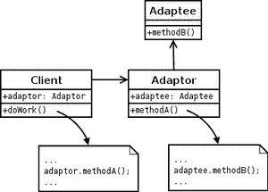

`Adapter`类包含`Adaptee`类。这意味着`Adaptee`类将被`Adapter`使用。

# 何时使用适配器模式

*   有一个类的接口与您需要的不匹配。
*   有几个子类，但是通过子类化每一个来适应它们的接口是不切实际的。

适配器模式有几个优点:

*   代码具有可重用性和灵活性。
*   干净的代码——因为客户端/上下文在每个具体的类中不使用不同的接口，并且可以使用多态性在不同的适配器之间交换。

# 示例 1

让我们看看如何使用 JavaScript/TypeScript 实现这个模式。

请记住——Javascript 既缺少接口也缺少抽象类。因此，理解这种模式的最佳方式是使用示例和 TypeScript。

在我们的例子中，我虚构了一个问题，其中有一个名为`Warrior`的抽象类定义了一个战士。战士有一组与问题无关的属性和一个叫做`attack`的方法。有一个战士类型的分类，例如`Saiyan`和`Namekian`，它们定义了`attack`方法的具体实现，但是一个新的类到达了系统`Android`，它不满足战士的接口，但是在内部以不同的方式实现了该方法。下面的 UML 图显示了我刚刚描述的场景。

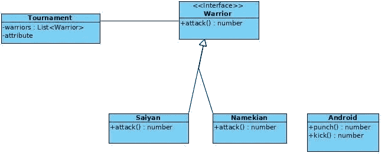

解决方案是使用一个由包含`Android`对象的类(`AndroidAdapter`)组成的适配器模式，并使用它使之与 warrior 的接口兼容。使用适配器模式的新 UML 图如下所示:

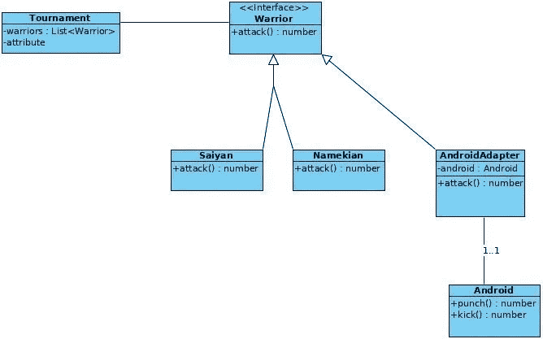

与模型和接口相关的代码:

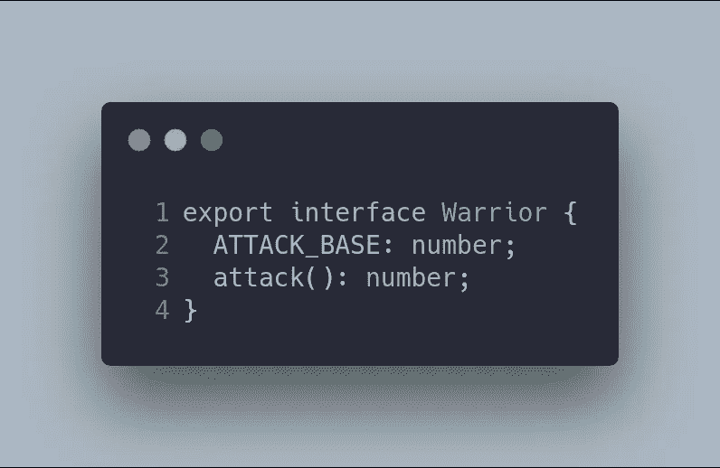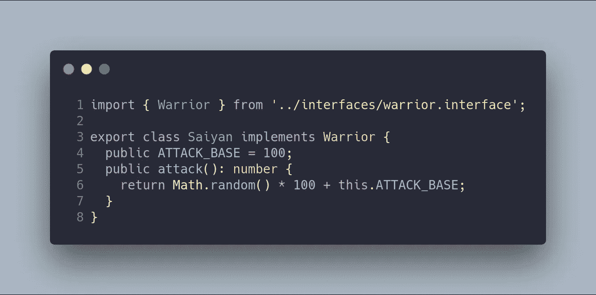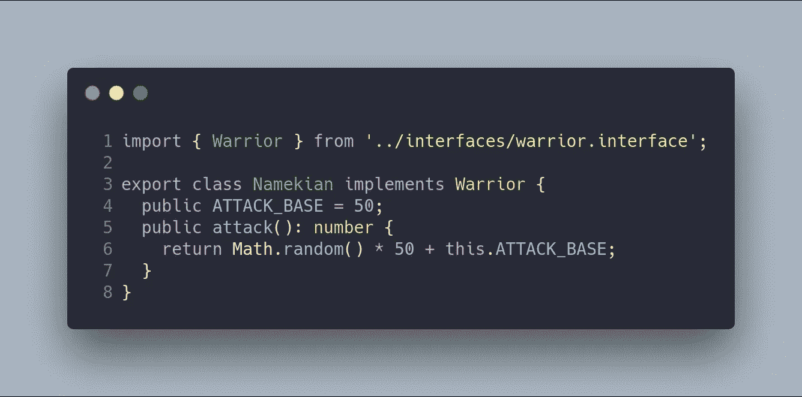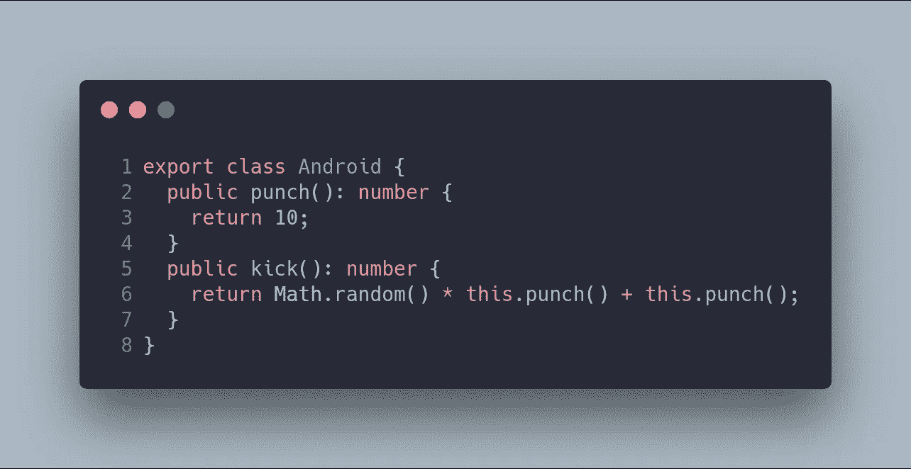

如你所见，`Android`类没有实现 warrior 的接口。`AndroidAdapter`能不能这个问题。

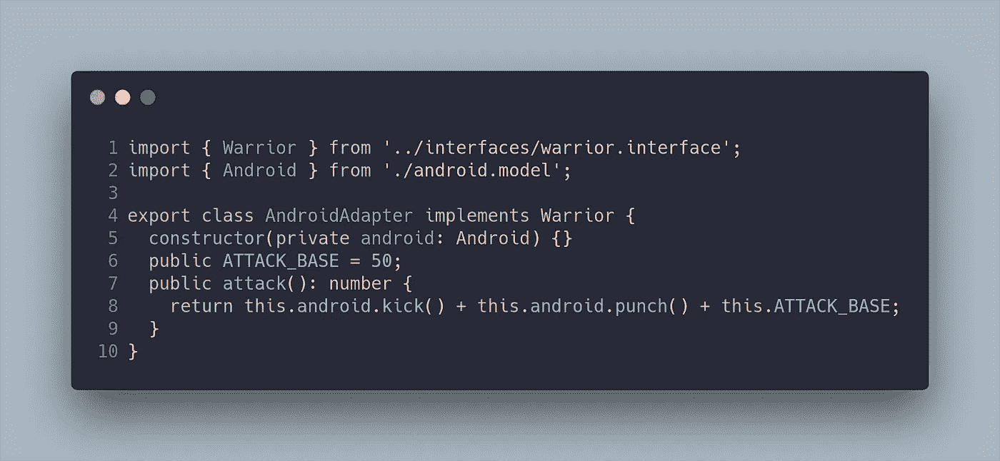

最后，想要使用这三个类的客户端应该使用`AndroidAdapter`类，以及`Saiyan`和`Namekian`，正如您在这里看到的:

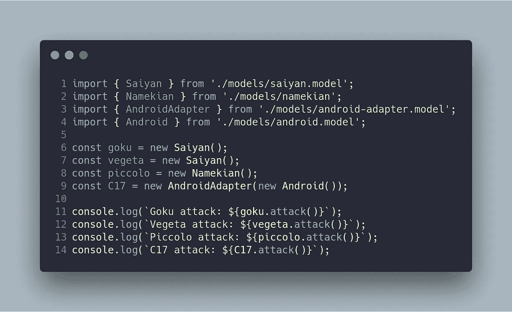

# 示例 2:几个种族想要使用 JavaScript/TypeScript 一起工作(Genki-dama)

适配器模式可以解决的另一个有趣的问题是，当有几个具有不同接口的类，但它们可以一起工作时。在下面的 UML 图中，您可以看到这种情况:

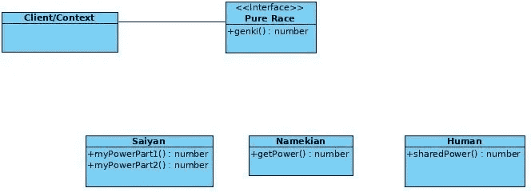

在这种情况下，种族之间有不同的接口进行通信。具体来说，每个种族都有一种或几种分享权力的方法。比如人类有`sharedPower`，namekians 有`getPower`。更复杂的是赛亚人，他们有两种分享权力的方法(`myPowerPart1`和`myPowerPart2`)。

解决方案是几个种族使用适配器模式一起工作，正如您在下面的 UML 图中看到的。

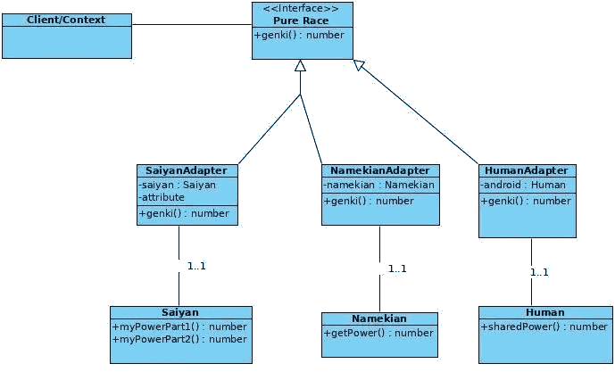

每个类都使用一个新的适配器类。这个适配器类包含原始对象和实现接口的方法。这个例子的代码非常简单:

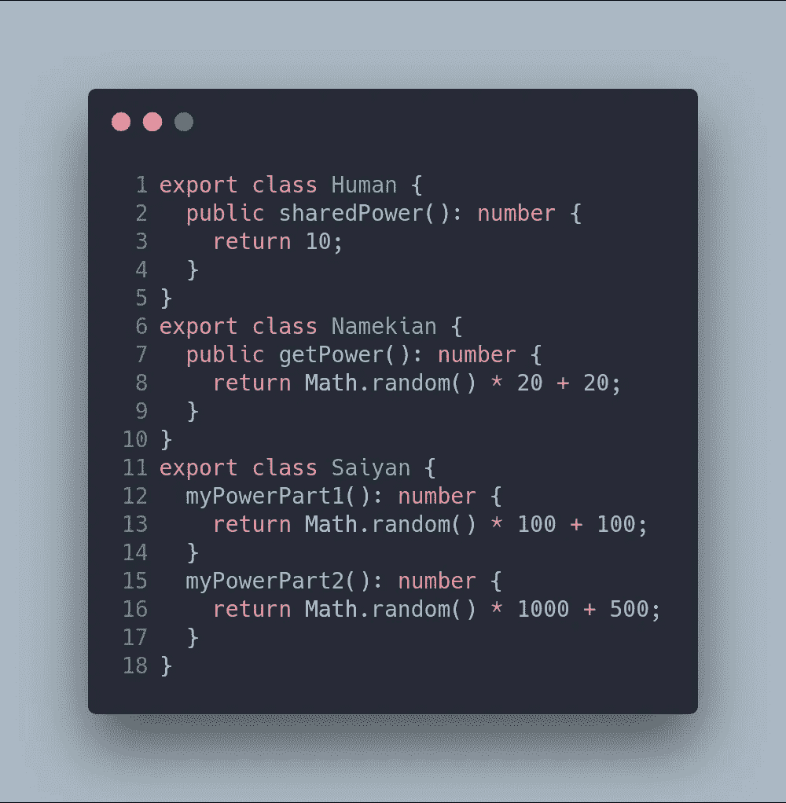

它们各自的适配器如下:

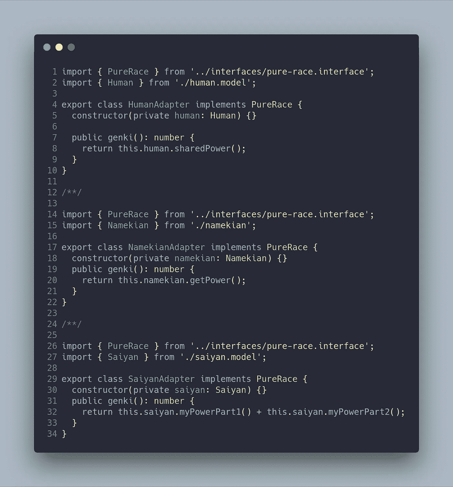

最后，所有的物体都在贡献能量来对抗邪恶，成就伟大的力量！

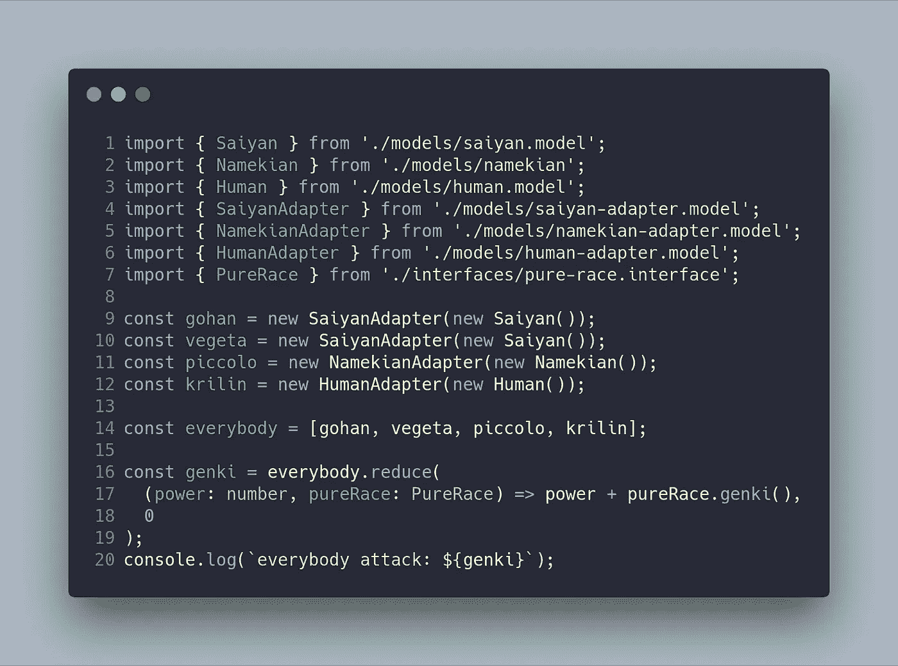

在应用了适配器模式之后，我创建了两个 NPM 脚本来运行这里显示的两个示例。

`npm run example1`

# 结论

当您有可以一起工作但其接口不兼容的类时，适配器模式可以帮助您避免项目中的重复代码。在这个岗位上我们；我们看到了一个使用 JavaScript/TypeScript 语言的简单实现。

最重要的事情不是实现我向你展示的模式，而是能够认识到这个特定模式可以解决的问题——知道你什么时候可以或者不可以实现这个模式。这一点至关重要，因为实现会因您使用的编程语言而异。

# 更大的

*   《设计模式:可重用面向对象软件的元素》，伽马、赫尔姆、约翰逊、& Vlissides、艾迪森·卫斯理，1995 。
*   [适配器模式—维基百科](https://en.wikipedia.org/wiki/Adapter_pattern)。
*   [https://www.dofactory.com/javascript/adapter-design-pattern](https://www.dofactory.com/javascript/adapter-design-pattern)
*   [https://github . com/sohamkamani/JavaScript-design-patterns-for-humans #-adapter](https://github.com/sohamkamani/javascript-design-patterns-for-humans#-adapter)

*   本帖的 **GitHub** 分支为[https://GitHub . com/Caballerog/blog/tree/master/adapter-pattern](https://github.com/Caballerog/blog/tree/master/adapter-pattern)