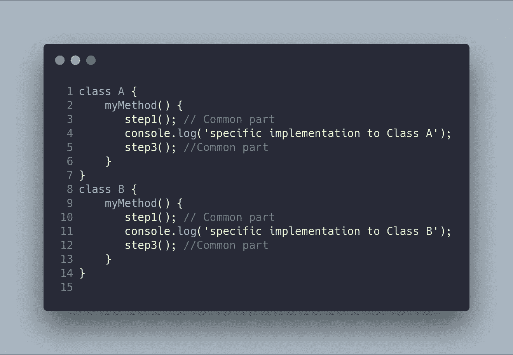
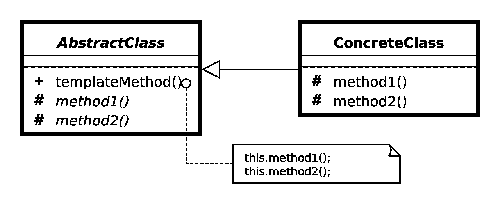
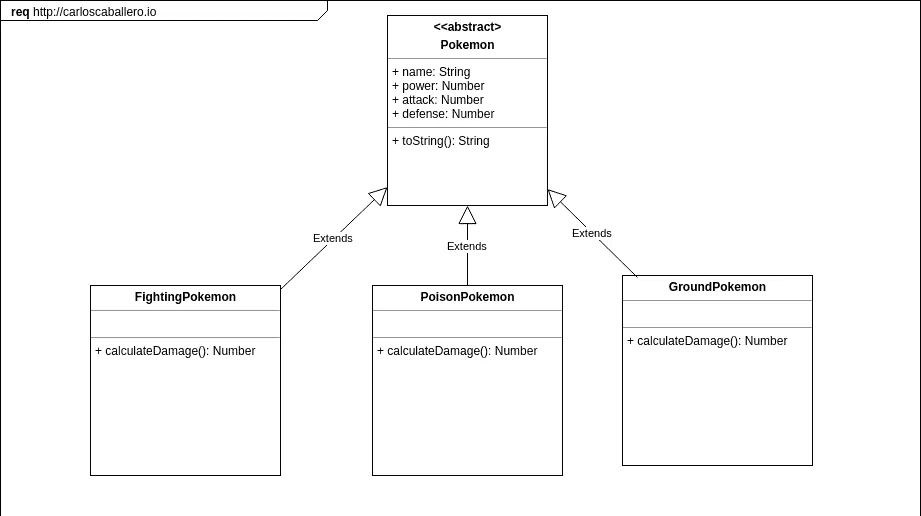
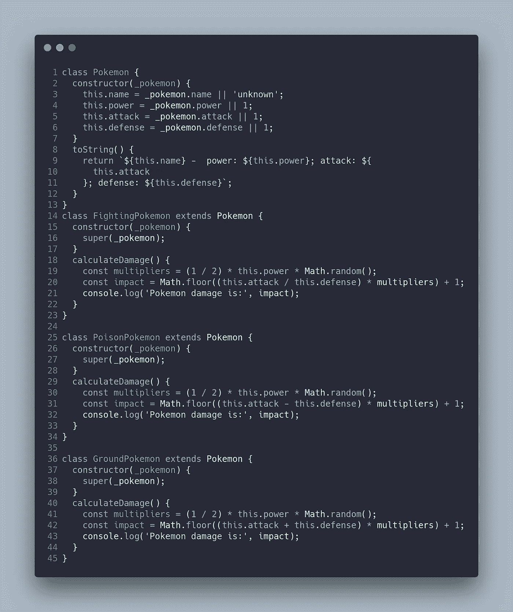
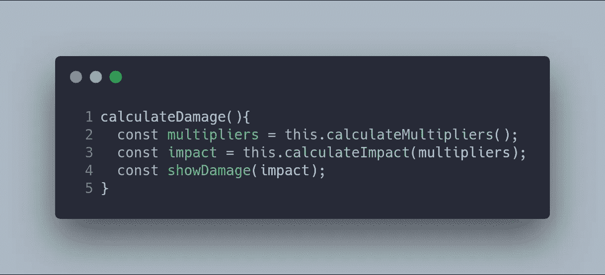
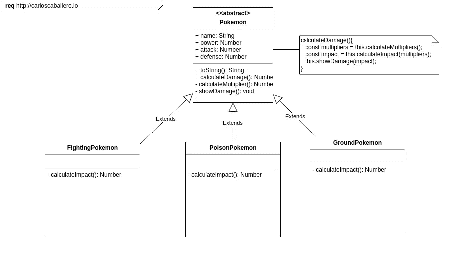
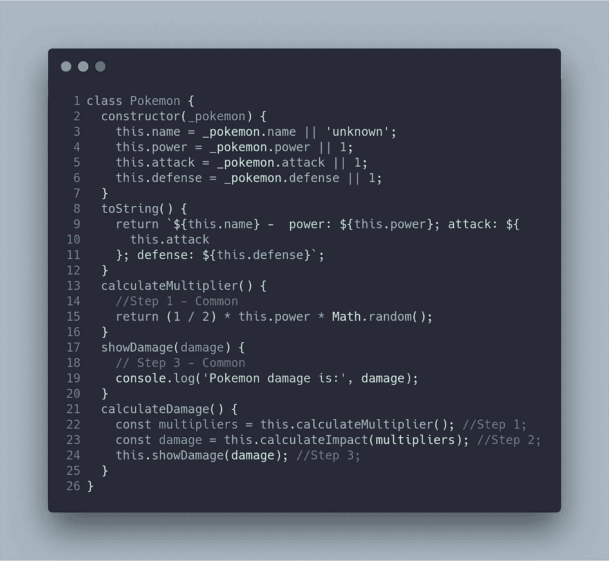
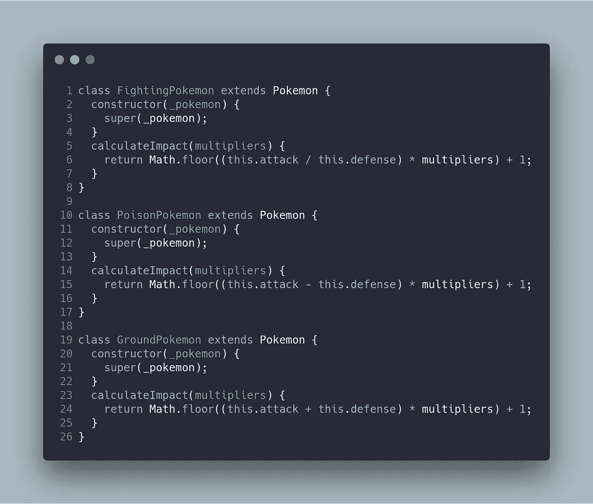
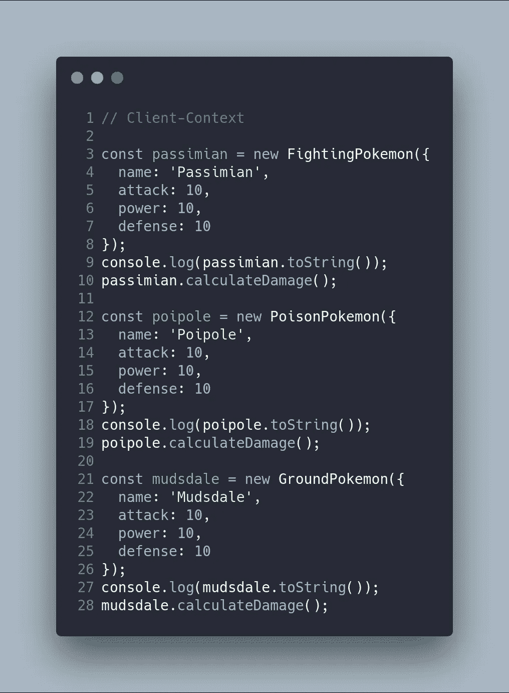

# 设计模式:模板方法

> 原文：<https://betterprogramming.pub/design-patterns-template-method-5400dde7bb72>

## 用口袋妖怪解释的复杂图案

大卫·格兰穆金在 [Unsplash](https://unsplash.com/s/photos/pokemon?utm_source=unsplash&utm_medium=referral&utm_content=creditCopyText) 上拍摄的照片

经典的设计模式有 23 种，在原著 [*设计模式:可复用面向对象软件的元素*](https://www.amazon.com/Design-Patterns-Elements-Reusable-Object-Oriented/dp/0201633612) 中有描述。这些模式为软件开发中经常重复出现的特定问题提供解决方案。

在本文中，我将描述模板模式，以及如何和何时应用它。

# 模板方法模式:基本思想

> *“模板方法模式是一种行为的* [*设计模式*](https://en.wikipedia.org/wiki/Software_design_pattern) *，它定义了一个* [*算法*](https://en.wikipedia.org/wiki/Algorithm) *中的* [*程序骨架*](https://en.wikipedia.org/wiki/Program_skeleton) *，将一些步骤推迟到* [*子类*](https://en.wikipedia.org/wiki/Subclass_(computer_science))*”—Wikipedia*
> 
> *“在一个操作中定义一个算法的框架，将一些步骤推迟到子类。模板方法允许子类在不改变算法结构的情况下重新定义算法的某些步骤。—设计模式:可重用面向对象软件的要素*

这种模式的主要特点是算法在不同种类的类之间略有不同。当在具体的类中实现时，这些部分通常在不同的算法中重复。

下面的代码显示了一个经典的问题，在这个问题中，您必须重复算法的某些部分(复制-粘贴)，并且只做很小的更改:

我们可以通过使用模板方法模式使代码更加简洁，这允许我们避免在算法的不同实现中重复代码。这个模式的 UML 图如下所示:

请注意抽象类，它包含模板方法和私有方法。

模板方法在不同的步骤中描述算法。这些步骤在抽象类中实现，而每个具体类中不同的具体步骤在所述具体类中实现。

# 模板方法模式:何时使用

1.  模板方法模式解决的问题是使用一种有不同变化的算法。您需要将算法分成不同的步骤，当在不同的实现之间通用时，在抽象类中实现。另一方面，不同的步骤将在具体的类中实现。
2.  另一个有趣的情况是，当您在不同的类之间复制粘贴代码(私有函数)时，您会发现需要这种模式。
3.  最后，当你的大多数类都有相关的行为时，你可以使用这种模式。

# 模板方法模式:优势

模板方法模式有几个优点，总结如下:

*   创建一个算法的具体实现是相当容易的，因为你通过使用一个抽象类去除了问题域的公共部分。
*   干净的代码，因为你避免了重复的代码。
*   更干净的代码，因为你把算法分成私有的方法或函数，这样更简单，更容易测试。

# 模板模式:使用 JavaScript 的口袋妖怪示例

我现在将向您展示如何使用 JavaScript 实现这种模式。请记住，JavaScript 既缺少接口也缺少抽象类。因此，理解这种模式的最好方法是使用一个例子。

在我们的例子中，我想到了一个问题，其中有一个名为`Pokemon`的抽象类，它定义了一个口袋妖怪。一个口袋妖怪除了经典的`toString`方法外，还有一套属性，比如`name`、`power`、`attack`、`defense`。

口袋妖怪的类型有一个分类，比如`FightingPokemon`、`PoisonPokemon`、`GroundPokemon`，定义了一个具体的方法叫做`calculateDamage`，根据口袋妖怪的属性和类型计算数值。

下面的 UML 图显示了我刚刚描述的场景。

使用 JavaScript 实现实际情况的代码如下:

方法`calculateDamage`在每个具体类中重复，即有一个气味代码(复制-粘贴-复制代码)。这种方法可以分成不同的步骤，如下所示:

注意，我们的方法被分成了三个函数。实际上，两个是通用的，一个是特定的，取决于实现它的类(`calculateImpact`)。

我们的`Template-Method`模式已经成功应用。在下面的 UML 中，您可以看到使用模板方法的版本更新。

`Pokemon`类如下:

您可能已经注意到这个类中没有实现方法`this.calculateImpact`。这是因为具体的实现将在具体的类中。这个口袋妖怪类就是我们问题中的抽象类。

下一步是实现具有`calculateImpact`方法的具体类。

最后，我们使用具体口袋妖怪的客户端/上下文代码如下:

这段代码创建了具体的 Pokemon，它调用它的`calculateDamage`。它的实现对客户端/上下文是透明的，但是，代码不会重复。

最后，我创建了两个 [npm](https://www.npmjs.com/) 脚本，在应用模板方法模式之前和之后运行代码。

`npm run step0`
`npm run step1`

如果你喜欢这篇文章，并想阅读类似的文章，别忘了鼓掌。

点按并拖移以不止一次鼓掌。50 是极限。

# 结论

模板方法模式是一种可以避免项目中重复代码的模式，当一个算法既有不变部分又有变化部分时，后者取决于具体的类。

在本文中，您已经能够观察到一个使用 JavaScript 语言的简单实现，它缺少接口/抽象。如果你使用的编程语言有接口/抽象，你可以遵循 UML 模式。

最重要的事情不是实现我向您展示的模式，而是能够识别这个特定模式可以解决的问题，以及何时可以或不可以实现所述模式。

这一点至关重要，因为实现会因您使用的编程语言而异。