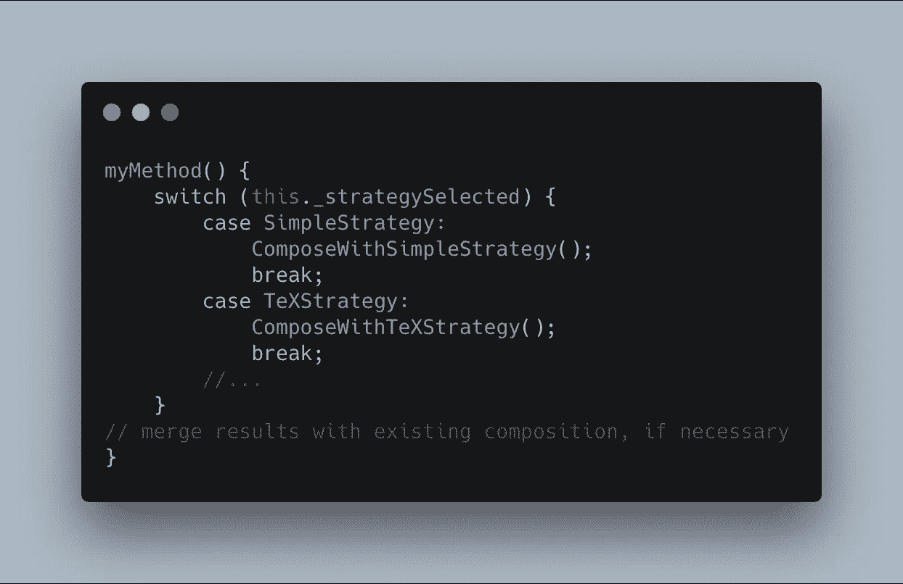
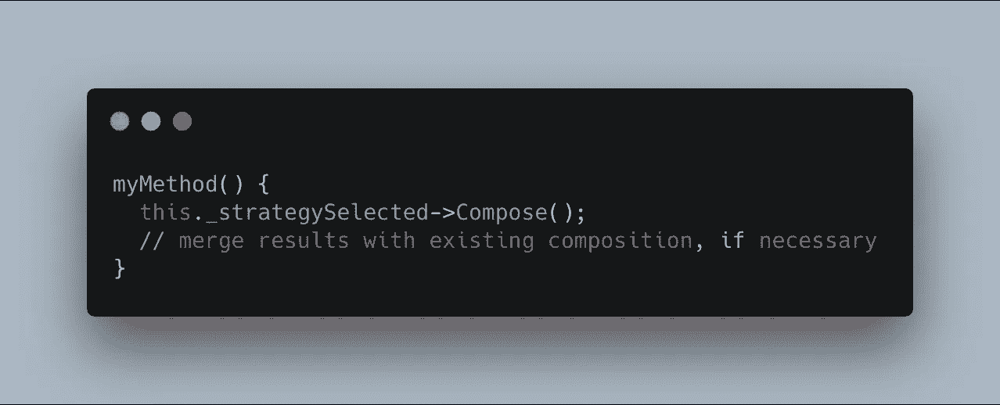
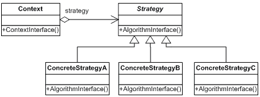
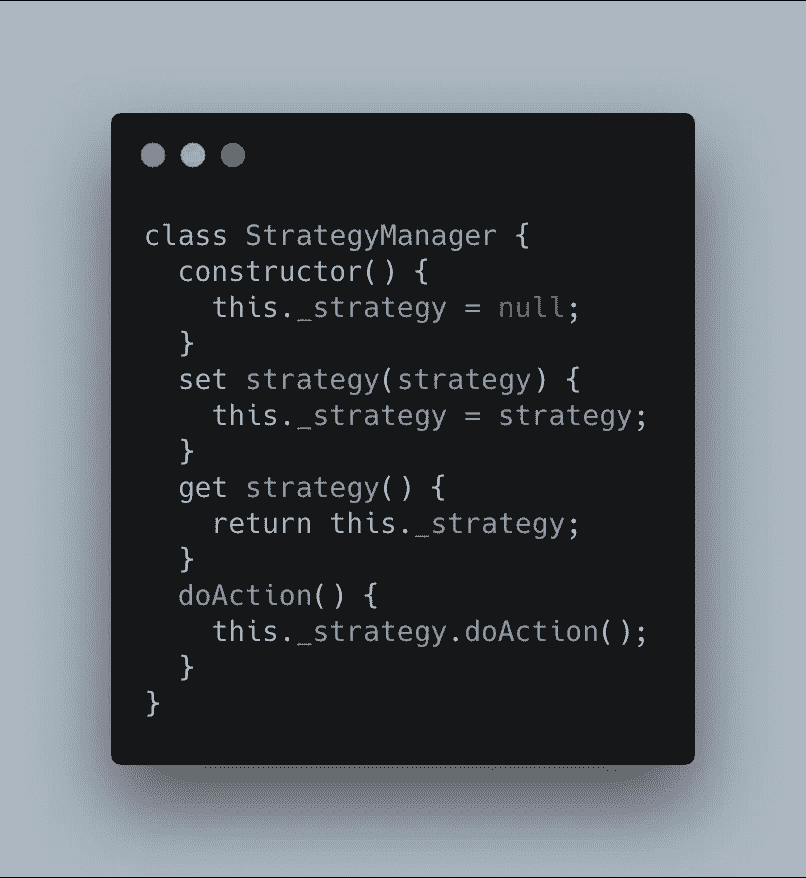
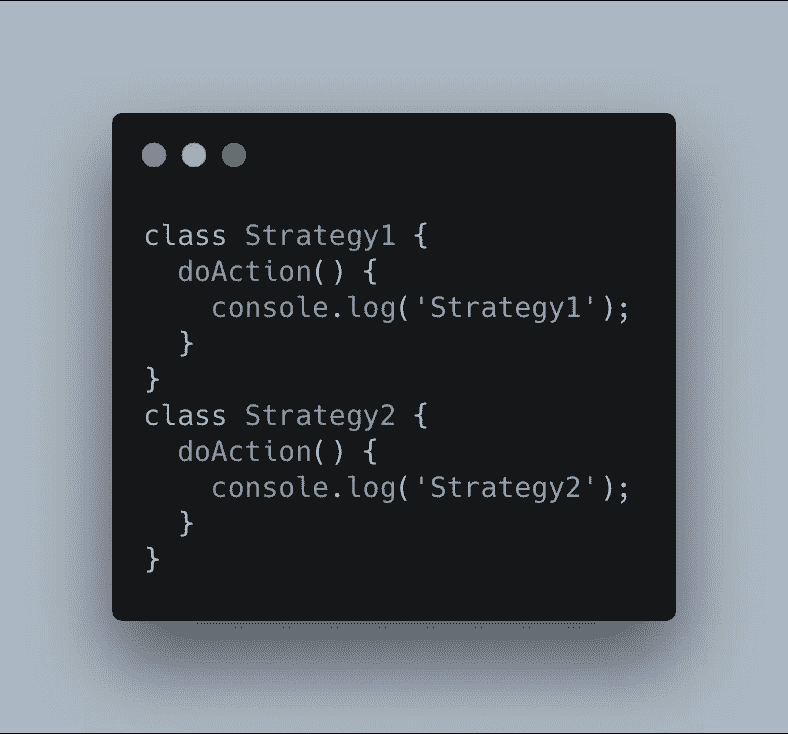
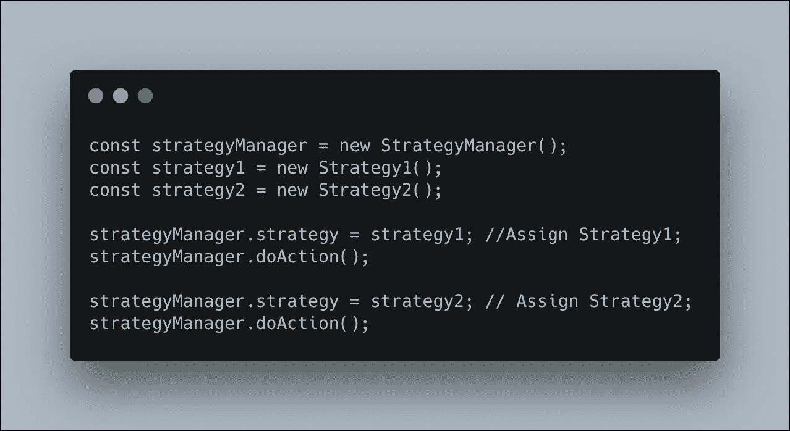
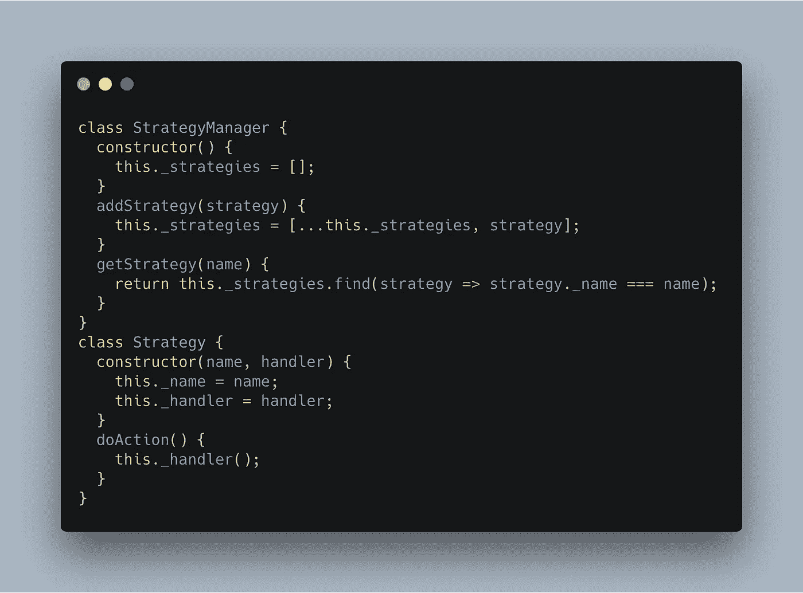
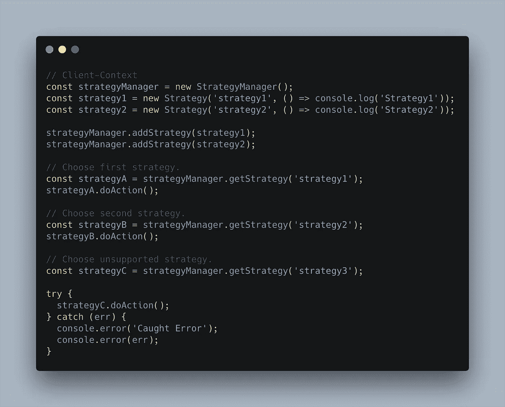

# 设计模式:在 JavaScript 中使用策略模式

> 原文：<https://betterprogramming.pub/design-patterns-using-the-strategy-pattern-in-javascript-3c12af58fd8a>

## 设计模式系列—第 1 部分

书中描述了 23 种经典设计模式`Design Patterns: Elements of Reusable Object-Oriented Software`。这些模式为软件开发中重复出现的特定问题提供了解决方案。

在这篇文章中，我将探讨*战略模式*——它是如何运作的，如何以及何时应用。这种模式在其他上下文中称为*策略* 。

# 战略模式:基本理念

> *策略模式是一种行为设计模式，能够在运行时选择算法*

*—维基百科*

> *定义一族算法，封装每一个，使它们可以互换。策略让算法独立于使用它的客户端而变化。*

*—设计模式:可复用面向对象软件的要素*

这种模式的主要特征是客户端有一组算法，在运行时将选择一个特定的算法来使用。这些算法可以在它们之间互换。

下面的代码展示了一个经典的问题，你需要在你的应用中选择一个具体的算法。在这段代码中，您可以使用任何编程语言的`switch`控制结构。

但是，使用*策略模式* 可以更加灵活，该模式采用以下结构:

这种模式的 UML 图:

每个策略都用一个具体的对象来表示。因此，客户端/上下文包含一个实现接口`Strategy`的`Strategy`对象(`concreteStrategyA`、`concreteStrategyB`、…)。关键的交换在于在上下文中实现一个方法，该方法改变策略的实例。比如:`setStrategy`。

# 何时使用策略模式

1.  当你需要使用几种不同的算法时。您需要创建一个具体的类来实现您的算法(它可以由`a`或`some`函数组成)。
2.  当围绕几个相关算法有条件语句时。
3.  当你的大部分课程都有相关行为时。

# 战略模式的优势

策略模式有几个优点:

*   运行时在不同算法(策略)之间切换很容易，因为你在接口中使用了多态性。
*   清理代码因为你避免了有条件感染的代码(不复杂)。
*   更干净的代码，因为您将关注点分成了类(每个策略一个类)。

# 策略模式:使用 JavaScript 的基本实现

我将向您展示如何用 JavaScript 实现这种模式。记住:Javascript 缺少接口——您需要编写一个名为`StrategyManager`的类，它被用作接口:

这个类包含一个名为`_strategy`的私有属性，它代表所使用的策略。方法`doAction`会落实到每一个具体的策略中。策略模式不同于 JavaScript 中的 UML，它缺少面向对象的特性。

每个具体策略的实施如下:

注意，具体方法`doAction`是在每个具体策略中实现的。

最后，上下文/客户端必须包含`StrategyManager`(或者策略接口是面向对象语言)才能使用具体的策略:

# 策略模式:使用 JavaScript 的一组策略

在下面的实现中，我们的`StrategyManager`变得更加复杂，包含一系列算法。在这种情况下，您可以更改属性`_strategy`，而不是名为`_strategies`的数组。

最后，使用方法`addStrategy`在策略列表中添加新的策略。`Strategy`类有两个属性:1。策略的名称和 2。算法(名为`handler`)。方法`doAction`用于调用具体的算法。

最后，我们使用具体策略的客户端/上下文代码:

第一部分是创建具体的策略(可以使用`Singleton`模式和`Factory` 模式构建)并添加到`strategyManager` (可以是我们的接口)。客户端的下一部分是选择要使用的策略——可以从我们的应用程序中使用 GUI 或 CLI 选择该策略。

最后，请注意，如果选择了不支持的策略，系统将返回一个错误。当您想要为您的系统提供高级算法时，可以使用这种方法。

如果你喜欢这篇文章，并想阅读类似的文章，别忘了鼓掌。

点按并拖移以不止一次鼓掌。50 是极限。

当您需要选择具体的算法时，策略模式可以帮助您避免代码中的复杂性。在这篇文章中，我用 JavaScript 语言展示了一个简单的实现，它没有接口。如果你使用一种带有接口的编程语言，你可以遵循这个模式的 UML。

最重要的是，不要只是实现我在这里展示的模式。您需要知道模式解决的问题是什么，以及为什么您应该使用它。实现会因编程语言而异。