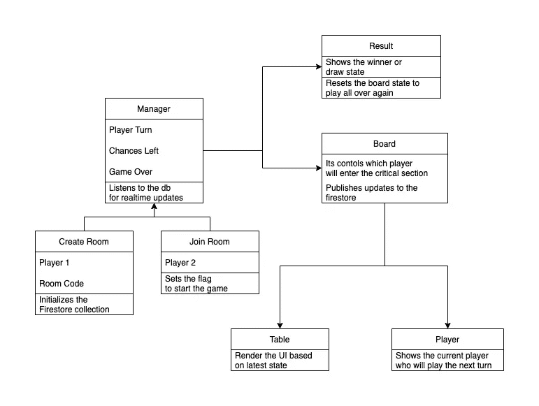

# 用 React 实时数据库设计和实现井字游戏

> 原文：<https://betterprogramming.pub/design-tic-tac-toe-with-realtime-database-in-react-code-attached-535409d7f9f>

## 部署在网络上


在本文中，我们将介绍如何设计井字游戏，将它与实时数据库绑定，实现逻辑并部署它，最终与您的朋友一起玩。

# 先决条件

*   Javascript(因为它是一个网络应用程序)
*   反应(主要是功能组件)
*   ReduxToolkit(状态管理)
*   Firebase(作为我们的数据库)
*   材质用户界面(渲染组件)
*   版本控制系统

# **理解设计**



设计井字游戏时，有几件事需要注意。

1.  这是一个双人游戏，所以游戏不会面临并发请求。基本上是互斥的。
2.  只有在玩家玩了在`Player B` 正在玩的时候`Player A`不能赢的回合之后，结果才会出现。
3.  只有 4 种方法可以让你赢:水平，垂直，左对角线，右对角线

# 数据库模式

```
{
 player1: String,
 player2: String,
 board: String[N][N],
 turn: String,
 gameOver: Boolean,
 chancesLeft: Integer == N
}This is how our db schema is going to look like. Getting onto the details
- player1 is a string field that represents the name of 1st player.
- player1 is a string field that represents the name of 1st player.
- board is N X N matrix representing current state of the game.
- turn as discussed in while designing point 1 is our mutex.
- Game over and chances left are used to decide the flow of game.
```

我们说游戏结束有两种情况:

1.  其中一个玩家赢了。
2.  剩下的机会是零。(画)

如果玩家满足以下任何一个条件，他就应该赢得游戏。

*   水平地

```
 let count = 0
 for(let i = 0; i< size; i++){
 if(arr[i][col] === symbol)
 count++;
 } if(count === size)
  return true;
```

*   垂直地

```
count = 0
 for(let i = 0; i < size; i++){
 if(arr[row][i] === symbol)
 count++;
 }

 if(count === size)
 return true;
```

*   左对角线

```
let count = 0
 for(let i = 0; i < size; i++){
 if(arr[i][i] === symbol)
 count++;
 } if(count === size)
 return true; 
```

*   右对角线

```
count = 0;
 for(let i = 0; i< size; i++){
 if(arr[i][size -i — 1] === symbol)
 count++;
 }if(count === size)
 return true; 
```

# **配置数据库**

```
const firebaseConfig = {
 apiKey: process.env.REACT_APP_API_KEY,
 authDomain: process.env.REACT_APP_AUTH_DOMAIN,
 projectId: process.env.REACT_APP_PROJECT_ID,
 storageBucket: process.env.REACT_APP_STORAGE_BUCKET,
 messagingSenderId: process.env.REACT_APP_MESSAGING_SENDER_ID,
 appId: process.env.REACT_APP_APP_ID,
 measurementId: process.env.REACT_APP_MEASUREMENT_ID
 };const app = initializeApp(firebaseConfig);
const db = getFirestore(app);export default db;
```

现在你可以使用这个`**db**`实例给你的 firestore 打电话。

> 注意:仍然担心如何将 firebase 添加到您的项目中。在此按照步骤[进行](https://firebase.google.com/docs/web/setup#add-sdk-and-initialize))

# **创建房间**

创建一个房间是游戏最重要的方面之一。房间代码需要对每一对玩家都是唯一的。这个房间代码的另一个方面是，这个房间代码也将作为您的`document`在 firebase 集合中服务，其他订户用户将会收听它。

这些步骤是:

1.通过选择一个随机数创建一个 5 位数的唯一密钥

```
const getRandom = () => Math.floor(Math.random()*90000) + 10000;
```

*2。通过勾选*防止碰撞发生

# **如何实时制作？**

Firestore SDK 提供了一个名为`onSnapshot`的 API 来监听实时更新。更多关于它的[这里](https://firebase.google.com/docs/firestore/query-data/listen)。

```
onSnapshot(docRef, (doc) => {
 // doc.data() will give you latest changes in the db 
 Your code goes here….
 });
```

那么下一步是什么？

差不多就是这样。这些是整个项目中最困难的部分。
也许是时候开始编码并做必要的改变了。

# **想要现场演示吗？**

是啊当然！我已经在网上部署了这个游戏。

还是，卡住了？需要参考资料来自己构建吗？

这是我的[回购](https://github.com/pritambarua/tic-tac-toe)的链接。我已经公开了。欢迎所有评论。