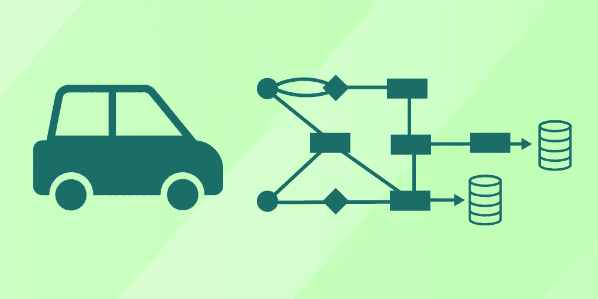
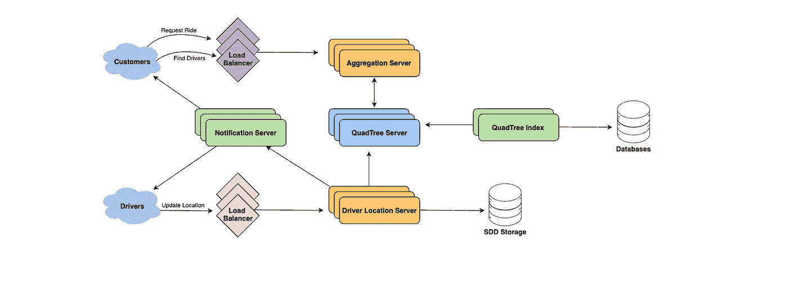

# 设计优步的后端:系统设计演练

> 原文：<https://betterprogramming.pub/design-ubers-backend-a-systems-design-walkthrough-c88f8959de97>

## 这个问题要求您创建一个拼车服务来匹配用户和司机。你会如何建造它？

图片来源:作者

在我们关于系统设计的上一篇文章中，我们看了[十大问题](https://www.educative.io/blog/top-10-system-design-interview-questions)，包括如何设计像优步或 Lyft 这样的拼车服务。今天，我们深入探讨系统设计问题，并讨论*如何设计优步的后端。*

这是一个常见的问题，你可能会在任何系统设计面试中遇到，尤其是如果你是为优步面试的话。这个问题要求您创建一个拼车服务来匹配用户和司机。用户输入目的地并发送他们的当前位置。附近的司机会在几秒钟内收到新用户的通知。

今天，我们将一步步分解这个问题。让我们设计一个像优步一样的拼车服务吧！

今天我们将复习:

*   [优步后端:问题概述](https://www.educative.io/blog/uber-backend-system-design#overview)
*   [优步后端:系统设计](https://www.educative.io/blog/uber-backend-system-design#design)
*   [高级问题和注意事项](https://www.educative.io/blog/uber-backend-system-design#issues)
*   [接下来学什么](https://www.educative.io/blog/uber-backend-system-design#next)

# 优步后端问题概述

优步的使命是让交通变得可靠和便捷。他们处理复杂的数据、高流量和复杂的系统，所有这些都打包在他们流行的智能手机应用程序中。优步让顾客可以预约司机，享受便宜的出租车服务。优步司机使用私人汽车，客户和司机都使用优步应用程序进行沟通。

我们的系统应该考虑两种用户:司机和顾客。

*   司机必须能够经常通知服务关于他们的当前位置和可用性
*   乘客应该能够实时看到附近所有的司机
*   客户可以使用目的地和接机时间请求搭车。
*   当需要接顾客时，附近的司机会得到通知。
*   一旦搭车被接受，司机和顾客都必须在旅行期间不断看到对方的当前位置。
*   一旦驾驶完成，驾驶员就完成了旅程，现在可以为另一个顾客服务了。

***类似服务:*** *Lyft、滴滴、Via、Sidecar 等。*

***难度等级:*** *难度*

***有用的前提:*** *设计 Yelp*

## 限制

为了有效地设计优步的后端，我们需要了解约束条件，即容量估计和系统限制。下面，我们将讨论在设计系统之前需要考虑的一些重要事项。

以下这些限制通常会因时间和地点的不同而有所不同。就本文而言，我们将使用以下约束和估计:

*   我们的系统中有 3 亿客户和 100 万司机
*   我们每天有 100 万活跃客户和 50 万活跃司机。
*   让我们假设每天有 100 万人次乘坐。
*   让我们假设所有活跃的驾驶员每三秒通知他们的当前位置。一旦顾客提出乘车请求，系统会实时联系司机。

# 优步后端:系统设计

下面，我们讨论该产品的系统设计。如果你熟悉 SDI 问题，设计 Yelp，这可能看起来很熟悉。我们将为上述用例修改解决方案。对于优步，我们的四叉树必须适应频繁更新。

如果我们使用 Yelp 问题的动态网格解决方案，会出现一些问题:

*   我们需要更新数据结构，以反映活跃的司机每三秒钟报告他们的位置。要将一个驱动程序更新到一个新的位置，我们必须根据驱动程序以前的位置找到正确的网格。
*   如果新位置不属于当前网格，我们从当前网格中移除驱动程序，并将它们重新插入到正确的网格中。然后，如果新的网格达到最大限制，我们必须对其进行重新分区。
*   我们需要一种快速的机制来将所有附近司机的当前位置传播给该区域的客户。我们的系统需要在整个旅程中通知司机和乘客汽车的位置。

对于这些情况，四叉树并不理想，因为树中的快速更新不能保证优步要求的速度。如果我们不根据每个驱动程序更新来更新我们的四叉树，它将使用不能反映当前位置的旧数据。

我们可以在哈希表中保存最近的驱动程序位置，并降低更新四叉树的频率。我们想保证一个司机的当前位置在 15 秒内反映在四叉树中。我们维护一个哈希表来存储当前的驱动程序位置。我们可以称之为`DriverLocationHT`。

## `DriverLocationHT`

我们需要将`DriveID`存储在哈希表中，哈希表反映了驱动程序的当前和以前的位置。这意味着我们将需要 35 个字节来存储每个记录:

*   DriverID (3 字节—100 万个驱动程序)
*   旧纬度(8 字节)
*   旧经度(8 字节)
*   新纬度(8 字节)
*   新经度(8 字节)总计= 35 字节

如前所述，我们假设有一百万个驱动程序，这将需要以下内存:

*100 万* 35 字节= > 35 MB*

现在我们来讨论一下带宽。如果我们得到了驱动器号和位置，将需要*(3+16 =>19 字节)*。此信息每三秒钟从 500，000 个每日活跃的驱动程序接收一次，因此我们每三秒钟接收 9.5MB。

为了帮助提高可伸缩性、性能和容错能力，我们可以基于`DriverID`将`DriverLocationHT`分布在多个服务器上，以实现随机化分布。我们将把保存这些信息的机器称为*驾驶员位置服务器*。

这些服务器还将执行以下操作:

*   一旦服务器接收到司机位置的更新，它将向相关客户广播该信息。
*   服务器将通知相应的四叉树服务器刷新驾驶员的位置。

# 广播驱动位置

接下来，我们需要向客户广播司机的位置。我们可以使用推送模型，其中服务器将位置推送给相关用户。我们可以使用通知服务，并在发布者/订阅者模型上构建它。

这样，当客户打开优步应用程序时，他们就可以查询服务器来查找附近的司机。在服务器端，我们为客户订阅来自这些驱动程序的所有更新。每当我们在`DriverLocationHT`更新一个特定的驱动程序时，我们会向所有订阅的用户广播当前位置。

这确保了我们显示驾驶员的当前位置。如上所述，我们拥有 100 万每日活跃客户和 50 万活跃司机。让我们假设五个客户订阅了一个驱动程序，我们将这个信息存储在一个**散列表中，以便快速更新。**

这意味着我们需要存储驱动程序和客户 id。我们需要 3 个字节用于 DriverID，8 个字节用于 CustomerID，所以我们需要 21MB 的内存。

*(500k * 3)+(500k * 5 * 8)~ = 21mb*

现在谈谈带宽。对于每个活跃的驱动程序，我们有五个订户。总之，这达到了:

*5 * 500K = > 2.5M*

我们需要每秒发送 DriverID(三个字节)和它们的位置(16 个字节)，这需要:

*2.5M * 19 字节=>47.5 MB/秒*

# 通知服务

为了有效地实现通知服务，我们可以使用 HTTP 长轮询或推送通知。客户第一次打开优步应用程序时会订阅附近的司机。

因此，当新的驱动程序进入他们的区域时，我们需要动态添加新的客户/驱动程序订阅。为此，我们跟踪客户正在观看的区域，但这非常复杂。

我们可以设计系统，让客户从服务器上获取信息，而不是推送信息。客户端将发送他们的当前位置，这样服务器就可以从我们的四叉树中找到附近的驱动程序。然后，客户端可以更新他们的屏幕，以反映所有司机的当前位置。

*客户端应该能够每五秒查询一次。这将限制到服务器的往返次数。*

当谈到**重新划分**时，我们可以创建一个缓冲区，这样在我们决定划分它之前，每个网格都会增长到超出限制。假设在我们划分网格之前，我们的网格可以额外增长或收缩*10%*。这将减少网格分区的负载。

# 请求游乐设备用例

让我们总结一下这个用例将如何工作:

*   顾客输入乘车请求。
*   其中一个`Aggregator`服务器接受请求，并要求`QuadTree`服务器返回附近的驱动程序。
*   `Aggregator`服务器收集搜索结果，并按等级分类。
*   `Aggregator`服务器同时向顶层驱动发送通知。
*   第一个接受的司机将被分配乘坐。其他司机将收到取消。
*   如果司机没有回应，`Aggregator`将会要求名单上的下一位司机搭车。
*   一旦司机接受了请求，客户就会得到通知。

# 高级问题和注意事项

## 容错和复制

如果一个驱动定位服务器或者通知服务器死了怎么办？我们将需要服务器副本，以便辅助服务器可以在需要时进行控制。我们还可以将数据存储在固态硬盘等持久存储中，以提供快速的 IOs。

这样，如果我们的主服务器和辅助服务器都出现故障，我们可以快速从持久存储中恢复数据。

## 等级

优步还为司机提供了一个排名系统，客户可以根据等待时间、礼貌和安全对司机进行评级。比方说，我们希望根据流行度或相关性以及接近度对搜索结果进行排序。

我们需要返回给定半径内的顶级车手。假设我们在数据库和`QuadTree`中跟踪车手的评级，一个聚合数字将代表基于星级的系统中的受欢迎程度。

因此，当系统搜索给定半径内的前十名司机时，我们也要求`QuadTree`的每个分区返回具有指定评级的前十名司机。聚合器服务器将在不同分区返回的所有驱动程序中确定前十个驱动程序。

## 要讨论的其他问题

*   我们将如何处理客户端使用缓慢或断开网络？
*   如果客户在乘坐过程中断开连接怎么办？
*   如果游乐设备断开连接，我们将如何处理计费？
*   如何实现新的机器学习组件来改进这个系统？

# 接下来学什么

恭喜你！现在，您应该对如何设计优步的后端有了一个很好的想法。我们希望这对你的面试准备有所帮助。如果你正在准备一个系统设计面试，还有很多东西需要学习。

接下来，您应该学习如何设计以下系统:

*   设计票主
*   微服务
*   设计 TinyUrl
*   设计 Twitter 搜索
*   SDI 基础:负载平衡、缓存等。

*快乐学习！*