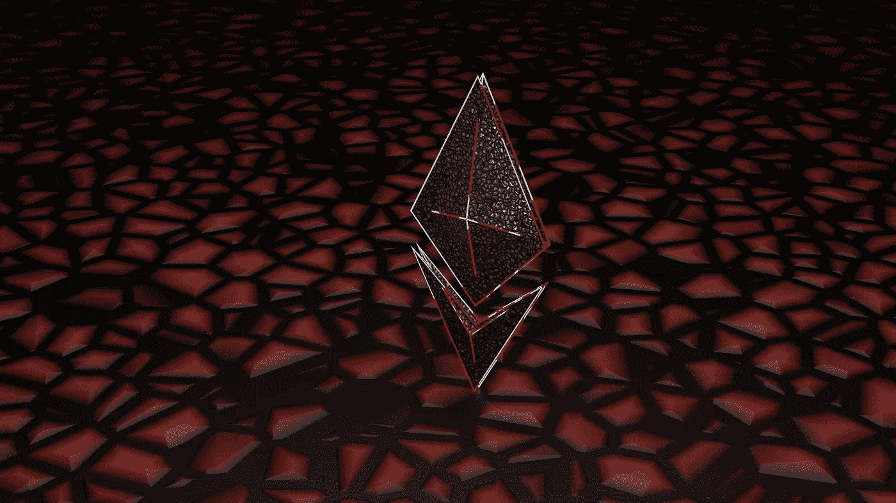
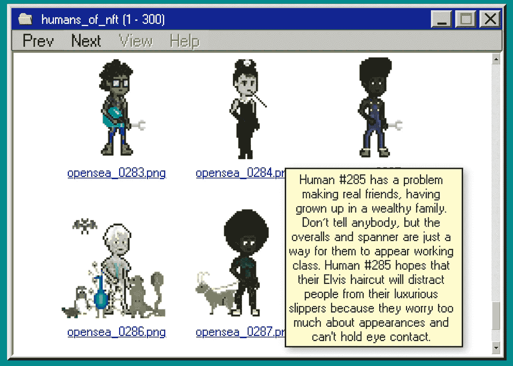
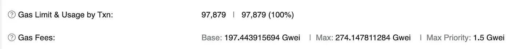

# 为灵活的铸造和索赔设计 NFT 智能合同

> 原文：<https://betterprogramming.pub/designing-an-nft-smart-contract-for-flexible-minting-and-claiming-5b420a9a2d82>

## 我们也没有汽油了。了解我们为什么以及如何优化它



由 [Unsplash](https://unsplash.com/@theshubhamdhage?utm_source=unsplash&utm_medium=referral&utm_content=creditCopyText) 上的 [Shubham Dhage](https://unsplash.com/@theshubhamdhage?utm_source=unsplash&utm_medium=referral&utm_content=creditCopyText) 拍摄的照片

有问题的智能合同是我们为 NFT 人开发的。这个项目本质上是一个艺术项目——旨在探索合作，以及一个社区，而不仅仅是为他们，如何创造一个 NFT 系列。

我们的智能合约需要考虑各种不同的铸造需求，以涵盖我们项目的各种元素，我们将在下面详细探讨。


1500 个人中的每一个人都有一份由社区成员贡献的手写简历。

这篇文章是我们探索合同实现的系列文章中的第一篇——它通常是为那些对我们的技术方法感兴趣的人准备的，但将以这样一种方式撰写，希望即使是不太懂技术的人也能从中学习一些东西。

在我们深入技术内容之前，让我们提供一些背景信息，说明为什么该合同需要这么多功能:

*   我们的创世纪系列(由 229 个人组成)是使用 Opensea 的 ERC1155 共享合同铸造的。我们希望使用自己的 ERC721 契约，通过刻录原始令牌并在契约中捕获它们，将旧集合合并到新集合中。
*   我们的作者计划中的作者因提交了 bios(“传记”的简称，即一个背景故事)给我们人类。我们需要给他们一种方法来认领他们的人类，而不用付钱给造币厂。每个作者根据他们提交的简历的数量获得不同数量的薄荷糖。
*   需要为使用钱包地址的个人保留 35 个设置了令牌 id 的荣誉人(自定义一对一)。
*   我们有一个预售列表，希望控制谁可以访问，并限制可以铸造的令牌数量。
*   我们的公开销售对所有人开放，但我们想限制每笔交易和每个地址的薄荷糖数量。

最后，但肯定不是最不重要的，我们想利用随机铸造策略。许多项目在随机化元数据时利用起源散列作为种子。我们只是在造币厂上线之前透露了元数据。这有三个主要目的:

1.  我们想在造币活动之前展示我们的整个系列。我们已经被过度宣传的薄荷糖烧伤太多次了，在展示后产生真正令人失望的艺术品，所以我们想向我们的社区展示他们到底得到了什么。
2.  我们希望这个过程尽可能的公平和透明，取消团队铸造精选或稀有令牌的选项。我们和其他人一样有机会。
3.  我们想规避揭露的需要，以消除狙击的可能性，并确保收集不会在未揭露的默默无闻中憔悴，如果我们不薄荷了。



在造币活动前浏览该系列

## **一份重要的免责声明**

在继续之前，我想提醒一下这篇文章，我不是可靠性专家。我做了很多年的开发人员，从事过各种各样非常不同的项目，但这是我部署到以太坊 Mainnet 的第一个智能合同，所以这是 NDA(不是开发人员的建议)。

我很幸运有一些非常聪明的人在我前进的道路上帮助我。我只是想借此机会分享我的思考过程和我们做出某些决定的原因，希望它可以帮助甚至一个人开始他们自己的 NFT 项目，因为如果没有向其他人学习，我不可能做到这一点，他们非常慷慨地分享了他们的经验。有很多很棒的资源，我会在这篇文章的底部链接一些我用过的资源。

如果您在通读本指南时需要参考代码，可以在 Etherscan 上找到我们的验证合同:

```
[https://etherscan.io/address/0x8575B2Dbbd7608A1629aDAA952abA74Bcc53d22A#code](https://etherscan.io/address/0x8575B2Dbbd7608A1629aDAA952abA74Bcc53d22A#code)
```

## **造币时随机分配令牌 ID**

值得一提的是，这种策略采用了伪随机数生成的方法。“正确地”做到这一点需要使用类似 Chainlink 的 VRF(可验证的随机函数) [(1)](https://docs.chain.link/docs/chainlink-vrf/) 的东西。

我们做了一个有根据的假设，我们相对不为人知的小收藏(1500 个)和它的低铸币价格(0.025 Eth)很少或没有激励人们想出一个复杂的方法来尝试和利用它。

此外，利用像 VRF 这样的方法会使我们的造币过程过于昂贵。在做了大量的研究和阅读了无数的论坛帖子后，我偶然发现了一些 ERC721 的 1001-digital [(2)](https://github.com/1001-digital/erc721-extensions) 扩展，它们涵盖了随机令牌分配。

对于我们来说,`RandomlyAssigned`扩展并不是现成的，因为我们需要在已知 id 和随机 id 之间“分割”集合(我们将很快对此进行解释)。

与此同时，您可以从构造函数中看到,“人类”契约继承自扩展，还有其他一些契约:

```
constructor(
  string memory uri,
  address adminSigner,
  address openseaAddress
 )
  ERC721('Humans Of NFT', 'HUMAN')
  RandomlyAssigned(
   MAX_HUMANS_SUPPLY,
   NUMBER_OF_GENESIS_HUMANS + NUMBER_OF_RESERVED_HUMANS
  )
 {
  _defaultUri = uri;
  _adminSigner = adminSigner;
  _openseaSharedContractAddress = openseaAddress;
 }
```

`RandomlyAssigned`构造函数现在接受两个参数:

*   集合的总大小(`MAX_HUMANS_SUPPLY`)
*   开始随机令牌 ID 分配的索引(`NUMBER_OF_GENESIS_HUMANS + NUMBER_OF_RESERVED_HUMANS )`)。

在我们的例子中，我们的 Genesis 集合中有 229 个人，所以我们想为 burn-to-claim 机制保留令牌 id`1–229`。换句话说，Genesis ID #1 的所有者应该在新的集合中接收 ID #1(即替换令牌)。

然后我们为特定的地址保留令牌 ID`230-264`,这样收到荣誉令牌的个人就可以使用预先确定的 ID 来认领他们的人类。

这就在`265-1500`之间留下了一个应该随机分布的令牌 id 池，我们可以从`RandomlyAssigned`构造函数中看到:

```
// RandomlyAssigned.solconstructor(uint256 maxSupply_, uint256 numReserved_)
  WithLimitedSupply(maxSupply_, numReserved_)
 {
  startFrom = numReserved_ + 1;
 }
```

`maxSupply_` arg 不在`RandomlyAssigned`契约中使用，而是传递给它所继承的`WithLimitedSupply`契约。

实际的随机化使用了一种流行的生成伪随机数的方法(显然我不认为这是我的功劳)，该方法从使用特定于块的数据以及函数调用方地址(`msg.sender`)生成的散列中转换出一个`uint256`。

然后，它将结果存储在一个`tokenMatrix`映射中，该映射存储了哪些 id 已经被使用:

```
function nextToken() internal override returns (uint256) {
  uint256 maxIndex = maxAvailableSupply() - tokenCount();
  uint256 random = uint256(
   keccak256(
    abi.encodePacked(
     msg.sender,
     block.coinbase,
     block.difficulty,
     block.gaslimit,
     block.timestamp
    )
   )
  ) % maxIndex; ... return value + startFrom;}
```

`maxIndex`是可从可用池中分配的最大可能 ID。`maxAvailableSupply()`返回池中 id 的数量(即`1500 — 229 — 35 = 1236`)，并且`tokenCount()`返回已经从池中铸造的代币的数量。

因此，如果我们已经铸造了 150 个带有随机 id 的代币，那么`maxIndex = 1236 — 150`，也就是`1086`，因此我们的`maxIndex`是 1086。我们将使用`keccak256`算法生成的散列转换为`uint256`，然后将**模运算(% )** 产生的余数除以`maxIndex`(它总是产生一个小于`maxIndex`的整数)。

如果你还记得在`RandomlyAssigned`构造函数中，我们将`startFrom`变量设置为等于我们保留的令牌数(即创世纪令牌+荣誉)+ 1。

因此，当我们最终返回新的随机令牌 ID 时，它落在范围`229 < random_id <= 1500`内。

回到契约本身，可用的令牌池在`WithLimitedSupply`构造函数中设置:

```
constructor(uint256 maxSupply_, uint256 reserved_) {
  _maxAvailableSupply = maxSupply_ - reserved_;
 }
```

然后，mint 函数的每个变体都利用一个修饰符来检查所请求的令牌数是否在随机 ID 池中剩余的可用令牌数的限制范围内，以防止任何人铸造超出所需范围的 ID。

```
 /// [@param](http://twitter.com/param) amount Check whether number of tokens are still available
 /// [@dev](http://twitter.com/dev) Check whether tokens are still available
 modifier ensureAvailabilityFor(uint256 amount) {
  require(
   availableTokenCount() >= amount,
   'Requested number of tokens not available'
  );
  _;
 }
```

在主合同中，我们有一个名为`_mintRandomId()`的便利函数，它负责生成一个随机 ID，并将选择的令牌铸造到提供的地址。

```
/// @dev internal check to ensure a genesis token ID, or ID outside of the collection, doesn't get minted
function _mintRandomId(address to) private {
  uint256 id = nextToken();
  assert(
    id > NUMBER_OF_GENESIS_HUMANS + NUMBER_OF_RESERVED_HUMANS &&
    id <= MAX_HUMANS_SUPPLY
);
   _safeMint(to, id);
}
```

总的来说，这种方法相对简单——我们承认这不是一个防弹的解决方案，但我们可以很高兴地说，它像预期的那样工作，我们为我们推出该系列的不泄露方法感到自豪。

## **一些意想不到的后果**

感谢我们在最终部署到`mainnet`之前进行了一系列测试，合同完全按照我们的预期运行。我们对我们采取的方法感到自豪，并且一切(大部分)进展顺利。

在 mint 的经历中，我们确实经历了两个小问题，不幸的是，这两个问题本来是可以避免的，但是我们把它们作为经验教训。这两个问题都不是由合同中的缺陷引起的，而是由我们的 mint 网站前端的一些有缺陷的逻辑引起的。

尽管我们在本地环境和 testnets 上进行了所有的测试，但直到我们在 mainnet 上开展预售活动时，我们才遇到这个特殊的问题。我们开始收到一些用户的报告，称他们的交易失败是因为汽油用完了。


在做了一些初步调查之后(尽管有点惊慌)，我们确定 Metamask 在估计一些(但不是所有)事务的 gas 限制方面做得非常差。

我们仍然不能 100%确定为什么会这样，但我在这个阶段的假设是，这至少部分是由于令牌 id 的随机化。无论哪种方式，这都是一个相对简单的修复，只需要在前端部署一个小补丁。

```
const GAS_LIMIT_PER: number = 200000;...mintPresale(
  qty: number, 
  priceInEth: number, 
  coupon: String
) 
{
  const mintPriceBn = utils.parseEther(priceInEth.toString());
  return this.contract.mintPresale(qty, coupon, {
    value: mintPriceBn.mul(qty),
    gasLimit: GAS_LIMIT_PER * qty,
  });
}
```

上面的代码片段显示了我们实现的简单修复，它涉及到根据铸造的令牌数量为每笔交易手动设置`gasLimit`。

应该注意的是，我们严重高估了限额，这导致了更高的天然气估计值，但实际交易使用的天然气要少得多。



预售期间铸造 1 枚代币时的用气量

另一个问题稍微“严重”一些。事实是，这只是一个疏忽，是我们的业余错误。回过头来看，我认为这是我们错过的东西，因为我们根本没有考虑到系列销售如此之快的情况。

我们真的希望这个系列需要几天才能完成，更不用说在一分钟之内完成，所以在这种情况下，我们根本没有想过要投入资金。

显然，事后看来，这是一个愚蠢的错误，因为人们确实应该考虑所有的情况。我们的错误是，如果`availableTokenCount()`返回`0`，我们没有阻止用户调用 mint 函数。

此外，用户界面引用了不正确的变量，导致显示给用户的电源在达到零时重置。这样做的结果是，许多人继续尝试铸造，即使没有更多的代币可用。

正如预期的那样，合同恢复了交易，因为包含了`ensureAvailabilityFor`修饰语，但是用户仍然为失败的交易支付天然气费用。我们在几分钟内部署了一个前端修复程序，最终为 170 多次失败的交易退还了损失的油费。

值得庆幸的是，没有一笔交易损失超过 0.004 Eth，所以损失很小。总而言之，这是一个很有价值的教训，值得庆幸的是，代价并不太大。

在我们的下一篇文章中，我们将深入探讨如何通过使用签名优惠券来处理我们的售前/允许列表:

[](https://medium.com/@humansofnft/handling-nft-presale-allow-lists-off-chain-47a3eb466e44) [## 离线处理 NFT 预售/允许列表

### 一种使用离线生成的签名优惠券而不是链上允许列表的新方法。

medium.com](https://medium.com/@humansofnft/handling-nft-presale-allow-lists-off-chain-47a3eb466e44) 

## **附录**

①[https://docs.chain.link/docs/chainlink-vrf/](https://docs.chain.link/docs/chainlink-vrf/)

[https://github.com/1001-digital/erc721-extensions](https://github.com/1001-digital/erc721-extensions)