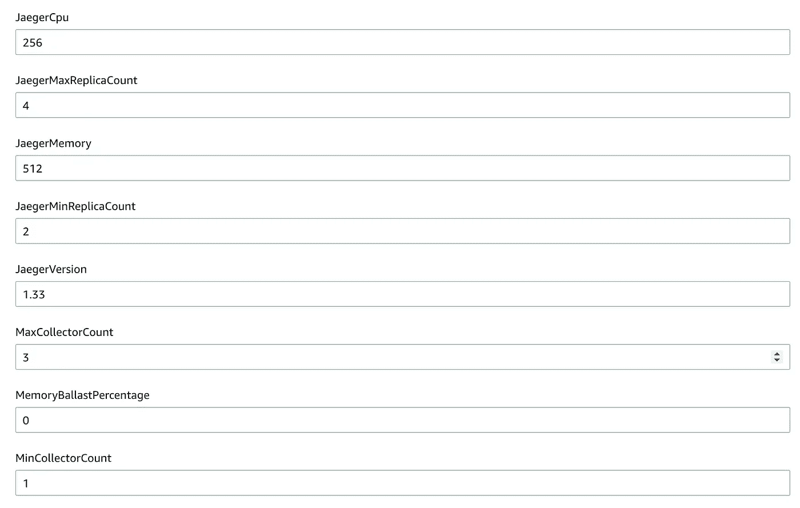
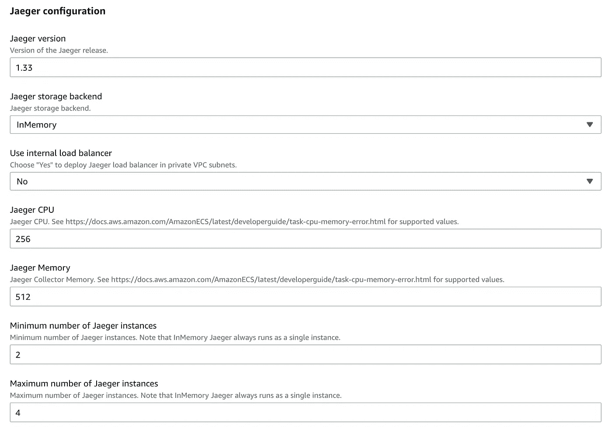
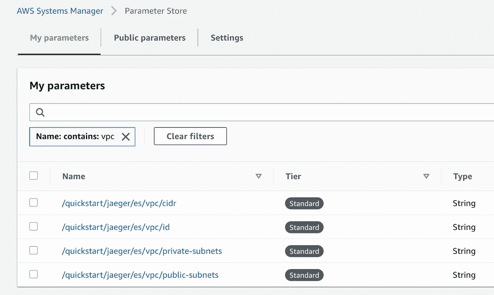

# 朴素的建筑

> 原文：<https://betterprogramming.pub/designing-and-building-modest-architectures-2a0a9978234b>

## 可靠结果的有趣方法

克里斯托夫·马克西米利安在 [Unsplash](https://unsplash.com/s/photos/modest-clothes?utm_source=unsplash&utm_medium=referral&utm_content=creditCopyText) 拍摄的照片

这是一篇关于我应用于我构建的一切的原则的短文——无论是类接口、web API、[作为代码](https://en.wikipedia.org/wiki/Infrastructure_as_code) (IaC)模板的基础设施，还是架构设计。

我没想到会这样。我在考虑构建好的 IaC 模板的原则，但是我很快意识到这些是我经常使用的一般原则。我整理了一个列表，取第一个字母，用 [WordFinder](https://wordfinder.yourdictionary.com/) 得到一个单词。我被这个词有多好逗乐了:

> 谦虚——不想谈论你的能力或成就，不想说你擅长某事，即使你擅长——用来表示赞同。*——*[*朗文当代英语词典*](https://www.ldoceonline.com/dictionary/modest)

这些原则是:

*   有意义的默认值
*   正交性
*   证明文件
*   展开性
*   安全性
*   易测性

所以我们在这里，又一个助记首字母缩略词。总有地方容纳新的。

# 原则

我们先来讲讲原理。为了让您开心，我将提供 IaC 领域的例子来说明它们是非常通用的。

## 有意义的默认值

> 简单的事情应该简单，复杂的事情应该可能。
> T22【艾伦凯】

有意义的默认帮助你最小化使用你的人工制品所需的摩擦。与 API 设计一样，考虑 Python 中的[排序](https://www.w3schools.com/python/ref_list_sort.asp)方法:

注意，默认情况下，`sort`按升序返回项目。您可以通过提供非默认参数来请求降序，如下所示:

类似地，在 IaC 世界中——想象你有一个包含几十个参数的大型云结构堆栈。为了论证起见，[杰格快速启动有 50 多辆](https://kolomiets.github.io/quickstart-jaeger/#_parameter_reference)。尽管如此，所有参数都有默认值，如果您想尝试快速入门，您不必更改它们。这种无摩擦的体验建立了信心，并刺激了进一步的实验。

## 正交性

正交性是软件设计中的一个重要原则。正如[维基百科所定义的](https://en.wikipedia.org/wiki/Orthogonality_(programming))，正交运算只改变一件事而不影响其他事。一个传统的例子是[纯函数](https://en.wikipedia.org/wiki/Pure_function)——纯函数没有副作用，因此，更容易组合多个函数并对它们进行推理。

IaC 示例可能更难理解。假设我们有一个提供以下选项的大型基础架构部署:

*   DNS:已禁用/私有托管区域/公共托管区域
*   存储后端:内存存储/弹性搜索
*   导出度量:禁用/启用

这些是正交选项，您可以根据需要混合和搭配它们，并且您将始终获得有效的组合:

*   无 DNS 配置+内存存储+禁用指标
*   公共 DNS +弹性搜索+启用指标

考虑正交性进行 IaC 设计通常会产生更易于测试和支持的解决方案，因为所有特性都是独立的。

## 证明文件

文档是软件工程中最被忽视的领域之一。好的文档是非常困难的，而且(几乎)没有人喜欢写它。还不清楚哪个更具挑战性——创建复杂的代码还是为其编写有意义的文档。

需要说明的是，我所说的文档并不是指这样的注释:

琐碎的事情不需要解释。它更多地是关于一些更复杂的片段，如果不了解一些背景信息，你很难理解:

像其他事情一样，知道需要记录什么来自实践。你需要写(和读！)很多文档才知道好是什么样子的。如果有疑问，向一个假想的朋友(或一只[鸭子](https://en.wikipedia.org/wiki/Rubber_duck_debugging))解释你的代码，并想想那些可能让他们惊讶的事情(虽然不确定鸭子是否有眉毛)。

在 IaC 领域，文档也扮演着核心角色。有多少次你看到模板带有未记录的参数，所以你不得不猜测你可以使用的正确值？你猜错了多少次？

没有参数文档的云形成模板

将参数进行逻辑分组，并提供有意义的描述和链接到客户可以获得更多信息的网页，这样会更好吗？

一个更加完美的版本，参数被分组并记录在案

还记得你最后一次抱怨缓慢的移动应用程序，不直观的用户界面，或者蹩脚的错误信息吗？这就是你的队友在使用 IaC 模板时的感受。

做得更好；他们活该！

## 展开性

无论是设计一个将被你的队友使用的类，还是构建一个大规模的微服务架构，可扩展性都是你可能需要考虑的事情。很可能，你还没有预想到所有可能的使用场景，所以创建一个开放的解决方案会让你长期受益。

> 这里的 Open 是为了 O in[SOLID](https://en.wikipedia.org/wiki/SOLID)——另一个流行的记忆术，你可能想在下次面试时记住。如果你也和你的面试官谈论谦虚的原则，(对双方来说)会很有趣。

来自 IaC 领域的一个例子:假设您为一个产品构建基础设施，并部署其他团队将使用的资源——VPC、安全组、IAM 角色等。后来，另一个团队想要在 VPC 部署微服务。他们可能需要一个 VPC ID、一个子网列表，可能还需要一个安全组来附加到他们的服务。团队检索这些信息的流程是什么？

他们可以打开 AWS 控制台，获取标识符/arn，并将它们硬编码到服务配置文件中。如果您有多个环境(开发/测试/生产)——让他们为每个环境重复这个过程(并运行)。

我们当然可以做得更好。如果作为 IaC 实现的一部分，我们提供一组带有所有必要标识符的 SSM 参数会怎么样呢？然后，服务团队可以使用定义良好的参数名导入他们需要的位。将这些参数视为您的 IaC“公共接口”——一旦发布，您必须维护它们并确保向后兼容性。

## 安全性

安全是一个包罗万象的原则。如果不知道从哪里入手，就从安全入手。

不过说真的，不管你在构建什么，你都需要考虑安全性。从静态代码分析、容器运行时安全工具、网络扫描器、日志分析、异常检测和 IaC 安全工具——范围非常广泛。 [Thoughtworks 技术雷达](https://www.thoughtworks.com/radar)是一个很好的起点。

## 易测性

我认为这些年来我们已经取得了很大的进步——即使是传说中的[单元测试也值得努力吗](https://stackoverflow.com/questions/67299/is-unit-testing-worth-the-effort) StackOverflow 问题已经停止征求意见了。

为了最后一个适度的原则，让我们假设如下:测试是好的，自动化测试更好。

可测试性设计意味着您的产品可以在开发过程中或者由您的客户在集成过程中进行有效的测试。考虑客户可能希望针对您开发的类/API/IaC/架构进行的负载/集成测试。

继续我们的 IaC 示例，您可以做很多事情来使您的 IaC 代码可测试。从 IaC 提供者的单元测试开始，考虑参数和目标区域的不同组合的实际部署测试。如果您需要支持非标准地区，如中国或 GovCloud，这一点尤为重要。下面是一个 [TaskCat](https://github.com/aws-ia/taskcat) 测试文件的例子(来自 [quickstart-jaeger 库](https://github.com/kolomiets/quickstart-jaeger)):

无论你在做什么，都有一个测试的方法。

# 结论

谦虚并不总是一个好的生活策略，但是设计和建造谦虚的建筑是你应该考虑的事情。为这种恶作剧的胡言乱语道歉。我很快会带着对分布式跟踪和 OpenTelemetry 更严肃的想法回来。