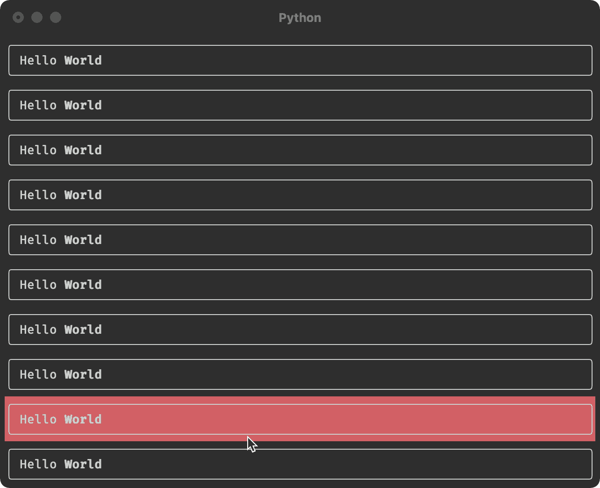
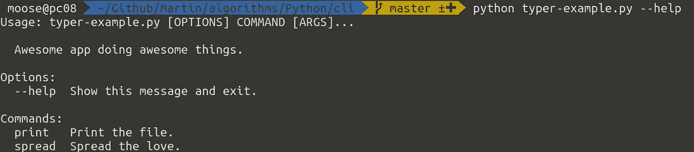
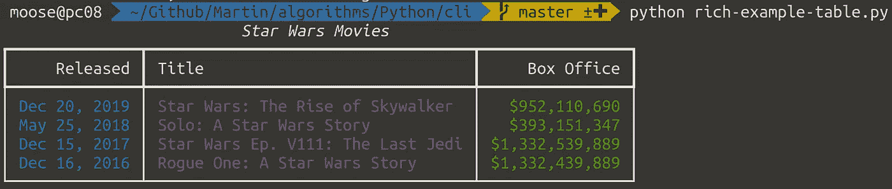
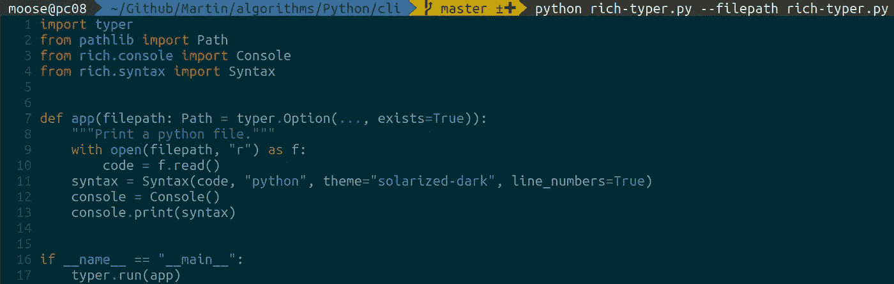
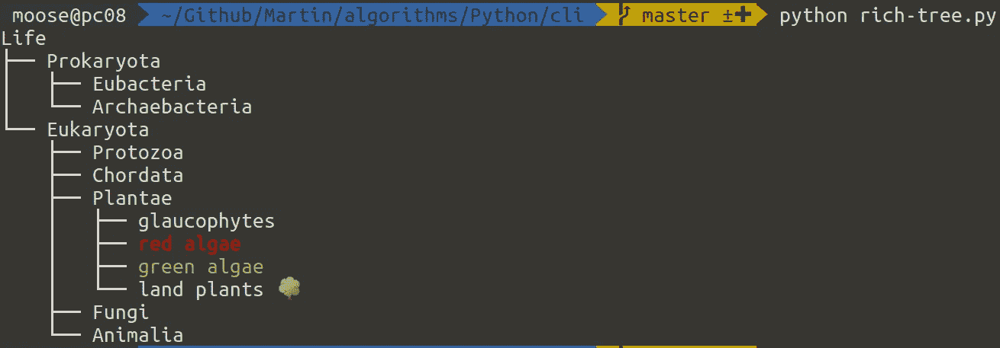
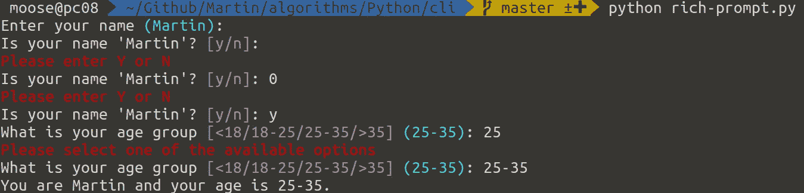
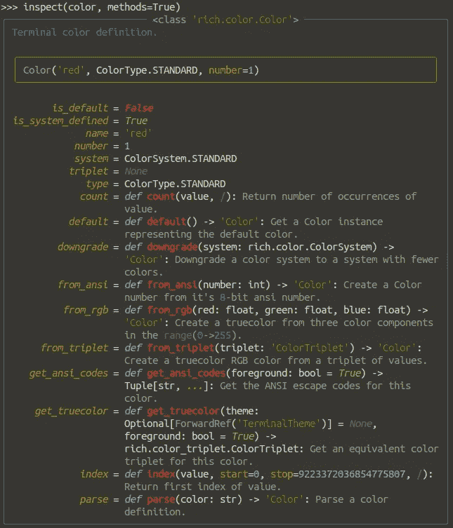
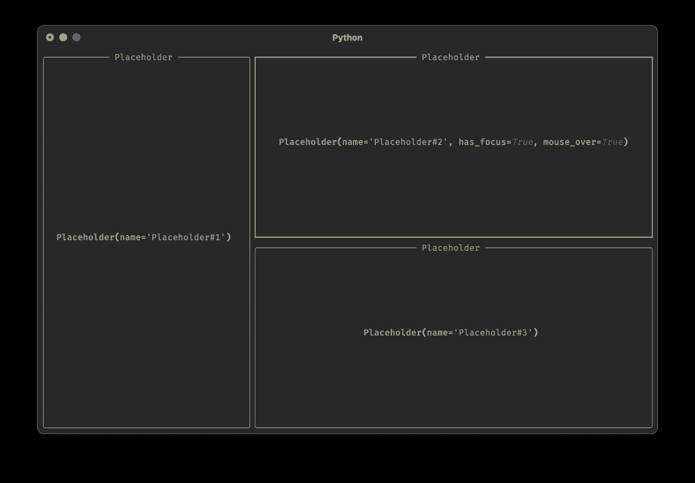
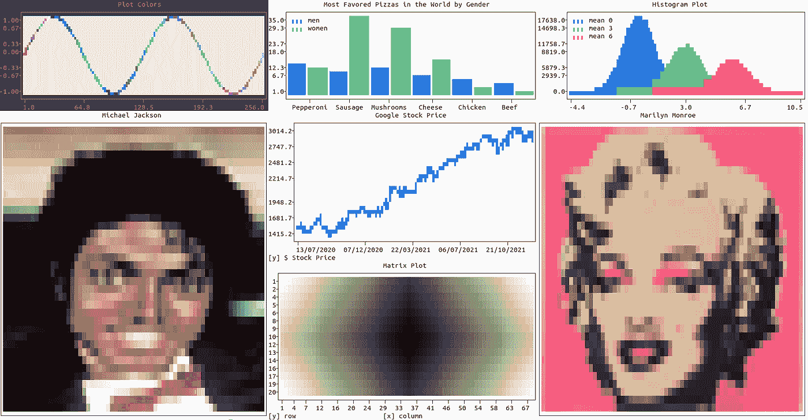

# 用 Python 设计漂亮的命令行应用程序

> 原文：<https://betterprogramming.pub/designing-beautiful-command-line-applications-with-python-72bd2f972ea>

## 五个库，让你的主机更漂亮



Textual 允许您创建这样令人惊奇的终端应用程序，它具有对鼠标光标位置作出反应的交互元素。绝对令人难以置信的是这是可能的。图片来自[自述文字](https://github.com/Textualize/textual#creating-widgets)。

很多人仍然用 Argparse 甚至 Optparse plus `input()`编写他们的命令行应用程序。创建输出通常直接通过`print`和格式化字符串来完成——当您想要打印表格或有一些颜色/强调时，这就变得非常麻烦了。

有四个库可以让你做得更好。我保证最后两个会让你大吃一惊——让我们开始吧！

# №1 和 2:为 CLI 使用 click 或 Typer



[click](https://pypi.org/project/click/) 是 Flask 生态系统中的一个库，用于创建非交互式命令行界面。它解析命令行参数/选项，但是以一种非常聪明的方式使用了 decorators。尤其是创建子命令的选项是一流的

看起来像这样:

```
$ python click-example.py --help                 
Usage: click-example.py [OPTIONS] COMMAND [ARGS]...Awesome app doing awesome things.Options:
  --help  Show this message and exit.Commands:
  print   Print the file.
  spread  Spread the love. $ python click-example.py print --help 
Usage: click-example.py print [OPTIONS] FILEPrint the file.Options:
  --show-meta
  --help       Show this message and exit.
```

[Typer](https://pypi.org/project/typer/) 是 FastAPI 生态系统中的一个库，与 click 非常相似。事实上，它使用了引擎盖下的 click。Typer 充分利用了类型注释，让您可以不费吹灰之力就创建漂亮的命令行界面。

以下脚本创建了与上面的 click 脚本几乎相同的输出:

# №3:使用 rich 进行输出格式化

[Rich](https://pypi.org/project/rich/) 是一个 Python 库，用于终端中丰富的文本和漂亮的格式。它的文档非常优秀，所以我将只使用其中的一些例子。

## 进度条


还有一个基本的例子:

```
**from** rich.progress **import** track

**for** n **in** track(range(n), description="Processing..."):
    do_work(n)
```

## 桌子



## 语法突出显示

控制台中的语法突出显示令人惊叹。显然 [rich.syntax.Syntax](https://rich.readthedocs.io/en/latest/reference/syntax.html) 在幕后使用 pygments，所以你可以在许多不同的[语法高亮主题](https://pygments.org/styles/)中进行选择。



## 树



## 提示和确认



## 额外收获:REPL 的富人

如果您想直接在 Python REPL 中进行漂亮的打印，请尝试以下方法:

```
>>> from rich import pretty
>>> pretty.install()
>>> ["Rich and pretty", True]
```

Rich 还提供了一个`inspect`函数，这个函数可以很好地计算出一个给定的对象能做什么:

```
>>> **from** rich **import** inspect
>>> **from** rich.color **import** Color
>>> color = Color.parse("red")
>>> **inspect**(color, methods=True)
```



# №4:为 TUI 应用程序使用文本

[Textual](https://pypi.org/project/textual/) 是 Python 的一个 TUI(文本用户界面)框架。它允许您与鼠标移动/点击进行交互，让组件监听按键，重新呈现部分屏幕。我一直认为这只有在 GUI 开发中才有可能。疯狂。我喜欢它



Textual 允许您定义用户界面的独立元素，即所谓的小部件。图片来自文字的[自述。](https://github.com/Textualize/textual#widgets)

textual 的自述文件中的以下代码从头开始生成交互式示例:

# №5:终端中的图形



图片由 [Savino Piccolomo 在 PyPI](https://pypi.org/project/plotext/) 上提供(本贴已获得许可)

如果 rich 和 textual 的功能对你来说还不够疯狂，那么试试`plotext`。`[plotext](https://pypi.org/project/plotext/)`直接在终端上绘图:语法与 matplotlib 非常相似，它没有依赖项(除了图像绘图所需的可选依赖项),可以将绘图保存为文本或彩色 HTML🤯

```
import plotext as plt # <--- this is plotext, not matplotlib!
y = plt.sin() # sinusoidal signal 
plt.scatter(y)
plt.title("Scatter Plot")
plt.show()
```

[](https://stackoverflow.com/questions/37288421/how-to-plot-a-chart-in-the-terminal) [## 如何在终端中绘制图表？

### 我正在研究 ML/Theano，最近偶然发现了这个脚本…

stackoverflow.com](https://stackoverflow.com/questions/37288421/how-to-plot-a-chart-in-the-terminal) 

# 摘要

`**click**/**typer**`允许你为你的应用程序创建一个漂亮的静态界面，`rich`给你很多格式选项，比如进度条和表格。如果你想留在终端上，但得到类似 GUI 的特性，试试`textual`和`plotext`。

既然您已经知道了如何用 Python 创建漂亮的终端应用程序，那么您应该确保您的终端也是闪亮的:

[](https://towardsdatascience.com/how-to-get-an-amazing-terminal-91619a0beeb7) [## 如何获得一个令人惊叹的终端

### 在 Windows 和 Linux 中；包括提示、字体和颜色

towardsdatascience.com](https://towardsdatascience.com/how-to-get-an-amazing-terminal-91619a0beeb7) 

```
[Sign up for the Medium membership using my link](https://martinthoma.medium.com/membership) if you haven’t done it yet. It encourages me to write more.
```