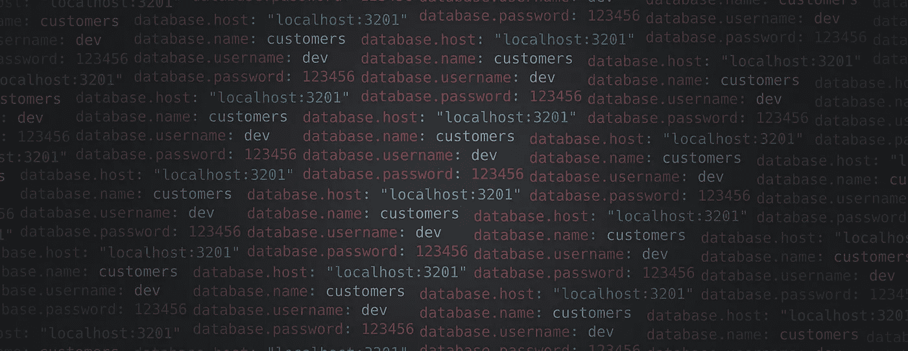
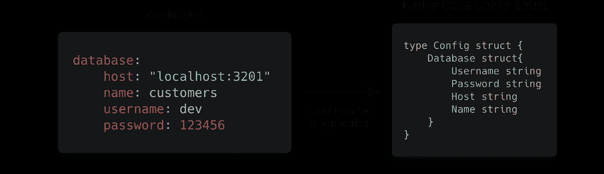
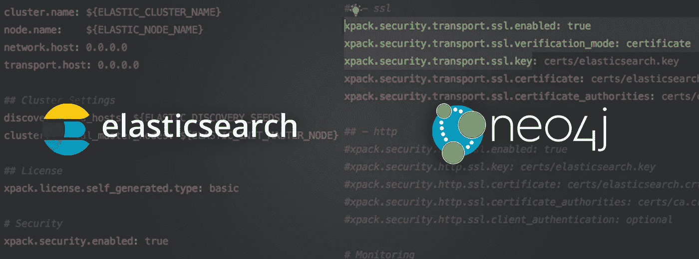
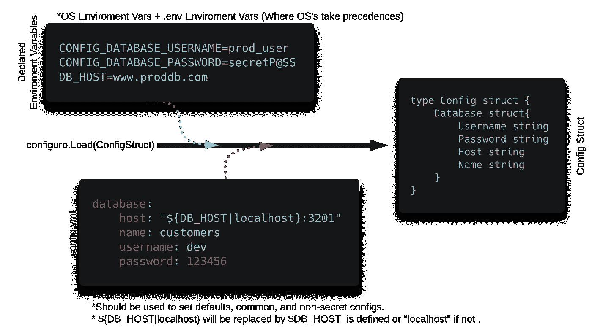

# 为云原生应用设计配置框架

> 原文：<https://betterprogramming.pub/designing-cloud-native-configuration-framework-eefb0b3793cb>

## 经历为现代云原生应用定义配置加载框架的思考过程



图片来源:作者

# 介绍

将配置加载到应用程序中通常是应用程序启动时做的第一件事。硬编码的值、配置文件、环境变量或标志——这些都是您可以使用的不同来源。



将配置从 YAML 文件映射到本机 Go 结构

每个应用程序最终都会构建自己的框架来加载应用程序内部的配置，通常是在第三方库的帮助下。

在本文中，我们将使用定义的方法设计一个框架，允许最多只使用一两行代码加载配置，并抽象出框架本身内部的所有观点，使其适合云原生应用。

## 需要第三方库/框架吗？

是也不是 [Go](https://golang.org/pkg/) 标准库足以构建你的配置加载框架。然而，你要么使用第三方包来读取`stdlib`中不支持的格式，比如 YAML，要么只是为了它们的抽象。

## 第三方库中的问题

第三方库中总是有太多的选项需要配置，因为他们试图提供绝对的灵活性。此外，我经常需要将多个库缝合在一起，以获得想要的结果。

## 趋同；聚集

过了一段时间，我用于配置加载的代码在大多数应用程序中趋于一致。这是我自以为是的配置加载方式，受到新兴的云原生标准、[十二因素应用](https://en.wikipedia.org/wiki/Twelve-Factor_App_methodology)和我使用的成熟工具的影响。将这种方式抽象到一个包中是下一个直观的事情。

# 设计我自己的包/框架

有许多事情需要决定。从文件加载？支持什么格式？从环境变量加载？从标志加载？混合所有这些？如何将原生 Go 结构的键映射到不同的格式？哪些方法更适合新兴的云原生应用？

# 云原生方式

Cloud native 有一些特定的特征，这些特征会影响到我们想要设计的已定义方法的决定。

云原生应用的主要特征之一是配置应该被外部化。这意味着没有硬编码的值。

将配置外部化到配置文件是不够的。您不能将包含您的机密和凭证的配置文件提交给 VCS。那么我们仍然需要某种方式来为我们的生产应用程序提供秘密，而不需要在源代码中包含它。环境变量通常用于此。

> “检验您是否已经正确地外部化了您的凭证和配置的试金石是想象您的应用程序的源代码被推送到 GitHub 的后果。”
> —凯文·霍夫曼，超越十二因素应用

通过查看所有不同的配置加载方法，我总结了以下几点。

## 我们可能需要的东西

1.  **从配置文件加载。**这是最流行的方法。尽管十二因素应用程序不鼓励这样做，因为它很容易将秘密错误地提交给 VCS，但它仍然是一种非常直观的方法，像 Kubernetes 的`ConfigMaps`这样的功能可以很容易地将配置作为秘密加载到应用程序中。
2.  **从环境变量加载。**环境变量通常包含应用程序的秘密(例如，数据库连接字符串)。
3.  **在配置文件中替换环境变量值的方法。**这可以让我们将我们的配置文件跟踪到 VCS，以便进行通用的非机密配置，同时替换来自 en vars 的特定于环境的值或机密，有效地结合了两者的优点。

## 我们不需要的东西

1.  **从远程源加载。**如果配置在远程源中，则获取该配置的责任应委托给操作员。
2.  **配置改变时热重装**。云原生应用程序应该是一次性的，要更改配置，只需重启应用程序。

# 支持这些想法


马克·弗莱彻·布朗在 [Unsplash](https://unsplash.com?utm_source=medium&utm_medium=referral) 上的照片

## 1.看十二因素，三。配置

十二要素应用程序定义了在云原生和容器化世界中现代应用程序的一些原则:

> **"十二因素应用程序将配置存储在*环境变量中。*** Env 变量很容易在部署之间改变，不需要改变任何代码；与配置文件不同，它们被意外签入代码仓库的可能性很小；与定制配置文件或其他配置机制(如 Java 系统属性)不同，它们是与语言和操作系统无关的标准。”——[十二因子，三。配置](https://12factor.net/config)

对所有事情都使用环境变量？但是等等，为什么许多应用程序(现代的也是)仍然使用配置文件？环境变量对于机密和特定于环境的配置有意义，但是我们仍然可以在配置文件中使用通用配置。事实上，跟踪这个文件及其在 VCS 的历史可以让我们更好地了解我们的应用程序。

## 2.着眼于成熟的、广泛使用的项目



查看我使用过的工具，我发现管理配置对一些人来说是一种乐趣和灵活性，但对另一些人来说却非常令人沮丧。我们将看看 [Elasticsearch](https://www.elastic.co/) 和 [Neo4J](https://neo4j.com/) 。两者都是可以有许多配置的数据库，并且同样频繁地部署在裸机和集装箱化环境中。

**弹性搜索**

*   Elasticsearch 使用单个`[elasticsearch.yml](https://www.elastic.co/guide/en/elasticsearch/reference/current/settings.html#config-files-location)`文件保存大多数配置。
*   它支持扩展的[环境变量，这允许您在一个(否则是静态的)`elasticsearch.yml`文件中引用环境变量，并在运行时替换值。](https://www.elastic.co/guide/en/elasticsearch/reference/current/settings.html#_environment_variable_substitution)

```
node.name: ${HOSTNAME}_node     ==>     node.name: elastic1_node
                    WHERE $HOSTNAME=elastic1
```

*   Elasticsearch Docker image 通过传递具有相同键名的环境变量支持[覆盖](https://www.elastic.co/guide/en/elasticsearch/reference/current/docker.html#docker-compose-file) `[elasticsearch.yml](https://www.elastic.co/guide/en/elasticsearch/reference/current/docker.html#docker-compose-file)` [配置](https://www.elastic.co/guide/en/elasticsearch/reference/current/docker.html#docker-compose-file)。因此，设置 ENV `cluster.name=es-docker-cluster`将覆盖`elasticsearch.yml`中设置的`cluster.name`。
*   其他弹性产品支持[在环境变量](https://www.elastic.co/guide/en/beats/libbeat/current/config-file-format-env-vars.html#_specify_complex_objects_in_environment_variables)中表达复杂的嵌套配置。

总之，`elasticsearch.yml`用于设置公共配置，而机密和特定于实例的配置是使用环境变量设置的。

**Neo4j**

Neo4j 使用类似的设置，只有一个`neo4j.conf`文件，并且能够使用环境变量替换值，其中键是大写的，前缀为`NEO4J_`，下划线写成`__`，而`.`写成`_`。

```
neo4j.conf:
node.name: local_node
                                >>>     Loaded Value = prod_node
Enviroment Variable:
NEO4J_NODE_NAME=prod_node
```

## 结论

流行的工具结合了两者的优点，既允许你拥有配置文件，又允许你完全依赖环境变量，并与 12 个因素的应用程序兼容。

配置文件可用于设置应用程序的公共和默认配置文件，在 VCS 使用环境变量进行机密或特定于主机的配置时，这种方式是安全的。

# 定义框架

尝试结合十二因子 App 和 Elasticsearch、Neo4j 等热门项目的不同方法，得出了这个定义。



1.  代码中的应用程序配置是将在应用程序启动时填充的单个结构(具有嵌套结构)。
2.  该配置将被写入一个单独的配置文件(如`config.yml` )
    ，并支持`.json`和`.toml`格式。(包将从文件扩展名推断格式。)
3.  配置应支持使用`${ENV|default}`表达式扩展/替换环境变量。
    示例:`host: www.example.com:**%{PORT|3306}**`，如果未设置包络`${PORT}`(受弹性启发)，则`3306`为默认值。
4.  前缀为`CONFIG_`的环境变量，后跟大写的配置键路径，`_`替换为`__`，而`.`替换为`_`将替换并覆盖配置文件中的配置(受 Neo4j 启发)。
    示例:可以通过设置`CONFIG_DATABASE_PASSWORD`来设置键`database.password`的值*前缀应该是可配置的。
5.  这个包应该是`.env`感知的，加载`.env`文件，如果它存在的话，这对本地开发非常方便。
6.  这个包应该能够在本质上是单行的环境变量中表达复杂/嵌套的结构。这是通过 JSON 将这些结构编码到一个字符串中来实现的，这个包负责解码和解组。
7.  使用快速验证标签(我使用了 [go-playground/validator](https://github.com/go-playground/validator) 标签)和`Validatable`接口提供验证方法来验证加载时的值，包将在每个兼容类型上使用这些接口来调用`Validate()`方法。

# 瞧啊。

```
config := &Config{}// Create Loader and Load Config
Loader, err := configuro.NewConfig()
err = Loader.Load(config)
```

这将根据上面定义的方式加载配置，只需要两行代码。

但在某种意义上，它仍然应该是可定制的。这可以通过将选项传递给`NewConfig(...ConfigOptions)`构造函数来实现:

```
func WithLoadFromConfigFile(Filepath string, ErrIfFileNotFound bool)
func WithoutLoadFromConfigFile()func WithLoadFromEnvVars(EnvPrefix string)
func WithoutLoadFromEnvVars()func WithLoadDotEnv(envDotFilePath string)
func WithoutExpandEnvVars()func WithExpandEnvVars()
func WithoutLoadDotEnv()func WithLoadDotEnv(envDotFilePath string)
func WithoutLoadDotEnv()func WithValidateByFunc(stopOnFirstErr bool, recursive bool)
func WithoutValidateByFunc()func WithValidateByTags()
func WithoutValidateByTags()
```

# 结论

有一个框架来定义您的应用程序配置是必须的。在配置文件中具体化配置是不够的。它应该用于保存公共值，但是我们必须支持在配置文件中替换机密和特定于环境的值的方法。我们可以通过替换配置文件中的环境变量值来实现，或者通过使用环境变量用匹配特定模式的键完全覆盖特定的键来实现。这使我们能够轻松地将我们的应用程序部署到具有不同配置的不同环境中。

你可以在你的下一个项目中使用这个框架。

谢谢大家！