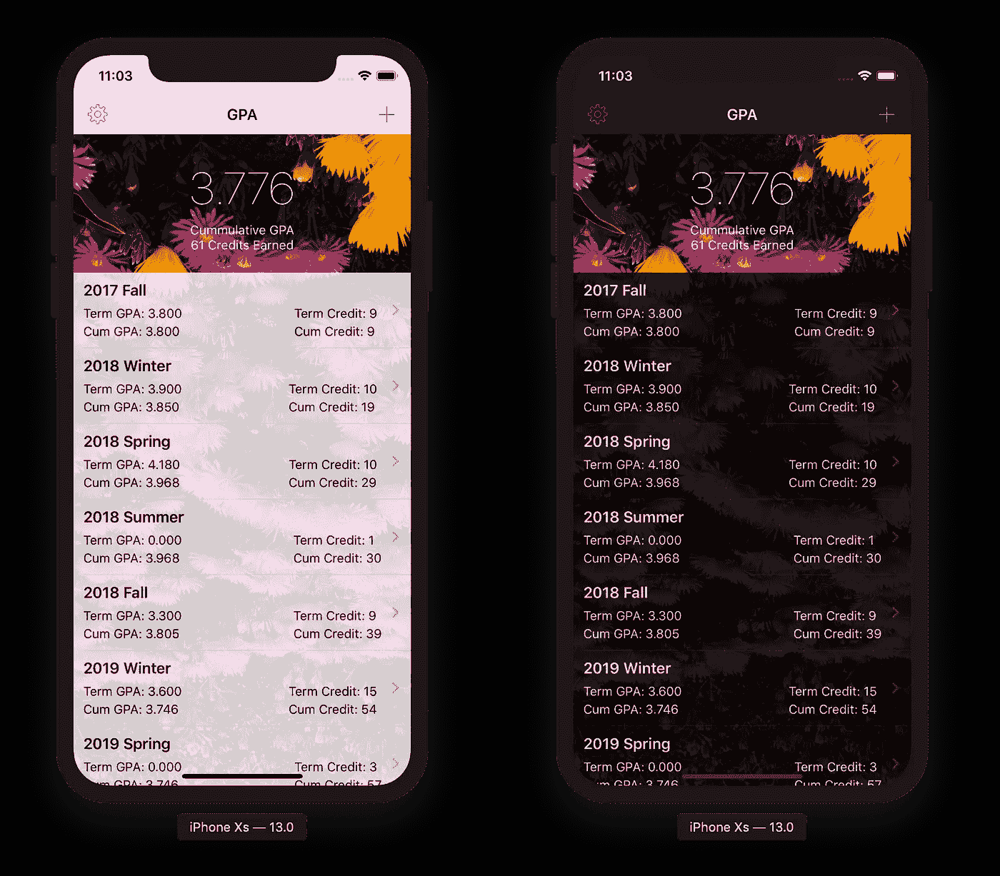
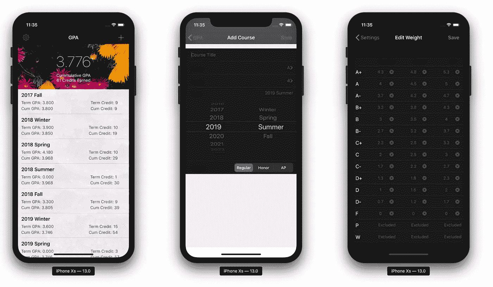
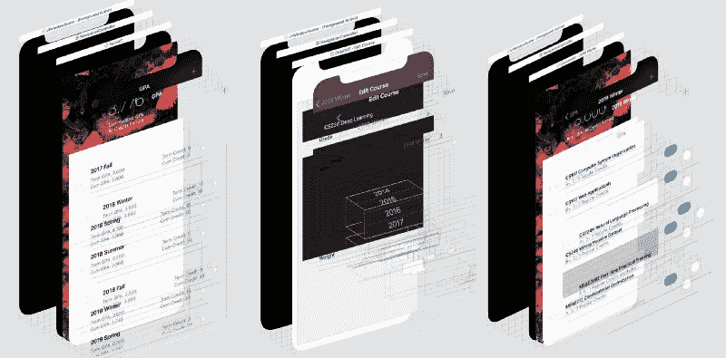
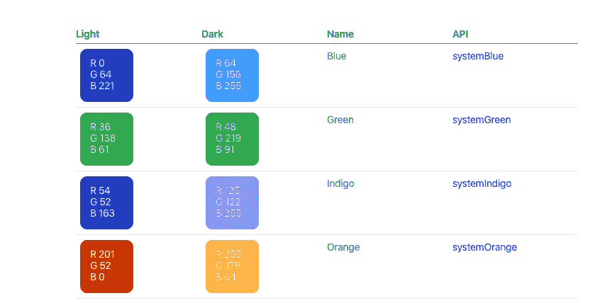
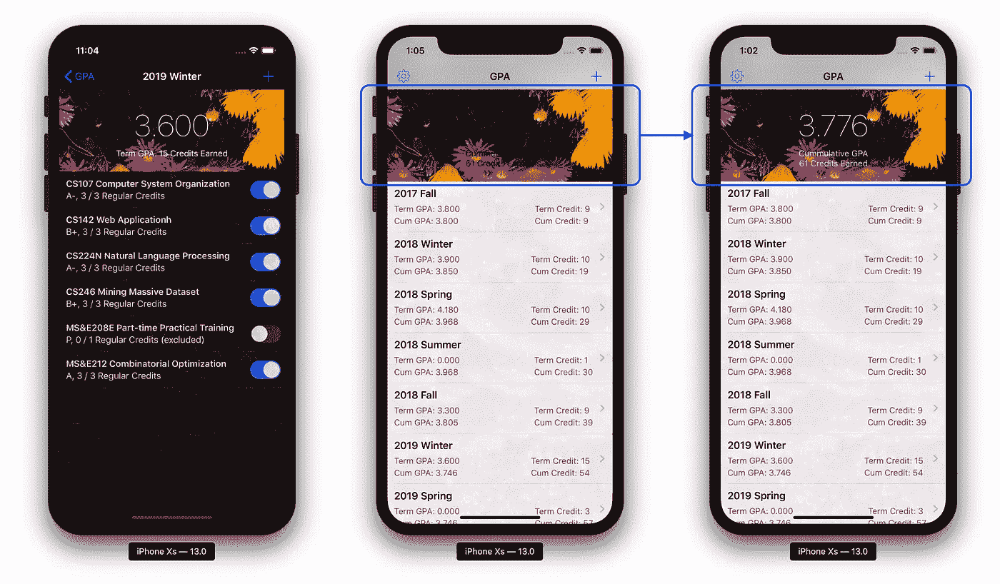
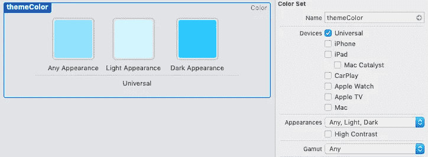
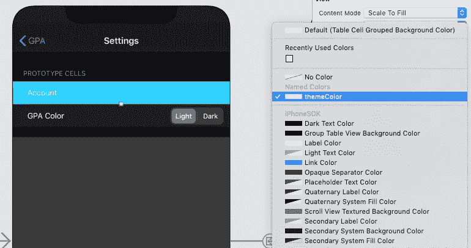

# 在 iOS 13 上设计黑暗模式

> 原文：<https://betterprogramming.pub/designing-for-dark-mode-on-ios-13-fc17a0940639>

## 我如何用三个简单的步骤实现黑暗模式



GPA 监控应用程序

黑暗模式终于在 iOS 13 中到来了。作为一个熬夜的夜猫子，我发现黑暗模式不仅对眼睛有吸引力，而且对大脑有舒缓作用。苹果已经提供了详细的文档。我将尝试以第一人称的视角通过一个例子进行补充，而不是照搬官方文档。我希望它能让你更容易过渡到黑暗模式。

很多年前我建了一个 [GPA 计算器应用](https://apps.apple.com/us/app/gpa-master-a-gpa-calculator/id1480981622?ls=1)。它最初是为纽约大学(我的*母校*)设计的，但我最近将该应用程序改编为通用应用，具有可定制的壁纸和评级尺度(常规、荣誉、AP)。如果你在高中或者大学，千万不要错过这个 app！

# 第一步:检查你的应用程序

要开始使用，你需要升级到 Xcode 11，并在模拟器中开启黑暗模式(需要 iOS 13)。第一次启动黑暗模式的时候，你会注意到很多 UI 控件，包括 UI 开关，标签栏，导航栏，都会自动适应。然而，一些组件将会彻底失败。以下截图显示了一些问题:

*   *左*:表格视图完全不适应黑暗模式；背景还是白色；文字颜色也不对。
*   *中间*:表格视图背景错误；标签文本不可读；导航栏与其他控制器不一致。
*   *右*:整体外观太暗；文字难以辨认。



筛选有问题的视图和 UI 控件

列出所有需要修复的有问题的视图。视图层次调试器是一个很好的工具，可以准确地从重叠的视图中识别出颜色错误的视图。



使用视图层次结构调试器查找有问题的视图

# 第二步:使用系统语义颜色

除非你有一个全职的 UI 设计师，并微调每个 UI 控件的十六进制颜色代码，否则你最好使用自动调整明暗模式的[系统语义颜色](https://developer.apple.com/design/human-interface-guidelines/ios/visual-design/color/)。



[*人机界面指南—颜色*](https://developer.apple.com/design/human-interface-guidelines/ios/visual-design/color/)

对于简单的应用程序，最好在故事板中选择颜色，而不是在控制器中编码(以避免兼容性警告)。首先，我简单地将所有标签、文本字段、文本视图、表格、容器视图的颜色和背景色切换为默认的语义颜色。

# 第三步:微调细节

通过利用语义颜色，苹果已经为你的转变做了大部分的繁重工作。

然而，*你仍然需要在黑暗和光明模式下检查每个控制器，以避免意外*。

请注意，在轻量模式下可能会出现新的问题。例如，GPA 标签在深色模式下自动调整为浅色，在浅色模式下自动调整为深色。不幸的是，在光线模式下，它是不清晰的。所以它的颜色必须明确定义。



微调细节

除了系统颜色，您还可以在资产目录中定义自己的颜色( *Assets.xsassets* )。只需创建一个新的颜色集，您就可以为亮模式和暗模式定义不同的色调。



然后，您可以在故事板的任何地方应用自定义颜色，或者以编程方式调用自定义颜色。



```
// swift
let themeColor = UIColor(named: "themeColor")// objective C
UIColor themeColor = [UIColor colorNamed:@"themeColor"];
```

注意，系统语义颜色适用于 iOS13。资产目录颜色集从 iOS 11 开始提供。为了最大化向后兼容性，我们每次都需要检查 iOS 版本。

我的应用足够简单，所以这三个步骤绰绰有余。对于更复杂的应用程序，您可能还需要检查以下内容:

*   在 UI 控件和导航栏中使用一致的文本颜色、背景颜色和色调。
*   不要全押 iOS 13。你的 app 应该还是向后兼容 iOS 11 的(到【2019 年 8 月，95%的 iOS 设备使用 iOS 11 或更高版本)。
*   在真实设备上测试。我发现真实设备比模拟器更能容忍易读性问题。
*   支持 iPad 分屏多任务。
*   在 App Store 中将黑暗模式截图添加到您的应用程序页面。

# 结论

我是一名 iOS 爱好者，努力保持最新状态。如果您注意到任何可以改进的地方，请留下评论或意见让我知道！在接触你自己的应用程序之前，这里有一些你必须观看的视频:

*   关于颜色层次和材料的演示，请参见 WWDC 2019 [在 iOS](https://developer.apple.com/videos/play/wwdc2019/214/) 上实现黑暗模式。
*   参见 WWDC 2019 [为 iOS 13](https://developer.apple.com/videos/play/wwdc2019/224/) 实现用户界面的现代化，了解新手势、演示和灵活的用户界面设计的演示。