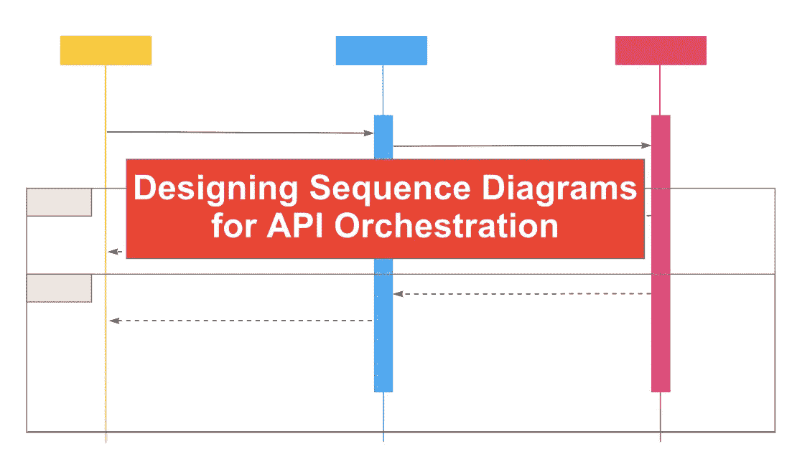
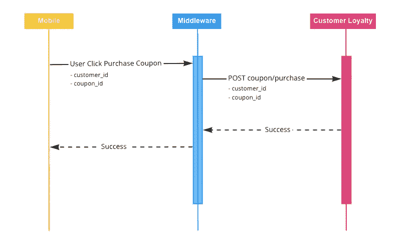
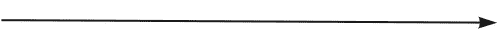
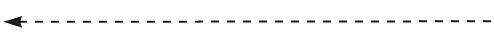
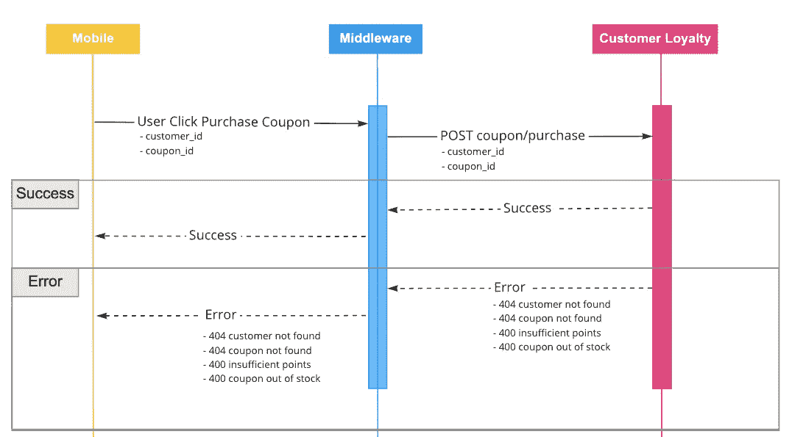

# 为 API 编排设计序列图

> 原文：<https://betterprogramming.pub/designing-sequence-diagrams-for-api-orchestration-113ac45e16df>

## 知道当用户按下按钮时会发生什么



作者图片

序列图有助于可视化当一个动作发生时会发生什么——比如当用户在你的应用程序上按下一个按钮。技术和业务团队通常使用它们来设计解决方案、了解新系统集成的需求和/或记录现有流程。

虽然序列图可以应用于各种场景，但是在本文中，我们将讨论如何为 API 编排设计序列图。您需要熟悉 API 或应用程序接口，它们基本上使不同的应用程序能够通过交换请求和响应来相互通信。我已经写了一篇独立的博客，介绍如何阅读 API 文档。API 编排是将这些独立的调用链接在一起以解决问题的行为。

# 从用例开始

你想解决什么问题？这是你在设计序列图时应该问的第一个问题。API 编排从用例开始，然后是可用的 API——而不是反过来。


由[布雷克·维斯](https://unsplash.com/@blakewisz?utm_source=medium&utm_medium=referral)在 [Unsplash](https://unsplash.com?utm_source=medium&utm_medium=referral) 上拍摄的照片

假设我们正在我们的移动应用程序中实施客户忠诚度计划。这是一个大项目，所以让我们将解决方案设计的范围缩小到一个用例中:*用积分购买优惠券*。

虽然这是大多数客户忠诚度计划的一个基本特征，但实际上要实现这一功能还需要做很多事情。至少，这需要协调以下对象

*   顾客
*   点
*   优惠券

为了做到这一点，我们需要知道客户是谁，他们有多少积分，以及购买优惠券需要多少金额。但是如果他们没有足够的积分或者优惠券数量有限并且已经售完了怎么办？

一个序列图将是完美的。

# 工具


Jo Szczepanska 在 [Unsplash](https://unsplash.com?utm_source=medium&utm_medium=referral) 上拍摄的照片

序列图与工具无关。这意味着您可以自由使用您喜欢的任何工具，因为内容遵循标准格式。如果我们在办公室，我个人喜欢在白板上写下解决方案设计；如果我在家，我喜欢在把想法传到网上之前，在记事本上画出草图。

这里有一些你可以使用的免费在线协作工具

*   弥洛松
*   Draw.io
*   Google Draw

# 设计


安妮·尼加德在 [Unsplash](https://unsplash.com?utm_source=medium&utm_medium=referral) 拍摄的照片

创建序列图的基本构件包括单词、箭头和系统对象。就是这样！当然，我们可以添加更多的维度，但现在让我们保持简单。

回到我们的移动应用程序客户用积分购买优惠券的用例，让我们写下这个活动从开始到结束的典型流程。

```
1\. Customer sign in to mobile app
2\. Home screen
3\. View coupon
4\. Buy coupon with points
```

虽然看起来很简单，但实际上幕后发生了很多事情，每一步都有自己的序列图。然而，出于本文的目的，让我们放大到步骤 4)用积分购买优惠券。

让我们用序列图来探索这个用例。对于这个示例场景，我们将引用以下系统

1.  移动应用程序
2.  中间件
3.  客户忠诚度应用程序

移动应用是客户接触点，中间件是通常用于 API 编排的软件，客户忠诚度应用是我们正在集成的新平台。

对于客户忠诚度应用程序，我们有以下用于购买优惠券的 API:

```
POST coupon/purchase (required: customer_id, coupon_id)
```

`Customer_id`和`coupon_id`是必需的，因为客户忠诚度应用程序需要知道谁在购买什么优惠券。

# 如何阅读序列图



顾名思义，序列图遵循一个序列——或者相关事件相互遵循的特定顺序。

为了阅读这个序列图，我们从左到右，从上到下开始。

从顶部开始，我们有不同的系统。


系统

实线箭头表示从一个系统向另一个系统发出的请求。



请求

虚线箭头是从接收者到请求者的响应。



反应

## 把它放在一起

```
1\. User clicks purchase coupon in Mobile
2\. Request sent to Middleware
3\. Middleware sends POST coupon/purchase to Customer Loyalty
4\. Customer Loyalty App returns success to Middleware
5\. Middleware returns success to Mobile
```

这是一个令人高兴的案例，客户有足够的积分来购买仍在供应的优惠券，因此结果是他们的数字钱包中有一个新的优惠。但是，如果在购买过程中出现问题，如积分不足或优惠券库存不足，会发生什么情况呢？我们如何处理这些情况？

幸运的是`POST coupon/purchase`有内部验证，检查客户和优惠券是否存在，还有多少优惠券，以及客户是否有足够的积分购买它。如果这些验证中的任何一个失败，那么 API 将返回一个错误，发出请求的调用者或系统可以处理这个错误。

这就是使用 API 的好处。

大部分工作是在客户忠诚度应用程序中完成的，它被抽象成一个*T2 API 调用。打电话的人不在乎工作如何完成，只要能完成就行。接收方负责监听请求、处理请求并给出适当的响应。*

# 交替流动

让我们看看使用另一个流程的序列图中的错误处理会是什么样子。



我们添加了两个额外的框来突出显示成功和错误的不同请求-响应场景。我们已经介绍了成功，所以让我们来看看错误响应。这用 HTTP 状态代码表示，后跟错误描述。

*   404 找不到客户
*   404 找不到优惠券
*   400 分不够
*   400 优惠券缺货

如果响应成功，那么它将遵循成功路线。但是，如果响应有错误，那么它将遵循错误路线。在这两种情况下，移动应用程序都可以处理响应并向客户显示适当的消息。

就是这样！

# 结论

序列图可以用来设计、分析和理解不同的工作流和系统集成。我们今天使用的例子是一个简单的用例，用来介绍这个概念。你可以用序列图做更多的事情，以及我们没有提到的更高级的构建模块，比如异步请求、递归、循环等等。

对于那些寻找实践活动的人来说，可以考虑在客户忠诚度应用程序中为`POST coupon/purchase`背后的业务逻辑创建一个序列图。

快乐解决！