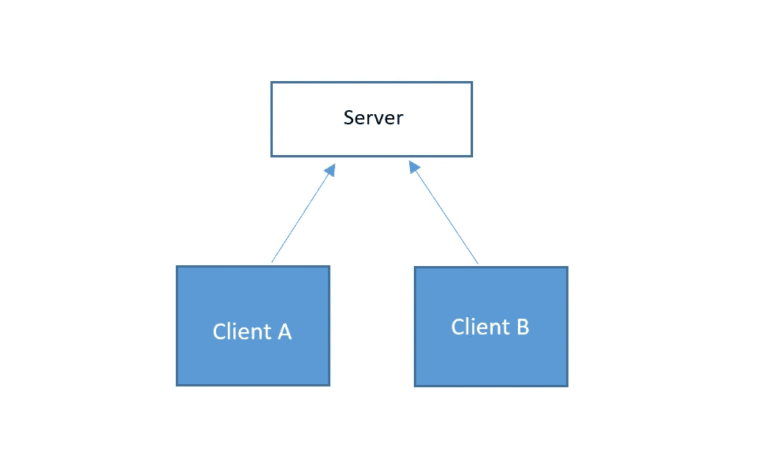
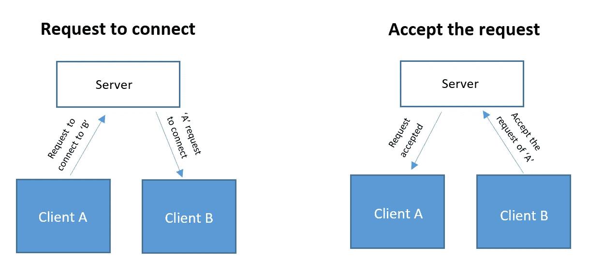
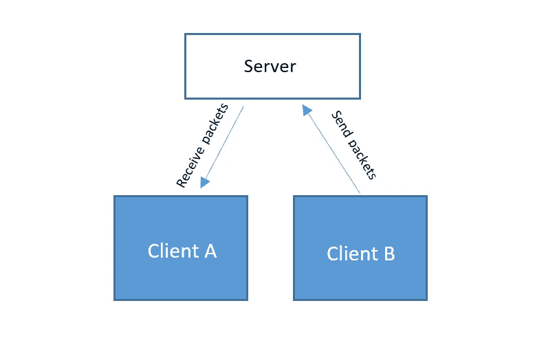
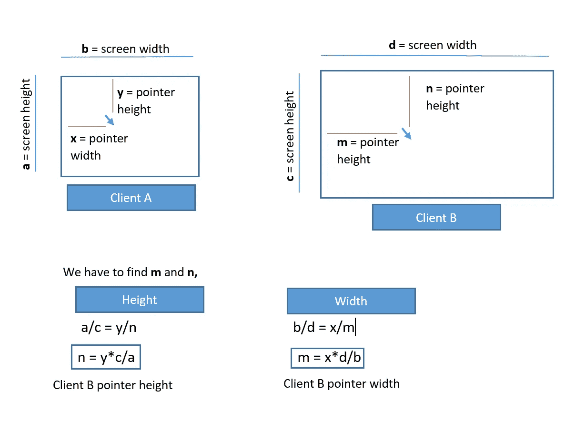

# 用 Nodejs、Electron 和 Socket.io 构建一个桌面共享应用程序

> 原文：<https://betterprogramming.pub/desktop-sharing-application-with-nodejs-electron-and-socket-io-af389cb21d93>

## 分 3 步完成


什么是桌面共享应用？

桌面共享应用程序是一种允许通过您的桌面上提供的界面在另一个人的桌面上进行远程访问和远程协作的产品。这种软件的一个著名例子是 anyDesk、TeamViewer 等。

还有一种屏幕共享方式，我们与其他用户共享整个或特定的窗口，但它不涉及任何操作，您只能查看屏幕，如缩放、google meet 等。

# **使用的技术堆栈:**

*   节点. js
*   电子. js
*   Socket.io
*   Robot.js

## 我们可以使用 webRTC 进行屏幕共享，那么为什么要考虑 Socket.io 呢？

我们可以通过 webRTC 轻松实现屏幕共享，所有这些都可以通过其客户端 API 实现，但问题是 webRTC 在 stun 服务器上仅提供有限的免费用户通信，为了扩大这一限制，我们必须使用第三方依赖，定制有点困难。因此，如果你有没有第三方依赖性的限制，并有定制的要求，那么使用自己的服务器将是一个很好的选择。

让我们开始构建它的主要功能。如果你只是来看代码，那么你可以在[***git***](https://github.com/jiaabid/screen-sharing-app.git)***上找到完整的代码。*** 下面将是基本的通信结构。

**步骤 1** :客户端将连接到 socket 服务器，通过 socket 服务器它们将相互通信。



**步骤 2** :任何客户端都可以请求通过服务器连接到任何其他客户端。假设客户端 A 想要连接到客户端 B，那么客户端 A 将请求服务器连接到客户端 B。服务器将把该请求转发给客户端 B。



**第三步**:如果客户端接受请求，将通过服务器通知源客户端。客户端 B 将接受客户端 A 的请求，服务器将通知客户端 A。然后客户端 B 将开始向客户端 A 发送数据包



这是应用程序的基本结构，为了快速概述，我将应用程序分为如下 3 个部分:

*   如何通过 socket 服务器共享屏幕数据？
*   如何在共享屏幕上执行操作？
*   指针精度算法。

# 如何通过服务器共享数据？

对于数据共享，我们通过 socket.io 实现了客户端和服务器的实时通信。

假设我们有两个客户端 A 和 B，A 将获取客户端 B 的远程访问权限，因此一旦客户端 B 接受连接请求 A，客户端 A 将开始接收客户端 B 的屏幕截图。

因此，服务器将向客户端 B 发出`ready-for-data`事件，它将设置 500ms 的连续时间间隔，并截取屏幕截图，通过`screen-data`事件发送给套接字服务器，如下所示:

```
*****client/controller/screen.controller.*js****//take screen shots and send the data to original screen**socket.on(“ready-for-data”, data => {data = JSON.parse(data)
data.status = true
status = trueinterval = setInterval(function () {screenshot().then((img) => {
let dimension = sizeOf(img)
var imgStr = new Buffer.from(img).toString(‘base64’);
var obj = {};
obj.room = data.myID;
obj.image = imgStr;
obj.dimension = dimension**//sending data to server**
socket.emit(“screen-data”, JSON.stringify(obj));
})
}, 500)
})
```

现在在服务器上，数据被接收并通过`connected-screen-data`事件发送到客户端 **A** ，如下所示:

```
*****server/index.js***socket.on(“screen-data”, function (data) {
data = JSON.parse(data);
var room = data.room;
var imgStr = data.image;//check if the connection exist of a client A
if (roomMap.has(room)) {**//emitting to client A**
socket.broadcast.to(room).emit(‘connected-screen-data’, {
imgStr,
dimension: data.dimension});}})
```

客户端 **A** 将通过`connected-screen-data`监听器接收该数据，并将其设置为整个屏幕画布。为了向屏幕发送数据，将使用电子的 IPC。

(*进程间通信(IPC)是呈现器和主进程通过其进行交互的电子特性*)

```
*****client/controller/screen.controller.js***//listening to the screen packets
ipcMain.on(“screen-packets”, (e, arg) => {socket.on(‘connected-screen-data’, data => {if (data.imgStr) {
e.reply(“screen-packets-reply”, data)
}
})
})
```

这就是两个客户端共享屏幕的全部过程。

# 如何在共享屏幕上执行操作？

正如我们所看到的，我们是在屏幕截图的帮助下共享屏幕的，那么问题来了，我们将如何在共享的屏幕上执行任何操作，如移动光标，点击任何地方，或打字等。所以对于这些操作，我们使用了一个名为`[Robotjs](http://robotjs.io/)`的库。这是一个桌面自动化库，通过它我们可以控制鼠标、键盘和阅读屏幕。

在我们的应用程序中，每当远程客户端(客户端 **A** )移动光标、点击或在屏幕上键入时，服务器上就会发出具有相应坐标的事件，然后服务器将其转发给主机客户端，在主机客户端`robotjs`获取这些坐标并执行操作。

例如，当客户端 A 点击共享屏幕时，`ipcRenderer`向`ipcMain`发送`mouse-click`事件，并将其发送给服务器。

```
*****client/js/screen.js***//when user click on the screen
imgElement.addEventListener(“mouseup”, e => {
ipcRenderer.send(“mouse-click”, {direction:e.which , double:false})
})*****client/controller/screen.controller.js***//host screen will send the server event to emit click event to original screen
ipcMain.on(“mouse-click”, (e, arg) => {socket.emit(“mouse-click”, { remoteID: Creds.remoteID, direction: arg.direction, double: arg.double })})
```

现在，客户端 B 将监听套接字`mouse-click`事件，并且`robotjs`将执行该动作。

```
*****client/controller/screen.controller.js***//click the original screen
socket.on(“mouse-click”, function (data) {let direction = “left”
switch (data.direction) {
case 1:
direction = “left”
break;
case 2:
direction = “middle”
break;
case 3:
direction = “right”
break;
default:
break;
}//**robotjs function to click**
robot.mouseClick(direction, data.double);
})
```

查看`robotjs` [的完整文档，点击](http://robotjs.io/) 查看其他操作——这是一个令人惊叹的桌面控制库。

# 指针精度算法:

在所有这些忙乱之后，出现的主要问题是指针的准确性，因为我们没有限制共享屏幕的大小，所以无论你的屏幕大小如何，共享屏幕都是一样的。因此，为了匹配不同的屏幕指针精度，我们使用了以下算法:



作者图片

这就是保持指针精度的方法，并在名为`mouse-move`的事件下使用。

# 结论

这就是我的屏幕共享应用程序的三个主要步骤。代码中还有很多东西——比如发送连接请求、设置密码和通过密码访问遥控器，以及双向共享文件。

到目前为止，我还没有遇到任何滞后的问题，因为屏幕数据是以 base64 字符串的形式共享的，仍在改进中，并公开征求建议。还计划增加更多的功能，比如聊天和通话。

你可以在我的 GitHub 库[这里](https://github.com/jiaabid/screen-sharing-app.git)找到完整的应用代码。