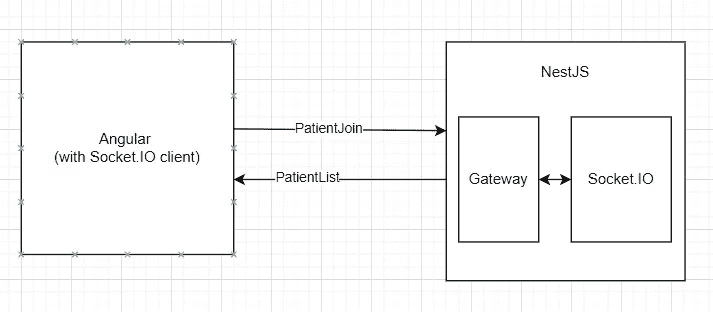
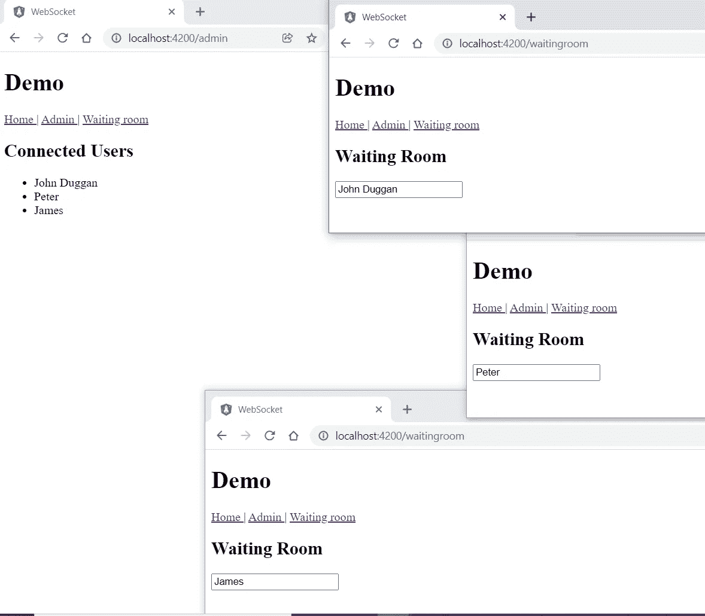

# 使用 NestJs 和 Socket 检测 Angular 中的活跃用户。超正析象管(Image Orthicon)

> 原文：<https://betterprogramming.pub/detect-active-users-in-angular-using-nestjs-and-socket-io-1efaf336b267>

## 插座之间的比较。IO 和信号员


约翰·巴克利在 [Unsplash](https://unsplash.com/s/photos/connect?utm_source=unsplash&utm_medium=referral&utm_content=creditCopyText) 上拍摄的照片

几年前，我写过一篇文章“[使用 SignalR](https://medium.com/p/fad0b9d56101) 检测 Angular 应用中的活跃用户”。这并不是很久以前的事，但是技术发展很快。在实时 web 应用程序的世界里，Socket。木卫一正在崛起。

信号器和插座。我和她有很多相似之处。两者都是为 web 客户机和服务器之间的实时双向通信而设计的，并且都使用 WebSocket 作为默认的传输协议。

除了相似之处，SignalR 也是。Net 生态系统和 Socket。IO 是为 NodeJS 打造的。但是在实际操作中，Socket 又有多大的不同。IO 与 SignalR 相比？有哪些利弊？

为了回答这些问题，我使用 NestJS 和 Socket.IO 重写了前一篇文章中的示例应用程序。

让我告诉你这个实验是如何进行的。

*向前跳跃:*

*   [用 NestJs 设置一个 WebSocket 服务器](#6129)
*   [配置 NestJS 网关](#2824)
*   [用 Socket 接收和广播消息。IO](#596f)
*   [使用缓存管理器管理用户会话数据](#1ad0)
*   [角度客户端](#7ae4)
*   [插座。IO vs 信号员](#5ebc)

## 概观

下图说明了这个人为示例中使用的技术堆栈。如果你读了我以前的博文，你会发现主要的区别是我们使用了 NestJS/Socket。木卫一而不是。网络核心/信号 r。



# 用 NestJs 设置 WebSocket 服务器

NestJS 提供了 WebSocket 模块，它支持两个 WebSocket 平台(S [ocket。](https://github.com/socketio/socket.io) IO 和 [ws](https://github.com/websockets/ws) )开箱即用。在本文中，我们将使用 Socket.IO。

首先，让我们创建一个新的 NestJS 应用程序并安装必要的依赖项。

```
nest new nest-waiting-room 
cd nest-waiting-room
npm i --save @nestjs/websockets @nestjs/platform-socket.io
```

在设置好 NestJS 应用程序框架之后。我们需要为新的应用程序添加一个网关。

# 配置 NestJS 网关

[网关](https://docs.nestjs.com/websockets/gateways)在 NestJS 中引入，作为 web socket 平台的平台无关接口。我们可以用 NestJS CLI 生成一个网关，如下所示。

```
nest g gateway app
```

生成的网关类如下所示:

```
@WebSocketGateway() 
export class AppGateway implements OnGatewayInit, OnGatewayConnection, OnGatewayDisconnect {
....
}
```

请注意，这个类是用`@WebsocketGateway()`修饰的，它让我们可以访问 web socket 功能。

我们还实现了 3 个生命周期挂钩:`OnGatewayInit`、`OnGatewayConnection` 和`OnGatewayDisconnect`。从它们的名字来看，它们是不言自明的。

为了允许 angular 客户端从不同的域访问网关，需要如下启用 cors。

```
@WebSocketGateway({ cors: true })
```

# 用套接字接收和广播消息。超正析象管(Image Orthicon)

`Gateway`类的核心是处理传入和传出的事件消息。

为了监听传入的消息，我们使用`@SubscribeMessage` decorator。

要向所有连接的客户端发送一个事件，您需要使用`WebSocketServer`装饰器并使用本地 WebSocket 实例发出一条消息:

```
@WebSocketServer() server;// Boardcast message to all connected clients
this.server.emit('patientList', activeUsers.map(x=> x.userName));
```

# 使用缓存管理器管理用户会话数据

与 SignalR 版本类似，我们使用内存缓存来存储状态。这主要是为了说明。在实际项目中，您可能会考虑将状态持久化到数据库或 Redis 中，以使其更具可伸缩性。

用户会话数据由`UserSessionCache` 类管理。`UserSessoinCache` 类建立在[缓存管理器](https://github.com/BryanDonovan/node-cache-manager)之上。它公开了用户会话数据的 CRUD 操作。

在更新缓存数据时，我们将这个示例应用程序的到期时间设置为 60 分钟。

当用户会话数据被缓存时，我们也更新了`lastConnectedTime` 属性。如果比当前时间多 60 秒，我们认为用户已经断开连接。

# 棱角分明的客户

使用插座。Angular 中的 IO 客户端，我们需要安装 [ngx-socket-io](https://github.com/rodgc/ngx-socket-io#readme) ，这是一个在 socket 上的 Angular 包装器。IO 客户端库。

```
npm i @ngx-socket-io --save
```

在 App.module.ts 中，我们将套接字服务器配置声明如下。

```
const config: SocketIoConfig = { url: 'http://localhost:3000', options: {} };
```

我们还需要在`AppModule`中导入`SocketIoModule` 。这将在`AppModule`加载时初始化客户端到套接字服务器的连接。

```
imports: [
...,
SocketIoModule.forRoot(config)
]
```

我们创建一个`WebScoketService` 来处理客户端事件:

在上面的代码片段中，`userPing` 函数调用`socket.emit`将事件发送到 socket 服务器。这个函数每秒在`waitingroom` 角度组件中被调用一次，这样服务器就会知道用户在页面上是活动的。

```
this.interval = setInterval(() => {
   this.service.userPing(this.userName);
}, 1000);
```

候诊室页面也有一个可观察到的`activeUsers$`。它从套接字订阅。IO 服务器`patientList`事件，因此连接用户的任何变化都会实时显示。

最终结果与 SignalR 版本完全相同！



## 插座。IO 与信号 r

总的来说，我喜欢 Socket.IO。它的设置非常简单，并且提供了我需要的所有功能。

与使用 SignalR 的实现相比，我只需要编写一半的代码就可以获得客户端和服务器端相同的特性。这直接证明了使用 Socket.IO 时需要的样板代码要少得多。

虽然我们在这个简单的例子中只使用了最基本的功能，但是值得强调一下这个套接字。IO 提供了许多其他重要的特性。它包括`Rooms`，一个任意的通道，可用于向客户端子集广播事件。它还支持负载平衡和数据流。

# 摘要

插座。IO 支持 web 客户端和服务器之间的双向通信。它在 WebSocket 上添加了一个很好的抽象，并公开了足够多但不太复杂的 API 来完成工作。

使用套接字的另一个主要好处是。IO 是活跃和充满活力的 NodeJS 社区和生态系统。我个人比较喜欢用 NestJS/Socket。未来项目的 IO，除非项目是基于。Net 平台。

Angular 客户端示例的源代码是[这里是](https://github.com/sunnyy02/ngWebsocket)，NestJS 示例可以在[这里](https://github.com/sunnyy02/nestWaitingRoom)找到。