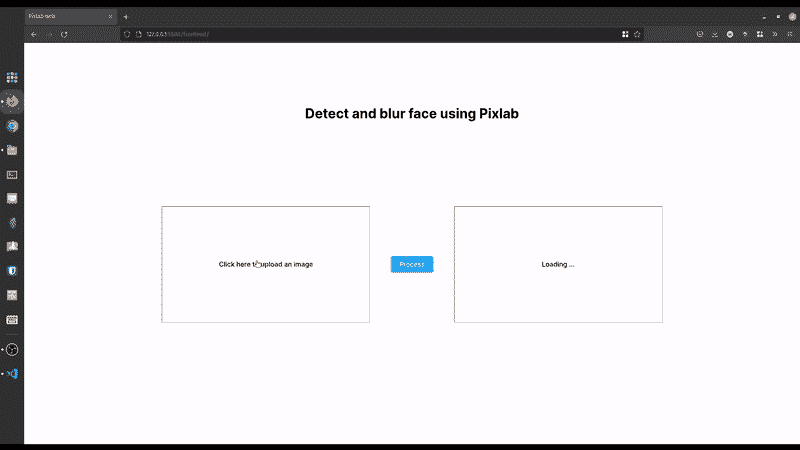

# 使用 JavaScript 检测和模糊网站上的人脸

> 原文：<https://betterprogramming.pub/detect-and-blur-human-faces-on-your-website-8c4a2d69a538>

## 能够检测和模糊人脸的人工智能可以在网站的数字时代的内容调节中发挥关键作用。


使用 Pixlab demo 检测和模糊人脸

内容适度对于一个网站来说是非常必要的。如果你正在开发一个用户可以上传图片的网站，那么你必须格外小心。你不能相信你的用户。如果他们上传一些令人反感的内容，那么有时你作为网站的创建者，成为它的受害者。

在每个现代 web 2.0 应用程序中，都存在一个内容审核系统。一些受欢迎的网站，如脸书、Instagram 和 Twitter，都有自动和手动的内容审核系统。

但是对于小型团队和个人开发人员来说，手动内容审核是不可行的，也不太经济。因此，我们可以使用基于人工智能(AI)的自动化来检测任何令人反感的内容，并将其模糊化。

构建基于人工智能的自动化并不容易。你必须雇佣一个有才华的开发人员，并且应该有很多数据来训练你的 AI 模型。但是我们可以走捷径。市场上有很多软件即服务(SaaS)平台，可以在这方面帮助我们。

[Pixlab](https://pixlab.io/) 是一个 SaaS 平台，可以给他们最先进的人工智能模型提供一个用户友好的应用编程接口(API)。您可以轻松地将这些服务集成到您的应用中。查看此[链接](https://pixlab.io/cmdls)了解更多信息。

# 议程

在本文中，我们将使用 P [ixlab API](https://pixlab.io/cmdls) 制作一个 web 应用程序。我将使用普通的 JavaScript。

你可以对任何框架使用相同的逻辑，比如 react、Vue、Angular 等等。由于我们大量使用 Pixlab API，请确保获得一个 [API 密匙](https://pixlab.io/pricing)以便使用。

在 web 应用程序中，首先，我们获取用户输入的图像。然后我们检测图像中的人脸。最后，我们模糊图像的面部，并在我们的应用程序中渲染最终的图像。

我们将使用`[facedetect](https://pixlab.io/cmd?id=facedetect)` API 端点来检测图像中的人脸。然后，我们向 [mogrify](https://pixlab.io/cmd?id=mogrify) endpoint 发出另一个请求，使用从`facedetect` API 收到的面部坐标来模糊我们的图像。

我们项目的最终版本将是这样的。



现场视频演示

由于我们正在制作一个 web 应用程序，由于 CORS 的限制，我们不能直接请求 Pixlab 服务器。CORS 限制是为了保护用户。你可以在这里了解更多关于 CORS 的信息。因此，我们使用 Nodejs 制作一个代理服务器，并在那里启用 CORS。然后，我们从前端向代理服务器发出所有请求，并将这些请求路由到 Pixlab APIs，以绕过 CORS 限制。

说够了，让我们制作我们的 web 应用程序。

# 项目设置

在深入学习教程之前，让我们先搭建一下我们的项目。我们需要在这个项目中的前端和后端(作为代理服务器)。因此，在项目根目录下创建两个名为`frontend`和`backend`的目录。

在你的前端目录中，创建 3 个文件，分别命名为`index.html`、`style.css`、`index.js`。在 VSCode 中安装 live-server 来服务这些静态文件。

在后端目录中，通过运行以下命令启动一个 npm 项目。

```
cd backend
npm init -y
```

因为我们要将 express.js 应用程序作为代理服务器，所以让我们一次性安装所有的依赖项。

```
npm install axios cors dotenv express express-fileupload form-data
npm install — save-dev nodemon
```

现在用这两个命令更改您的`package.json`文件的脚本部分。

```
"scripts": {
    "dev": "nodemon server.js",
    "start": "node server.js"
  },
```

现在在你的后端目录中创建`server.js`文件。

在所有这些设置之后，项目结构将看起来像这样。

```
.
├── backend
│   ├── package.json
│   ├── package-lock.json
│   └── server.js
└── frontend
    ├── index.html
    ├── index.js
    └── style.css
```

让我们快速了解一下所有这些 npm 包在我们的项目中有什么用。

1.  `axios` : Axios 是 Node.js 界非常流行的 http 客户端。它帮助我们非常容易地编写复杂的查询。
2.  `cors` : cors 库用于在每个对我们服务器的请求中添加 cors 报头。您还可以使用该软件包对 CORS 策略进行大量定制。
3.  这个包帮助我们在 Node.js 项目中创建和使用环境变量。这是隐藏你的 API 密匙或其他秘密所必需的，你不想把它们推给 GitHub。
4.  这个库不需要解释。这是 Node.js 世界中一个非常受欢迎的具有中间件功能的服务器库。
5.  `express-fileupload`:这个库作为中间件工作，让我们可以访问从客户端上传的所有文件。
6.  `form-data`:该包提供了 Nodejs 环境下的 browser [FormData](https://developer.mozilla.org/en-US/docs/Web/API/FormData) 对象。为了向某个 API 发出多部分/表单数据请求，我在这个项目中使用了这个包。
7.  这是一个开发依赖项，每当 javascript 文件中的一些代码发生变化时，它会自动重启服务器。

# 让我们将代理节点设为服务器

正如我之前提到的，由于浏览器 CORS 政策，我们不能从我们的前端应用程序直接调用 Pixlab API。因此，我们将制作一个 Node.js 服务器，代理我们对 Pixlab API 的请求。

> 在这一节中，我交替使用了客户端和前端。请记住这一点。

## 代理用户将图像上传到 Pixlab API

这是我们项目中代理上传图像的最棘手的部分。Pixlab 倾向于接受在线图像链接来处理我们的请求。为了将我们的本地图像上传到存储桶，Pixlab 还提供了一个开发人员友好的 API，称为 [store](https://pixlab.io/cmd?id=store) 。

这个 API 接受 POST 请求。请求的主体应该是包含用户上传的图像和 API 密钥的多部分/格式数据。如果请求成功，API 会获取您的图像并将其上传到在线存储桶，并提供该图像的链接。

在我们的代理服务器中，我们将用户文件输入到`/upload`路径中。我们使用`express-fileupload`包访问用户上传的图像。将这个包作为中间件添加后，我们可以使用`req.files`方法访问用户上传文件。

然后，我们使用我前面提到的`form-data` 包来构造我们的多部分/表单数据请求。在表单数据中附加用户上传的图像和 API 密钥。您可以在这里使用`dotenv`包来隐藏您的 API 密钥，并将其作为环境变量来访问。

在构建了多部分/表单数据之后，我们将请求提交给 Pixlab API。然后不管我们得到什么响应，如果是 200，我们就把它作为对用户的响应。

我们的`/upload`路径的代码如下所示。

如果这个请求成功，那么我们将获得一个到用户上传图像的链接。我们保留这个链接，以便在`facedetect`和`mogrify` API 请求中使用。

## 代理人脸检测 API(人脸检测)

现在让我们使用 Node.js 制作一个 **Facedetect** API 代理。要读取用户发送的 JSON 数据，在我们的服务器中使用`express.json()`中间件。

首先，我们获取用户发送的图像 URL(来自我们之前的请求),并用这个图像 URL 和 Pixlab API 密钥向 Pixlab API 发出 get 请求。然后，我们只需将响应从服务器发送到客户端。

路径`/facedetect`的代码如下所示。

请求成功后，我们从服务器获得一个面部坐标列表。我们把这些坐标发给客户。我们需要这些坐标在`mogrify` API 中使用来模糊人们的脸。

## 代理 mogrify API(面部模糊)

我们使用服务器的`/mogrify`路径来调用 Pixlab 的`mogrify` API。客户端提供我们从上述两个请求中获得的图像 URL 和面部坐标。解析用户提供的数据后，我们向 Pixlab `mogrify` API 发出 POST 请求。

`/mogrify`里面的代码是这样的。

请求成功后，它会返回我们之前上传的图像的模糊脸部版本。

然后，我们将新的模糊图像链接传递给客户端。现在，客户端可以使用这个链接来显示图像。

# 构建前端部分

增加一个直观的前端，对于用户的角度来说是非常必要的。在本节中，我们将这个前端作为应用程序的一部分。为了简单起见，我尽可能保持前端最小化。

## 获取用户文件输入

首先，用最少的 html 标记填充“index.html”文件。供你参考，这是我这个项目的 HTML 模板。

在上面的 HTML 代码中，我们用 HTML 链接了 CSS 和 javascript 文件，并创建了一个网站的基本结构。

现在，要从用户那里获取文件输入，我们必须在 HTML 文件内部添加一个输入标记。确保添加`accept`属性以仅接受 jpg 和 png 图像。

现在，在 HTML 标记中添加两个图像标签。一个用于显示用户上传的图像，另一个用于渲染来自 Pixlab API 服务器的经过处理的模糊人脸图像。

最后，添加一个按钮来调用图像处理。

## 让我们的前端互动

在`index.js`文件中，首先，我们定义了这个过程中需要的所有 DOM 节点。这包括来自用户的图像(`imageInput`)的输入标签，显示初始(图像)和最终(`finalImage`)结果的两个图像标签，以及启动该过程的一个按钮(`processBtn`)。

现在，当用户使用我们的文件选取器选取一个新图像时，我们将这个图像作为 DataURL 读取，然后将这个图像渲染到我们的初始图像标签中。

现在我们手中有了用户选择的图像。因此，这是向我们的代理服务器发送请求以开始图像处理的时候了。

## 使用 Pixlab API 进行图像处理

在这个过程中，每次用户上传图像时，我们总共向服务器发出 3 个请求。这些请求是连续的，所以我们必须严格按照顺序进行查询。

1.  **上传图像到远程服务器**:为了上传图像到代理服务器，我们用用户选择的图像向代理服务器的`/upload`路由发出 POST 请求。我们创建了一个助手函数来简化这个过程。

2.**调用人脸检测 API** :通过使用我们从前面的请求中获得的远程图像链接，我们调用人脸检测 API。我们向代理服务器的`/facedetect`路由发出一个 POST 请求。

3.**模糊检测到的人脸**:我们从之前的查询中获取上传的图像的人脸坐标。现在我们称之为`/mogrify`代理路线来模糊我们的形象。我们再次使用面部坐标和图像链接发出 POST 请求。

我们从这个查询中得到模糊图像链接作为回报。我们将使用这个 URL 在我们的用户面前显示图像。

## 管理所有这些功能的按钮

所有这些过程都由我们前面定义的 process 按钮管理。它向每个端点逐个发出请求，并将所需的值从一个函数传递给另一个函数。处理按钮是我们前端部分的管理器。

# 奖金

如果你读到这里，这是给你的 GitHub 项目链接。我必须在这里和那里做一些改变，让我们的网络应用程序看起来更好。此外，您可以查看我没有包括在本文中的 CSS 部分。

如果你现在还在读这篇文章，我很高兴我能写出这样的内容让人们阅读。

```
Do you have any queries? I am available on Twitter as [@hrishikshpathak](http://twitter.com/hrishikshpathak). Make your version of this web app and show me on Twitter. Till then bye.
```