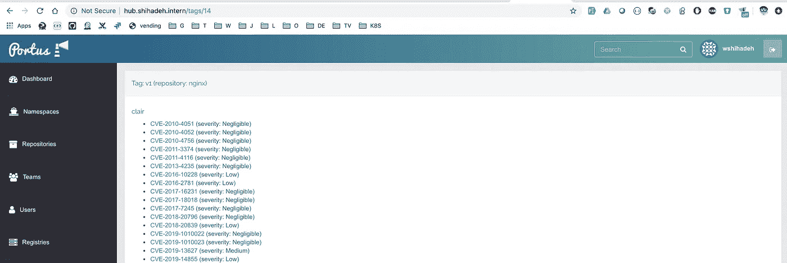

# 如何检测 Docker 图像中的漏洞

> 原文：<https://betterprogramming.pub/detect-vulnerabilities-in-docker-images-d21f1b762898>

## 提高码头集装箱的安全性


卡米洛·希门尼斯在 [Unsplash](https://unsplash.com?utm_source=medium&utm_medium=referral) 上拍摄的照片

[*Clair*](https://github.com/quay/clair) *是针对应用程序容器中的* [*漏洞进行静态分析*](https://en.wikipedia.org/wiki/Static_program_analysis) *的开源项目。*

传统部署和 Docker 部署的主要区别之一是处理软件依赖的方式。在传统部署中，软件依赖关系需要由专门的团队来安装和管理。他们安装所需版本的依赖项，在出现安全问题时对其进行升级，并定期对操作系统软件包进行修补。在主机上管理和安装所有依赖关系，以及解决同一台服务器上不同软件之间的依赖关系冲突是一项挑战，而且非常耗时。

Docker 部署通过将给定软件所需的所有依赖项封装在其自己的 Docker 映像中来解决这些挑战。这些依赖项是在 Docker 构建时安装的，并且只适用于与生成的 Docker 映像一起运行的容器(这些依赖项也不会影响主机)。然而，由于 Docker 映像由多个层组成，从操作系统(ubuntu、alpine、centos 等)到应用层本身，因此 Docker 映像存在漏洞的风险，这些漏洞可能会暴露一些安全风险，并为攻击者提供访问托管服务器的方法。

根据[国家漏洞 D](https://nvd.nist.gov/vuln/search) 数据库，已知漏洞超过 75000 个。其中一些漏洞是众所周知的，比如影响 OpenSSL 的 [Heartbleed](http://heartbleed.com/) 。这意味着用于部署应用程序的 Docker 映像很有可能包含这些漏洞。获取此信息需要扫描 Docker 图像，并针对已知漏洞进行分析和比较。不幸的是，这个特性在 Docker registry 和 Portus 中都不可用，所以需要另一个工具来实现这个目标。

[Clair](https://github.com/quay/clair) 是一款工具，可用于扫描 Docker 图像并报告发现的任何漏洞。 [Clair](https://github.com/quay/clair) 公开了一个用于索引 docker 映像的 API，并向数据库查询特定映像的漏洞。在我们开始部署 [Clair](https://github.com/quay/clair) 并将其与 [Portus](http://port.us.org/) 集成之前，让我们快速了解一下 [Clair](https://github.com/quay/clair) 是如何工作的:

*   Clair 定期提取外部数据库，并用已知漏洞更新其内部数据库。
*   客户端(注册或 Portus)将图像发送到 [Clair](https://github.com/quay/clair) API 进行分析。
*   出于性能和效率的原因，Clair 逐层分析 Docker 图像，而不是基于图像。这是因为 Docker 图像共享图层，无需多次分析相同的数据/图层。
*   Clair 将图像层传递给工作人员，以检测每个层中的漏洞。Clair 支持三种不同的检测器来查找 Docker 图像层中的漏洞。

1.  第一种类型是`Data Detector`，它负责扫描层中任何不应该包含在生产中的静态配置。
2.  第二种类型是`Feature Detector`，它基本上可以是 Docker 容器中的任何东西，从 OpenSSL 这样的包到配置参数。
3.  最后一个探测器是`Namespace Detector`。该检测器基于`features`和`vulnerabilities`之间的上下文。该检测器能够发现在`centos7`上安装`centos6`封装等问题。

## 克莱尔部署

如上所述，Clair 将收集的关于 Docker 图像的数据存储在内部数据库(PostgreSQL 数据库)中。因此，我们需要访问 HA PostgreSQL 数据库，以便在生产环境中执行部署。为了简单起见，我将使用 Clair Docker 栈部署一个 PostgreSQL 服务器(这也可以在测试环境中完成)。

为了避免在 Clair 服务中使用 Docker 卷，我决定构建一个自定义映像，它包含一个配置模板，可以使用 environment valuables 进行配置。这里是定制 docker 图像的`Dockerfile`:

克莱尔·多克尔文件

这里是入口点文件，它负责呈现模板并为 Clair 生成配置文件:

克莱尔入口点

最后，这里是我用来部署 Clair 及其依赖项的 Docker swarm 堆栈:

克莱尔码头栈

部署 Clair 堆栈(Clair 服务器和 PostgreSQL 数据库)后，下一步是将 Clair 与 Portus 集成，以便能够扫描 Docker 图像。默认情况下，Clair 在端口`6060`上公开其 API。因此，要集成 Clair 和 Portus，我们需要用 Clair URL 来配置 Portus，如下所示:`[http://clair_server:86060](http://clair_server:86060,)`。我们需要将这个值添加到环境变量`PORTUS_SECURITY_CLAIR_SERVER`，或者通过更新 Portus [配置](http://port.us.org/features/6_security_scanning.html)。

将 Clair 与 Portus 集成并向 Docker 注册表推送一些图像后，我们可以开始看到漏洞报告，如下所示:



# **最后一个字**

我更新了在这篇[帖子](https://medium.com/@wshihadeh/how-to-deploy-portus-in-swam-a3b71c7519b5)中创建的 Swarm orca 项目，也包括了 Clair。您可以简单地通过执行下面的命令来部署 Clair(您还需要部署其他服务来使它在您的本地机器上工作):

```
SCM=copy bundle exec cap local deploy:setup deploy:clair
```

# **结论**

为了提高生成的 Docker 映像的质量并避免暴露于已知漏洞，建议:

*   开始扫描 Docker 图像寻找漏洞。
*   将扫描过程与软件应用程序的发布周期相结合。