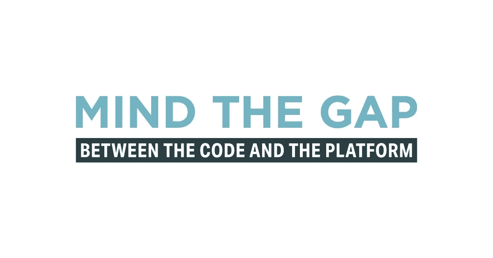
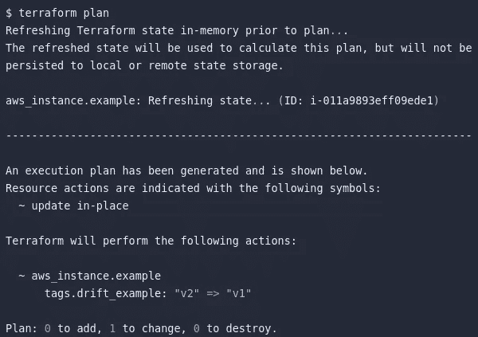
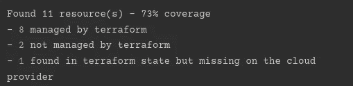

# 检测、识别和管理地形状态漂移

> 原文：<https://betterprogramming.pub/detecting-identifying-and-managing-terraform-state-drift-997366a74537>

## 制定实时策略来识别和监控云提供商之间的基础架构变化



作者图片

在理想的 IaC 世界中，我们所有的基础设施实现和更新都是通过将更新后的代码推送到 GitHub 来编写和实现的，这将在 Jenkins 或 Circle-Ci 中触发 CI/CD 管道，并且更改会反映在我们最喜欢的公共云中。但现实远非如此，即使在处于云成熟度第四阶段的公司中也是如此。这可能有很多原因，例如:

*   该公司仍处于云自动化的初级阶段
*   不同团队中有多个利益相关者正在通过控制台开发概念验证。
*   引入了专门的手动热修复来稳定当前生产。
*   用户不知道 IAC 工具

鉴于这些原因，系统中引入了不同类别的漂移，每种漂移都有自己的补救措施。本文解释了地形漂移，其类别，补救策略，以及监测地形漂移的工具。

为了更好地理解这些概念，我们先来探讨一下什么是 terraform 漂移，以及 Terraform 如何检测这种漂移。

# 什么是地形漂移？

当我们使用 Terraform 创建资源(即`terraform apply`)时，它会在一个名为`terraform.tfstate`的文件中存储有关当前基础设施的信息，无论是本地的还是远程的。在随后的`terraform apply`中，该文件将根据基础设施的当前状态进行更新。但是，当我们通过控制台或 CLI 进行手动更改时，这些更改会应用到云环境中，但不会在状态文件中看到。

> Terraform 漂移可以理解为从我们的 terraform 中定义的基础架构的实际状态到我们的云环境中存在的基础架构状态的漂移/差异。



在上述任何一种情况下，在 Terraform 代码之外更改基础设施都会导致我们的 Terraform 状态文件具有与云环境非常不同的状态。因此，当我们下次应用 Terraform 代码时，我们会看到一个漂移，这可能会导致 Terraform 资源改变或破坏资源。因此，了解不同类型的漂移如何侵入我们的基础设施有助于我们降低此类风险。

# 漂移的类型

我们可以将地形配置漂移分为三类:

1.  紧急漂移-在 Terraform 生态系统之外进行基础设施更改时观察到的漂移，最初是通过 Terraform 应用的(因此它们的状态存在于 Terraform 状态文件中)。
2.  伪漂移——由于列表中的排序项目和其他提供者特性，在计划/应用周期中看到的“变化”。
3.  引入漂移—在 Terraform 之外创建的新基础架构。

有时人们争论引入的漂移不应该被考虑，因为基础设施完全是通过控制台设置的。但是使用 Terraform 的想法是通过代码完全自动化基础设施流程。所以任何手动/混动都算漂移。

# 管理紧急漂移

如上所述，当 Terraform 应用和管理的基础设施在 Terraform 生态系统之外被修改时，会观察到紧急漂移。这可以根据我们喜欢的状态来管理:

*   基础设施状态首选:如果我们的首选状态是云中的状态，那么我们将对我们的 Terraform 配置图(通常是`[main.tf](http://main.tf)`文件)及其相关模块进行更改，以便下次我们运行`terraform apply`时，配置文件和 Terraform 状态文件的状态是同步的。
*   首选配置状态:如果我们的首选状态是我们的配置文件中的状态，我们只需使用我们的配置文件运行`terraform apply`。这将否定云中的所有更改，并应用 Terraform 配置文件中的配置。

# 管理伪漂移

当配置文件中的某些资源或资源的某些参数的顺序不同于状态文件时，可以观察到伪漂移。这种漂移并不常见，但在某些提供商身上很少观察到。为了更好地理解这一点，让我们举一个创建多可用性区域 RDS 的例子。

```
resource "aws_db_instance" "default" {
  allocated_storage    = 10
  engine               = "mysql"
  engine_version       = "5.7"
  instance_class       = "db.t3.micro"
	availability_zone    = ["us-east-1b","us-east-1c","us-east-1a"]# Us-east -1a was added later 
  name                 = "mydb"
  username             = "foo"
  password             = "foobarbaz"
  parameter_group_name = "default.mysql5.7"
  skip_final_snapshot  = true
}
```

最初，我们只想要 east-1b 和 1c，但后来增加了 1a。当我们应用这个配置时，它运行成功。我们是小心翼翼的 SRE 工程师，我们运行`terraform plan`来确认一切都如我们所愿。但令我们惊讶的是，我们可能会看到它在“可用性区域”行中再次添加了这个资源。当我们再次应用这个变更时，这个变更日志可以在随后的`terraform apply`生命周期中显示。

为了管理这个，我们应该运行`terraform show`，它将向我们显示当前的状态文件。找到可用性区域参数，并查看这些参数作为列表传递的顺序。将这些值复制到 Terraform 配置文件中，就可以开始了。

# 管理引入的漂移

当在云中的 Terraform 生态系统之外调配新基础架构时，会产生引入的漂移。这是最可怕的漂移，需要工程师认真努力来检测和处理，因为在地形状态文件中没有跟踪这些变化。除非通过控制台查看每个资源、阅读云监控日志、检查计费控制台或向完成此更改的人学习，否则很难检测到这种偏差。当我们运行`terraform destroy`时也会出现这种情况，有些资源破坏失败。

如果我们可以识别手动调配的资源，则根据其所处的环境有两种方法:

1.  重新配置:如果资源不在生产级环境中，建议我们销毁该资源，然后在 Terraform 配置文件中为其创建一个模块。这样，基础设施通过 Terraform 状态文件进行记录、跟踪和监控，所有资源都通过 Terraform 创建。
2.  Terraform 导入:如果资源存在于生产级环境中，则很难重新创建它。在这种情况下，我们使用“地形导入”来导入资源 Terraform import 帮助我们为相关资源创建 Terraform HCL 代码。一旦我们获得了这个资源，我们就可以将这个代码复制到 Terraform 配置文件中，当应用这个文件时，它将使用与云中存在的状态相同的配置来更新状态文件。

# 漂移识别和监控

只有当我们能够检测到存在漂移时，才能对漂移进行所有这些管理。在紧急和伪漂移的情况下，我们可以使用“Terraform Plan”命令来识别它们，该命令会将当前状态文件与云中的资源(之前使用 Terraform 创建)进行比较。但这在引入漂移的情况下会失败，因为在地形生态系统之外没有为资源创建的状态。因此，如果我们能够事先检测到这种漂移，并通过 IAC 工具将其自动化，将会为我们提供更好的服务。这种漂移可以使用两种工具来完成:

## CloudQuery

如果您喜欢在可视化仪表板中使用以数据为中心的方法，这个解决方案非常适合您。CloudQuery 是一个开源工具，它将状态文件与我们期望的云提供商中的资源进行比较，然后将这些数据格式化并加载到一个 [PostgreSQL](https://www.postgresql.org/) 数据库中。由于漂移检测命令是在 PostgreSQL 之上创建的，其中一列为托管或非托管，因此我们可以使用此标志作为过滤器，在我们最喜欢的仪表板解决方案(如 Tableau 或 Power BI)中进行可视化，以监控基础架构状态漂移。(更多信息，请参考 https://www.cloudquery.io/docs/cli/commands/cloudquery 的[。)](https://www.cloudquery.io/docs/cli/commands/cloudquery)

```
providers:
  # provider configurations
  - name: aws
    configuration:
       accounts:
	      - id: <UNIQUE ACCOUNT IDENTIFIER>
      # Optional. Role ARN we want to assume when accessing this account
      #     role_arn: < YOUR_ROLE_ARN >
      # Named profile in config or credential file from where CQ should grab credentials
      local_profile =  default
      # By default assumes all regions
	    regions:
	      - us-east-1
	      - us-west-2

      # The maximum number of times that a request will be retried for failures. 
	    max_retries: 5
      # The maximum back off delay between attempts. The backoff delays exponentially with a jitter based on the number of attempts. Defaults to 30 seconds.
      max_backoff: 20
      #  
    # list of resources to fetch
	    resources:
	      - "*"
```

## 漂流物

如果你是一个喜欢使用终端的 CLI 类型的人，这个工具是为你准备的。Driftctl 帮助我们跟踪和检测可能通过一个命令发生的托管和非托管漂移。



由于这是一个基于 CLI 的工具，这可以很容易地集成到 Jenkins 管道中编写的 CI/CD 管道中，并且可以将结果作为输出推送到 GitHub 中的 PR。如果这不是你喜欢的，那么在你的系统中运行这个 cron 任务。创建一个日志组来收集日志，然后使用 Fleuentd 或 Prometheus/graphana 软件包等日志监控解决方案来可视化和创建警报解决方案。更多信息，请阅读 https://docs.driftctl.com/0.35.0/installation 的[。](https://docs.driftctl.com/0.35.0/installation)

```
#to scan local filedriftctl scan# To scan backend in AWS S3driftctl scan --from tfstate+s3://my-bucket/path/to/state.tfstate
```

# 结论

它总是防止漂移潜入我们的代码，而不是在它们潜入后创建补救措施。最后，我想建议，写更好的代码和编码实践总是更好的。

*   始终尝试构建自动化基础设施。即使您执行手动步骤，也要尝试将其导入 Terraform 脚本，然后应用它们。
*   逐步编写和应用代码。
*   实施一个漂移跟踪系统和一个定制的警报系统，该系统将把观察到的红外漂移发送给 SRE。

```
**Liked my content?**Feel free to reach out to my [LinkedIn](https://www.linkedin.com/in/krishnadutt/) for interesting content and productive discussions.
```