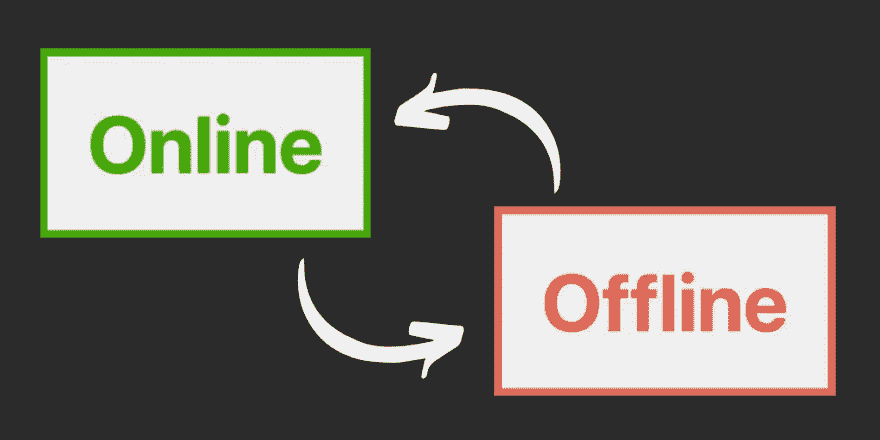
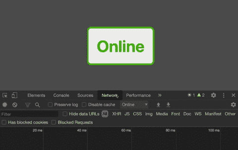

# 用 JavaScript 检测用户是在线还是离线

> 原文：<https://betterprogramming.pub/detecting-if-a-user-is-online-or-offline-with-javascript-2fcf5eb90c12>

## 显示您的用户是否有可靠的互联网连接


[安德鲁·尼尔](https://unsplash.com/@andrewtneel?utm_source=medium&utm_medium=referral)在 [Unsplash](https://unsplash.com?utm_source=medium&utm_medium=referral) 上拍照。

作为开发人员，我们有时会习惯办公室的宽带，而 localhost 是有史以来最快的网站，没有网络问题。

很多人忘记的是，超过一半的互联网流量是通过手机传输的，除非你在一个繁荣的城市，否则持续的互联网连接是不正常的。

这是一个系列的第一部分，在这个系列中，我将介绍一些提示和技巧，以便轻松地为网络连接不好的人创造更好的体验。如果您正在构建面向消费者的应用程序，这可能是您的用户的一大部分。

在本文中，我们将看到一种超级简单的方法来检查用户是否连接到互联网，并检测他们是否失去连接或重新连接，以便您可以根据互联网状态适当地更新您的 UI。



作者照片。

到本文结束时，您将拥有根据用户是否有互联网而变化的卡。

# 一点样板文件

`index.html`:

`style.css`:

添加一个空的`app.js`文件。那是我们将做所有工作的地方。

因此，您的文件夹应该如下所示:

```
├── app
│   ├── index.html
│   └── style.css
│   └── app.js
```

让我们首先创建一个函数，根据用户是否有连接来操作 DOM。我们将传递给它一个`boolean`值。

接下来是有趣的部分。

我们将首先使用`navigator.online`来检查页面初始加载时用户是否有互联网。`navigator.online`从 IE9 开始就受到支持，并返回一个`boolean`值。

重要的是要记住浏览器实现这个特性的方式是不同的。有关更多详细信息，请查看[MDN 文档](https://developer.mozilla.org/en-US/docs/Web/API/NavigatorOnLine/onLine#Example)。

> “在 Chrome 和 Safari 中，如果浏览器无法连接到局域网(LAN)或路由器，它就是离线的；所有其他条件返回 true。因此，虽然当浏览器返回一个假值时，你可以假设它处于离线状态，但你不能假设一个真值就一定意味着浏览器可以访问互联网。”— [MDN 网络文档](https://developer.mozilla.org/en-US/docs/Web/API/NavigatorOnLine/onLine#Example)

```
// Listen for the page to be finished loading
window.addEventListener("load", () => {
  hasNetwork(navigator.onLine);
});
```

# 注意

起初，这似乎是毫无意义的一步，但是根据 web 开发工具和最佳实践的当前状态，您会发现用户通常会将网页缓存起来，并且仍然能够脱机访问您的站点。因此，如果他们启动你的应用程序，并意识到他们的内容可能已经过时，这种初步检查可能会很好。

接下来我们要做的是为在线和离线事件添加事件侦听器，以便我们可以检查用户的网络状态何时发生变化。

我们关心的事件有两个:`online`和`offline`。我相信你能猜到，当用户在离线和在线之间切换时，这些都会被触发。

现在，当我们进入我们的应用程序时，当用户改变他们的网络状态时，我们将获得实时反馈。



# 什么时候用这个

也许你需要告诉用户他们不能上传文件，因为他们离线了，他们看到的实时数据可能不再是最新的，因为他们离线了，或者其他任何事情。您可能需要检测网络状态的原因有很多，作为 web 开发人员，我们应该努力让 web 成为每个人更友好的体验。

我希望这篇技巧有所帮助，直到下一篇，祝编码愉快！

你可以在这里看我的视频解释: