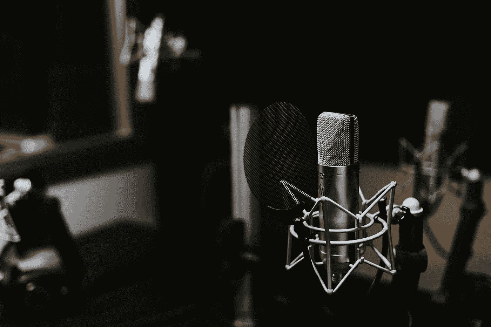
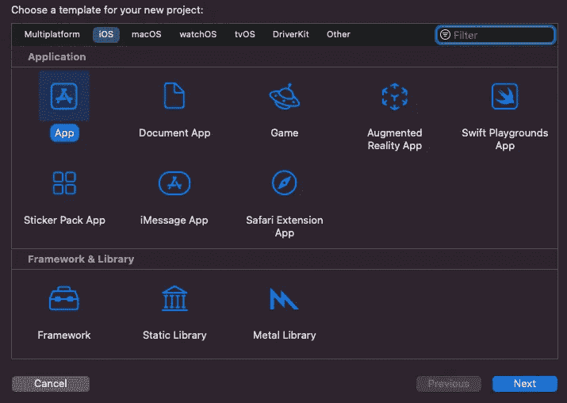
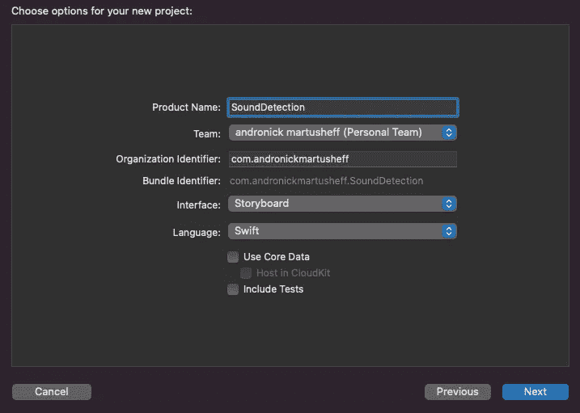
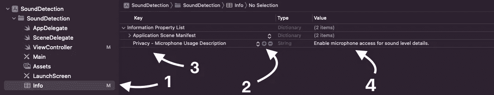
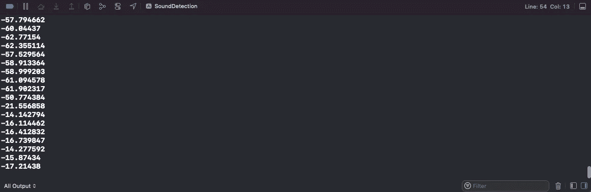

# 检测 iOS 应用程序中的麦克风输入电平

> 原文：<https://betterprogramming.pub/detecting-microphone-input-levels-in-your-ios-application-e5b96bf97c5c>

## 在应用程序中设置音频采集

乔纳森·贝拉斯克斯在 [Unsplash](https://unsplash.com?utm_source=medium&utm_medium=referral) 上拍摄的照片

如果您熟悉设置 Xcode 项目，请跳到“设置我们的音频采集会话”；否则，让我们开始构建我们的 iOS 声音检测应用程序吧！

# 项目设置

让我们从创建我们的入门 iOS 应用程序开始。

打开 Xcode 并选择“创建新项目”后，系统会提示我们选择平台和应用程序类型。

我们将选择 iOS 默认应用程序配置，如下所示。

接下来，我们将通过选择 Storyboard 作为我们的界面来完成我们的 starter 项目设置。

在填写完剩余的必需信息(项目名称，组织标识符..等等)我们可以选择下一步，然后保存项目。

这样做之后，我们将被抛入新的 Xcode 项目。

## 入门指南

让我们确保了解如何获得音频阅读，以及如何开始添加代码。

为此，我们将从视图控制器开始(如上图)。为了获得音频相关编程功能，我们需要比 Swift 默认提供的更多的功能。

我们将使用 AVFoundation 库，所以接下来我们要去的是`import AVFoundation`。

现在随着 AVFoundation 的导入，我们将把注意力转向`viewDidLoad()`函数。

简单地说，一旦我们运行我们的应用程序，我们放在`viewDidLoad(`中的所有东西都会在视图加载后执行。(你可以在函数中添加一个`print("Hello Medium!")`打印语句，运行应用程序，一旦你的 iOS 模拟器视图加载，你就可以看到你的消息打印到控制台。它的命名方案非常直观)。

有了基础知识(和你的`ViewController.swift`文件的设置完全一样)，我们现在可以继续设置我们的音频捕获会话。

## 设置我们的音频捕获会话

在我们的`viewDidLoad()`函数下面，我们将开始设置我们的音频捕获会话。

在我们的新函数(如上所示)中，我们首先在`AVAudioSession`(由我们之前导入的库提供)的帮助下创建一个`recordingSession`。

这个音频会话基本上充当了我们的应用程序和操作系统访问主机音频硬件之间的中间人。

接下来，我们会注意到这里的大部分代码被包装在一个 do/catch 块中。这是因为在配置的每一步，都有可能出现不想要的行为(即与我们的`recordingSession`交互可能会抛出异常，需要适当处理)。

如果我们捕获到由下面的设置抛出的任何异常，它将被捕获，我们的错误消息将被打印到控制台。

我们的录制会话需要以下设置:

1.  将录制会话的类别设置为`playAndRecord`
2.  使用`setActive`激活录制会话
3.  尝试使用`requestRecordPermission`从设备接收麦克风权限

现在我们已经在我们的应用程序中设置了音频会话，我们必须将音频设置为一个可以被请求的选项，否则我们的应用程序将在启动时崩溃。

## 启用麦克风权限请求

1.  导航到您的项目 Info.plist 文件。
2.  将鼠标悬停在表格中已有的一行上，选择“+”按钮添加您自己的属性。
3.  输入`Privacy — Microphone Usage Description`作为密钥。
4.  该值是您的应用程序在请求麦克风权限时将读出的消息。加入一些描述性的东西。

这就是全部了！

现在运行应用程序时，应该会提示您使用麦克风，并显示您刚刚在中输入的消息。

如果出于某种原因，您仍然遇到问题，下面是一个当前的工作示例，说明我们应该如何使用视图控制器。

现在说说有趣的事情。

## 捕捉音频

因此，我们刚刚创建了共享音频会话的实例，并设置了麦克风权限请求。

我们现在可以设置我们的`AVAudioRecorder`(也由`AVFoundation`提供)。

第 1 集，共 2 集

*   因为我们正在建立一个记录会话，根据定义，我们需要一个地方来保存记录。正在动态生成一个跨系统的文件路径。
*   我们正在创建的录音也需要一个名称。(如果安全性是一个问题，您可以选择[不保存记录的文件](https://stackoverflow.com/questions/40625265/avaudiorecorder-can-we-record-without-saving-into-file)，但是对于我们的目的来说，我们不会有问题。)
*   然后，我们将为我们的录音机创建一个设置字典。我们在这里保持相对简单的设置。`AVFormatIDKey`指定我们将使用的音频文件的类型。`AVSampleRateKey`指定音频采样率(单位为赫兹)。`AVNumberOfChannelsKey`指定音频通道的数量。`AVEncoderAudioQualityKey`指定我们期望的音频质量水平。(续)

捕获音频 2/2

*   随着最后一个设置的完成，我们现在能够创建我们的录音机，同样，我们把它放入一个 do/catch 块。
*   我们将使用`AVAudioRecorder`创建出`audioRecorder`，并传入我们刚刚创建的 URL 和设置字典。
*   我们将在我们的 audioRecorder 实例上使用`record()`开始记录。
*   默认情况下，音频录制会话不会启用计数，因为它会使用计算资源，因此我们需要启用它来访问音频录制器的计数信息。这个计量信息包含分贝读数。
*   我们当然也希望不止一次地读取测量的分贝信息，这就是`Timer`发挥作用的地方。简而言之，我们将使用这个计时器在设定的时间间隔内重复运行一些代码。
*   每当间歇响起，我们将更新我们的音频记录的米。在更新计量表之后，我们将通过检索`.averagePower(forChannel: 0)`最终获得我们想要的数据库信息。这将返回录音最后一秒的平均分贝读数，范围从-160dBFS(最小值)到 0dBFS(最大值)。(回想一下我们的设置，当我们传递我们的通道数时。因为我们只创建了 1 个通道，所以我们基本上只是在这里获得第一个通道。)
*   最后，将这个分贝读数打印到控制台。

现在，如果你再次运行你的应用程序，你应该看到你的控制台每 0.1 秒打印出记录的分贝读数。声音越大，数值越接近 0。

我将有一个后续视频，展示我们如何使用使用`AVAudioRecording`检索的分贝数据来构建一个有响应的 UI。希望我能帮上忙！

## 排除故障

如果因为任何原因你遇到了问题，这里是我最后的`ViewController`。

只要这个和`Info.plist`文件如图所示，你应该会看到分贝读数打印。

如果您仍然遇到问题，请随时联系我们，我会尽我所能帮助您！

感谢阅读。