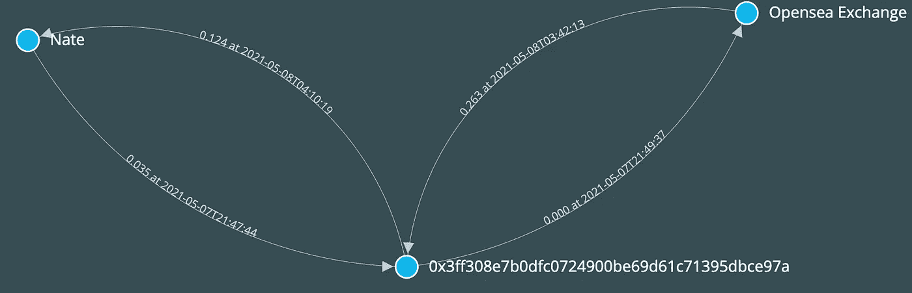
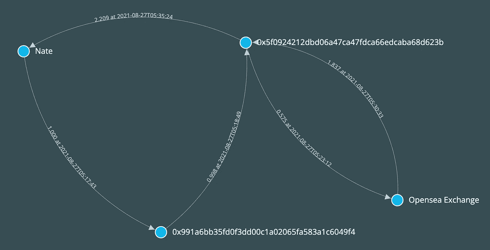

# 用图算法检测 NFT 前沿

> 原文：<https://betterprogramming.pub/detecting-nft-front-running-with-graph-algorithms-3fddadbff4a7>

## 对加密数据的精细深入研究


艾莉娜·格鲁布尼亚克在 [Unsplash](https://unsplash.com?utm_source=medium&utm_medium=referral) 上的照片

在我之前的帖子中，我分享了一个例子，说明如何使用加密数据来[理解 NFT 生态系统的宏观进化](https://towardsdatascience.com/the-data-behind-the-nft-hype-32f6f92c27cb)。在本帖中，我们将通过用图形算法检测 NFT 前端运行，进行一次粒度用户级分析。

首先，我所说的 NFT 抢先一步的一些背景:2021 年 9 月，NFT 市场 Opensea 的产品负责人 Nate Chastain 被发现[在 NFT 出现在 Opensea 主页之前购买了它们，并在之后立即出售以获取利润。他利用内部信息，即 NFT 将被 Opensea 推广的信息，获得不公平的优势。这是一个有事业心的人发现的](https://twitter.com/0xZuwu/status/1437921263394115584)

1.  利用内特拥有 NFT 3501 号密码朋克的事实，确定了他的主要钱包
2.  追踪资金从这个主钱包流向他的一次性钱包，一次性钱包通过买卖 NFT 获利，最终将利润返还给主钱包
3.  将 NFT 的交易时间戳与 Opensea 的有问题的 NFTs 的首页促销时间戳相匹配

这个人通过在 Etherscan 上倾倒交易来手动完成大部分分析，这非常耗时，并且很可能错过了至少一些发生类似行为的实例。

通过[加密数据](https://towardsdatascience.com/what-is-crypto-data-fef70ecadf7b)实现的透明性，我们可以使用图形算法系统地识别这种行为，通过识别这种类型的前置运行的签名是

1.  从主钱包到一个或多个一次性钱包的一系列资金转移，意在掩盖演员的真实身份
2.  在短时间内购买 NFT，然后出售 NFT 以获取利润——表明知道价格即将上涨
3.  将一次性钱包中的利润返还给主钱包

如果我们将数据建模为一个[定向多图](https://en.wikipedia.org/wiki/Multigraph#:~:text=A%20multidigraph%20is%20a%20directed,directed%20edges%2C%20arcs%20or%20arrows.)，其中节点是用户钱包和智能合约地址，边是资金转移和 NFT 购买/销售，那么我们可以使用[周期检测算法](https://en.wikipedia.org/wiki/Cycle_(graph_theory))来寻找这个特定的签名。这不仅实现了对 Nate 参与抢注的所有时间的系统回顾，还实现了在未来主动监控和监管这种行为的方法。

检测算法的实现可在本报告中找到。该算法的主要工具是`find_cycles`函数:

```
# find all nodes that are n degrees removed from a given node u in the graph G
def findPaths(G,u,n):
    if n==0:
        return [[u]]
    paths = [[u]+path for neighbor in G.neighbors(u) for path in findPaths(G,neighbor,n-1)]
    return paths# find all nodes that are n degrees removed from a given node u in the graph G, which form a closed cycle
def find_cycles(G,u,n):
    paths = findPaths(G,u,n)
    return [tuple(path) for path in paths if (path[-1] == u) and sum(x ==u for x in path) == 2]
```

…以及可疑会话匹配循环:

```
session_active = False
suspicision_sessions = []
session_id = 0session_holder = []
nate_outflow = 0
nate_inflow = 0
opensea_buy = False
opensea_sell = Falsedef reset_session():
    global session_holder
    global nate_outflow
    global nate_inflow
    global opensea_buy
    global opensea_sell
    if (nate_outflow > 0 and nate_inflow > 0 and opensea_buy and opensea_sell):
        suspicision_sessions.append(copy.deepcopy(session_holder))
    session_holder = []
    nate_outflow = 0
    nate_inflow = 0
    opensea_buy = False
    opensea_sell = Falseprogress_counter = 0for size in [2, 3]:
    cycles = find_cycles(G,'0xa3a4548b39da96eb065ff91811ca30da40431c0d', size)
    for c in cycles:
        if '0x7be8076f4ea4a4ad08075c2508e481d6c946d12b' not in c:
            progress_counter += 1
            if (progress_counter %5 == 0):
                print(progress_counter)
            reset_session()
            prev_time = pendulum.now()
            sub = list(G.subgraph(list(c) + ['0x7be8076f4ea4a4ad08075c2508e481d6c946d12b']).edges(data=True))
            sub.sort(key=lambda x: x[2]['block_timestamp'])for e in sub:
                cur_time = pendulum.parse(e[2]['block_timestamp'][0:-5])
                diff_time = (cur_time - prev_time).in_hours()if not session_active and map_node(e[0]) == 'Nate':
                    session_active = True
                    session_holder.append(e)
                    session_id += 1
                    nate_outflow += e[2]['value']/1e18
                elif session_active and diff_time > 36:
                    if map_node(e[0]) == 'Nate':
                        reset_session()
                        session_holder.append(e)
                        session_id += 1
                        nate_outflow += e[2]['value']/1e18
                    else:
                        reset_session()
                        session_active = False
                elif session_active:
                    session_holder.append(e)
                    if map_node(e[0]) == 'Nate':
                        nate_outflow += e[2]['value']/1e18
                    elif map_node(e[1]) == 'Nate':
                        nate_inflow += e[2]['value']/1e18
                    elif map_node(e[0]) == 'Opensea Exchange':
                        opensea_sell = True
                    elif map_node(e[1]) == 'Opensea Exchange':
                        opensea_buy = Trueprev_time = cur_timeprint('{} suspicious sessions found'.format(len(suspicision_sessions)))
```

用简单的英语来说，它会执行以下操作:

1.  在图 G 中找到涉及 Nate 的主钱包的闭合循环，图 G 包含与 Nate 的主钱包相差 3 度或更小的所有交易和地址——这些循环是至少匹配前端运行签名的资金转移部分的候选循环
2.  对于每个周期，生成一个子图，只包含周期中的节点和 Opensea 交换节点——这使我们能够寻找任何与资金转移周期一致的可疑 NFT 交易
3.  按时间顺序遍历每个子图中的活动(或边),标记任何会话(定义为连续活动之间少于 36 小时),该会话以连续顺序匹配 1)从主钱包到一次性钱包的资金转移，2)购买后销售获利，3)资金转移回主钱包的完整前端运行签名。

利用这种算法，我们发现了 17 种不同的情况，内特的主钱包可能与一种领先模式相关联。其中最早的一次发生在 2021 年 5 月 7 日，比现在臭名昭著的 Twitter 帖子中标记的 2021 年 9 月 14 日的例子早了 4 个多月。

在这种情况下，Nate 将 0.035ETH 转移到一个一次性账户，以 0ETH 的价格(仅支付汽油费)购买了[这辆 NFT](https://opensea.io/assets/0x495f947276749ce646f68ac8c248420045cb7b5e/19707794715962039650013670819326392846345927146224565303908839162091770216449) ，不到 5 小时后以 0.263ETH 的价格出售，然后在出售后不到 30 分钟将 0.124ETH 的利润转移回他的主账户。虽然我没有 Opensea 在 NFT 的推广时间表，但我强烈怀疑，鉴于买卖之间的短暂时间，内特知道价格上涨。按时间顺序排列的这一系列活动如下所示:

```
2021-05-07T21:47:44 Nate -> 0x3ff308e7b0dfc0724900be69d61c71395dbce97a, transfer 0.035ETH2021-05-07T21:49:37 0x3ff308e7b0dfc0724900be69d61c71395dbce97a -> Opensea Exchange, bought OpenSea Shared Storefront-19707794715962039650013670819326392846345927146224565303908839162091770216449 for 0.000ETH2021-05-08T03:42:13 Opensea Exchange -> 0x3ff308e7b0dfc0724900be69d61c71395dbce97a, sold OpenSea Shared Storefront-19707794715962039650013670819326392846345927146224565303908839162091770216449 for 0.263ETH2021-05-08T04:10:19 0x3ff308e7b0dfc0724900be69d61c71395dbce97a -> Nate, transfer 0.124ETH
```

使用 D3.js，我们可以创建图形等价物，更直观地描述这里检测到的前端运行签名。



已知最早的 NFT 前线跑步链接到内特的主钱包-作者图片

这是几个月后发生的另外两个例子，涉及到一个稍微复杂一点的计划，有两个一次性钱包，和更多的以太币。



NFT 领先的实例链接到内特的主钱包-图片由作者提供


NFT 领先的实例链接到内特的主钱包-图片由作者提供

在这三种情况下，快速买入和卖出的特征，以及随之而来的利润回流都非常明显。我将避免在这里复制所有 17 个实例——鼓励好奇的读者亲自查看回购中的数据和代码。有关如何创建该可视化的详细信息，请查看[完整报告](https://github.com/yifeihuang/nft-frontrunning)中的示例。

# 结束语

我的意图不是重新提起内特的可疑行为。相反，它表明加密数据带来的透明性是一种强大的工具，可以在生态系统参与者之间加强更大程度的问责制和公平性。Opensea 或任何人现在都可以利用这种算法来监控可疑的交易行为，并标记违规的用户钱包。我们可能无法完全阻止不良行为者，但我们可以通过从数据中学习和增加工具来更好地打击和监管他们。这种通过数据不断学习和改善生态系统的能力是 Crypto 如此令人兴奋的原因。

希望这是一次有用的讨论，我已经帮助你对加密数据的应用有了更好的直觉。在我的下一篇文章中，我将探索索拉纳区块链和它的数据耗尽。如果你想在帖子发布时得到通知，请务必点击电子邮件图标进行订阅。

*一如既往，感谢您的阅读，如果您对我想写的内容有任何问题或建议，请随时联系我。* [*推特*](https://twitter.com/yifei_huang) *|* [*领英*](https://www.linkedin.com/in/yifeihuangdatascience/)