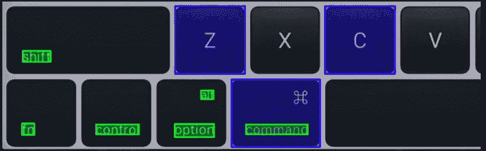
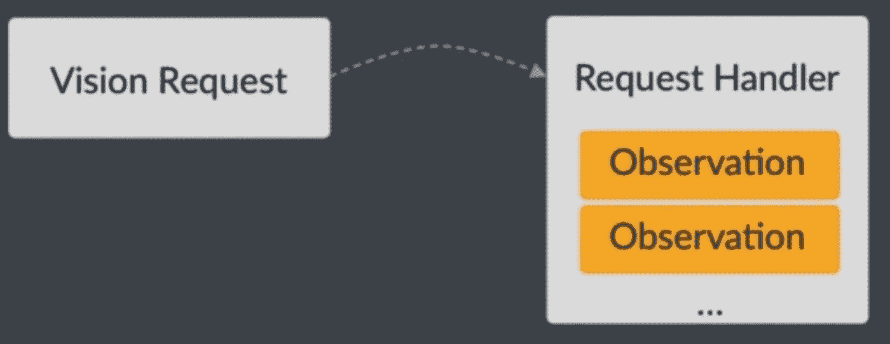
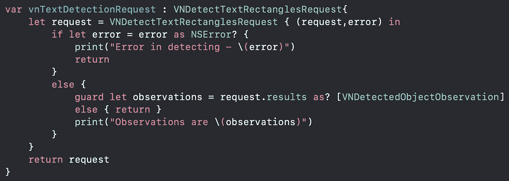
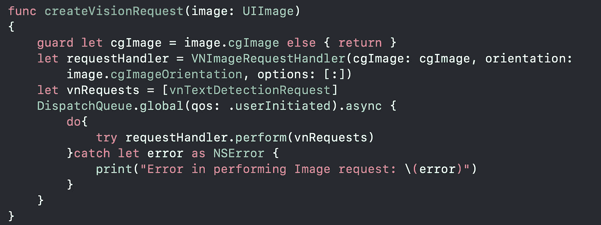
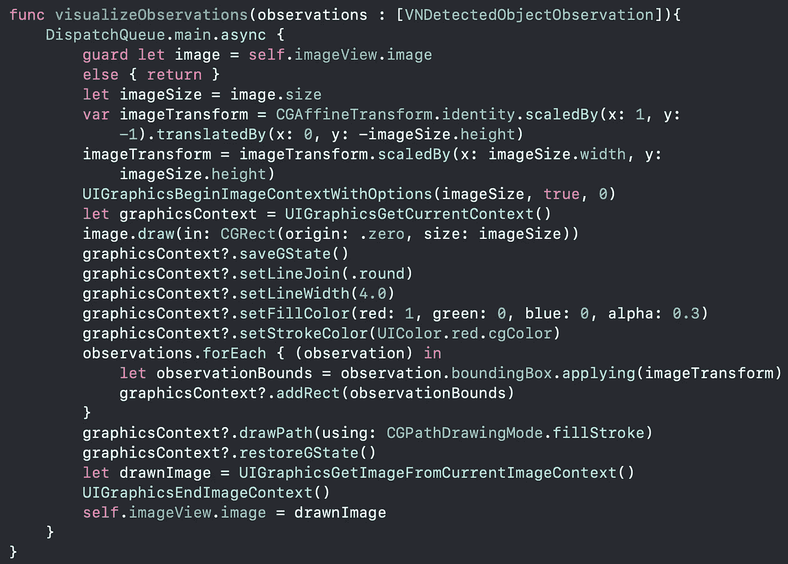

# 在 iOS 中检测静止图像中的对象

> 原文：<https://betterprogramming.pub/detecting-objects-in-still-images-using-vision-framework-in-ios-82877bc87703>

## 使用愿景框架



视觉框架执行面部检测、文本检测、条形码识别、图像配准和一般特征跟踪。

# 愿景框架是如何工作的？



**视觉请求** *→创建一个请求，让视觉为您检测物体。* **请求处理程序** *→请求完成后调用处理程序。它可以在给定的图像上执行多个请求。在这里，您可以处理执行请求的结果。* **观察** *→返回的结果称为观察*

让我们看看检测静态图像中文本的示例代码。

```
import Vision
```

从导入`Vision` 框架开始，在您的类中访问它的 API:



这段代码使用`VNDetectTextRectanglesRequest` *创建一个`Request`来检测图像中的文本。* 您可以使用`VNDetectBarcodesRequest`、`VNDetectFaceRectanglesRequest`、*、*、*创建其他请求。* 请求有一个 results 属性，它包含一个特定于给定请求的`VNObservation`对象数组。

*   如果我们只是对检测到的图像特征的位置和边界框感兴趣，我们可以使用 Generic `VNDetectedObjectObservation`。
*   如果我们对特定的结果类型感兴趣，我们可以根据请求，使用`VNTextObservation`、`VNFaceObservation`等将观察转换为特定的结果类型。



此代码片段创建一个 VNImageRequestHandler 来处理您的请求。可以传递多个请求。

# 可视化观察

通过在检测到的特征上画一个矩形来显示观察值。我们需要转换`Quartz2D`和`UIKit`之间的坐标。
视觉系统返回`Quartz2**D**`坐标系中的观察结果，该坐标系相对于 UIKit 坐标系绕 x 轴翻转。视觉结果被标准化。我们需要执行一系列转换来呈现检测到的观察结果。



我们现在可以在`vnTextDetectionRequest`属性中调用上面的函数，并将观察结果传递给这个调用。

我们使用红色方框看到检测到的特征。

参考 GitHub 上的[完整 Xcode 项目](https://github.com/talreja-priya/VisionFrameworkDemo)

谢谢你。希望这有帮助！

编码快乐！