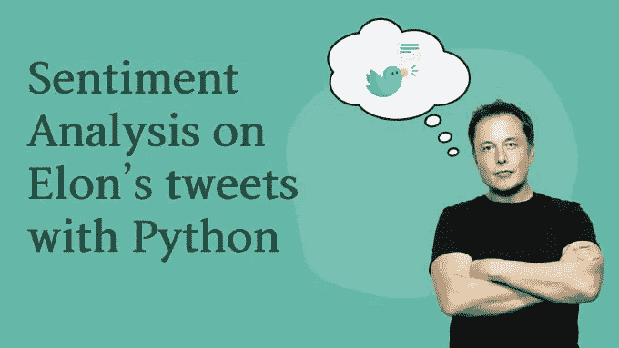
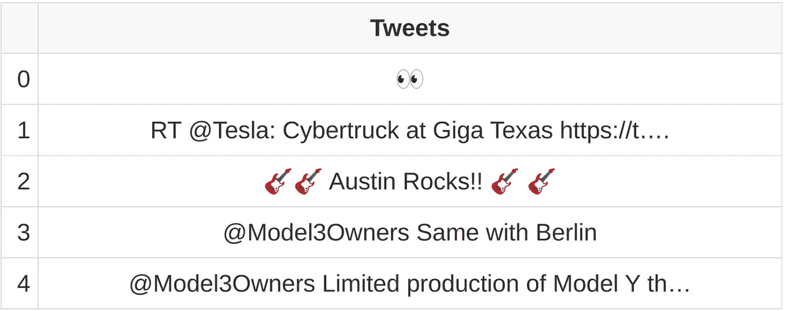
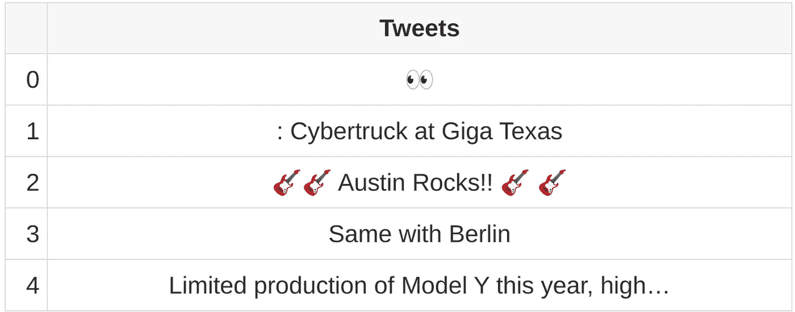
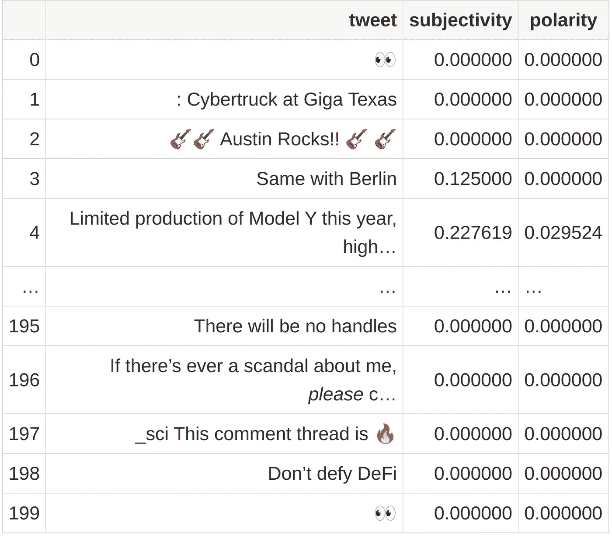
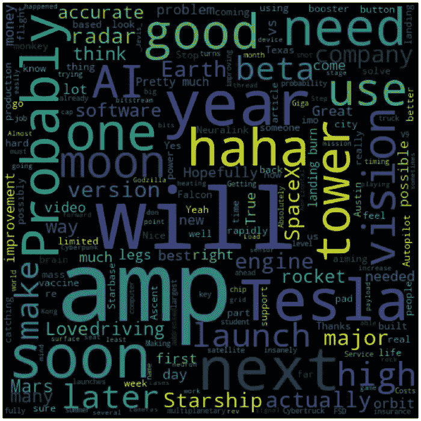
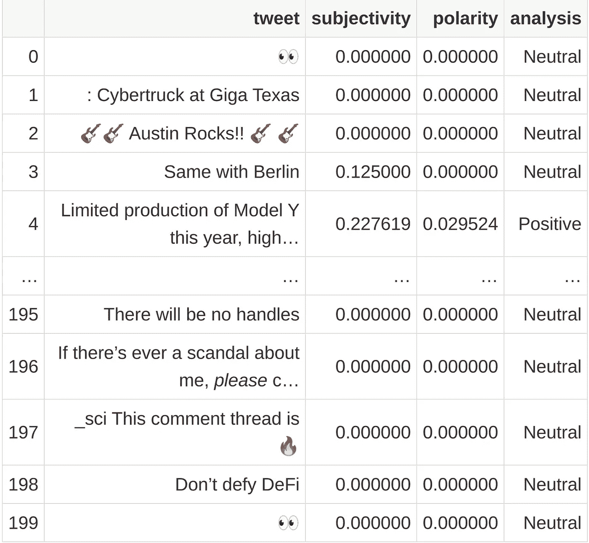
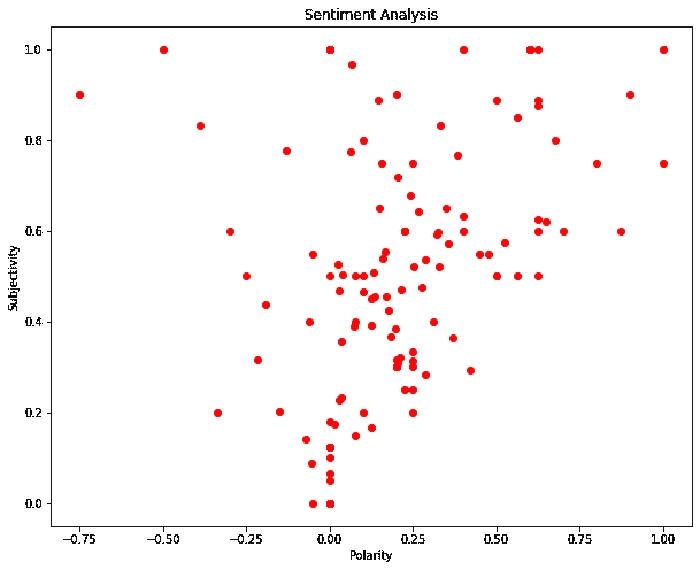

# 使用 Python 从埃隆·马斯克的推文中发现情绪

> 原文：<https://betterprogramming.pub/detecting-sentiment-from-elon-musks-tweets-using-python-ec7820469ac0>

## 通过阅读埃隆的推文，了解如何进行情绪分析



图片由作者提供。

几天前，我们用 Python 做了一个关于 NLP 的[介绍，得到了一些非常积极的反馈。因此，我决定写一个我喜欢的 NLP 用例:情感分析。](https://livecodestream.dev/post/intro-to-natural-language-processing-with-python/)

虽然我们已经介绍了它是什么以及如何与 Python 一起使用，但今天我们将更详细地回顾这个主题，并使用实际数据和实例。我们将使用来自 Twitter 的文本数据，所以我相信这会很有趣！

像往常一样，你可以使用下面的 [Jupyter 笔记本](https://colab.research.google.com/drive/1Txh44qENUH2pe-5aGmnirkzN9iJkvboM?usp=sharing)遵循所有的步骤，或者你可以自己编写代码。

# 情感分析

让我们先简单回顾一下什么是情绪分析。情感分析识别关于主题或消息(例如，推文)的态度。我们可以将文本中的情感分为积极的、消极的或中性的。

情感分析在现实世界中有着广泛的应用，从营销活动的报告到用户反馈、评论、推文等的评估和分类。

# 为什么是 Twitter，为什么是 Musk？

对于这种类型的分析来说，推文是很好的。每条推文都是一组有限的信息(目前最多 280 个字符)，更容易处理。此外，与脸书或其他社交平台不同，Twitter 拥有绝大多数的公开资料。

至关重要的一点是 Twitter API，它是完整和健壮的。这使得我们很容易提取我们需要的数据。

所以接下来的问题是“为什么是马斯克？”尽管你可以将相同的步骤应用于任何个人资料，甚至任何推文集合——甚至来自不同的个人资料——但我决定选择马斯克，因为……为什么不呢？他是 Twitter 的超级明星之一，我想看看他在那里谈论什么会很酷，很令人兴奋。

既然我们已经解决了这个问题，让我们开始吧。

# 要求

我们的项目需要一些库来处理推文、数据集、图表，并进行实际的情感分析。

让我们在笔记本上设置它们:

```
!pip3 install tweepy
!pip3 install textblob
!pip3 install pandas
!pip3 install matplotlib
!pip3 install wordcloud
```

# 设置 Twitter

在我们进入代码之前，我们需要确保我们有 Twitter API 键来检索我们分析所需的 tweets。如果你还没有，去 https://apps.twitter.com[注册一个 Twitter 开发者账户。你必须申请这个许可并回答一些问题。](https://apps.twitter.com/)

Twitter 的批准过程可能需要 24 到 48 小时。之后，您将获得您的 API 密钥和访问令牌。

连接 Twitter 接收数据就变得非常简单。只需导入 [tweepy](https://docs.tweepy.org/en/latest/index.html) 库，登录，检索如下:

如果一切顺利，您可以使用下面的代码来测试您的连接:

如果一切顺利，你会看到埃隆·马斯克的最后五条推文。

# 数据准备

我们已经得到了所有我们需要的信息，并开始着手处理。首先，让我们下载一个更重要的数据集(假设有 200 条推文):

```
tweets = api.user_timeline(screen_name = "elonmusk", count = 200, lang = "en", tweet_mode = "extended")
```

现在，200 条推特不是一个任意的选择。相反，这是我们在不使用分页的情况下用这种方法可以下载的最大数量。

tweet 附带了一堆我们不需要的数据，所以让我们创建一个 pandas `DataFrame`并加载 tweet 消息，以便更容易处理:

```
import pandas as pddf = pd.DataFrame([tweet.full_text for tweet in tweets], columns = ["tweet"])
df.head()
```



最后，让我们通过删除不相关的信息(至少对于我们的目的来说)来清理文本，如标签、提及、转发和链接:



我们的清理方法相当简单，因为它只使用正则表达式来去除一些块，但是你可以在这里得到你想要的。

# 捕捉每条推文的主观性和极性

正如我们在用 Python 编写的 NLP 的[介绍中解释的那样，](https://livecodestream.dev/post/intro-to-natural-language-processing-with-python/#sentiment-analysis) [textblob](https://textblob.readthedocs.io/en/dev/) 是一个流行的文本分析库。当用来评价一个文本的情绪时，会输出两个值:主观性和极性。

极性是一个介于 *-1* 和 *1* 之间的值，其中 *-1* 为非常负， *+1* 为非常正。主观性的范围在 *0* 和 *1* 之间，指的是人的观点、情感，甚至是判断。数字越高，文本越主观。

让我们在`DataFrame`中捕获这些信息，以便稍后分析:



我们数据集中的第一条和最后一条推文没有说太多，但是让我们看看我们还能发现什么。

# 创建单词云

单词云曾经在博客和一些信息图表中流行过，现在它们对于理解文本中最相关或最常见的单词(或者在这种情况下，一系列推文)仍然很重要。

让我们根据马斯克的推文生成一个，看看我们能否找出他在说什么:



生成的云词

对于单词 cloud，我们可以看到一些我们也应该清除的单词和表达，但我们也可以看到一些重要的单词，如“特斯拉”、“火箭”、“年”和“很快”

# 对推文的极性进行分类

正如我们所说的，极性设计了文本的中性、积极和消极含义，但是将该值作为数字可能会令人困惑。因此，让我们用一个新列对数据进行分类，该列定义了可供用户使用的极性:



让我们摘录一些正面和负面的推文全文，看看它们都是关于什么的:

输出:

```
positive tweets
 - Limited production of Model Y this year, high volume next year
 -  Yeah, should be fully mobile later this year, so you can move it anywhere or use it on an RV or truck in motion. We need a few more satellite launches to achieve compete coverage &amp; some key software upgrades.
 - This is accurate. Service uptime, bandwidth &amp; latency are improving rapidly. Probably out of beta this summer.
 - One of many reasons that we need to make life multiplanetary!
 -   Certainly one of the largest. A company whose name rhymes with Shmoogle is pretty far ahead. But I think we’re the leader in shallow-minded AI haha!negative tweets
 - Probably late July
 - Tesla is building up collision repair capability to help address the grief that you went through, but usually insurance companies make you go their “approved” collision repair partners. Tesla Insurance will make it smooth sailing.
 - Congrats to NIO. That is a tough milestone.
 - Almost ready with FSD Beta V9.0\. Step change improvement is massive, especially for weird corner cases &amp; bad weather. Pure vision, no radar.
 -A monkey is literally playing a video game telepathically using a brain chip!!
```

由于他的推文的性质，一些可能被错误地分类，其他的…我甚至不确定。没有上下文的推文并不总是很有意义。

# Elon 一般是正面的还是负面的？

现在让我们来看看埃隆的推文是有更多积极的还是消极的内涵。为此，我们将使用散点图绘制所有推文，以主观性和极性为轴:



不是最漂亮的图表，但是如果想增强的话，推荐阅读[如何用 Python 和 seaborn 制作漂亮的剧情](https://livecodestream.dev/post/how-to-build-beautiful-plots-with-python-and-seaborn/)。

除了外表，图表还告诉了我们什么？一眼看去，我们可以看到极性的正面有更多的点，这意味着他的推文一般是正面多于负面。

这里有另一个简单的方法来确定正面推文和负面推文的比例:

```
len(positive_tweets) / len(negative_tweets)################
# Output
################
6.666
```

既然这个数字是正的，而且是一个相当高的比率，我们也可以得出结论，埃隆是一个积极的人。

# 结论

只需有限的一组推文，无需编写大量代码，我们就可以对 Elon 的 Twitter 账户上发生的事情进行一些非常有趣的分析。我们还可以得出结论，你也许应该跟着他，因为他通常是一个积极有趣的人。

这个项目对我来说非常有趣，我希望你也喜欢它。我们将在未来更多地探索文本分析，并扩展我们在该领域的知识。

感谢阅读！