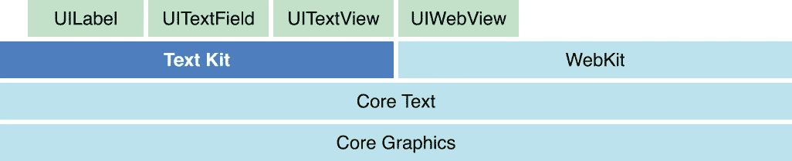
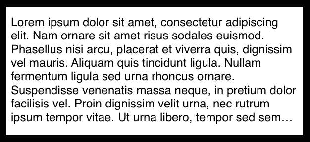
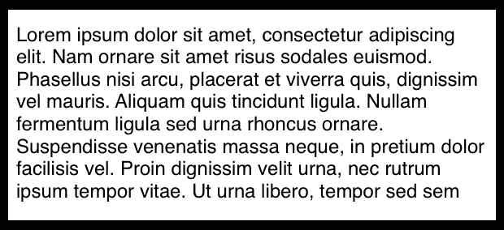

# 检测 UITextViews 中的截断

> 原文：<https://betterprogramming.pub/detecting-truncation-in-uitextviews-8ab8481da3be>

## 你的文本视图显示…？

在使用`UITextViews`时，你可能会遇到的一个挑战是，它们没有提供一种直接的方法来检测它们是否显示被截断的文本。

使用`UILabel`,您可以通过计算标签中文本的大小并将其与标签本身的边界进行比较来检查截断。如果文本超出边界，则显示为被截断。

`UITextView`的挑战在于，从设计上来说，它可以容纳比其界限大得多的文本。

这是滚动文本视图操作的本质。这个特性破坏了我们快速检查截断的能力，所以首先，我们需要使用禁用了*滚动的*文本视图。

# 解决办法

这就是关于 [TextKit](https://developer.apple.com/documentation/appkit/textkit) 以及 iOS 如何布局和操作渲染文本的一些知识派上用场的地方。我强烈推荐阅读官方文档 [TextKit](https://developer.apple.com/documentation/appkit/textkit) ，以及 objc.io 的人们所写的这篇精彩的[文章。](https://www.objc.io/issues/5-ios7/getting-to-know-textkit/#cocoa-text-system)

从现在开始，我假设你至少对 iOS 中的文本布局有一个粗略的了解。

因为我们不能仅仅依靠`UITextView`的边界来进行检查，我们必须依靠文本视图本身中的`NSLayoutManager`。

因此，如果我们有一个文本视图显示如下所示的截断文本，那么我们可以使用下面的代码片段来检测它。

尾部截断示例

我们到底在这里做什么？嗯，`NSLayoutManager`使用线条片段来布局文本。这些基本上是定义每行文本边界的矩形。

同样，objc.io 的文章比我在这里所能做的更深入，但是要点是，使用行片段的概念，我们可以要求布局管理器搜索它们来找到我们关心的截断字形(…)。

如果找到了，我们就可以停止遍历，并知道我们的文本是以截断的方式呈现的。

旁注:为什么我们不能在`textContainer.text`属性中搜索`...`字符呢？

嗯，在引擎盖下，`textContainer`根本没有截断字形的概念。在文本最终呈现到屏幕上之前，`NSLayoutManager`在上面一层完成了这项工作。

这个解决方案本身对于检测尾部截断非常有用。但是，如果 textview 不够宽或不够高，无法呈现所有文本，该怎么办呢？

为此，我们需要检查文本容器的字符和字形来进行比较。下面显示了这种 textview 的一个示例，以及下面详述检测如何工作的代码片段。

自动换行截断的示例

这现在应该涵盖了`lineBreakMode`和`byCharWrapping` / `byWordWrapping`被设置为`byTruncatingTail`的两种情况。你可以在这里找到这个解决方案的全部要点。

# 结论

正如您所看到的，检测某些文本是否以截断的方式显示并不容易。这很可能是苹果的设计，因为它会打开大量的 edge 外壳，有点违背`UITextView`的目的。

即使有了上面的解决方案，也只能在使用上面列出的三个`lineBreakMode`设置时可靠地检测截断。它还要求被检查的 textview 禁用了*滚动*。

所以，你自己斟酌使用。在我的例子中，对这种行为的需求来自于一个产品需求，在这个产品需求中，我们显示简短的注释，并且我们希望允许内联扩展行为。

此外，我想对戴夫·德隆(Dave DeLong)大加赞赏，因为他和我一起坐了很长时间，帮助我找到了这个解决方案，这个方案能够正常运行，大部分功劳都归他。

无论如何，我希望这已经帮到你了，或者至少是一个有益的阅读。如果你在我的解决方案中发现了错误，或者你有不同的解决方法，请在下面留下你的评论。干杯！

# 参考资料:

*   [苹果开发者——自定义文本处理](https://developer.apple.com/library/archive/documentation/StringsTextFonts/Conceptual/TextAndWebiPhoneOS/CustomTextProcessing/CustomTextProcessing.html)。
*   [目标 io](https://www.objc.io/issues/5-ios7/getting-to-know-textkit/#cocoa-text-system)
*   [苹果开发者——text kit](https://developer.apple.com/documentation/appkit/textkit)