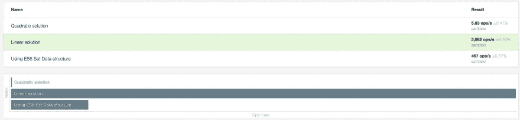

# 如何在 JavaScript 中检测唯一数组

> 原文：<https://betterprogramming.pub/detecting-unique-arrays-in-javascript-e4e9a7a87542>

## 集合、多种类型的循环等等

当 JavaScript 数组包含原始值(字符串、数字、未定义、null、布尔值和符号)时，可能会出现这样的情况，您希望检测数组是否包含任何重复的元素。

换句话说，您可能希望确定数组中的元素是否是唯一的。有几种方法可以实现这一点。

让我们仔细看看我们的选择。

# 方法 1。嵌套循环

在这种方法中，我们将遍历数组，从第一个元素开始，对于每个元素，我们将该元素与所有其他元素进行比较，以查看是否存在匹配。

为了实现这一点，我们将使用两个相互嵌套的`for loops`。

```
function isUnique(arr) {
  const len = arr.length;
  for (let i = 0; i < len; i++) {
    for (let j = 0; j < len; j++) {
      // if the elements match, this wouldn't be a unique array
      if (i !== j && arr[i] === arr[j]) {
        return false;
      }
    }
  }
  return true;
}
```

尽管这种方法对于小型和半小型数据集非常有效，但随着输入数据集的增长，它会变得越来越慢。这种方法的缓慢是因为嵌套循环。

想象一个有一百万个数字的数据集。在这个数据集中，在最坏的情况下，我们的重复元素可能是数组中的最后一个元素，因此，我们需要将一百万个数字与一百万个数字进行比较(一百万*一百万)，这非常慢。

*   [代号](https://jsfiddle.net/farskid/bquo7k8x/12/)

# 方法 2。具有缓存值的单循环

在这种方法中，我们不是将每个元素与其他元素进行比较，而是跟踪我们访问的元素，这些元素与重复的元素不匹配。

换句话说，我们缓存我们遍历的内容，并查找下一个元素来检查我们是否已经访问过这样的元素。

由于这个被访问的引用，我们只需要将数组中的每个元素与这个引用进行比较，因此，我们只需要遍历这个数组一次。

```
function isUnique(arr) {
  const seenValues = {}

  for (let i = 0; i < arr.length; i++) {
    // we already saw this element in the array
    if (seenValues[arr[i]]) {
      return false;
    } else {
      seenValues[arr[i]] = true
    }
  }

  return true;
}
```

在最坏的情况下，数据集中有一百万个数字，我们复制的元素将是最后一个元素，但是在这种方法中，我们只比较一百万次。这种方法比方法 1 快得多。

*   [代码](https://jsfiddle.net/farskid/zky1mdug/18/)

# 方法三。使用 ES6 S `et`

当 ES6 出现的时候，我们被介绍了一种新的 JavaScript 数据结构，叫做`Set`。

集合是定义上唯一的元素的集合，这意味着，如果您试图将重复的元素插入到集合中，它不会有任何效果。

由于根据定义`Set` s 是唯一元素的集合，所以有一种技术可以将数组转换成集合，这反过来又会产生数组中唯一的项目集合，现在存储在集合中。

然后，一个相反的操作将被用来把那个`Set`转换回一个数组。在某种意义上，你可以说`Set`被用作中间数据结构来从数组中移除重复的元素。

`Array -> Set -> Array`

```
// convert an array to a set and convert back
function getUniqueArray(arr) {
  return [...new Set(arr)]
}

function isUnique(arr) {
  return getUniqueArray(arr).length === arr.length
}
```

在这种方法中，如果唯一数组(从`Set`转换回来)中的元素数量与输入数组长度相同，这意味着该数组已经包含唯一值，并且没有从其中删除重复值来改变长度。

注意:如果你只是想检查唯一性，你不需要将一个`Set`转换回一个数组。您可以通过勾选`Set.prototype.size`来完全跳过这部分操作。

```
// convert an array to a set
function arrayToSet(arr) {
  return new Set(arr)
}

function isUnique(arr) {
  return arrayToSet(arr).size === arr.length
}
```

# 性能比较

只要数据集相对较小，交替使用这三种方法都可以。对于较大的数据集，您需要关注这些方法的性能，以及它们在有限的时间内可以执行多少操作。

这三者之间性能比较的简短答案是:

`Approach 2 > Approach 3 > Approach 1`。

方法 2(使用带有缓存值的单循环)比其他方法快得多。在方法 3 ( `Set`)和方法 1(嵌套循环)之间，方法 3 也快得多。

为了更好地理解这些性能比较，请看一下基准测试:

 [## ESBench

esbench.com 三种方法的基准](https://esbench.com/bench/5e0273c1170166009e5470f7) 

# 好奇者请注意

*   方法 1(使用嵌套循环)具有二次复杂度，这意味着它将导致 O(n2)时间复杂度。
*   方法 2(使用单个循环和缓存值)是线性复杂度，这意味着它将导致 O(n)时间复杂度。
*   对于方法 3，我没有强烈的意见，因为我并不完全了解如何在 JavaScript 引擎中实现`Set`。

# 给不耐烦的人的结论

不要为你没有的问题预先优化。只有当你有一个大的数据集带来表面的缓慢时，性能优化才有意义。

对于相对较小的数据集，您采用哪种方法并不重要，因为所有方法都足够快。对于较大的数据集，总是倾向于使用方法 2，因为基准测试表明它明显更快。

