# 使用 Python 从视频片段中确定足球运动员球衣的颜色

> 原文：<https://betterprogramming.pub/determining-soccer-player-jersey-colors-from-video-footage-31365e12e39c>

## 利用 K-均值聚类识别球员球衣颜色


Krzysztof Dubiel 在 [Unsplash](https://unsplash.com/s/photos/soccer?utm_source=unsplash&utm_medium=referral&utm_content=creditCopyText) 上拍摄的照片

足球是世界上最受欢迎的运动。在洪都拉斯(我出生的国家)，足球能够完全阻止许多事件，吸引大众的注意力，并在 90 分钟内将人群卷入情绪的漩涡。

从我记事起，我就是一个足球迷。我选择的球队是巴塞罗那足球俱乐部，我从五岁开始就支持他们。这些年来，我看到了各种各样的技术被实现来获得关于游戏中发生的事情和玩家表现的各种统计数据和信息。这些球员的数据会让我着迷，因为它指向了体育背后的数字游戏…任何认识我的人都可以证明我喜欢数字。

在已经开发/实现的最有趣的技术应用中，一般来说，不仅用于足球，而且用于许多其他运动，是计算机视觉。计算机视觉(CV)是关于开发能够理解图像或视频等视觉数据的算法和/或人工智能的领域。CV 功能极其强大，在 Instagram 滤镜、自动驾驶汽车、MRI 重建、癌症检测等应用中司空见惯。

在这个项目中，我从 Trace 获取了一系列在不同足球比赛中拍摄的视频片段，并使用 K-Means 聚类算法确定了球员球衣的颜色。

这篇文章将详细介绍我实现这个目标的过程。这里开发的例程将视频镜头作为输入，并生成一个包含聚类过程结果的 pandas 数据帧作为输出。这个项目需要我执行数据清理、聚类、图像/视频处理、图像中对象的初步分类、读取 JSON 文件以及各种 pandas/numpy 数组/列表操作。我将这篇文章分成三个不同的部分，您可以通过下面可点击的目录很容易地找到它们:

*   [图像处理基础](#5d33)
*   [从图像中提取颜色](#c6d6)
*   [从视频文件中提取帧](#c83b)
*   [从 JSON 文件中提取玩家包围盒](#698c)
*   [实现 K 均值聚类以确定球员球衣颜色](#b61b)
*   [制作快速可视化聚类结果的 GUI](#fe40)
*   [结论](#607b)

说完了，我们开始吧！

# 图像/视频处理基础知识

本节将涵盖对本项目很重要的图像和视频处理/操作的基础知识。我使用足球历史上我最喜欢的一个时刻作为参考图像，尝试各种可用的处理技术。那个时刻是 2005 年 11 月 19 日，罗纳尔迪尼奥代表巴塞罗那队对阵皇家马德里队的精彩进球，如下图所示。

这张照片不仅勾起了我美好的回忆，它还包含了一些对我未来发展有用的元素。例如，它有一些非常清晰的玩家对象，我可以尝试为其生成边界框，它有大量的“字段”作为图像的一部分，我可以用它来学习如何屏蔽某些颜色，它有两个队的玩家，我可以用它来开始弄清楚如何对东西进行分类。


罗纳尔迪尼奥在 2005 年 11 月 19 日对阵皇家马德里的比赛中进球。图片由巴塞罗那足球俱乐部提供

## 使用 OpenCV 加载图像

我需要做的第一件事是将图像加载到我的笔记本中。如果您已经将图像保存在电脑上，那么您可以简单地使用`cv2.imread`功能。然而，对于我在这部分工作中使用的图片，我是通过 URL 获取的。加载图像需要我们:

1.  将我们的网址传入`urllib.request.urlopen`
2.  从 URL 中的图像创建一个 numpy 数组
3.  使用`cv2.imdecode`从内存缓存中读取图像数据，并将其转换为图像格式。
4.  由于`cv2.imdecode`默认加载 BGR 格式的图像，我将使用`cv2.cvtColor(img, cv2.COLOR_BGR2RGB)`来处理和渲染原始 RGB 格式的图像。

该过程的结果如下所示:

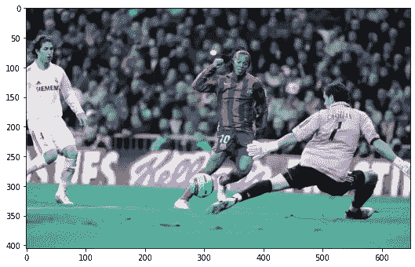

使用 OpenCV 在 BGR 空间加载图像。作者修改的图像。

正如你所看到的，我加载的这个图像中的颜色与原始图像中看到的颜色不匹配。这是因为 OpenCV 默认加载的图像在 BGR 颜色空间中。不过没问题，因为切换到 RGB 色彩空间可以通过一行快速代码来完成，如下所示:

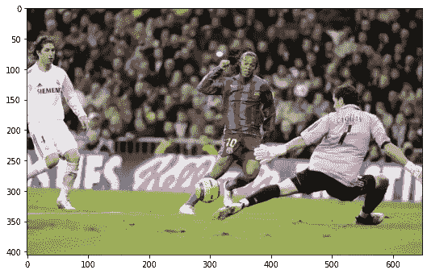

使用 OpenCV 在 BGR 空间加载图像。作者修改的图像。

太好了，我们开始工作了！现在我可以开始玩各种图像处理/操作技术了。我将在这里展示其中的一些，但是如果你想让我展示其他的，请告诉我！

## 旋转图像

旋转图像有几种不同的方法。imutils 包通过`imutils.rotate_bound`函数实现起来最简单，因为它只需要旋转图像和我们想要旋转图像的角度。除此之外，该函数确保显示的旋转图像不会被裁剪，并且完全包含在边界内。其他方法要求首先构建旋转矩阵，然后应用旋转矩阵。

此操作的结果如下所示:

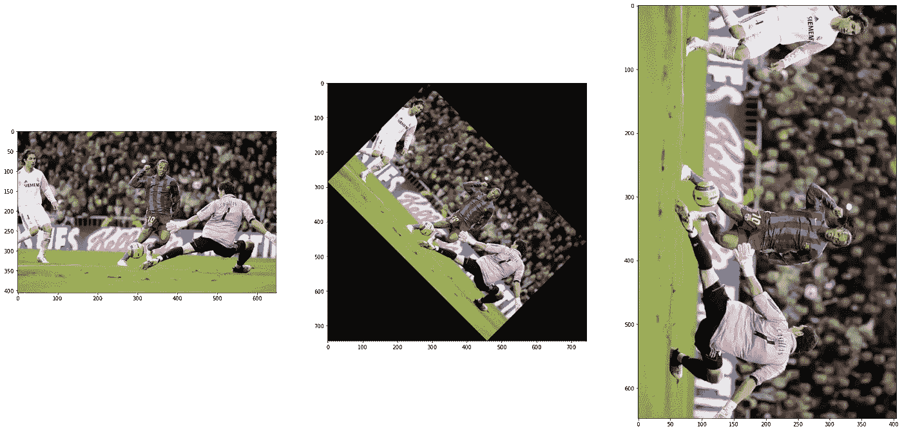

Python 中的旋转图像。作者修改的图片。

## 裁剪图像

当通过 OpenCV 加载图像时，图像作为 numpy 数组加载。然后，要裁剪图像，我们可以简单地使用 numpy 切片来裁剪内容。有多种方法可以裁剪东西。我将在这里展示一个简单的例子，我们可以通过不同的高度和宽度百分比来裁剪图像。通过定义感兴趣区域(ROI)和轮廓，还有更好的裁剪方式，我将在后面的章节中介绍。

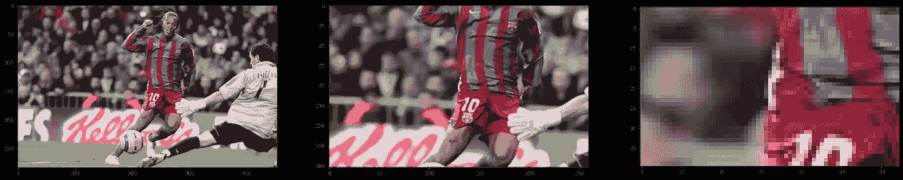

Python 中通过 numpy 切片裁剪图像。作者修改的图片。

## 调整图像大小

有许多方法可以调整图像的大小。在这里，我将展示如何使用 OpenCV 中的 resize 函数来调整图像的大小。尽管图像看起来完全相同，但当我们调整图像大小时，可以看出图像的大小(高度和宽度)发生了变化。

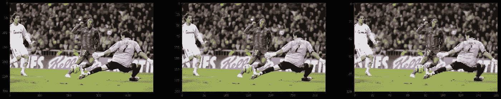

在 Python 中调整图像大小。作者修改的图片。

```
The width, height and depth of this image are  (304, 486, 3)
The width, height and depth of this image are  (202, 324, 3)
The width, height and depth of this image are  (101, 162, 3)
```

## 调整图像的亮度/对比度

通过 OpenCV 中的`addWeighted`功能可以调整图像的亮度/对比度。这是一个称为混合的过程。该函数使用以下变换对图像进行调整:

`result = αsrc1 + βsrc2 + γ`

在上面的等式中，通过将`α`值应用于源图像，将`β`值应用于某个其他图像(它可以是相同的源图像)并将其值增加`γ`来修改混合图像。

混合的效果如下图所示。图的第一行显示了在保持其他两个参数不变的情况下改变`α`的效果(`α`从左到右减小)。图的第二行显示了在保持其他两个参数不变的情况下改变`β`的效果(`β`从左到右增加)。图的第三行显示了在保持其他两个参数不变的情况下改变`γ`的效果(`**γ**`从左到右增加)。

*   减少`α`会导致图像变暗。
*   增加`β`会使图像具有更高的对比度。
*   减少`γ`会使图像变得柔和。

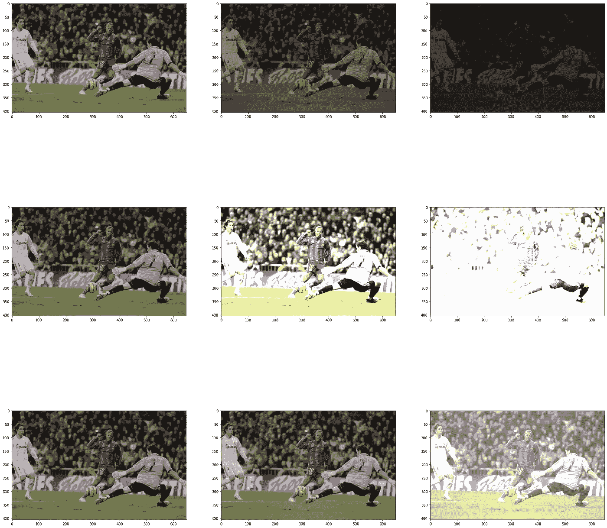

在 Python 中改变图像的亮度和对比度。作者修改的图片。

## 改变图像的色彩空间

图像处理中使用了多种颜色空间，这些颜色空间有助于完成各种任务，例如边缘检测、颜色检测和遮罩等。通过`cvtColor`函数，OpenCV 可以很容易地在色彩空间之间进行转换

下面列出了一些常见的色彩空间:

*   RGB ->许多图像最初都是使用这种格式编码的
*   HSV-->对颜色色调提供更好的控制
*   灰色->使许多图像处理方法更加精确

下面显示了一些已更改色彩空间的示例:

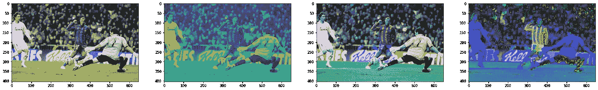

在 Python 中改变色彩空间。图片由作者修改。

## 模糊图像

当试图检测边缘(即，描绘从一组像素到另一组像素的过渡的线)时，模糊是重要的操作，因为它使对象边界之间的过渡更平滑。例如，这可以用来将对象从背景中分离出来。

对于这个项目，我研究了四个类别:

*   平均模糊->快速，但可能无法保留对象边缘
*   高斯模糊->比平均模糊慢，但边缘保留更好
*   中值滤波->对异常值稳健
*   双边过滤->比上面的方法慢很多。更多参数(更多可调参数)。

使用不同模糊方法的效果如下图所示。图的第一行显示了在从左到右增加内核大小时使用平均模糊的效果。图的第二行显示了在从左到右增加内核大小时使用高斯模糊的效果。图的第三行显示了在从左到右增加内核大小时使用中值模糊的效果。第四行图显示了从左至右增加`diameter`、`sigmaColor`和`sigmaSpace`参数时使用双边模糊的效果。

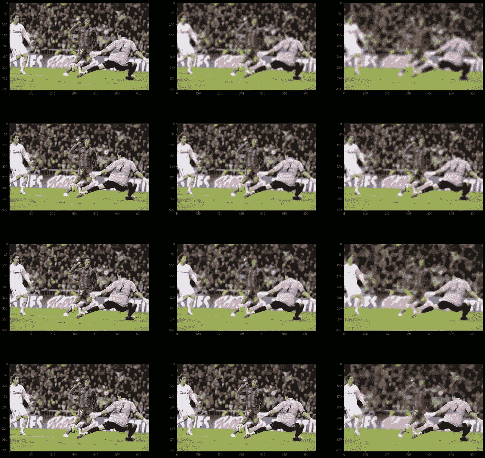

Python 中的模糊图像。作者修改的图片。

## 检测图像的边缘

边缘检测是一种识别图像中对象边界(即边缘)的图像处理技术。边缘允许我们识别图像的底层结构，使它们成为我们从图像中需要的最重要的信息之一。

下面使用 Canny 算法来检测图像的边缘。

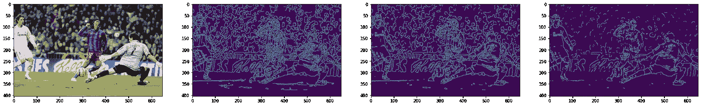

Python 中 Canny 的边缘检测。作者修改的图片。

## 遮蔽图像中的颜色

通常，人们可能希望在图像中只显示特定的颜色。这可以通过掩蔽来实现。OpenCV 中的`inRange`函数允许在 HSV 空间中工作时很容易地做到这一点。

下面显示的图像(从左到右)是没有应用遮罩，分别遮罩绿色、红色和蓝色的结果。

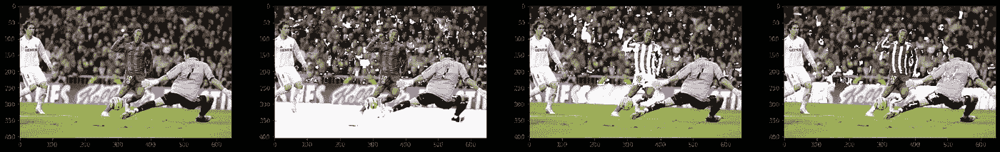

Python 中的遮罩颜色。作者修改的图片。

## 选择图像中的感兴趣区域

选择 ROI 是另一种形式的裁剪。如果你不需要处理太多的图片，这里展示的方法是一个快速裁剪图片的好方法。

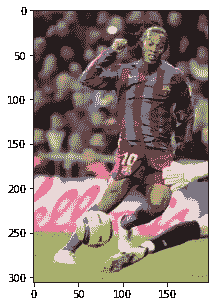

ROI 图像。作者修改的图片。

# 从图像中提取颜色

至此，我已经介绍了许多基本的处理操作，这些操作应该足以从图像中确定球员的颜色。为了确定颜色，我尝试了以下方法:

*   提取单个像素的颜色
*   通过逐像素平均提取颜色
*   使用 K-均值聚类获得图像中的 K-颜色

## 提取单个像素的颜色

通过向图像阵列提供像素的 x，y 坐标，读取该像素的 RGB 通道的结果，并将这些 RGB 通道分配到一个阵列中，可以很容易地提取单个像素的颜色。我写了一个小函数，为下图中的各种像素做这个。下面显示了 17 个不同像素的结果。

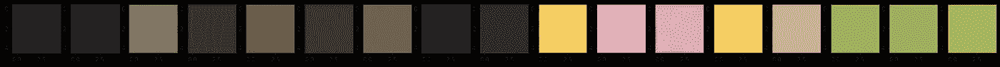

提取像素颜色的方法 1。图片作者。

## 通过逐像素平均提取主色

既然我们可以提取单个像素的颜色，我们可以扩展该方法来确定图像的平均颜色。向我们的图像数组传递一个 x，y 坐标会返回一个像素的 RGB 元组。然后，通过在每个像素处添加元组中每个元素的值，我们可以获得与每个 RGB 通道相关联的“总计数”。最后，我们可以将每个 RGB 颜色通道中的计数除以图像中的像素总数，以获得图像的平均颜色。

此过程的结果如下所示，其中平均颜色变成了十六进制值为`#787561`的灰绿色，通过对图像的视觉检查，这看起来是合理的。然而，我们能改善这一点吗？

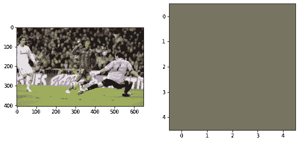

图像中最常见的用户颜色通过平均确定。图片作者。

## 通过 K-均值聚类提取主色

K-Means 聚类算法可以进一步改进球员球衣颜色检测程序。这个例程将允许我们通过指定该例程应该使用的聚类数`k`来提取图像中的几个“主色”。如果人们知道数据应该落入多少个聚类中，则可以先验地确定`k`的值。

否则，确定 k 值的常用方法是通过弯管法，如下所示。肘方法图获取模型的变形，并根据`k`的值绘制它们。图表的拐点(也称为肘部)是应该使用的 k 值。使用我一直在处理的图像的肘图的结果表明最佳 k 值是`3`。

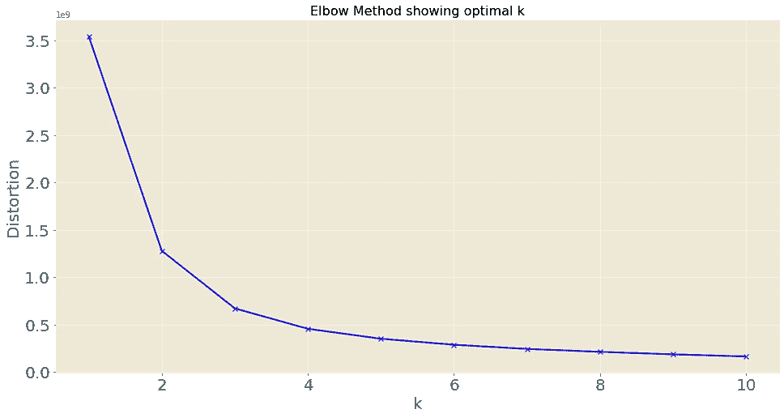

对小罗图片进行肘击的结果。图片作者。

## 对图像运行 k-means 聚类

确定了`k`应该是`3`之后，我可以编写一个小程序来获取图像并确定它的 k 主色。`k = 3`、`k = 4`和`k = 10`(我做的最后两个只是为了好玩)案例的结果如下所示:

```
#Call K-Means function with K = 3
nClusters = 3
rgb_array = KMeansTest(rgb_img, nClusters)
plotKMeansResult(nClusters,rgb_array)
```

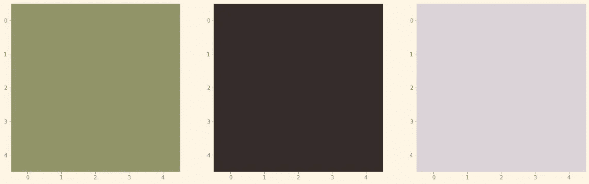

根据 K-Means 聚类确定的图像中的前三种颜色。图像中的颜色从左到右逐渐减少。图片作者。

使用`k=3`确定的顶部颜色是绿色，通过目测，在“绿色区域”普遍存在的情况下，该颜色看起来是正确的

```
#Call K-Means function with K = 4
nClusters = 4
rgb_array = KMeansTest(rgb_img, nClusters)
plotKMeansResult(nClusters,rgb_array)
```

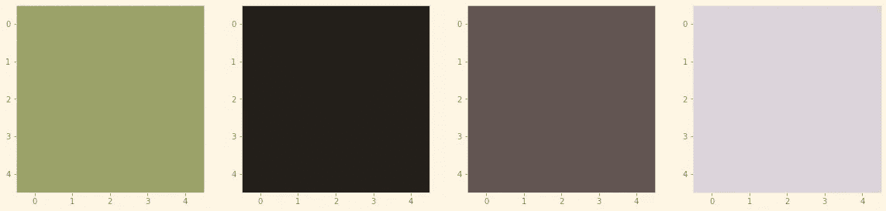

根据 K-Means 聚类确定的图像中的前四种颜色。图像中的颜色从左到右逐渐减少。图片作者。

使用`k=4`确定的顶部颜色也是绿色。然而，它的色调要亮得多。

```
#Call K-Means function with K = 10
nClusters = 10
rgb_array = KMeansTest(rgb_img, nClusters)
plotKMeansResult(nClusters,rgb_array)
```

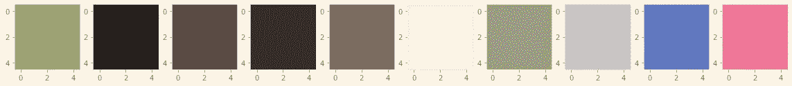

根据 K 均值聚类确定的图像中前 10 种颜色。图像中的颜色从左到右逐渐减少。图片作者。

使用`k=10`确定的顶部颜色也是绿色。然而，它比前两个例子要亮得多。通过`k=10`的使用可以看出，通过使用更多的簇可以获得更高的颜色特异性。要点是 k-means 例程可以准确地检测颜色，并提供图像中最常见的颜色。

# 在图像中识别人类

在开始处理视频片段之前，我还有一件感兴趣的事情。我想检查图像中玩家/人类的分类和/或识别。这些物品的分类不是作业的一部分，但是我想简单地探索一下以满足我的好奇心。

OpenCV 中的 HOG 包包含经过训练的模型的数据库，这些模型能够检测不同的对象，如猫、脸和人。在以后的文章中，我将展示我为解决这个分类问题而构建的神经网络模型。但是现在，我将展示 HOG 包的用法。

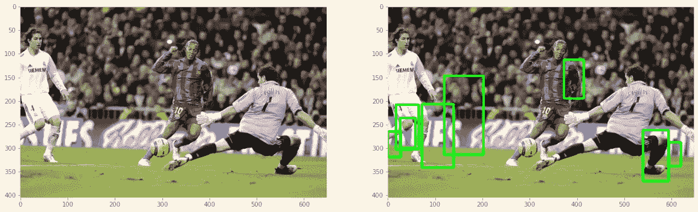

尝试使用 Python 中的 HOG 包在图像中检测球员失败。作者修改的图片。

我花了一点时间摆弄探测器的参数，没有得到更好的结果。我尝试使用`DefaultPeopleDetector`和 Haar 级联分类器`haarcascade_fullbody`，但无法得到我想要的结果。即使检测玩家本身不是项目的一部分(我得到了一个包含玩家边界框坐标的 JSON 文件)，我仍然想确保我成功地尝试了使用 HOG 检测器。

我尝试了下面的一个不同的图像，我认为它会给我一个成功的检测。在参数上玩了几分钟后，我发现了一个有效的组合！我决定只使用玩家边界框(BB)来生成图像，并将 K-means 例程应用于 BB 的内容。结果如下所示:

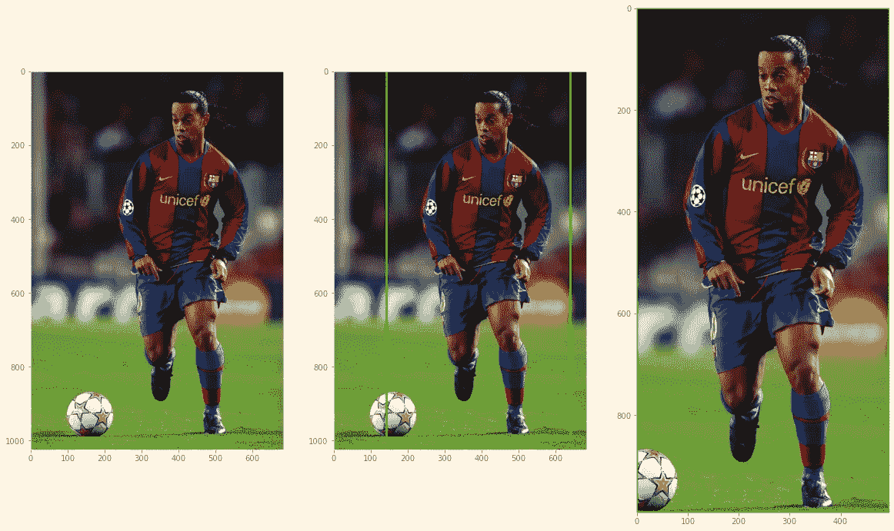

使用 HOG 包检测玩家并提取包含玩家的包围盒。作者修改的图片。

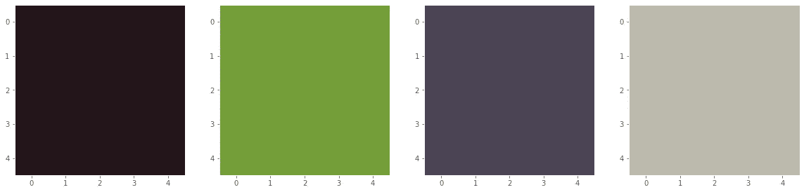

通过 K-Means 聚类确定的上图中的前 4 种颜色。图片作者。

我将需要研究细化/自动化对象检测器功能的参数，但我对目前为止的进展感到满意。

# 处理视频和提取帧

在熟悉了各种图像操作和处理技术并了解了如何实现 K-Means 来提取图像中的主色之后，我决定开始处理视频素材，因为我相信我已经具备了开发一个功能例程来从图像中确定球衣颜色的基础。

我的文件中有一部分是从两台不同的摄像机拍摄的足球比赛视频。需要做的第一件事是获取视频文件，我可以使用以下例程来完成:

现在我有了 mp4 文件的列表，我可以使用下面的例程从视频中提取单个帧:

现在我可以看到从两台摄像机提取的画面。帧 2500 作为示例显示如下:

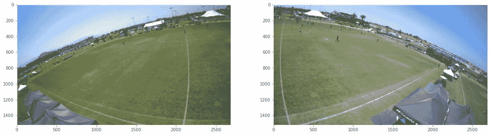

分别从左右摄像机提取帧。图片作者。

我想从视频中提取的另一件事是视频中的帧数。这可以使用以下例程来完成:

# 加载 JSON 文件并检查边界框

JSON 文件包含玩家边界框坐标。需要做的第一件事是加载 JSON 文件，这可以使用我之前制作的例程来完成。JSON 文件与 MP4 文件相关联，所以我必须确保当我批处理所有文件时，正确的 JSON 文件与正确的 MP4 文件是成对的。

为此，我将首先去除路径和。json 扩展名，并将结果放入一个名为`json_strip.`的列表中。然后，我将从我之前为每个相机(LCAMERA 和 RCAMERA)生成的 MP4 文件列表中删除路径，并将结果分别放入两个名为`mp4_strip_LC`和`mp4_strip_RC`的列表中。最后，我将使用这些列表从每台摄像机获取与这些文件相关联的索引。完成上述步骤的程序如下所示:

我可以读取 JSON 文件，并获得上述框架的绑定框信息。为此，我将为正在处理的视频中的每一帧生成一个字典，其中包含每个玩家边界框(检测)的坐标。

上面的代码给出了当前视频中每一帧的边界框。接下来，我将确定给定帧中有多少个边界框。

接下来，我将确定视频中包含玩家检测的第一帧。

接下来，对不同视频可能不同的`frame_index`值进行检测。让我们根据 JSON 文件计算出视频的检测收集时间间隔。

接下来，我将从 JSON 文件中提取当前帧的所有边界框坐标。

最后，我将从 JSON 文件中提取特定边界框的边界框坐标。

让我们通过可视化边界框来看看我的程序是否有效！以下是视频中第一个帧的示例，分别包含对左右摄像机的检测。第一帧分别被确定为帧 0 和帧 62。


来自左右摄像机的视频镜头的原始第一帧。图片作者。

绘制了玩家边界框的帧如下所示。

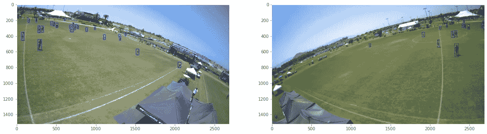

从带有玩家边界框的左右摄像机获得的视频镜头的帧。图片作者。

最后，这里是每个玩家在画面中的边界框。

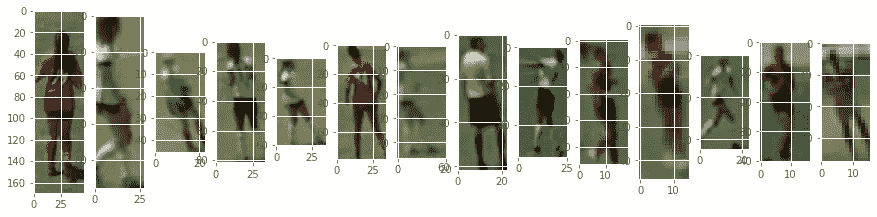

玩家从左边相机包围盒。图片作者。

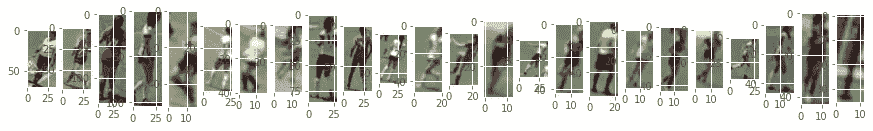

来自右边相机的玩家边界框。图片作者。

厉害！到目前为止，这些方法允许我成功地提取玩家边界框。从一些边界框中可以看到一些东西。首先，有假阳性的例子。这个数据中的假阳性需要没有玩家的包围盒。这是将来需要解决的问题。

# 应用 K-均值聚类确定运动员球衣颜色

太好了！现在，我的数据处于适当的状态。现在，让我们尝试在边界框上应用 K-Means 聚类例程，看看会发生什么。我将坚持处理我到目前为止一直使用的相同视频和帧，以便我可以稍微关注一下聚类本身。聚类例程如下所示。该程序需要以下步骤:

1.  将图像(玩家边界框)转换到 HSV 颜色空间
2.  将图像展平成 1D 阵列，以便于处理
3.  运行 K 均值聚类
4.  确定图像上每种颜色的百分比
5.  按降序排列这些颜色，并将它们放入一个数组中

对前四个边界框运行此例程的结果如下所示:

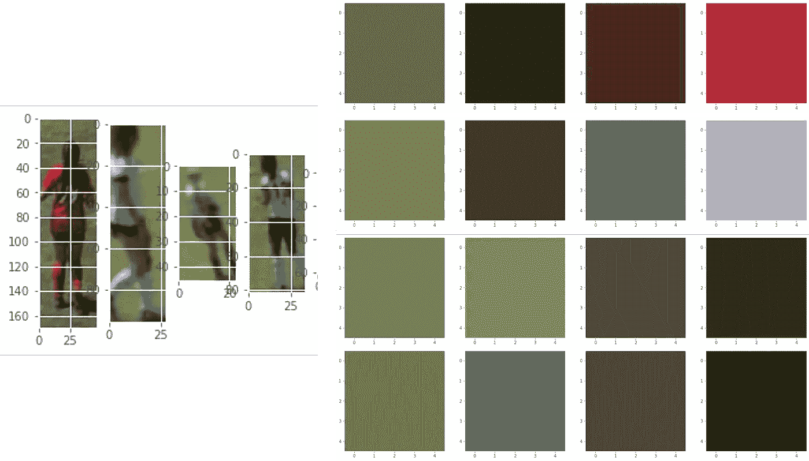

显示的边界框上的聚类结果。图片作者。

从上面的结果中可以看出，绿色是所有边框的主色。绿色主要来自于田野里的草。这就是掩蔽发挥作用的地方。

## 将遮罩应用于图像数据

为了更好地处理边界框中草地的存在，我将使用遮罩。我的方法包括为构成 HSV 颜色空间的三个值(即色调、饱和度、亮度)中的每一个设置低阈值和高阈值。如果一种颜色落在这个阈值的范围内，那么它将被屏蔽掉。

此外，我还添加了一些错误处理功能，以应对蒙版过程移除过多像素的情况。聚类例程要求待处理的图像至少具有与聚类一样多的唯一像素。因此，如果得到的屏蔽图像的维数低于所需的聚类数，则该图像将被忽略。这种情况很可能发生在边界框只有一个字段的情况下。

下面显示了几种不同情况下使用掩码的结果。使用蒙版去除绿色对改进颜色检测程序有很大帮助！

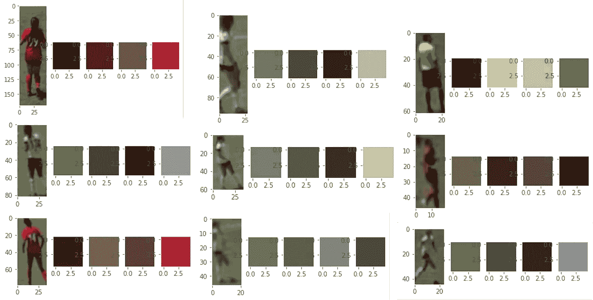

应用绿色遮罩后，玩家边界框中的主色。图片作者。

## 移除边界框的下半部分，以关注球衣数据

由于任务是仅确定球衣颜色，裁剪图像的底部也有助于支持分析，因为我们可以专注于更重要的区域，并提高球员球衣颜色检测的准确性。这可以通过下面的程序简单地完成。

掩蔽和裁剪后的聚类例程的结果如下所示:

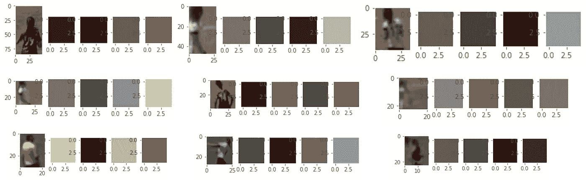

遮罩区域和裁剪图像底部后的主色。

好多了！

# 正在处理整个 MP4 文件

让我们尝试处理每一帧，看看会发生什么！到目前为止，我把所有的例程都放在了下面的包装函数中。这个包装器函数将 JSON 文件的路径、mp4 文件的路径、要处理的视频和 k-means 的聚类数作为输入。这个函数的输出是一个 pandas 数据帧，包含当前视频的每一帧中每个边界框的 RGB 格式的主色。

723 帧可以在 10 分钟内处理完毕。平均帧处理速率为 1.23 帧/秒。该速率取决于给定帧处理了多少个边界框。让我们来看看我做的数据框。

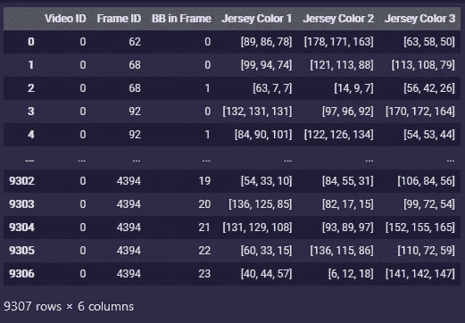

包含视频聚类结果的熊猫数据帧。图片作者。

数据帧具有所需的结构。可以看出，总共处理了 9，307 个边界框。这意味着每秒可以处理 15.8 个边界框。我将删除数据帧中包含 nan 数组的所有行(这些数组包含误报)。

到目前为止，在处理的数据集中有 281 个误报，这意味着玩家对象的分类过程有 97%的准确率，这相当不错！现在，我将尝试使用 K-Means 例程在我们的数据帧的 RGB 列上查看当前处理的 MP4 帧中的前五种颜色。

# 所有处理过的边界框中最常见的颜色是什么？

另外，我认为在处理过的 MP4 文件中看到最频繁出现的颜色会很有趣。这个过程可以帮助识别视频片段中出现的球队球衣颜色，然后可以用来开发一个能够区分不同球队球员的算法例程。

因为我有一个熊猫数据帧，其中包含每个边界框中出现的最多、第二最多和第三最多的主色，所以我可以利用与我前面介绍的相似的聚类例程来从这些类别中获得最多的主色。该过程的结果如下所示:

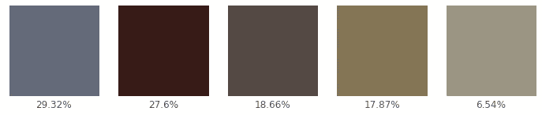

最常见的颜色出现在所有玩家的边界框中。图片作者。

从上面的图像中可以看出，深灰色对应于总颜色的 29.32%，褐红色对应于所有边界框中找到的颜色的 27.60%。经过处理的视频中的球队球衣是红白相间的。然而，由于阴影和光照的差异，这里观察到的顶部两种颜色准确地描绘了球队球衣，并可随后用于球队分类。

# 处理整个游戏

我下面展示的例程已经在一个 MP4 文件上演示过了。然而，这个 MP4 文件对应的是几分钟游戏时间的镜头。也就是说，我开发的代码例程是相当模块化的，因此，通过下面的例程连接从每个 MP4 文件获得的结果，它可以很容易地用于处理整个游戏:

# 用于快速可视化聚类结果的 GUI

熊猫数据帧整齐地存储了聚类结果。然而，所有这些数字可能有点难以理解。因此，我编写了一个 GUI，它将使用跟踪条在我的熊猫数据帧的行之间移动，并沿着三种最主要的颜色绘制裁剪的玩家边界框。它将标记由聚类算法确定的十六进制代码。下面显示了相关的代码，以及运行中的 GUI 演示。

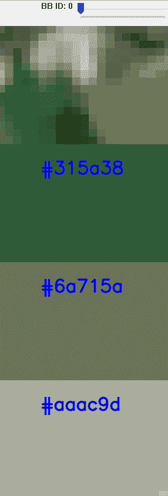

展示聚类结果的 GUI 演示。图片作者。

# 结论

上面显示的工作演示了如何使用 K-Means 聚类算法从足球比赛视频片段中提取球衣颜色。在这个过程中，某些方面肯定可以改进。例如，我确信我可以通过多重处理和/或批处理视频来提高代码的效率。

此外，在处理假阳性(即裁判、非玩家对象)时，可以通过包括更好的错误处理来改进例程。聚类过程结果与预期输出一致(即，主色是红色和白色的阴影，而团队球衣颜色是红色和白色)。我希望这篇文章对你来说是有趣的或者至少是有用的。我很高兴听到你对此的任何建议或想法！

感谢阅读！

如果你愿意支持我的编码工作，请考虑通过我的推荐链接加入 Medium:[https://victormurcia-53351.medium.com/membership](https://victormurcia-53351.medium.com/membership)